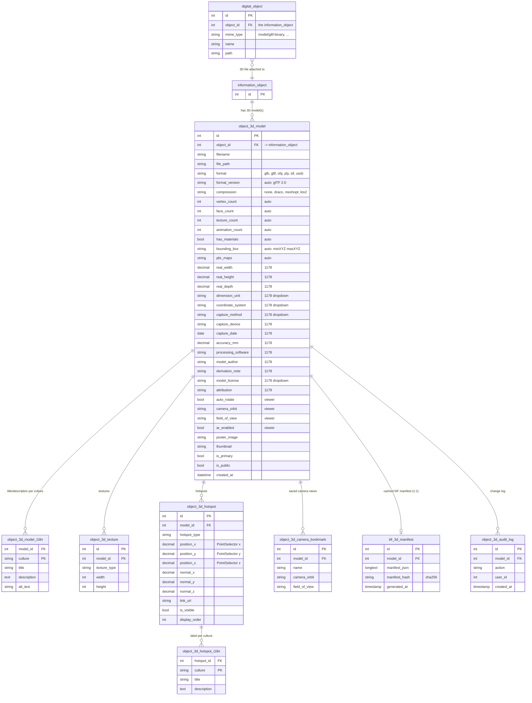

# Heratio 3D model — Entity-Relationship Diagram

Data model for the `ahg-3d-model` package (3D digital objects, metadata/paradata,
viewer, hotspots, and IIIF). Renders as a diagram on GitHub and any
Mermaid-aware Markdown viewer.

## Key relationships

- **`information_object` 1 — N `object_3d_model`** (`object_id`): a record can have
  several 3D models; one is `is_primary`. (FK `ON DELETE CASCADE`.)
- A 3D file may instead arrive as a **`digital_object`** attached to the record;
  `Model3dRegistry` ensures such files also get an `object_3d_model` row (so they
  carry metadata). Both paths converge on `object_3d_model`.
- **`object_3d_model` 1 — N i18n / texture / hotspot / camera-bookmark / audit**,
  all keyed by `model_id` (`ON DELETE CASCADE`).
- **`object_3d_hotspot` 1 — N `object_3d_hotspot_i18n`** (`hotspot_id`). Hotspot
  `position_x/y/z` map directly to an IIIF **PointSelector** in the manifest.
- **`object_3d_model` 1 — 1 `iiif_3d_manifest`** (`model_id`): cached RC-aligned
  IIIF 3D manifest (regenerated on request; `manifest_hash` detects change).

## Column groups on `object_3d_model`

| Group | Columns (summary) |
|-------|-------------------|
| Identity / file | `id, object_id, filename, original_filename, file_path, file_size, mime_type, format` |
| Geometry (auto-extracted) | `format_version, compression, vertex_count, face_count, texture_count, animation_count, has_materials, has_rig, is_watertight, bounding_box, pbr_maps, texture_colorspace, lod_levels, is_lossless_master` |
| Real-world (#1178) | `real_width, real_height, real_depth, dimension_unit, scale_note, coordinate_system` |
| Capture paradata (#1178) | `capture_method, capture_device, capture_date, capture_operator, source_count, point_density, accuracy_mm, processing_software, processing_notes, georeference` |
| Provenance / rights (#1178) | `model_author, derivation_note, model_license, model_license_holder, attribution, alt_text` |
| Viewer | `auto_rotate, rotation_speed, camera_orbit, min_camera_orbit, max_camera_orbit, field_of_view, exposure, shadow_intensity, shadow_softness, environment_image, skybox_image, background_color` |
| AR | `ar_enabled, ar_scale, ar_placement` |
| Derivatives | `turntable_mp4_path, turntable_generated_at, poster_image, thumbnail` |
| Flags / audit | `is_primary, is_public, display_order, created_by, updated_by, created_at, updated_at` |

Controlled vocabularies (`dimension_unit`, `coordinate_system`, `capture_method`,
`compression`, `model_license`) are managed in the Dropdown Manager
(`ahg_dropdown`, taxonomies `model_3d_*`) — no ENUM columns.
