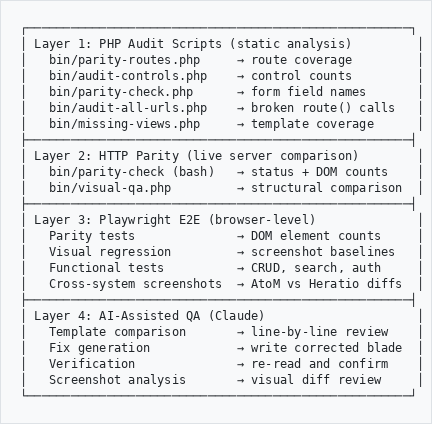

# Audit Methodology: AtoM → Heratio Parity

**Purpose:** This document describes the complete audit and parity-checking process used to measure and close the gap between AtoM (Symfony 1.4) and Heratio (Laravel 12). Use this to replicate the same audit on another instance.

---

## Overview

The audit is a multi-layer process that answers these questions:

1. **Route parity** — Does Heratio have every URL/route that AtoM has?
2. **HTTP parity** — Do both systems return the same status codes and DOM structure for each route?
3. **Control parity** — Does every Heratio page have the same number of buttons, links, fields, headings, badges, tables, etc. as the AtoM equivalent?
4. **Field parity** — Does every Heratio edit/create form have the same `name=` fields as AtoM?
5. **URL/link parity** — Does every link on every page point to the correct Heratio equivalent of the AtoM URL?
6. **View parity** — Does every AtoM template have a Heratio blade equivalent?
7. **API parity** — Does Heratio expose the same REST/OAI-PMH endpoints as AtoM?
8. **Media processing parity** — Does Heratio handle the same media types and operations as AtoM?
9. **Menu parity** — Does Heratio's navigation match AtoM's menu structure?

---

## Prerequisites

- **Heratio instance** at a known URL (e.g., `http://localhost`)
- **AtoM instance** at a known URL (e.g., `http://psis.theahg.co.za`)
- **AtoM source code** on disk (e.g., `/usr/share/nginx/archive`) — needed for template-level comparison
- **PHP 8.3+** with CLI
- **Laravel artisan** accessible (`php artisan route:list --json`)
- **curl**, **python3** (for the bash parity-check script)

---

## Step-by-Step Audit Process

### Step 1: Route Parity — `bin/parity-routes.php`

**What it does:** Reads all AtoM `routing.yml` files (base Symfony + every AHG plugin) and compares against Heratio's `artisan route:list`.

**Run:**
```bash
cd /usr/share/nginx/heratio
php bin/parity-routes.php                          # terminal output
php bin/parity-routes.php --output /tmp/routes.html # HTML report
php bin/parity-routes.php --missing-only            # only show gaps
php bin/parity-routes.php --plugin actor             # filter by plugin
php bin/parity-routes.php --json                     # JSON output
```

**Output:** List of every AtoM route, whether it exists in Heratio, and missing routes grouped by package.

**Result from our audit:** 2,249 Heratio routes, 327/332 AtoM app routes matched (5 protocol-level skipped).

---

### Step 2: HTTP Parity — `bin/parity-check` (bash)

**What it does:** For every GET route in Heratio, fetches the page from both Heratio and AtoM, compares HTTP status codes and DOM element counts (inputs, selects, textareas, table rows, headings, links, buttons).

**Run:**
```bash
cd /usr/share/nginx/heratio
bin/parity-check                                                # defaults
bin/parity-check --heratio-url http://localhost --atom-url http://psis.theahg.co.za
bin/parity-check --filter "information"                         # test subset
bin/parity-check --cookie /tmp/cookies.txt --verbose            # authenticated
bin/parity-check --output /tmp/parity-report.html               # HTML report
```

**Output:** HTML report at `/tmp/parity-report.html` with:
- Summary cards: matched, diffs, errors, missing
- Per-route table with status codes, field counts, heading counts
- Color-coded status: MATCH / DIFF / HERATIO_500 / HERATIO_404 / ATOM_FAIL

---

### Step 3: Control Parity — `bin/audit-controls.php`

**What it does:** Reads every Heratio blade view and its mapped AtoM template. Counts every UI element: buttons, links, inputs, selects, textareas, checkboxes, radios, headings (h1-h6), badges, tables, labels, icons, images, forms. Computes delta per package.

**Run:**
```bash
cd /usr/share/nginx/heratio
php bin/audit-controls.php > docs/FULL-CONTROL-AUDIT.txt
```

**Key configuration:** The `$mapping` array (lines ~130–243) maps each Heratio package to its AtoM source directories. This must be correct for accurate results.

**Output:** `docs/FULL-CONTROL-AUDIT.txt` — per-package breakdown:
- H-Ctrl (Heratio controls), A-Ctrl (AtoM controls), Delta
- Layout type (1col/2col/3col), sidebar presence
- AtoM mapping percentage

**Result from our audit:** 22,766 Heratio controls vs 22,279 AtoM controls, 11,590 total delta.

---

### Step 4: Field Parity — `bin/parity-check.php`

**What it does:** For each edit/create form, extracts `name=` attributes from both AtoM templates and Heratio blade views. Reports fields present in AtoM but missing in Heratio.

**Run:**
```bash
cd /usr/share/nginx/heratio
php bin/parity-check.php > docs/FIELD-PARITY-REPORT.txt
```

**Output:** `docs/FIELD-PARITY-REPORT.txt` — per-form breakdown:
- H-Fld (Heratio fields), A-Fld (AtoM fields), Miss (missing), Extra
- List of missing field names per form

**Result from our audit:** 260 missing fields across 24 forms.

---

### Step 5: URL/Link Parity — Three levels

#### 5a. All route() calls — `bin/audit-all-urls.php`
Validates every `route('name')` call in blade files against `artisan route:list`.

```bash
php bin/audit-all-urls.php > docs/URL-AUDIT-ALL.txt
```

**Result:** 1,270 route() calls found, 110 broken (pointing to non-existent routes).

#### 5b. Scoped URL audit — `bin/audit-urls.php`
Checks that links on show/edit pages are record-scoped (contain `$slug`, `$id`, etc.) rather than generic.

```bash
php bin/audit-urls.php
```

#### 5c. Page-by-page link comparison — `bin/audit-urls-v2.php`
Extracts every `<a href>` from each Heratio blade and its AtoM equivalent, pairs by link text, flags MISSING/EXTRA/MISMATCH.

```bash
php bin/audit-urls-v2.php > docs/URL-AUDIT-V2.txt
```

---

### Step 6: View Parity — `bin/missing-views.php`

**What it does:** Scans all AtoM templates across all plugins and checks if a corresponding Heratio blade exists.

```bash
php bin/missing-views.php > docs/MISSING-VIEWS-REPORT.txt
```

**Result from our audit:** 2,058 AtoM templates, all have Heratio equivalents at file level (but many 30-50% feature-complete).

---

### Step 7: Menu Comparison (manual + documented)

Compare AtoM's navigation menus item-by-item against Heratio. Document in `docs/AHG-MENU-COMPARISON.md`.

**Check:**
- Every top-level menu item
- Every dropdown sub-item
- Badge counts (pending researchers, bookings, etc.)
- URL targets for each item

---

### Step 8: API Comparison (manual + documented)

Compare all AtoM API endpoints (v1, v2, OAI-PMH) against Heratio. Document in `docs/API-COMPARISON.md`.

---

### Step 9: Media Processing Comparison (manual + documented)

Compare AtoM's media handling features (thumbnails, derivatives, 3D, IIIF, metadata extraction, AI, watermarks, transcoding) against Heratio. Document in `docs/MEDIA-PROCESSING-COMPARISON.md`.

---

## Auto-Fix Scripts

After auditing, these scripts automate common fixes:

| Script | Purpose |
|--------|---------|
| `bin/fix-badges-and-buttons.php` | Add Required/Recommended/Optional badges to form labels |
| `bin/fix-badges-pass2.php` | Second pass — edge cases |
| `bin/fix-badges-pass3.php` | Third pass — final refinements |
| `bin/fix-broken-routes.php` | Generate stub routes for broken `route()` calls |
| `bin/create-missing-packages.php` | Scaffold Heratio packages for missing AtoM plugins |

---

## The 12 Rules (mandatory for every page fix)

Every page fix must follow ALL 12 rules:

| # | Rule |
|---|------|
| 1 | Apply central CSS theme (`var(--ahg-primary)`, `atom-btn-*` classes) |
| 2 | Count controls, report in comparison table (AtoM vs Heratio vs delta) |
| 3 | Clone exactly — same controls, same look, same text, same CSS |
| 4 | No asking permission — just fix it |
| 5 | No "future enhancements" — everything done in one pass |
| 6 | Text = controls — headings, labels, static text, help text all count |
| 7 | Field badges — Required (bg-danger), Recommended (bg-warning), Optional (bg-secondary) |
| 8 | Report again after fixes — confirm 0 deltas |
| 9 | Layout template must match AtoM (1col/2col/3col) |
| 10 | Sidebar position must match AtoM (left/right) |
| 11 | Page width/structure must match (container vs container-fluid, column ratios) |
| 12 | Every button/link URL must route to correct Heratio equivalent |

**Workflow:** BEFORE (read AtoM + Heratio, generate table) → FIX (clone all 12 dimensions) → AFTER (regenerate table, confirm 0 delta)

---

## 3-Phase Execution Plan

### Phase 1: Fix Audit Mapping
Correct the `$mapping` array in `bin/audit-controls.php` so it points to the right AtoM source directories for all packages. This unblocks accurate delta measurement.

### Phase 2: Extended Data Wiring
For each AtoM `*_extended` table, ensure:
- Service class queries the table
- Controller passes data to view
- View renders all fields

Follow the pattern in `StorageService::getExtendedData()` → `StorageController::edit()` → `edit.blade.php`.

### Phase 3: View-by-View Field Parity
For each edit/create/show form, compare field-by-field against AtoM and close the delta. Priority:
1. information-object-manage (largest gap)
2. actor-manage
3. repository-manage
4. accession-manage
5. settings
6. All remaining entities

---

## Output Files Summary

| File | Generated By | Contains |
|------|-------------|----------|
| `docs/FULL-CONTROL-AUDIT.txt` | `bin/audit-controls.php` | Per-package control counts and deltas |
| `docs/FIELD-PARITY-REPORT.txt` | `bin/parity-check.php` | Missing form fields per edit/create view |
| `docs/URL-AUDIT-ALL.txt` | `bin/audit-all-urls.php` | Broken route() calls |
| `docs/URL-AUDIT-V2.txt` | `bin/audit-urls-v2.php` | Page-by-page link comparison |
| `docs/MISSING-VIEWS-REPORT.txt` | `bin/missing-views.php` | AtoM templates without Heratio equivalents |
| `docs/AHG-MENU-COMPARISON.md` | Manual | Menu item parity |
| `docs/AHG-MENU-PAGE-COMPARISON.md` | Manual | Deep page-by-page feature parity |
| `docs/API-COMPARISON.md` | Manual | API endpoint parity |
| `docs/MEDIA-PROCESSING-COMPARISON.md` | Manual | Media processing feature parity |
| `docs/CLONE-PARITY-PLAN.md` | Manual | Master 3-phase roadmap |
| `docs/CLONE-PARITY-WORKLIST.md` | Manual | Granular task checklist with progress |
| `/tmp/parity-report.html` | `bin/parity-check` | HTTP response comparison report |
| `/tmp/parity-routes-report.html` | `bin/parity-routes.php` | Route comparison HTML report |

---

## Replicating on Another Instance

To run this audit on a new AtoM → Heratio migration:

1. **Copy all `bin/` audit scripts** to the new instance
2. **Update paths** in each script:
   - AtoM source path (default: `/usr/share/nginx/archive`)
   - Heratio app path (default: `/usr/share/nginx/heratio`)
   - AtoM URL (for HTTP parity check)
   - Heratio URL (for HTTP parity check)
3. **Update the `$mapping` array** in `bin/audit-controls.php` and `bin/parity-check.php` to reflect the AtoM plugin directory structure of the new instance
4. **Run scripts in order:** routes → HTTP → controls → fields → URLs → views
5. **Generate reports** into `docs/`
6. **Apply fixes** using the auto-fix scripts or manually following the 12 Rules
7. **Re-run audits** to confirm deltas approach zero

### Key paths to update per script:

| Script | Config to change |
|--------|-----------------|
| `bin/parity-routes.php` | AtoM routing.yml glob path |
| `bin/parity-check` (bash) | `--heratio-url` and `--atom-url` CLI args |
| `bin/audit-controls.php` | `$mapping` array (package → AtoM directories) |
| `bin/parity-check.php` | `$mapping` array (same structure) |
| `bin/audit-urls-v2.php` | AtoM template base path |
| `bin/missing-views.php` | AtoM plugin glob paths |

---

## Part 2: AI-Assisted Testing & Playwright End-to-End Testing

### Overview

Beyond the PHP audit scripts, the parity process uses two additional testing layers:

1. **AI-assisted visual QA** — Claude reads live pages from both AtoM and Heratio, compares DOM structure, identifies discrepancies, and generates fixes
2. **Playwright E2E tests** — Automated browser tests that navigate every page, validate DOM elements, take screenshots, and run regression checks

---

### AI-Assisted Testing Process

#### How it works

Claude (the AI) acts as a visual QA tester by:

1. **Reading the AtoM source template** — the original Symfony PHP template from `/usr/share/nginx/archive/`
2. **Reading the Heratio blade view** — the Laravel equivalent from `/usr/share/nginx/heratio/packages/`
3. **Comparing element-by-element** — headings, links, buttons, form fields, sections, badges, sidebar, layout
4. **Generating a comparison table** — AtoM count vs Heratio count vs delta per control type
5. **Writing the fix** — modifying the Heratio blade to close the delta to zero
6. **Verifying after fix** — re-reading both files and confirming 0 delta

#### The `bin/visual-qa.php` script

This PHP script automates the structural comparison by fetching live pages:

```bash
# Compare a single page
php bin/visual-qa.php /plaas-welgelegen

# Compare all predefined pages
php bin/visual-qa.php --all
```

**What it extracts from each page:**
- Headings (h1–h5) with text content
- Links with href and text (URLs normalized, `index.php` stripped)
- Buttons and submit inputs
- Card/accordion section headers
- Forms with method and action

**What it reports:**
- MISSING: element exists in AtoM but not Heratio
- EXTRA: element exists in Heratio but not AtoM
- Per-page summary table with issue counts

**Configuration:**
```php
$atomBase    = 'https://psis.theahg.co.za/index.php';
$heratioBase = 'https://heratio.theahg.co.za';
```

Update these URLs for a new instance.

#### AI workflow per page (The 12 Rules applied)

```
1. READ AtoM template    → extract every control (headings, links, buttons, fields, labels, badges, icons, text)
2. READ Heratio blade    → extract same
3. GENERATE table        → | Type | AtoM | Heratio | Delta |
4. IDENTIFY gaps         → list every missing/extra element
5. FIX blade file        → add missing elements, remove extras, match CSS classes
6. VERIFY layout         → 1col/2col/3col, sidebar left/right, container width
7. VERIFY URLs           → every href routes to correct Heratio equivalent
8. REGENERATE table      → confirm all deltas = 0
```

This process is repeated for every view in every package, prioritized by gap size.

---

### Playwright E2E Testing

#### Purpose

Playwright provides automated browser-level testing that the PHP scripts cannot:
- **Real rendering** — tests what the user actually sees (CSS applied, JS executed)
- **Screenshots** — visual regression detection via screenshot comparison
- **Interactive testing** — form submissions, navigation flows, authentication
- **Cross-browser** — Chrome, Firefox, Safari

#### Setup

Install Playwright in the Heratio project:

```bash
cd /usr/share/nginx/heratio
npm install -D @playwright/test
npx playwright install
```

Add to `package.json`:
```json
{
  "scripts": {
    "test:e2e": "playwright test",
    "test:e2e:ui": "playwright test --ui",
    "test:e2e:report": "playwright show-report"
  }
}
```

#### Configuration — `playwright.config.ts`

```typescript
import { defineConfig } from '@playwright/test';

export default defineConfig({
  testDir: './tests/e2e',
  timeout: 30000,
  retries: 1,
  use: {
    baseURL: process.env.HERATIO_URL || 'https://heratio.theahg.co.za',
    screenshot: 'on',
    trace: 'on-first-retry',
  },
  projects: [
    { name: 'chromium', use: { browserName: 'chromium' } },
  ],
});
```

#### Test Structure

```
tests/
└── e2e/
    ├── auth.setup.ts              ← Login once, save session
    ├── parity/
    │   ├── browse-pages.spec.ts   ← All browse pages render correctly
    │   ├── show-pages.spec.ts     ← All show pages render correctly
    │   ├── edit-pages.spec.ts     ← All edit forms have correct fields
    │   ├── admin-pages.spec.ts    ← Admin/settings pages
    │   └── navigation.spec.ts     ← Menu items, breadcrumbs, links
    ├── visual/
    │   ├── screenshots.spec.ts    ← Screenshot comparison vs baseline
    │   └── layout.spec.ts         ← Column layout, sidebar, responsive
    └── functional/
        ├── search.spec.ts         ← Search works correctly
        ├── clipboard.spec.ts      ← Clipboard add/remove/clear
        └── crud.spec.ts           ← Create/edit/delete flows
```

#### Parity Test Pattern

Each parity test compares Heratio against expected DOM structure (derived from AtoM):

```typescript
import { test, expect } from '@playwright/test';

// Define expected structure from AtoM audit
const ATOM_EXPECTED = {
  '/informationobject/browse': {
    title: 'Browse archival descriptions',
    headings: { h1: 1, h2: 2 },
    formFields: 5,
    tableRows: { min: 1 },
    links: { min: 20 },
    buttons: 3,
    sections: ['Title', 'Level of description', 'Date range'],
  },
  '/actor/browse': {
    title: 'Browse authority records',
    headings: { h1: 1, h2: 1 },
    formFields: 3,
    links: { min: 10 },
    buttons: 2,
  },
};

for (const [path, expected] of Object.entries(ATOM_EXPECTED)) {
  test(`Parity: ${path}`, async ({ page }) => {
    await page.goto(path);
    await expect(page).toHaveTitle(new RegExp(expected.title, 'i'));

    // Heading counts
    if (expected.headings) {
      for (const [tag, count] of Object.entries(expected.headings)) {
        await expect(page.locator(tag)).toHaveCount(count);
      }
    }

    // Form field count
    if (expected.formFields) {
      const fields = page.locator('input, select, textarea').filter({ hasNot: page.locator('[type="hidden"]') });
      await expect(fields).toHaveCount(expected.formFields);
    }

    // Minimum link count
    if (expected.links?.min) {
      const links = page.locator('a[href]');
      expect(await links.count()).toBeGreaterThanOrEqual(expected.links.min);
    }

    // Screenshot for visual regression
    await expect(page).toHaveScreenshot(`${path.replace(/\//g, '_')}.png`, {
      fullPage: true,
      threshold: 0.1,
    });
  });
}
```

#### Visual Regression Testing

Playwright's built-in screenshot comparison:

```typescript
test('Visual regression: homepage', async ({ page }) => {
  await page.goto('/');
  await expect(page).toHaveScreenshot('homepage.png', {
    fullPage: true,
    threshold: 0.05,      // 5% pixel difference tolerance
    maxDiffPixels: 100,    // or max absolute pixel diff
  });
});
```

**Workflow:**
1. First run creates baseline screenshots in `tests/e2e/screenshots/`
2. Subsequent runs compare against baselines
3. Differences flagged as test failures with visual diff report
4. After verified changes: `npx playwright test --update-snapshots`

#### AtoM vs Heratio Side-by-Side Screenshots

For cross-system visual comparison, take screenshots of both:

```typescript
import { chromium } from '@playwright/test';

const pages = [
  '/informationobject/browse',
  '/actor/browse',
  '/repository/browse',
  // ... all pages from visual-qa.php
];

async function captureAll(baseURL: string, prefix: string) {
  const browser = await chromium.launch();
  const page = await browser.newPage({ viewport: { width: 1280, height: 900 } });
  for (const path of pages) {
    await page.goto(`${baseURL}${path}`);
    await page.screenshot({
      path: `screenshots/${prefix}${path.replace(/\//g, '_')}.png`,
      fullPage: true,
    });
  }
  await browser.close();
}

// Capture both systems
await captureAll('https://psis.theahg.co.za/index.php', 'atom_');
await captureAll('https://heratio.theahg.co.za', 'heratio_');
```

Then use an image diff tool (e.g., `pixelmatch`, `looks-same`) or AI vision to compare.

#### Authenticated Testing

Most admin pages require login:

```typescript
// tests/e2e/auth.setup.ts
import { test as setup } from '@playwright/test';

setup('authenticate', async ({ page }) => {
  await page.goto('/login');
  await page.fill('input[name="email"]', process.env.TEST_USER || 'admin@example.com');
  await page.fill('input[name="password"]', process.env.TEST_PASS || 'password');
  await page.click('button[type="submit"]');
  await page.waitForURL('/');
  await page.context().storageState({ path: 'tests/e2e/.auth/user.json' });
});
```

Reference in config:
```typescript
projects: [
  { name: 'setup', testMatch: /auth\.setup\.ts/ },
  {
    name: 'authenticated',
    dependencies: ['setup'],
    use: { storageState: 'tests/e2e/.auth/user.json' },
  },
]
```

#### Running Tests

```bash
# Run all E2E tests
npm run test:e2e

# Run specific test file
npx playwright test tests/e2e/parity/browse-pages.spec.ts

# Run with UI mode (interactive)
npm run test:e2e:ui

# View HTML report
npm run test:e2e:report

# Update screenshot baselines
npx playwright test --update-snapshots

# Run against specific URL
HERATIO_URL=http://localhost npx playwright test
```

---

### Combined AI + Playwright Workflow

The full testing pipeline combines all layers:

```
┌─────────────────────────────────────────────────────┐
│ Layer 1: PHP Audit Scripts (static analysis)         │
│   bin/parity-routes.php     → route coverage         │
│   bin/audit-controls.php    → control counts         │
│   bin/parity-check.php      → form field names       │
│   bin/audit-all-urls.php    → broken route() calls   │
│   bin/missing-views.php     → template coverage      │
├─────────────────────────────────────────────────────┤
│ Layer 2: HTTP Parity (live server comparison)        │
│   bin/parity-check (bash)   → status + DOM counts    │
│   bin/visual-qa.php         → structural comparison  │
├─────────────────────────────────────────────────────┤
│ Layer 3: Playwright E2E (browser-level)              │
│   Parity tests              → DOM element counts     │
│   Visual regression         → screenshot baselines   │
│   Functional tests          → CRUD, search, auth     │
│   Cross-system screenshots  → AtoM vs Heratio diffs  │
├─────────────────────────────────────────────────────┤
│ Layer 4: AI-Assisted QA (Claude)                     │
│   Template comparison       → line-by-line review    │
│   Fix generation            → write corrected blade  │
│   Verification              → re-read and confirm    │
│   Screenshot analysis       → visual diff review     │
└─────────────────────────────────────────────────────┘

```

**Order of execution:**
1. Run PHP audit scripts → identify gaps at code level
2. Run HTTP parity check → identify gaps at rendered page level
3. AI reviews gaps → generates fixes following the 12 Rules
4. Run Playwright tests → verify fixes in real browser
5. Update screenshot baselines → lock in verified state
6. Re-run all layers → confirm zero delta

---

### Replicating on Another Instance

1. **PHP scripts:** Copy `bin/` audit scripts, update paths (see Part 1)
2. **visual-qa.php:** Update `$atomBase` and `$heratioBase` URLs
3. **Playwright:**
   - `npm install -D @playwright/test && npx playwright install`
   - Copy `playwright.config.ts` and `tests/e2e/` directory
   - Update `baseURL` in config
   - Update `ATOM_EXPECTED` data from the new instance's audit results
   - Run `npx playwright test --update-snapshots` to create baselines
4. **AI workflow:** Use Claude with the same 12 Rules and CLAUDE.md instructions
5. **Environment variables:**
   ```bash
   export HERATIO_URL=https://new-heratio-instance.example.com
   export ATOM_URL=https://new-atom-instance.example.com
   export TEST_USER=admin@example.com
   export TEST_PASS=password
   ```
