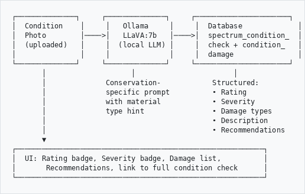

# Heratio — AI Condition Assessment

**Product:** Heratio Framework v2.8.2
**Component:** ahgConditionPlugin + ConditionAIService
**Date:** 16 March 2026
**Author:** The Archive and Heritage Group (Pty) Ltd

---

## Overview

AI Condition Assessment uses a local vision model (LLaVA) to analyze photographs of cultural heritage objects and generate structured condition reports. The system runs entirely on-premises — no cloud services, no API fees, no data leaves your network.

## How It Works

```
┌──────────────┐     ┌──────────────┐     ┌──────────────────────┐
│  Condition    │     │   Ollama     │     │  Database             │
│  Photo        │────>│   LLaVA:7b   │────>│  spectrum_condition_  │
│  (uploaded)   │     │  (local LLM) │     │  check + condition_   │
│               │     │              │     │  damage               │
└──────────────┘     └──────────────┘     └──────────────────────┘
       │                    │                       │
       │              Conservation-            Structured:
       │              specific prompt          • Rating
       │              with material            • Severity
       │              type hint                • Damage types
       │                                       • Description
       │                                       • Recommendations
       ▼
┌──────────────────────────────────────────────────────────┐
│  UI: Rating badge, Severity badge, Damage list,          │
│       Recommendations, link to full condition check      │
└──────────────────────────────────────────────────────────┘

```

## User Workflow

1. Navigate to a record with a condition assessment
2. Go to **Condition Photos**
3. Click the **robot icon** (AI Scan) on any photo
4. Wait 2-30 seconds (GPU vs CPU)
5. Review the AI assessment: rating, damage types, severity, recommendations
6. Assessment is automatically saved to the database

## Damage Types Detected

15 Spectrum 5.1 damage types with 30+ synonym mappings:

| Damage Type | Synonyms Recognised |
|-------------|-------------------|
| tear | torn, rip, split |
| stain | stained, spot, mark |
| foxing | fox |
| fading | fade, faded, bleach |
| water_damage | water, moisture, wet |
| mold | mould, fungus, fungal |
| pest_damage | insect, pest, bug, rodent |
| abrasion | scratch, scuff, wear |
| brittleness | brittle, fragile |
| loss | missing, lacuna, hole |
| crack | cracked, cracking |
| corrosion | rust, oxidation, tarnish |
| discolouration | discolour, discolor, yellowing |
| deformation | warp, bent, buckle |
| dust | dirty, grime, soot |

## Rating Scale

| Rating | Description | Priority Mapping |
|--------|-------------|-----------------|
| Excellent | No visible damage or deterioration | Low |
| Good | Minor wear consistent with age, no active damage | Low |
| Fair | Some damage visible, monitoring recommended | Normal |
| Poor | Significant damage, treatment recommended | High |
| Critical | Severe damage, urgent treatment required | Urgent |

## Severity Levels

| Severity | Description |
|----------|-------------|
| Minor | Surface-level, cosmetic only |
| Moderate | Structural concern, should be addressed |
| Severe | Active deterioration, needs prompt attention |
| Critical | Immediate risk of further loss, urgent intervention |

## Technology Stack

| Component | Details | License |
|-----------|---------|---------|
| LLaVA:7b | Vision-language model (4.7GB) | Apache 2.0 — free for commercial use |
| Ollama | Local LLM runtime | MIT — free for commercial use |
| Server | Runs on 112 (CPU) or 115 (RTX 3080 GPU) | — |

**No cloud dependency. No API keys. No usage fees. No data leaves your network.**

### Performance

| Server | Hardware | Speed per Image |
|--------|----------|----------------|
| 112 | CPU only (no GPU) | ~20-30 seconds |
| 115 | NVIDIA RTX 3080 10GB | ~2-3 seconds |

To point to 115: AHG Settings > Voice & AI > Local LLM URL → `http://192.168.0.115:11434`

## Current Accuracy

| Aspect | Rating | Notes |
|--------|--------|-------|
| Obvious damage (tears, stains, mould) | Good (70%) | LLaVA sees these clearly |
| Severity assessment | Fair (50%) | Guesses — no conservation training |
| Subtle damage (foxing, early mould) | Poor (30%) | Generic model, not domain-trained |
| Structured output parsing | Good (85%) | Prompt engineering forces consistent format |
| Material-specific knowledge | Poor (30%) | Doesn't differentiate paper vs metal conservation |

**Overall: 60-70% accuracy with prompt engineering alone.** Suitable for first-pass triage. Expert review still required for formal condition reports.

## Improving Accuracy — Fine-Tuning

### LoRA Fine-Tuning Path

Fine-tuning LLaVA with conservation images improves accuracy to 85-90%. The fine-tuned model still runs locally with no external dependencies.

**Requirements:**
- 200-500 annotated condition photos (more = better)
- GPU with 10GB+ VRAM (RTX 3080 on server 115)
- 4-8 hours training time
- Result: conservation-specific model weights (~100MB LoRA adapter)

### Training Data Sources

| Source | What | Size | Access |
|--------|------|------|--------|
| **Your own data** | `spectrum_condition_photo` + `condition_damage` tables — photos already annotated with damage types, severity, location | Growing | Already in your DB |
| **ICONCLASS** | Art damage classification images from conservation literature | Small | Academic — free |
| **Conservation Online (CoOL)** | Stanford's preservation resource with before/after treatment photos | Medium | Free: https://cool.culturalheritage.org |
| **ICOM / ICCROM** | International conservation body publications with condition documentation | Medium | Institutional access |
| **Heritage Science Journal** | Open access papers with condition assessment images | Medium | Free: https://heritagesciencejournal.springeropen.com |
| **Europeana** | European cultural heritage — millions of digitised objects, some with condition metadata | Large | Free API: https://pro.europeana.eu/page/apis |
| **Smithsonian Open Access** | 4.4M+ images, some with conservation records | Large | Free: https://www.si.edu/openaccess |
| **UK National Archives** | Preservation assessment datasets | Medium | Free: https://www.nationalarchives.gov.uk |
| **FAIC / AIC** | Foundation for Advancement in Conservation — case studies with photos | Medium | Membership (some free) |

### Practical Path

1. **Start with your own data** — you already have condition photos with expert damage annotations in `spectrum_condition_photo.annotations` (JSON with damage categories, coordinates, severity)
2. **Export 200-500 annotated photo/label pairs** from your DB
3. **LoRA fine-tune** LLaVA on 115 (RTX 3080 can fine-tune 7B model with LoRA in ~4-8 hours on 500 images)
4. **Result:** A conservation-specific vision model that runs locally, knows your terminology, and improves with every assessment your staff does

### Scaling Up

| Model | VRAM | Accuracy (estimated) | Speed (115 GPU) |
|-------|------|---------------------|-----------------|
| llava:7b (current) | 5GB | 60-70% | 2-3s |
| llava:13b | 8GB | 75-80% | 4-5s |
| llava:34b | 20GB+ | 85-90% | Not feasible on 115 |
| llava:7b + LoRA fine-tune | 5GB | 85-90% | 2-3s |

**Recommendation:** LoRA fine-tuning the 7B model gives the best accuracy-to-speed ratio for your hardware.

## Database Integration

### Tables Written

| Table | Fields Written |
|-------|---------------|
| `spectrum_condition_check` | object_id, check_date, overall_condition, condition_rating, condition_description, recommended_treatment, treatment_priority, material_type, workflow_state, condition_note |
| `condition_damage` | condition_report_id, damage_type, severity, location, treatment_required, treatment_notes |
| `spectrum_condition_photo` | condition_check_id (linked to new check) |

### API Endpoint

```
POST /condition/ai-assess
Content-Type: application/x-www-form-urlencoded

Parameters:
  photo_id      — spectrum_condition_photo ID
  object_id     — information_object ID
  material_type — paper, textile, metal, etc. (optional, improves accuracy)

Response:
{
  "success": true,
  "overall_rating": "fair",
  "severity": "moderate",
  "damage_types": [
    {"type": "tear", "severity": "moderate", "location": "overall"},
    {"type": "stain", "severity": "minor", "location": "overall"}
  ],
  "description": "The document shows moderate wear with a visible tear along the left edge and light staining in the upper right quadrant.",
  "recommendations": "Repair the tear with Japanese tissue and wheat starch paste. Surface clean the stained area with a soft brush.",
  "condition_check_id": 42,
  "raw_response": "..."
}
```

## Files

| File | Purpose |
|------|---------|
| `ahgConditionPlugin/lib/Service/ConditionAIService.php` | Core AI service — photo analysis, LLM calling, response parsing, DB save |
| `ahgConditionPlugin/modules/condition/actions/actions.class.php` | `executeAiAssess()` action endpoint |
| `ahgConditionPlugin/config/ahgConditionPluginConfiguration.class.php` | Route registration |
| `ahgConditionPlugin/modules/condition/templates/photosSuccess.php` | UI — AI Scan button and result display |

---

*Heratio Framework v2.8.2 — The Archive and Heritage Group (Pty) Ltd*
