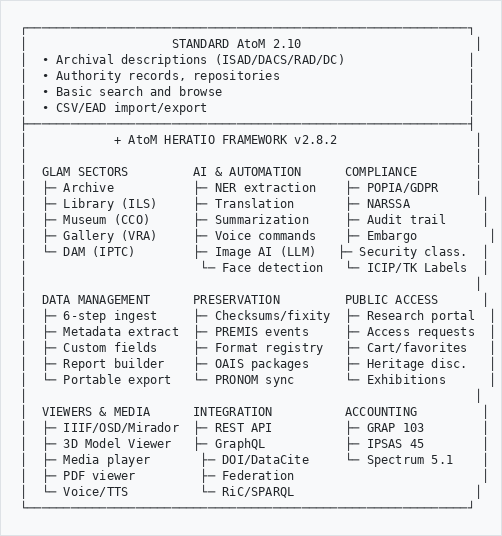
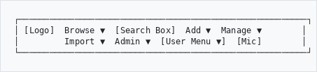
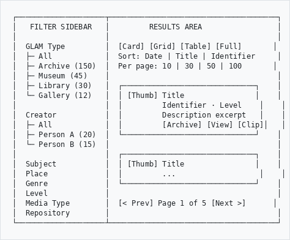
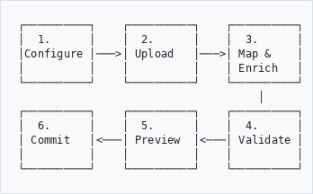

# Heratio - Complete User Manual

**Product:** Heratio Framework v2.8.2
**Date:** 16 March 2026
**Author:** The Archive and Heritage Group (Pty) Ltd
**Document Type:** Complete System User Manual

---

## Executive Summary

Heratio is a comprehensive modernization of Access to Memory (AtoM) 2.10 - the leading open-source archival management system. It transforms AtoM from a single-purpose archival tool into an enterprise-grade GLAM platform (Galleries, Libraries, Archives, Museums) and Digital Asset Management (DAM) system, adding approximately 300% more functionality through 80 modular plugins - without modifying a single core AtoM file.

### What Makes Heratio Different

```
┌─────────────────────────────────────────────────────────────┐
│                    STANDARD AtoM 2.10                        │
│  • Archival descriptions (ISAD/DACS/RAD/DC)                 │
│  • Authority records, repositories                          │
│  • Basic search and browse                                  │
│  • CSV/EAD import/export                                    │
├─────────────────────────────────────────────────────────────┤
│            + AtoM HERATIO FRAMEWORK v2.8.2                   │
│                                                              │
│  GLAM SECTORS         AI & AUTOMATION      COMPLIANCE        │
│  ├─ Archive           ├─ NER extraction    ├─ POPIA/GDPR     │
│  ├─ Library (ILS)     ├─ Translation       ├─ NARSSA          │
│  ├─ Museum (CCO)      ├─ Summarization     ├─ Audit trail     │
│  ├─ Gallery (VRA)     ├─ Voice commands    ├─ Embargo          │
│  └─ DAM (IPTC)        ├─ Image AI (LLM)   ├─ Security class.  │
│                        └─ Face detection   └─ ICIP/TK Labels  │
│                                                              │
│  DATA MANAGEMENT      PRESERVATION         PUBLIC ACCESS      │
│  ├─ 6-step ingest     ├─ Checksums/fixity  ├─ Research portal  │
│  ├─ Metadata extract  ├─ PREMIS events     ├─ Access requests  │
│  ├─ Custom fields     ├─ Format registry   ├─ Cart/favorites   │
│  ├─ Report builder    ├─ OAIS packages     ├─ Heritage disc.   │
│  └─ Portable export   └─ PRONOM sync       └─ Exhibitions      │
│                                                              │
│  VIEWERS & MEDIA      INTEGRATION          ACCOUNTING         │
│  ├─ IIIF/OSD/Mirador  ├─ REST API          ├─ GRAP 103        │
│  ├─ 3D Model Viewer   ├─ GraphQL           ├─ IPSAS 45        │
│  ├─ Media player       ├─ DOI/DataCite     └─ Spectrum 5.1    │
│  ├─ PDF viewer         ├─ Federation                          │
│  └─ Voice/TTS          └─ RiC/SPARQL                         │
└─────────────────────────────────────────────────────────────┘

```

### Key Numbers

| Metric | Value |
|--------|-------|
| Plugins | 80 (15 locked core + 6 stable GLAM + 59 feature) |
| CLI commands | 71 (framework) + 40+ (plugin tasks) |
| Services | 90+ |
| Settings fields | 200+ across 21 sections |
| Compliance standards | 12 (POPIA, GDPR, CCPA, PIPEDA, NDPA, DPA, NARSSA, CDPA, NAZ, NMMZ, GRAP 103, IPSAS 45) |
| Descriptive standards | 5 (ISAD(G), DACS, Dublin Core, MODS, RAD) |
| GLAM sectors | 5 (Archive, Library, Museum, Gallery, DAM) |
| Languages (voice) | 11 |
| WCAG conformance | Level AA |

### Who Is This For?

- **Archivists** - managing archival collections with full ISAD(G)/DACS/RAD support
- **Librarians** - cataloguing with MARC-inspired fields, ISBN lookup, circulation management
- **Museum curators** - CCO cataloguing, Spectrum 5.1 procedures, Getty AAT integration
- **Gallery managers** - exhibition management, artist tracking, loan management
- **Digital asset managers** - IPTC metadata, watermarks, batch processing
- **Compliance officers** - POPIA/GDPR compliance, audit trails, security classification
- **Researchers** - reading room booking, access requests, workspace management
- **IT administrators** - backup scheduling, API management, system monitoring

---

## Chapter 1: Getting Started

### 1.1 Logging In

1. Navigate to your institution's AtoM URL (e.g., `https://psis.theahg.co.za`)
2. Click **Log in** in the top-right corner
3. Enter your email address and password
4. Click **Log in**

### 1.2 Navigation

The main navigation bar contains:

```
┌─────────────────────────────────────────────────────────┐
│ [Logo]  Browse ▼  [Search Box]  Add ▼  Manage ▼        │
│         Import ▼  Admin ▼  [User Menu ▼]  [Mic]        │
└─────────────────────────────────────────────────────────┘

```

| Menu | Contents |
|------|----------|
| **Browse** | Archival descriptions, Authority records, Institutions, Functions, Subjects, Places, Digital objects |
| **Add** | New archival description, authority record, accession, institution, term, function |
| **Manage** | Accessions, Donors, Rights holders, Physical storage, Jobs |
| **Import** | CSV, EAD XML, SKOS, Digital objects |
| **Admin** | Plugins, Themes, Settings, AHG Settings, Users, Groups, Menus, Static pages, Visible elements |

### 1.3 Dashboard / Homepage

The homepage displays:

- **Welcome carousel** - featured collections with images
- **Browse by GLAM type** - cards for Archive, Library, Museum, Gallery, DAM
- **Browse by creator** - top creators with item counts
- **Recent additions** - latest records added to the system
- **Quick search** - search box with semantic search toggle

---

## Chapter 2: Browse & Search

### 2.1 GLAM Browse

**Access:** Browse > Archival descriptions (or click a GLAM type card)

The browse page shows records in a card layout with filtering:

```
┌────────────────────┬──────────────────────────────────────┐
│   FILTER SIDEBAR   │         RESULTS AREA                 │
│                    │                                      │
│  GLAM Type         │  [Card] [Grid] [Table] [Full]       │
│  ├─ All            │  Sort: Date | Title | Identifier     │
│  ├─ Archive (150)  │  Per page: 10 | 30 | 50 | 100       │
│  ├─ Museum (45)    │                                      │
│  ├─ Library (30)   │  ┌──────────────────────────────┐    │
│  └─ Gallery (12)   │  │ [Thumb] Title                │    │
│                    │  │         Identifier · Level    │    │
│  Creator           │  │         Description excerpt   │    │
│  ├─ All            │  │         [Archive] [View] [Clip]│   │
│  ├─ Person A (20)  │  └──────────────────────────────┘    │
│  └─ Person B (15)  │                                      │
│                    │  ┌──────────────────────────────┐    │
│  Subject           │  │ [Thumb] Title                │    │
│  Place             │  │         ...                   │    │
│  Genre             │  └──────────────────────────────┘    │
│  Level             │                                      │
│  Media Type        │  [< Prev] Page 1 of 5 [Next >]      │
│  Repository        │                                      │
└────────────────────┴──────────────────────────────────────┘

```

**View modes:**
- **Card** - default, shows thumbnail + title + metadata + description excerpt
- **Grid** - compact thumbnails in a grid
- **Table** - spreadsheet-style with sortable columns and resizable headers
- **Full width** - large images with full metadata

**Facet filters:**
Each facet shows the count of matching records. Click to filter; click again to remove. Facets are collapsible (click the header to expand/collapse).

### 2.2 Advanced Search

**Access:** Search box > gear icon > "Advanced search"

Fields:
- **Any field** - searches across all text fields
- **Title** - title field only
- **Identifier / Reference code** - identifier fields
- **Creator** - name access points
- **Subject** - subject access points
- **Place** - place access points
- **Date range** - start and end dates
- **Level of description** - dropdown (fonds, series, file, item, etc.)
- **Repository** - dropdown of institutions
- **Digital object** - has/doesn't have digital object
- **Media type** - image, video, audio, text, application
- **GLAM type** - archive, library, museum, gallery, DAM

Operators: AND, OR, NOT between search fields.

### 2.3 Semantic Search

**Access:** Search box > gear icon > "Semantic search" or "Expand search with synonyms"

Semantic search expands your query with related terms:
- "photographs" also searches "photos", "images", "pictures"
- "World War II" also searches "WWII", "Second World War", "1939-1945"

### 2.4 Discovery Search

**Access:** Search box > gear icon > "Semantic search" modal

Natural language search using three strategies:
1. **Direct match** - exact and fuzzy matching
2. **Expanded match** - synonym and thesaurus expansion
3. **Contextual match** - related concepts and time periods

Results are grouped by relevance with explanations of why each result matched.

---

## Chapter 3: GLAM Sectors

### 3.1 Archive (ISAD(G))

Standard archival descriptions following ISAD(G):

| Field Group | Fields |
|-------------|--------|
| Identity | Reference code, Title, Date(s), Level, Extent |
| Context | Creator, Repository, Archival history, Immediate source |
| Content | Scope and content, Appraisal, Accruals, System of arrangement |
| Access | Conditions of access, Conditions of reproduction, Language, Finding aids |
| Allied Materials | Related units, Publication note |
| Notes | Archivist's note, Rules/conventions |
| Control | Description identifier, Institution identifier, Dates of creation |

### 3.2 Library

MARC-inspired cataloguing with integrated library system (ILS) features:

- **Cataloguing** - bibliographic records with MARC-style fields
- **ISBN Lookup** - auto-populate metadata from ISBN
- **Circulation** - loans, returns, renewals, fines, patron management
- **Cover images** - automatic cover image retrieval

### 3.3 Museum (CCO)

Cataloguing Culturual Objects standard with:

- **Object identification** - object name, classification, materials, techniques
- **Getty AAT** - linked vocabulary for materials, techniques, styles
- **Condition assessment** - with photo documentation
- **Spectrum 5.1** - UK Collections Trust procedures

### 3.4 Gallery

Exhibition and artwork management:

- **Artist tracking** - biographical data, exhibitions, provenance
- **Exhibition management** - planning, layout, loans, installation
- **VRA Core** - Visual Resources Association metadata

### 3.5 Digital Asset Management (DAM)

Photo and media management:

- **IPTC metadata** - automatic extraction and mapping
- **Watermarking** - configurable watermarks on downloads
- **Batch processing** - bulk metadata operations

---

## Chapter 4: Record Management

### 4.1 Creating a Record

**Access:** Add > Archival description

1. Select the descriptive standard (ISAD, DACS, DC, MODS, RAD)
2. Fill in required fields (title is always required)
3. Add access points (subjects, places, names, genres)
4. Attach digital objects (upload or link)
5. Set publication status (draft or published)
6. Click **Save**

### 4.2 Editing a Record

1. Navigate to the record
2. Click **Edit** in the action bar
3. Modify fields using the accordion sections
4. Click **Save** or **Cancel**

### 4.3 Digital Objects

Upload digital objects to records:

- **Images** - JPEG, PNG, TIFF, GIF, WebP (auto-generates thumbnails + reference copies)
- **Documents** - PDF (rendered via IIIF viewer, OCR available)
- **Video** - MP4, OGV, WebM (HTML5 player with transcription)
- **Audio** - MP3, WAV, OGG (HTML5 player with waveform)
- **3D Models** - GLB, GLTF (Google Model Viewer with AR support)

### 4.4 Custom Fields

**Access:** Admin > Custom Fields

Administrators can define custom metadata fields per entity type without code changes:

- **Field types:** text, textarea, date, number, boolean, dropdown, url
- **Entity types:** information object, actor, accession, repository, donor, function
- **Features:** repeatable fields, field grouping, validation rules, searchable flag

---

## Chapter 5: Entity Management

### 5.1 Actors (Authority Records)

**Access:** Browse > Authority records, or Manage > Authority records

ISAAR(CPF) compliant authority records for persons, corporate bodies, and families.

### 5.2 Donors

**Access:** Manage > Donors

Track donors with contact information, donation history, and agreements.

### 5.3 Accessions

**Access:** Manage > Accessions

Track incoming transfers with configurable numbering, priority, and intake workflows.

### 5.4 Repositories

**Access:** Browse > Archival institutions

ISDIAH compliant repository descriptions.

### 5.5 Physical Storage

**Access:** Manage > Physical storage

Track physical locations (buildings, rooms, shelves, containers) and link to records.

### 5.6 Terms & Taxonomies

**Access:** Browse > Subjects, Browse > Places, or Admin > Taxonomies

Manage controlled vocabularies and hierarchical term lists.

---

## Chapter 6: Digital Object Viewers

### 6.1 IIIF Viewer (Images & PDFs)

High-resolution image viewing via OpenSeadragon or Mirador:

- **Zoom** - scroll wheel or +/- buttons
- **Pan** - click and drag
- **Rotate** - rotation controls (if enabled)
- **Full screen** - expand to full screen
- **Navigator** - mini-map for orientation
- **OCR overlay** - text overlay on scanned documents

### 6.2 3D Model Viewer

Google Model Viewer for GLB/GLTF files:

- **Rotate** - click and drag to orbit
- **Zoom** - scroll wheel
- **AR** - "View in AR" on supported devices
- **Hotspots** - clickable annotation points
- **Auto-rotate** - optional continuous rotation

### 6.3 Media Player

HTML5 audio/video player:

- **Controls** - play, pause, seek, volume, playback speed
- **Transcription** - synchronized subtitles/captions (VTT/SRT)
- **Waveform** - visual audio waveform display

### 6.4 PDF Viewer

Embedded PDF rendering via IIIF:

- **Page navigation** - scroll or page number input
- **Zoom** - configurable zoom levels
- **Text search** - search within the PDF (if OCR'd)
- **Download** - download original PDF

---

## Chapter 7: AI & Automation

### 7.1 Named Entity Recognition (NER)

**Access:** AI icon on record view pages, or CLI: `php symfony ai:ner-extract`

Extracts persons, organizations, places, and dates from description text.

### 7.2 Translation

**Access:** Translate button on record view, or CLI: `php symfony ai:translate`

Offline machine translation via Argos Translate. Supported languages: English, Afrikaans, Zulu, Xhosa, Sesotho, French, Portuguese, Spanish, German, Dutch.

### 7.3 Summarization

**Access:** Summarize button on record view, or CLI: `php symfony ai:summarize`

AI-powered text summarization for scope and content fields.

### 7.4 Spellcheck

**Access:** Spellcheck button on record view, or CLI: `php symfony ai:spellcheck`

Spelling and grammar checking via aspell.

### 7.5 AI Description Suggestions

**Access:** AI Suggest on record view, or CLI: `php symfony ai:suggest-description`

LLM-powered description generation using configurable prompt templates. Supports local (Ollama) and cloud (Anthropic Claude) providers.

### 7.6 Voice Commands

**Access:** Click the microphone button in the navbar or floating button

100+ voice commands in 11 languages:

| Category | Examples |
|----------|---------|
| Navigation | "go home", "browse", "search for photographs" |
| Reading | "read title", "read description", "read metadata" |
| AI Describe | "describe image", "save to description", "save to alt text" |
| Media | "read PDF", "read document" |
| Dictation | "start dictating", "stop dictating", punctuation commands |
| Control | "disable voice", "enable voice", "help" |

**Right-click** the mic button to type a command instead of speaking.

### 7.7 Face Detection

**Access:** Settings > AHG Settings > Faces

Experimental face detection and matching to authority records. Backends: OpenCV (local), AWS Rekognition, Azure Face API.

---

## Chapter 8: Import & Export

### 8.1 Data Ingest (6-Step Wizard)

**Access:** Import > Data Ingest

```
┌──────────┐    ┌──────────┐    ┌──────────┐
│  1.      │    │  2.      │    │  3.      │
│Configure │───>│ Upload   │───>│ Map &    │
│          │    │          │    │ Enrich   │
└──────────┘    └──────────┘    └──────────┘
                                     │
┌──────────┐    ┌──────────┐    ┌──────────┐
│  6.      │    │  5.      │    │  4.      │
│ Commit   │<───│ Preview  │<───│ Validate │
│          │    │          │    │          │
└──────────┘    └──────────┘    └──────────┘

```

**Step 1 - Configure:** Select sector, standard, repository, parent, output packages, AI options
**Step 2 - Upload:** CSV, ZIP, EAD, or server directory path
**Step 3 - Map & Enrich:** Column mapping, auto-map, saved profiles, metadata extraction
**Step 4 - Validate:** Required fields, dates, hierarchy, duplicates, checksums
**Step 5 - Preview:** Hierarchical tree, approve/exclude records
**Step 6 - Commit:** Background job execution, progress polling, completion report

### 8.2 CSV Import/Export

**Import:** Import > CSV (various templates for descriptions, authorities, accessions)
**Export:** Browse results > CSV button, or CLI: `php bin/atom csv:export`

### 8.3 Portable Export

**Access:** Clipboard > Portable Catalogue, or record view > Export > Portable Viewer

Creates standalone HTML catalogue for CD/USB/ZIP distribution - works offline without a server.

### 8.4 Metadata Export

**Access:** CLI: `php symfony metadata:export`

Export metadata in GLAM-specific formats.

### 8.5 Label Printing

**Access:** Record view > Print Label

Generate labels with customizable templates including barcodes.

---

## Chapter 9: Compliance & Rights

### 9.1 Privacy (POPIA/GDPR)

**Access:** Admin > Privacy Management

Multi-jurisdiction privacy compliance:

| Jurisdiction | Legislation |
|-------------|-------------|
| South Africa | POPIA + PAIA |
| EU | GDPR |
| UK | UK GDPR |
| USA (California) | CCPA |
| Canada | PIPEDA |
| Nigeria | NDPA |
| Kenya | DPA |

Features: consent management, data subject requests, PII scanning, retention policies, breach notification.

### 9.2 Security Classification

**Access:** Record view > Security tab

Bell-LaPadula mandatory access control:

- **Classification levels** - Unclassified, Restricted, Confidential, Secret, Top Secret
- **User clearance** - assigned per user, controls access to classified records
- **Embargo** - time-based access restrictions

### 9.3 Audit Trail

Automatic logging of all create, update, delete operations across the system.

**Access:** Admin > Audit Trail

### 9.4 Extended Rights

RightsStatements.org integration, Traditional Knowledge (TK) Labels, embargo management.

---

## Chapter 10: Heritage Accounting

### 10.1 GRAP 103 / Heritage Asset Accounting

South African public sector heritage asset valuation and reporting.

### 10.2 IPSAS 45

International Public Sector Accounting Standards for heritage assets.

### 10.3 Spectrum 5.1

UK Collections Trust museum procedures - acquisition, loans, location/movement, condition checking.

---

## Chapter 11: Research & Public Access

### 11.1 Research Portal

**Access:** Research menu

Reading room booking, researcher registration, workspace management, custody chain tracking.

### 11.2 Access Requests

**Access:** Manage > Access Requests

Manage researcher access requests with triage, correspondence, and fulfilment workflows.

### 11.3 Cart

**Access:** Cart icon in navbar

Shopping cart for reproduction requests.

### 11.4 Favorites

**Access:** Heart icon on records

Bookmark records for later reference.

---

## Chapter 12: Collection Management

### 12.1 Condition Assessment

Spectrum-compliant condition recording with photo documentation and scoring.

### 12.2 Provenance

Chain of custody tracking for archival and museum objects.

### 12.3 Donor Agreements

South African compliant donor/institution agreement management.

### 12.4 Loans

Shared loan management for GLAM institutions with status tracking.

---

## Chapter 13: Exhibitions & Public Engagement

### 13.1 Exhibition Management

Plan and manage exhibitions:

- **Exhibition records** - dates, venues, themes, curators
- **Storylines** - narrative flow with stops and media
- **Object selection** - link exhibition to collection objects
- **Loans** - manage incoming/outgoing exhibition loans

### 13.2 Landing Page Builder

**Access:** Admin > Landing Page

Drag-and-drop visual landing page with configurable blocks:
- Hero carousel, collection highlights, statistics, featured records
- Browse by type/creator/subject cards

### 13.3 Heritage Discovery

Public heritage discovery platform with contributor system.

---

## Chapter 14: Integration

### 14.1 REST API

**Access:** Admin > API Settings

RESTful API for external integrations with authentication and rate limiting.

### 14.2 GraphQL

**Access:** `/graphql` endpoint

GraphQL API with security safeguards for complex queries.

### 14.3 DOI Management

DataCite integration for minting Digital Object Identifiers.

### 14.4 Records in Contexts (RiC)

SPARQL/Fuseki RiC-O triplestore integration for RiC (Records in Contexts) linked data.

---

## Chapter 15: Administration

### 15.1 AHG Settings

**Access:** Admin > AHG Settings

Centralized settings management with 21 sections and 200+ configurable options.

#### General - Theme Configuration

| Setting | Type | Default | Description |
|---------|------|---------|-------------|
| Enable AHG Theme | Toggle | On | Use AHG theme customizations |
| Custom Logo | Text | (empty) | Path to custom logo image |
| Primary Color | Color | #1a5f7a | Primary theme color |
| Secondary Color | Color | #57837b | Secondary theme color |
| Card Header Background | Color | #1a5f2a | Card header background |
| Card Header Text | Color | #ffffff | Card header text color |
| Button Background | Color | #1a5f2a | Button background color |
| Button Text | Color | #ffffff | Button text color |
| Link Color | Color | #1a5f2a | Hyperlink color |
| Sidebar Background | Color | #f8f9fa | Sidebar background |
| Sidebar Text | Color | #333333 | Sidebar text color |
| Footer Text | Text | (empty) | Custom footer text |
| Show Branding | Toggle | On | Display AHG branding |
| Custom CSS | Textarea | (empty) | Custom CSS styles |

#### Spectrum - Collections Management

| Setting | Type | Default | Description |
|---------|------|---------|-------------|
| Enable Spectrum | Toggle | On | Enable Spectrum procedures |
| Default Currency | Select | ZAR | ZAR, USD, EUR, GBP |
| Valuation Reminder | Days | 365 | Re-valuation reminder period |
| Default Loan Period | Days | 90 | Default loan duration |
| Condition Check Interval | Days | 180 | Recommended check interval |
| Auto-create Movements | Toggle | On | Auto-create on location change |
| Require Photos | Toggle | Off | Require photos for condition reports |
| Email Notifications | Toggle | On | Task assignment notifications |

#### Media - Media Player

| Setting | Type | Default | Description |
|---------|------|---------|-------------|
| Player Type | Select | enhanced | basic or enhanced |
| Auto-play | Toggle | Off | Auto-play on load |
| Show Controls | Toggle | On | Display controls |
| Loop Playback | Toggle | Off | Loop media |
| Default Volume | Slider | 0.8 | Volume level (0-1.0) |
| Show Download | Toggle | Off | Download button |

#### Photos - Photo Upload

| Setting | Type | Default | Description |
|---------|------|---------|-------------|
| Upload Path | Text | (auto) | Storage path |
| Max Upload Size | Select | 10 MB | 5/10/20/50 MB |
| Create Thumbnails | Toggle | On | Auto-generate thumbnails |
| Thumbnail Small | Pixels | 150 | Small size |
| Thumbnail Medium | Pixels | 300 | Medium size |
| Thumbnail Large | Pixels | 600 | Large size |
| JPEG Quality | Slider | 85 | Compression quality |
| Extract EXIF | Toggle | On | Read camera data |
| Auto-rotate | Toggle | On | EXIF orientation |

#### Data Protection - Compliance

| Setting | Type | Default | Description |
|---------|------|---------|-------------|
| Enable Module | Toggle | On | Enable data protection |
| Default Regulation | Select | POPIA | POPIA/GDPR/PAIA/CCPA |
| Notify Overdue | Toggle | On | Email for overdue requests |
| Notification Email | Email | (empty) | Notification recipient |
| POPIA Request Fee | ZAR | 50 | Standard fee |
| Special Category Fee | ZAR | 140 | Special category fee |
| Response Days | Days | 30 | Response deadline |

#### IIIF - Image Viewer

| Setting | Type | Default | Description |
|---------|------|---------|-------------|
| Enable IIIF | Toggle | On | Enable IIIF viewer |
| Viewer Library | Select | OpenSeadragon | OSD/Mirador/Leaflet |
| IIIF Server URL | URL | (empty) | External server (blank=built-in) |
| Show Navigator | Toggle | On | Mini-map |
| Enable Rotation | Toggle | On | Allow rotation |
| Max Zoom Level | Number | 10 | Zoom limit (1-20) |

#### Jobs - Background Processing

| Setting | Type | Default | Description |
|---------|------|---------|-------------|
| Enable Jobs | Toggle | On | Enable background jobs |
| Max Concurrent | Number | 2 | Parallel jobs (1-10) |
| Timeout | Seconds | 3600 | Job timeout |
| Retry Attempts | Number | 3 | Retry count (0-10) |
| Cleanup After | Days | 30 | Delete completed jobs |
| Notify on Failure | Toggle | On | Email on failure |
| Notification Email | Email | (empty) | Failure alert email |

#### Fuseki - RiC Triplestore

| Setting | Type | Default | Description |
|---------|------|---------|-------------|
| SPARQL Endpoint | URL | http://localhost:3030/ric | Fuseki endpoint |
| Username | Text | admin | Fuseki user |
| Password | Password | (hidden) | Fuseki password |
| Enable Auto Sync | Toggle | On | Master sync switch |
| Use Async Queue | Toggle | On | Queue for background |
| Sync on Save | Toggle | On | Sync on record save |
| Sync on Delete | Toggle | On | Remove on delete |
| Cascade Delete | Toggle | On | Remove references |
| Batch Size | Number | 100 | Records per batch |
| Integrity Schedule | Select | weekly | daily/weekly/monthly/disabled |
| Orphan Retention | Days | 30 | Orphan cleanup period |

#### Metadata - Extraction Configuration

| Setting | Type | Default | Description |
|---------|------|---------|-------------|
| Extract on Upload | Toggle | On | Auto-extract metadata |
| Auto-Populate | Toggle | On | Populate fields |
| Images / PDF / Office / Video / Audio | Toggles | All On | File types to process |
| Field Mapping (per sector) | Selects | (varies) | Map extracted fields to AtoM fields |

*Field mapping is configurable per GLAM sector (ISAD, Museum, DAM) for: Title, Creator, Keywords, Description, Date, Copyright, Technical Data, GPS.*

#### Faces - Face Detection

| Setting | Type | Default | Description |
|---------|------|---------|-------------|
| Enable | Toggle | Off | Experimental feature |
| Backend | Select | local | local (OpenCV), aws, azure |

#### Ingest - Data Ingest Defaults

| Setting | Type | Default | Description |
|---------|------|---------|-------------|
| AI Processing | 8 Toggles | (varies) | Virus scan, OCR, NER, Summarize, Spellcheck, Format ID, Face detect, Translate |
| Translation Languages | Selects | en → af | From/to language |
| Spellcheck Language | Select | en_ZA | Dictionary |
| Output Defaults | 6 Toggles | (varies) | Records, SIP, AIP, DIP, thumbnails, references |
| Output Paths | 3 Text | (empty) | SIP/AIP/DIP output directories |
| Default Sector | Select | archive | Default GLAM sector |
| Default Standard | Select | ISAD(G) | Default descriptive standard |

#### Portable Export

| Setting | Type | Default | Description |
|---------|------|---------|-------------|
| Enable | Toggle | On | Allow portable exports |
| Retention | Days | 30 | Auto-delete after |
| Include: Objects/Thumbnails/References/Masters | 4 Toggles | (varies) | Content inclusion |
| Default Mode | Select | read_only | read_only or editable |
| Default Language | Select | en | Export language |
| Max Size | MB | 2048 | Size limit |
| Show on Description Pages | Toggle | On | Export button visibility |
| Show on Clipboard | Toggle | On | Clipboard export option |

#### Encryption

| Setting | Type | Default | Description |
|---------|------|---------|-------------|
| Enable Encryption | Toggle | Off | Master toggle |
| Encrypt Derivatives | Toggle | On | Also encrypt thumbnails |
| Field Categories | 5 Toggles | All Off | Contact details, Financial, Donor info, Personal notes, Access restrictions |

*Requires encryption key at `/etc/atom/encryption.key`. Algorithm: XChaCha20-Poly1305 or AES-256-GCM.*

#### Voice & AI

| Setting | Type | Default | Description |
|---------|------|---------|-------------|
| Enable Voice | Toggle | On | Voice command system |
| Language | Select | en-US | 11 languages available |
| Confidence | Slider | 0.4 | Recognition threshold |
| Speech Rate | Slider | 1.0 | TTS playback speed |
| Continuous Listen | Toggle | Off | Stay on after each command |
| Floating Button | Toggle | On | Show mic button |
| Hover Read | Toggle | On | TTS on mouse hover |
| Hover Delay | Slider | 400ms | Delay before reading |
| LLM Provider | Select | hybrid | local/cloud/hybrid |
| Daily Cloud Limit | Number | 50 | Cloud API call limit |
| Local LLM URL | URL | http://localhost:11434 | Ollama endpoint |
| Local LLM Model | Text | llava:7b | Vision model |
| Timeout | Seconds | 30 | LLM request timeout |
| Cloud API Key | Password | (hidden) | Anthropic API key |
| Cloud Model | Text | claude-sonnet-4-20250514 | Cloud model ID |
| Audit AI Calls | Toggle | On | Log to audit trail |

#### Integrity - Verification

| Setting | Type | Default | Description |
|---------|------|---------|-------------|
| Enable | Toggle | On | Master switch |
| Auto Baselines | Toggle | On | Auto-generate if none exist |
| Algorithm | Select | sha256 | sha256 or sha512 |
| Batch Size | Number | 200 | Objects per run |
| IO Throttle | ms | 10 | Pause between objects |
| Max Runtime | Minutes | 120 | Maximum run time |
| Max Memory | MB | 512 | Memory limit |
| Dead Letter Threshold | Number | 3 | Failures before escalation |
| Notify on Failure | Toggle | On | Run failure alerts |
| Notify on Mismatch | Toggle | On | Hash mismatch alerts |
| Alert Email | Email | (empty) | Notification recipient |
| Webhook URL | URL | (empty) | Slack/Teams/PagerDuty |

#### Accession - Intake Settings

| Setting | Type | Default | Description |
|---------|------|---------|-------------|
| Numbering Mask | Text | ACC-{YYYY}-{####} | Auto-number pattern |
| Default Priority | Select | normal | low/normal/high/urgent |
| Auto-Assign | Toggle | Off | Assign to creating archivist |
| Require Donor Agreement | Toggle | Off | Agreement before finalization |
| Require Appraisal | Toggle | Off | Appraisal before finalization |
| Allow Container Barcodes | Toggle | Off | Barcode scanning |
| Rights Inheritance | Toggle | Off | Inherit from donor agreement |

#### Authority - Authority Records

| Setting | Type | Default | Description |
|---------|------|---------|-------------|
| External Sources | 5 Toggles | All Off | Wikidata, VIAF, Getty ULAN, LCNAF, ISNI |
| Auto-Verify Wikidata | Toggle | Off | Auto-mark as verified |
| Auto-Recalculate Completeness | Toggle | On | Completeness scores |
| Hide Stubs from Public | Toggle | On | Hide incomplete records |
| NER Auto-Create Stubs | Toggle | Off | Auto-create from NER |
| NER Confidence Threshold | Number | 0.85 | Minimum confidence |
| Require Approval for Merge | Toggle | Off | Workflow approval |
| Dedup Threshold | Number | 0.80 | Similarity score |
| Function Linking | Toggle | On | ISDF actor-function links |

#### Security - Access Control

| Setting | Type | Default | Description |
|---------|------|---------|-------------|
| Password Expiry | Days | 90 | Expiration period (0=disabled) |
| Password History | Number | 5 | Previous passwords remembered |
| Expiry Warning | Days | 14 | Warning before expiry |
| Show Expiry Notification | Toggle | On | Login notification |
| Force Password Change | Toggle | Off | Redirect when expired |
| Enable Lockout | Toggle | On | Account lockout |
| Max Failed Attempts | Number | 5 | Attempts before lockout |
| Lockout Duration | Minutes | 15 | Lockout period |
| Session Timeout | Minutes | 30 | Idle session timeout |
| Login Attempt Retention | Hours | 24 | Log retention |

#### Library - Circulation

| Setting | Type | Default | Description |
|---------|------|---------|-------------|
| Loan Rules | Table | (per material/patron type) | Loan days, renewals, fines, grace period |
| Default Loan Period | Days | 14 | Default loan duration |
| Default Max Renewals | Number | 2 | Default renewal count |
| Currency | Text | ZAR | Currency code |
| Auto Fine | Toggle | (varies) | Generate fines automatically |

#### FTP - File Transfer

| Setting | Type | Default | Description |
|---------|------|---------|-------------|
| Protocol | Select | SFTP | SFTP or FTP |
| Host | Text | (empty) | Server hostname |
| Port | Number | 22 | Port number |
| Username | Text | (empty) | FTP user |
| Password | Password | (hidden) | FTP password |
| Remote Path | Text | /uploads | Remote base path |
| Server Disk Path | Text | (empty) | Filesystem path |
| Passive Mode | Toggle | On | FTP passive mode |

### 15.2 Backup & Restore

**Access:** Admin > Backup & Restore

See separate Backup Strategy documentation for full details on:
- Full, incremental, and scheduled backups
- Restore from list or upload
- Email notifications
- Retention policies
- CLI: `php symfony backup:run-scheduled`

### 15.3 Reports & Statistics

**Access:** Admin > Reports, Admin > Statistics

- **Reports Dashboard** - pre-built reports on collections, access, compliance
- **Report Builder** - enterprise report builder with rich text, templates, SQL queries, Word/PDF/XLSX export
- **Statistics** - usage tracking and trends

### 15.4 Workflow

**Access:** Admin > Workflow

Configurable approval workflows with task assignment, deadlines, and escalation.

### 15.5 Queue Management

**Access:** Admin > Queue

Background job queue with:
- Job status monitoring
- Failed job retry
- Rate limiting
- Per-queue workers via systemd

### 15.6 User Management

**Access:** Admin > Users & Groups

User accounts, roles, groups, and ACL permissions.

---

## Chapter 16: Accessibility

### 16.1 WCAG 2.1 Level AA

All pages include:
- ARIA landmarks and live regions
- Keyboard navigation with visible focus
- Screen reader support
- Colour contrast AA compliance
- Reduced motion support
- High contrast mode support

### 16.2 Voice Commands

See Chapter 7.6 for full voice command documentation.

### 16.3 Accessibility Statement

A built-in accessibility statement is linked from the site footer.

---

## Chapter 17: Digital Preservation

### 17.1 Fixity & Checksums

Verify file integrity with SHA-256/SHA-512 checksums and scheduled fixity checks.

### 17.2 PREMIS Events

Record preservation events (creation, migration, validation, fixity check).

### 17.3 Format Registry

PRONOM format identification via Siegfried. Automatic format risk assessment.

### 17.4 OAIS Packages

Generate Submission (SIP), Archival (AIP), and Dissemination (DIP) Information Packages via the ingest wizard.

---

## Appendix A: Keyboard Shortcuts

| Shortcut | Action |
|----------|--------|
| Ctrl+Shift+V | Toggle voice commands |
| Ctrl+Shift+H | Open voice help |
| Tab | Navigate to next interactive element |
| Shift+Tab | Navigate to previous element |
| Escape | Close modal/dropdown |
| Enter | Activate focused element |

## Appendix B: CLI Quick Reference

```bash
# Extension management
php bin/atom extension:discover
php bin/atom extension:enable <name>
php bin/atom extension:disable <name>

# Search
php symfony search:populate

# Backup
php symfony backup:run-scheduled
php symfony backup:run-scheduled --dry-run

# AI
php symfony ai:ner-extract --slug=<slug>
php symfony ai:translate --from=en --to=af
php symfony ai:summarize --slug=<slug>
php symfony ai:suggest-description --slug=<slug>

# Ingest
php symfony ingest:commit --job-id=<id>

# Preservation
php symfony preservation:fixity
php symfony preservation:identify
php symfony preservation:pronom-sync

# Cache
php symfony cc
```

---

*Document generated 16 March 2026 by The Archive and Heritage Group (Pty) Ltd.*
*Heratio Framework v2.8.2 - 80 plugins, 200+ settings, WCAG 2.1 AA compliant.*
