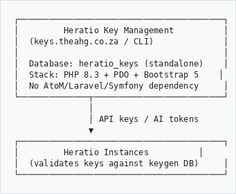

# Heratio — Key Management

## Feature Overview

**Component:** Heratio Key Management (heratio-keygen)
**Version:** 1.0.0
**Category:** Security & Administration
**Publisher:** The Archive and Heritage Group (Pty) Ltd

---

## Summary

Heratio Key Management is a standalone application for managing client API keys and AI server tokens used by Heratio installations. It operates independently from AtoM with its own database, providing a centralized point of control for all client authentication credentials. Available as both a CLI tool and a web interface.

## Key Features

### Client Management
- **Client Registry** — Register and manage client organizations using Heratio
- **Contact Information** — Store client name, email, and organization details
- **Status Control** — Activate or deactivate clients; deactivation automatically revokes all associated keys and tokens

### API Key Management
- **Secure Generation** — Cryptographically random API keys with `hk_api_` prefix for easy identification
- **SHA-256 Hashed Storage** — Keys are hashed before storage; plaintext shown only once at generation
- **Revocation** — Individual key revocation with timestamp tracking
- **Scoping** — Keys scoped by name/purpose (e.g., "production", "staging", "development")

### AI Server Token Management
- **Dedicated AI Tokens** — Separate token type (`hk_ai_` prefix) for AI server authentication
- **Independent Lifecycle** — AI tokens managed separately from API keys
- **Service Isolation** — AI server access controlled independently from REST API access

### Web Interface
- **Dashboard** — Overview cards showing total clients, active API keys, active AI tokens, and 30-day usage
- **Client Management** — Create, view, and deactivate clients through the browser
- **Key/Token Operations** — Generate, list, and revoke keys and tokens per client
- **Responsive Design** — Bootstrap 5 interface, mobile-friendly
- **Secure Access** — Password-protected admin login

### CLI Interface
- **12 Commands** — Full management capability from the command line
- **Scriptable** — Suitable for automation and CI/CD integration
- **Installation** — Built-in database installer (`keygen install`)

### Usage Tracking
- **Request Logging** — Every API key and AI token validation logged with timestamp, IP, and endpoint
- **Statistics** — Usage counts and last-used timestamps per key/token
- **30-Day Metrics** — Dashboard shows recent activity trends

## Architecture

```
┌─────────────────────────────────────────┐
│         Heratio Key Management          │
│  (keys.theahg.co.za / CLI)              │
│                                         │
│  Database: heratio_keys (standalone)    │
│  Stack: PHP 8.3 + PDO + Bootstrap 5    │
│  No AtoM/Laravel/Symfony dependency     │
└──────────────┬──────────────────────────┘
               │
               │ API keys / AI tokens
               ▼
┌─────────────────────────────────────────┐
│         Heratio Instances          │
│  (validates keys against keygen DB)     │
└─────────────────────────────────────────┘

```

## Database Tables

| Table | Purpose |
|-------|---------|
| `client` | Client organizations (name, email, organization, status) |
| `api_key` | REST API keys — hashed storage, scoped by name |
| `ai_token` | AI server authentication tokens — hashed storage |
| `usage_log` | Validation/usage log with IP, endpoint, timestamp |

## CLI Commands

| Command | Description |
|---------|-------------|
| `keygen install` | Create database tables and seed data |
| `keygen client:create` | Register a new client |
| `keygen client:list` | List all clients |
| `keygen client:deactivate` | Deactivate a client and revoke all credentials |
| `keygen api:generate` | Generate a new API key for a client |
| `keygen api:list` | List API keys for a client |
| `keygen api:revoke` | Revoke an API key |
| `keygen api:validate` | Test-validate an API key |
| `keygen ai:generate` | Generate a new AI server token |
| `keygen ai:list` | List AI tokens for a client |
| `keygen ai:revoke` | Revoke an AI token |
| `keygen ai:validate` | Test-validate an AI token |
| `keygen stats` | Show usage statistics |

## Technical Requirements

| Requirement | Details |
|-------------|---------|
| PHP | 8.3+ |
| MySQL | 8.0+ |
| Database | `heratio_keys` (standalone, separate from AtoM) |
| Web Server | Nginx with PHP-FPM |
| SSL | Recommended for production (Let's Encrypt) |

## Security

- **No plaintext key storage** — All keys and tokens stored as SHA-256 hashes
- **One-time display** — Plaintext credentials shown only at generation time
- **Cascade revocation** — Deactivating a client revokes all associated credentials
- **Path protection** — Nginx blocks access to `/config/`, `/src/`, `/database/`, `/bin/`
- **Session-based auth** — Web interface requires admin login
- **Zero AtoM coupling** — Standalone app with no access to AtoM databases or configuration

## Deployment

- **URL:** `https://keys.theahg.co.za`
- **Path:** `/usr/share/nginx/heratio-keygen`
- **Repository:** `ArchiveHeritageGroup/heratio-keygen`
- **Database User:** Dedicated MySQL user (not root)

---

*Heratio is developed by The Archive and Heritage Group (Pty) Ltd for GLAM and DAM institutions worldwide.*
