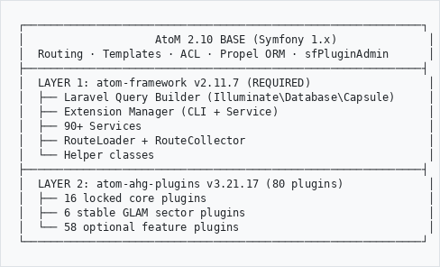

# Heratio — Project Briefing

**Version:** Framework 2.11.7 / Plugins 3.21.17
**Date:** 16 March 2026
**Organization:** The Archive and Heritage Group (Pty) Ltd
**Owner:** Johan Pieterse (johan@theahg.co.za)

---

## What Is Heratio?

Heratio is a comprehensive modernization of **Access to Memory (AtoM) 2.10** — the world's leading open-source archival management system used by thousands of institutions globally. Heratio transforms AtoM from a single-purpose archival tool into an enterprise-grade **GLAM platform** (Galleries, Libraries, Archives, Museums) and **Digital Asset Management** system.

It adds approximately **300% more functionality** through 80 modular plugins — without modifying a single core AtoM file. All customizations sit in two layers on top of base AtoM, maintaining full backward compatibility and upgrade paths.

### Target Market

GLAM and DAM institutions internationally:
- National archives and government record offices
- University and research libraries
- Museums and cultural heritage institutions
- Art galleries and exhibition spaces
- Digital asset management organizations
- Heritage and conservation bodies

### Competitive Position

| Alternative | Cost | Limitations |
|-------------|------|------------|
| Preservica | $50K+/year | Proprietary, archive-only |
| ArchivesSpace | Free (open source) | Archive-only, no GLAM |
| CollectiveAccess | Free (open source) | Museum-focused, limited |
| ResourceSpace | Free/paid | DAM-only |
| **Heratio** | **Free (GPL-3.0)** | **All 5 sectors in one platform** |

---

## System at a Glance

| Metric | Value |
|--------|-------|
| Framework version | 2.11.7 |
| Plugin version | 3.21.17 |
| Total plugins | 80 (registered: 79 + ahgMigrationPlugin filesystem-only) |
| Enabled plugins | 108 (incl. base AtoM plugins) |
| Locked core plugins | 16 |
| Database tables | 894 |
| CLI commands | 235 (Symfony) + framework commands |
| Help articles | 201 (published) |
| Settings fields | 200+ across 21 sections |
| Descriptive standards | 5 (ISAD(G), DACS, Dublin Core, MODS, RAD) |
| GLAM sectors | 5 (Archive, Library, Museum, Gallery, DAM) |
| Compliance standards | 12 jurisdictions |
| WCAG conformance | Level AA |
| Voice commands | 100+ in 11 languages |
| GitHub issues | 218 closed, 9 open (7 future/parked) |

### Sample Instance (PSIS)

| Metric | Count |
|--------|-------|
| Archival descriptions | 704 |
| Authority records | 395 |
| Digital objects | 665 |
| Accessions | 4 |
| Repositories | 14 |

---

## Architecture

```
┌─────────────────────────────────────────────────────────────┐
│                    AtoM 2.10 BASE (Symfony 1.x)              │
│  Routing · Templates · ACL · Propel ORM · sfPluginAdmin      │
├─────────────────────────────────────────────────────────────┤
│  LAYER 1: atom-framework v2.11.7 (REQUIRED)                  │
│  ├── Laravel Query Builder (Illuminate\Database\Capsule)     │
│  ├── Extension Manager (CLI + Service)                       │
│  ├── 90+ Services                                            │
│  ├── RouteLoader + RouteCollector                            │
│  └── Helper classes                                          │
├─────────────────────────────────────────────────────────────┤
│  LAYER 2: atom-ahg-plugins v3.21.17 (80 plugins)             │
│  ├── 16 locked core plugins                                  │
│  ├── 6 stable GLAM sector plugins                            │
│  └── 58 optional feature plugins                             │
└─────────────────────────────────────────────────────────────┘

```

### Technology Stack

| Component | Version | Purpose |
|-----------|---------|---------|
| PHP | 8.3 | Application runtime |
| MySQL | 8.0 | Database |
| Elasticsearch | 7.10 | Full-text search |
| Bootstrap 5 | 5.3 | Frontend framework |
| Nginx | 1.18+ | Web server |
| Cantaloupe | 5.0.6 | IIIF image server |
| Ollama | 0.17.7 | Local LLM runtime (LLaVA, Mistral) |
| Python 3 | 3.12 | AI services (NER, translation, summarization) |
| Node.js | 18+ | Webpack build |

### Server Infrastructure

| Server | IP | Role | GPU |
|--------|-----|------|-----|
| 112 | 192.168.0.112 | Web/App (AtoM instances) | None |
| 115 | 192.168.0.115 | AI/GPU Workhorse | NVIDIA RTX 3080 10GB |
| 92 | 192.168.0.92 | Future inference | NVIDIA RTX 3060 12GB |
| TrueNAS | /mnt/nas/heratio/ | Digital object storage | — |

---

## Complete Plugin Catalog (80 Plugins)

### Core & Theme (Locked)

| Plugin | Purpose |
|--------|---------|
| ahgCorePlugin | Framework integration bridge |
| ahgThemeB5Plugin | Bootstrap 5 theme with voice commands, WCAG AA, TTS |
| ahgSecurityClearancePlugin | Bell-LaPadula security classification |
| ahgDisplayPlugin | GLAM Browse with dynamic facets, 4 view modes |
| ahgUiOverridesPlugin | Viewer dispatch, UI helpers |
| ahgSettingsPlugin | 21-section settings management (200+ options) |

### GLAM Sectors (Stable)

| Plugin | Sector | Key Features |
|--------|--------|-------------|
| ahgLibraryPlugin | Library | MARC cataloguing, ISBN lookup, circulation, fines, patron management |
| ahgMuseumPlugin | Museum | CCO, Spectrum 5.1, Getty AAT (1,057 cached terms), condition assessment |
| ahgGalleryPlugin | Gallery | VRA Core, exhibitions, artist tracking, loans, valuations |
| ahgDAMPlugin | DAM | IPTC metadata extraction, watermarking, batch processing |

### Browse/Manage Plugins

| Plugin | Entity |
|--------|--------|
| ahgAccessionManagePlugin | Accessions with numbering, priority, intake workflow |
| ahgAccessRequestPlugin | Researcher access requests with triage |
| ahgActorManagePlugin | Authority records + autocomplete |
| ahgDonorManagePlugin | Donors |
| ahgRepositoryManagePlugin | Repositories |
| ahgRightsHolderManagePlugin | Rights holders |
| ahgStorageManagePlugin | Physical storage locations |
| ahgTermTaxonomyPlugin | Terms + taxonomies |
| ahgUserManagePlugin | User accounts |
| ahgJobsManagePlugin | Background jobs |
| ahgMenuManagePlugin | Navigation menus |
| ahgStaticPagePlugin | Static pages |
| ahgFunctionManagePlugin | ISDF functions |

### Descriptive Standard CRUD

| Plugin | Standard |
|--------|----------|
| ahgInformationObjectManagePlugin | ISAD(G) |
| ahgDacsManagePlugin | DACS |
| ahgDcManagePlugin | Dublin Core |
| ahgModsManagePlugin | MODS |
| ahgRadManagePlugin | RAD |

### AI & Automation

| Plugin | Features |
|--------|----------|
| ahgAIPlugin | NER (spaCy), Translation (Argos), Summarization, Spellcheck, Face Detection, LLM Description Suggestions |
| ahgDiscoveryPlugin | Natural language search, query expansion, 3-strategy search |
| ahgSemanticSearchPlugin | Thesaurus, WordNet/Wikidata sync, vector embeddings |
| ahgSearchPlugin | Global search, autocomplete, search/replace |
| ahgDedupePlugin | Duplicate detection with merge workflow |
| ahgTranslationPlugin | Machine translation (LibreTranslate) |

### Data Ingest & Import/Export

| Plugin | Features |
|--------|----------|
| ahgIngestPlugin | OAIS-aligned 6-step batch ingest wizard with 9 AI processing options |
| ahgDataMigrationPlugin | Field mapping between GLAM sectors |
| ahgExportPlugin | CSV, EAD, bulk export |
| ahgMetadataExportPlugin | GLAM metadata export (RiC-O JSON-LD, Schema.org, RIC-O, BIBFRAME) |
| ahgPortableExportPlugin | Standalone offline catalogue viewer (CD/USB/ZIP) |
| ahgLabelPlugin | Label generation with barcodes |
| ahgFormsPlugin | Configurable metadata entry forms per repository |
| ahgMetadataExtractionPlugin | EXIF, IPTC, XMP extraction from digital objects |

### Compliance & Regulatory

| Plugin | Jurisdiction | Standard |
|--------|-------------|----------|
| ahgPrivacyPlugin | Multi (7) | POPIA, GDPR, CCPA, PIPEDA, NDPA, DPA, UK GDPR |
| ahgCDPAPlugin | Zimbabwe | Cyber & Data Protection Act |
| ahgNAZPlugin | Zimbabwe | National Archives Act (25-year rule) |
| ahgNMMZPlugin | Zimbabwe | National Museums & Monuments Act |
| ahgAuditTrailPlugin | Universal | Full audit logging |
| ahgExtendedRightsPlugin | Multi | RightsStatements.org, TK Labels, embargo enforcement |
| ahgICIPPlugin | Indigenous | Indigenous Cultural & Intellectual Property |

### Heritage Accounting & Finance

| Plugin | Standard |
|--------|----------|
| ahgHeritageAccountingPlugin | GRAP 103 / IPSAS 45 |
| ahgIPSASPlugin | International Public Sector Accounting |
| ahgSpectrumPlugin | Spectrum 5.1 (UK Collections Trust) |

### Digital Preservation

| Plugin | Features |
|--------|----------|
| ahgPreservationPlugin | Checksums, fixity, PREMIS events, format registry, PRONOM sync, migration pathways |
| ahgBackupPlugin | Full/incremental/scheduled backups, restore, email notifications |
| ahgTiffPdfMergePlugin | TIFF and PDF merge jobs |

### Rights Management

| Plugin | Features |
|--------|----------|
| ahgRightsPlugin | PREMIS rights, Creative Commons |
| ahgExtendedRightsPlugin | Embargo (4 types: full, metadata_only, digital_only, partial), TK Labels |
| ahgICIPPlugin | Indigenous Cultural & Intellectual Property |

### Research & Public Access

| Plugin | Features |
|--------|----------|
| ahgResearchPlugin | Reading room booking, researcher registration, workspace, custody chain |
| ahgRequestToPublishPlugin | Publication requests for archival images |
| ahgCartPlugin | Shopping cart for reproduction requests |
| ahgFavoritesPlugin | User bookmarks |
| ahgFeedbackPlugin | User feedback management |

### Collection Management

| Plugin | Features |
|--------|----------|
| ahgConditionPlugin | Condition assessment with AI (LLaVA), photo annotation, Spectrum 5.1 |
| ahgProvenancePlugin | Chain of custody tracking |
| ahgDonorAgreementPlugin | Donor/institution agreements (SA compliance) |
| ahgLoanPlugin | Shared loan management |
| ahgVendorPlugin | Vendor/supplier management |
| ahgContactPlugin | Extended contact information |

### Exhibitions & Public Engagement

| Plugin | Features |
|--------|----------|
| ahgExhibitionPlugin | Exhibition management, storylines, media, loans |
| ahgLandingPagePlugin | Drag-drop visual landing page builder |
| ahgHeritagePlugin | Heritage discovery platform, contributor system |

### Integration & API

| Plugin | Features |
|--------|----------|
| ahgIiifPlugin | IIIF manifests, viewer, collections, OCR, Auth API 1.0 |
| ahg3DModelPlugin | 3D viewing, Google Model Viewer, AR, hotspots |
| ahgRicExplorerPlugin | Records in Context (RiC), Fuseki SPARQL RiC-O triplestore |
| ahgGraphQLPlugin | GraphQL API endpoint |
| ahgAPIPlugin | REST API, webhooks |
| ahgDoiPlugin | DOI minting via DataCite |
| ahgFederationPlugin | OAI-PMH federated search |

### Reporting & Admin

| Plugin | Features |
|--------|----------|
| ahgCustomFieldsPlugin | Admin-configurable EAV custom fields (7 types, 6 entity types) |
| ahgReportsPlugin | Reporting dashboard |
| ahgReportBuilderPlugin | Enterprise report builder (Quill.js, Word/PDF/XLSX export, templates, scheduling) |
| ahgStatisticsPlugin | Usage statistics |
| ahgWorkflowPlugin | Configurable approval workflows |
| ahgAuthorityPlugin | Authority enhancement: Wikidata, VIAF, ULAN, LCNAF, ISNI linking, completeness scoring, merge/dedup |

---

## Key Features Delivered (2026)

### WCAG 2.1 Level AA Accessibility (March 2026)
- Global ARIA landmarks, live regions, focus management on every page
- Auto table scoping, form validation ARIA, keyboard navigation
- Colour contrast AA, prefers-reduced-motion, forced-colors
- Automated axe-core testing (10 Playwright tests)
- Built-in accessibility statement page

### Voice Command System
- 100+ commands in 11 languages (English, Afrikaans, Zulu, Xhosa, Sesotho, French, Portuguese, Spanish, German, Dutch)
- Navigation, search, dictation, AI image description, PDF reading
- Enable/disable toggle, continuous listening, hover-read TTS
- Right-click type input for manual command entry

### AI Services (Local — No Cloud Required)
- **NER** — Named entity extraction (spaCy, server 115)
- **Translation** — Offline via Argos Translate (10 languages)
- **Summarization** — BART-based seq2seq (server 115)
- **Spellcheck** — aspell CLI
- **Image Description** — LLaVA:7b via Ollama (server 115 GPU, 0.2s/image)
- **Condition Assessment** — AI damage detection with Spectrum 5.1 vocabulary (15 damage types)
- **LLM Suggestions** — Description generation via Ollama/Anthropic Claude
- **Face Detection** — OpenCV local, AWS/Azure cloud options

### Smart Media Handling
- PDF detection with OCR transcript reading
- Video/audio detection with transcript playback
- TIFF deep zoom via IIIF/Cantaloupe
- 3D model viewing with AR support

### Backup Strategy
- Full, incremental, and scheduled backups
- Hourly/daily/weekly/monthly scheduling with admin UI
- Per-schedule retention policies
- Email notifications on success/failure
- CLI: `php symfony backup:run-scheduled`

### Embargo Enforcement
- 4 embargo types: full, metadata_only, digital_only, partial
- Browse/search filtering (embargoed records hidden from public)
- User/group/IP range exceptions
- Auto-lift on expiry with notifications

### Wikidata/VIAF Authority Linking
- 5 external sources: Wikidata, VIAF, Getty ULAN, LCNAF, ISNI
- Live API search and auto-linking
- EAC-CPF export enrichment
- Completeness scoring and dedup pipeline

### Queue Engine
- Background job queue with dispatch, chain, batch, retry
- 5 CLI commands, admin UI, systemd workers
- Rate limiting, exponential backoff

### Custom Fields (EAV)
- Admin-configurable per entity type (7 field types, 6 entity types)
- Repeatable fields, validation, import/export

---

## Open Issues (9)

| # | Issue | Status | Priority |
|---|-------|--------|----------|
| 220 | IIIF AI Extract | Parked | P2 |
| 168 | HTR Vital Records POC | Parked (separate dev) | P2 |
| 124 | Scan + Active Directory | Parked | P3 |
| 77 | Preservica Converter | Future | P3 |
| 72 | Auto-update cron | Ready (script built, needs deploy) | P2 |
| 47 | Mobile PWA | Future | P3 |
| 42 | Archivematica Integration | Future | P3 |
| 30 | SAML/SSO | Future | P3 |
| 29 | LDAP Integration | Future | P3 |

**218 issues closed.**

---

## Roadmap

### Near Term (Q2 2026)
- SAMAB 2026 paper submission (deadline: 30 May 2026)
- HTR vital records pipeline (in progress on 115)
- LLaVA fine-tuning for conservation (training data export, LoRA on 115)
- Auto-update deployment to client servers (#72)

### Medium Term (Q3-Q4 2026)
- Full Laravel Heratio (replace Symfony entirely)
- IIIF AI extraction pipeline (#220)
- Mobile PWA wrapper (#47)
- SAML/SSO authentication (#30)

### Long Term (2027+)
- Archivematica integration (#42)
- LDAP/Active Directory (#29, #124)
- Preservica migration tool (#77)
- Multi-tenant SaaS offering

---

## Documentation

| Document | Type | Location |
|----------|------|----------|
| User Manual | .md + .docx | atom-extensions-catalog/docs/ |
| Admin Manual | .md + .docx | atom-extensions-catalog/docs/ |
| Technical Manual | .md + .docx | atom-extensions-catalog/docs/ |
| LLaVA Fine-Tuning Guide | .md + .docx | atom-extensions-catalog/docs/technical/ |
| AI Condition Assessment | .md + .docx | atom-extensions-catalog/docs/ |
| Accessibility Feature Overview | .md + .docx | atom-extensions-catalog/docs/ |
| Accessibility Statement | .md + .docx | atom-extensions-catalog/docs/ |
| Backup Strategy Feature Overview | .md + .docx | atom-extensions-catalog/docs/ |
| Database ERD | .md | atom-extensions-catalog/docs/technical/ |
| SAMAB 2026 Paper | .md + .doc | atom-extensions-catalog/docs/samab/ |
| Help Center | 201 articles | https://psis.theahg.co.za/index.php/help |
| Docs Site | MkDocs | https://docs.theahg.co.za |

---

## Instances

| Instance | URL | Database | Purpose |
|----------|-----|----------|---------|
| PSIS | https://psis.theahg.co.za | archive | Primary development/demo |
| ANC | https://atom.theahg.co.za | atom | African National Congress archives |
| KM | https://km.theahg.co.za | — | AI Knowledge Management Q&A |
| Registry | https://registry.theahg.co.za | — | Plugin registry site |
| Docs | https://docs.theahg.co.za | — | MkDocs documentation |
| AI Gateway | https://ai.theahg.co.za | — | AI service admin |

---

## GitHub Repositories

| Repository | Purpose |
|------------|---------|
| ArchiveHeritageGroup/atom-framework | Core Laravel foundation, CLI tools, services |
| ArchiveHeritageGroup/atom-ahg-plugins | All 80 AHG plugins |
| ArchiveHeritageGroup/atom-extensions-catalog | Documentation, issues, registry |

---

*The Archive and Heritage Group (Pty) Ltd — Johan Pieterse*
*Heratio Framework v2.11.7 / Plugins v3.21.17*
