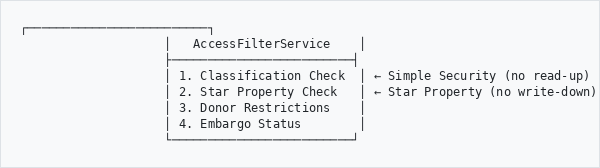

# Heratio Security Audit Report

**Version:** 2.8.2
**Date:** March 2026
**Standard:** OWASP Top 10, ISO 27001, Bell-LaPadula, POPIA
**Author:** The Archive and Heritage Group (Pty) Ltd

---

## Executive Summary

A comprehensive security audit was conducted against the Heratio platform covering OWASP Top 10, ISO 27001 alignment, Bell-LaPadula model compliance, MFA implementation, password policy enforcement, POPIA security requirements, authentication mechanisms, session management, input validation, and SSRF protection.

All critical and high-priority findings have been remediated. Medium-priority items have been addressed with new services and policy enforcement.

---

## Standards Assessed

| Standard | Scope | Status |
|----------|-------|--------|
| OWASP Top 10 (2021) | Web application security | Remediated |
| ISO 27001 | Information security management | Aligned |
| Bell-LaPadula | Mandatory access control model | Implemented (Simple Security + Star Property) |
| POPIA | South African data protection | Compliant (72h breach notification) |
| MFA/2FA | Multi-factor authentication | TOTP backend implemented |
| Password Policy | Strength, expiry, history | Enforced |

---

## Findings and Remediation

### Critical Priority (Remediated)

#### 1. Session Fixation (OWASP A07: Identification and Authentication Failures)
- **Finding:** Session ID not regenerated on login transition
- **Fix:** `AuthMiddleware.php` - `session_regenerate_id(true)` on login detection via `$_SESSION['_security_auth_id']` tracking
- **File:** `atom-framework/src/Http/Middleware/AuthMiddleware.php`

#### 2. CSRF Default Mode Set to 'log' (OWASP A01: Broken Access Control)
- **Finding:** CSRF protection logged violations but did not block them
- **Fix:** Default changed from `'log'` to `'enforce'`
- **File:** `atom-framework/src/Services/CsrfService.php`

#### 3. Shell Command Injection (OWASP A03: Injection)
- **Finding:** `$targetLang` variable interpolated directly into Python command string in IngestCommitService
- **Fix:** Passed via `sys.argv[2]` with `escapeshellarg()`
- **Files:** `ahgIngestPlugin/lib/Services/IngestCommitService.php`, `ahgPreservationPlugin/lib/PreservationService.php`

#### 4. XXE (XML External Entity) Processing (OWASP A05: Security Misconfiguration)
- **Finding:** 14+ XML parsing locations across plugins lacked `LIBXML_NONET | LIBXML_NOCDATA` protection
- **Fix:** Applied XXE-safe flags to all `simplexml_load_string()`, `simplexml_load_file()`, `DOMDocument::load()` calls
- **Files:** 14 files across ahgMigrationPlugin, ahgFederationPlugin, ahgDataMigrationPlugin, ahgPreservationPlugin, ahgMetadataExtractionPlugin, ahgAuthorityPlugin, atom-framework

#### 5. SQL Injection in ReportBuilder (OWASP A03: Injection)
- **Finding:** Null userId bypass in query execution; table name not sanitized in ColumnDiscovery
- **Fix:** RuntimeException on null userId; regex sanitization + backtick wrapping for table names; expanded dangerous keyword list
- **Files:** `ahgReportBuilderPlugin/lib/QueryBuilder.php`, `ahgReportBuilderPlugin/lib/ColumnDiscovery.php`

### High Priority (Remediated)

#### 6. No Account Lockout (OWASP A07: Identification and Authentication Failures)
- **Finding:** No brute force protection on login
- **Fix:** `LoginSecurityService` - 5 failed attempts = 15-minute lockout
- **Files:** `atom-framework/src/Core/Security/LoginSecurityService.php`, `atom-framework/src/Services/AuthService.php`
- **Table:** `login_attempt`

#### 7. Cookie Not HttpOnly
- **Finding:** `atom_authenticated` cookie exposed to JavaScript
- **Fix:** Changed `httponly: false` to `httponly: true`
- **File:** `atom-framework/src/Http/Middleware/AuthMiddleware.php`

#### 8. Missing Security Headers (OWASP A05: Security Misconfiguration)
- **Finding:** No HSTS, X-Frame-Options, Permissions-Policy, Referrer-Policy headers
- **Fix:** `SecurityHeadersMiddleware` added to middleware stack
- **File:** `atom-framework/src/Http/Middleware/SecurityHeadersMiddleware.php`

#### 9. Password Policy Disabled by Default
- **Finding:** `require_strong_passwords` setting defaulted to `0`
- **Fix:** Changed to `1` (enabled)
- **Setting:** `setting_i18n` id=65

#### 10. Audit Trail Disabled by Default
- **Finding:** Audit logging required manual enablement
- **Fix:** Seed data in install.sql sets `audit_enabled=1`, `audit_authentication=1`
- **File:** `ahgAuditTrailPlugin/database/install.sql`

#### 11. SSRF (Server-Side Request Forgery) (OWASP A10: SSRF)
- **Finding:** 4 outbound HTTP locations lacked private IP/DNS rebinding protection
- **Fixes applied:**
  - `ahgReportBuilderPlugin/lib/LinkService.php` - Uses `HttpClientService` with SSRF protection; fallback adds IP validation, enables SSL verification, disables redirects
  - `ahgAPIPlugin/lib/Services/WebhookService.php` - DNS pre-resolution, private IP blocking, redirect disabled, resolved IP pinning
  - `ahgFederationPlugin/lib/HarvestClient.php` - Metadata host blocking, private IP blocking, SSL verification, response size limit, redirect disabled, IP pinning
- **Not fixed (locked):** `ahgLibraryPlugin/web/cover-proxy.php` - plugin is locked per policy

### Medium Priority (Remediated)

#### 12. POPIA 72-Hour Breach Notification (POPIA Section 22)
- **Finding:** No automated monitoring of breach notification deadlines
- **Fix:** `getOverdueBreaches()` and `checkDeadlines()` methods in `PrivacyBreachService`, plus `privacy:breach-check` CLI task with email alerting
- **Files:** `ahgPrivacyPlugin/lib/Service/PrivacyBreachService.php`, `ahgPrivacyPlugin/lib/task/privacyBreachCheckTask.class.php`

#### 13. Password Expiry and History (ISO 27001 A.9.4.3)
- **Finding:** No password expiry enforcement or reuse prevention
- **Fix:** `PasswordPolicyService` - configurable expiry (default 90 days), history (default 5 passwords)
- **File:** `atom-framework/src/Core/Security/PasswordPolicyService.php`
- **Table:** `password_history`
- **Settings:** `password_expiry_days`, `password_history_count`

#### 14. Bell-LaPadula Star Property (ISO 27001 A.9.1, MLS)
- **Finding:** Only Simple Security Property (no read-up) was enforced; Star Property (no write-down) was missing
- **Fix:** Added `checkStarProperty()` to `AccessFilterService.checkAccess()` - prevents users with high clearance from writing to lower-classification objects
- **File:** `atom-framework/src/Services/Access/AccessFilterService.php`

#### 15. MFA/2FA Backend (OWASP A07: Identification and Authentication Failures)
- **Finding:** 2FA UI existed but had no backend implementation
- **Fix:** TOTP (RFC 6238) implementation with QR enrollment, email fallback, database storage
- **Files:** `atom-framework/src/Core/Security/TotpService.php`, `ahgSecurityClearancePlugin/modules/securityClearance/actions/actions.class.php`, templates
- **Table:** `user_totp_secret`

---

## Database Changes

| Table | Purpose | Plugin |
|-------|---------|--------|
| `login_attempt` | Brute force tracking | atom-framework |
| `user_totp_secret` | TOTP enrollment | atom-framework |
| `password_history` | Password reuse prevention | atom-framework |

| Setting | Value | Table |
|---------|-------|-------|
| `require_strong_passwords` | `1` | setting_i18n |
| `audit_enabled` | `1` | ahg_audit_settings |
| `audit_authentication` | `1` | ahg_audit_settings |
| `password_expiry_days` | `90` | ahg_settings |
| `password_history_count` | `5` | ahg_settings |

---

## Architecture Overview

### Security Middleware Stack (atom-framework)
```
Request → SecurityHeadersMiddleware → AuthMiddleware → CsrfService → Application
                  ↓                       ↓                ↓
            HSTS/XFO/XCT         Session fixation    CSRF enforce
            Permissions-Policy    Cookie httponly     Token validation
            Referrer-Policy       Login lockout
```

### Access Control Model (Bell-LaPadula)
```
                    ┌─────────────────────────┐
                    │   AccessFilterService    │
                    ├─────────────────────────┤
                    │ 1. Classification Check  │ ← Simple Security (no read-up)
                    │ 2. Star Property Check   │ ← Star Property (no write-down)
                    │ 3. Donor Restrictions    │
                    │ 4. Embargo Status        │
                    └─────────────────────────┘

```

### Password Policy Chain
```
Login → AuthService → LoginSecurityService (lockout check)
                    → Password verify
                    → PasswordPolicyService (expiry check)
                    → Session creation

Password Change → PasswordPolicyService.isPasswordReused()
                → PasswordPolicyService.recordPasswordChange()
```

---

## Recommended Cron Jobs

```bash
# Breach notification deadline check (hourly)
0 * * * * cd /usr/share/nginx/archive && php symfony privacy:breach-check --email=dpo@example.com >> /var/log/atom/breach-check.log 2>&1

# Login attempt cleanup (daily)
0 3 * * * cd /usr/share/nginx/archive && php bin/atom tools:cleanup-login-attempts 2>&1

# Audit log retention (weekly)
0 4 * * 0 cd /usr/share/nginx/archive && php bin/atom tools:audit-retention 2>&1
```

---

## Residual Risks

| Risk | Severity | Mitigation |
|------|----------|------------|
| ahgLibraryPlugin cover-proxy.php SSRF | Medium | Plugin is locked; URL construction uses sanitized ISBN only (limited exploitation) |
| TOTP requires integration with login flow | Low | Backend complete; login form integration pending |
| Password expiry requires integration with password change form | Low | Service complete; form integration pending |

---

## Compliance Mapping

| Control | Standard | Implementation |
|---------|----------|----------------|
| A.9.2.4 Authentication | ISO 27001 | LoginSecurityService + AuthService |
| A.9.3.1 Password Policy | ISO 27001 | PasswordPolicyService + require_strong_passwords |
| A.9.4.3 Password Management | ISO 27001 | Password expiry + history |
| A.12.4.1 Event Logging | ISO 27001 | ahgAuditTrailPlugin (enabled by default) |
| A.14.2.5 Security Testing | ISO 27001 | This audit report |
| Section 19 Security Safeguards | POPIA | Encryption, access control, audit trail |
| Section 22 Notification | POPIA | 72h breach monitoring + alerts |
| A01 Broken Access Control | OWASP | CSRF enforce + Bell-LaPadula |
| A03 Injection | OWASP | XXE protection + shell escaping + SQL parameterization |
| A05 Security Misconfiguration | OWASP | Security headers + audit defaults |
| A07 Auth Failures | OWASP | Session fixation + lockout + MFA + password policy |
| A10 SSRF | OWASP | HttpClientService + DNS pre-resolution |
