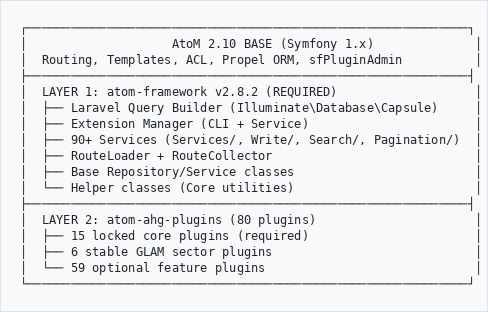

# Heratio — Technical Manual

**For:** Developers, DevOps Engineers, System Integrators
**Product:** Heratio Framework v2.8.2
**Date:** 16 March 2026
**Author:** The Archive and Heritage Group (Pty) Ltd

---

## About This Manual

This manual covers architecture, plugin development, CLI commands, database schema, API integration, and deployment. For end-user workflows, see the **User Manual**. For administration, see the **Admin Manual**.

---

## 1. Architecture

### 1.1 Two-Layer Design

```
┌─────────────────────────────────────────────────────────────┐
│                    AtoM 2.10 BASE (Symfony 1.x)              │
│  Routing, Templates, ACL, Propel ORM, sfPluginAdmin          │
├─────────────────────────────────────────────────────────────┤
│  LAYER 1: atom-framework v2.8.2 (REQUIRED)                   │
│  ├── Laravel Query Builder (Illuminate\Database\Capsule)     │
│  ├── Extension Manager (CLI + Service)                       │
│  ├── 90+ Services (Services/, Write/, Search/, Pagination/)  │
│  ├── RouteLoader + RouteCollector                            │
│  ├── Base Repository/Service classes                         │
│  └── Helper classes (Core utilities)                         │
├─────────────────────────────────────────────────────────────┤
│  LAYER 2: atom-ahg-plugins (80 plugins)                      │
│  ├── 15 locked core plugins (required)                       │
│  ├── 6 stable GLAM sector plugins                            │
│  └── 59 optional feature plugins                             │
└─────────────────────────────────────────────────────────────┘

```

**Philosophy:** Modern data layer, legacy presentation layer. Laravel Query Builder handles all database operations while preserving Symfony's routing, templates, and ACL.

### 1.2 Plugin Loading

```
ProjectConfiguration::setup()
  └── loadPluginsFromDatabase($corePlugins)
        └── SELECT name FROM atom_plugin WHERE is_enabled = 1
              └── enablePlugins($plugins)
```

**Source of truth:** `atom_plugin` table.
**Legacy:** `setting_i18n` id=1 maintained for sfPluginAdmin UI only.

### 1.3 Database Access Patterns

| Context | Use This | NOT This |
|---------|----------|----------|
| All plugins & services | `Illuminate\Database\Capsule\Manager as DB` | Raw PDO |
| Plugin Manager only | `Propel::getConnection()` + PDO | Laravel QB |
| `atom_plugin` table | PDO only | Laravel QB |

**Why Plugin Manager uses PDO:** Symfony autoloader conflicts prevent Laravel from working when managing the `atom_plugin` and `atom_plugin_audit` tables.

### 1.4 Namespace Convention

```php
namespace AtomExtensions\Repositories;
namespace AtomExtensions\Services;
use Illuminate\Database\Capsule\Manager as DB;
```

---

## 2. Plugin Development

### 2.1 Directory Structure

```
atom-ahg-plugins/ahgMyPlugin/
├── extension.json                    # Plugin manifest
├── config/
│   ├── ahgMyPluginConfiguration.class.php
│   ├── routing.yml                   # Routes (optional)
│   └── settings.yml                  # Enabled modules
├── database/
│   └── install.sql                   # Schema + seed data
├── lib/
│   ├── Repositories/                 # Data access (Laravel QB)
│   ├── Services/                     # Business logic
│   ├── Helpers/                      # Utilities
│   └── task/                         # CLI tasks
├── modules/
│   └── myModule/
│       ├── actions/
│       │   └── actions.class.php     # Controller
│       │   └── myAction.class.php    # Single action
│       └── templates/
│           └── indexSuccess.php       # View
├── css/
├── js/
└── web/                              # Public assets
```

### 2.2 extension.json

```json
{
  "name": "My Plugin",
  "machine_name": "ahgMyPlugin",
  "version": "1.0.0",
  "description": "What this plugin does",
  "author": "The Archive and Heritage Group",
  "license": "GPL-3.0",
  "requires": {
    "atom_framework": ">=1.0.0",
    "atom": ">=2.8",
    "php": ">=8.1"
  },
  "dependencies": ["ahgCorePlugin"],
  "tables": ["my_table"],
  "shared_tables": [],
  "theme_support": ["ahgThemeB5Plugin"],
  "install_task": "my:install"
}
```

### 2.3 Repository Pattern

```php
<?php
namespace AtomExtensions\Repositories;

use Illuminate\Database\Capsule\Manager as DB;

class MyRepository
{
    public function findAll(): \Illuminate\Support\Collection
    {
        return DB::table('my_table')
            ->where('is_active', 1)
            ->orderBy('created_at', 'desc')
            ->get();
    }

    public function findById(int $id): ?object
    {
        return DB::table('my_table')->where('id', $id)->first();
    }

    public function create(array $data): int
    {
        return DB::table('my_table')->insertGetId(array_merge($data, [
            'created_at' => date('Y-m-d H:i:s'),
        ]));
    }
}
```

### 2.4 Template Rules

```php
// CORRECT — always use this
<?php echo url_for(['module' => 'myModule', 'action' => 'show', 'slug' => $item->slug]) ?>
<?php echo $resource->title ?? $resource->slug ?>

// WRONG — never use
<?php echo url_for([$resource, 'module' => 'myModule']) ?>
<?php echo render_title($resource) ?>
<?php echo $resource->__toString() ?>
```

### 2.5 CSP Nonce (Scripts & Styles)

All inline `<script>` and `<style>` tags must include the CSP nonce:

```php
<script <?php $n = sfConfig::get('csp_nonce', ''); echo $n ? preg_replace('/^nonce=/', 'nonce="', $n).'"' : ''; ?>>
// Your JavaScript here
</script>
```

### 2.6 Namespaced Global Classes

In namespaced PHP files, prefix global classes with `\`:

```php
\sfConfig::get('app_setting');
\QubitActor::getById($id);
\sfContext::getInstance();
```

### 2.7 install.sql Rules

```sql
-- ALLOWED: tables, indexes, seed data
CREATE TABLE IF NOT EXISTS my_table (...);
INSERT INTO term (taxonomy_id, ...) VALUES (...);

-- FORBIDDEN: never include this
INSERT INTO atom_plugin (...) VALUES (...);
```

**Note:** `ADD COLUMN IF NOT EXISTS` does not work in MySQL 8. Use `CREATE TABLE IF NOT EXISTS` or check `information_schema.COLUMNS` before altering.

### 2.8 Enabling Plugins

```bash
php bin/atom extension:enable ahgMyPlugin
php symfony cc
```

---

## 3. CLI Commands

### 3.1 Framework Commands (`php bin/atom`)

| Command | Description |
|---------|-------------|
| `extension:discover` | Scan directories, register new plugins |
| `extension:list` | List all plugins with status |
| `extension:enable <name>` | Enable a plugin |
| `extension:disable <name>` | Disable a plugin |
| `extension:info <name>` | Show plugin details |
| `extension:install <name>` | Install from GitHub |
| `extension:update --all` | Update all plugins |
| `extension:cleanup` | Delete data past grace period |
| `framework:install` | Initial setup |
| `framework:update` | Pull framework updates |
| `framework:version` | Show version |

### 3.2 Plugin Commands (`php symfony`)

| Namespace | Plugin | Commands |
|-----------|--------|----------|
| `ai:*` | ahgAIPlugin | install, ner-extract, ner-sync, translate, summarize, spellcheck, suggest-description, process-pending, sync-entity-cache |
| `backup:*` | ahgBackupPlugin | run-scheduled |
| `preservation:*` | ahgPreservationPlugin | convert, fixity, identify, migration, package, pronom-sync, replicate, scheduler, verify-backup, virus-scan |
| `doi:*` | ahgDoiPlugin | deactivate, mint, process-queue, sync, verify |
| `cdpa:*` | ahgCDPAPlugin | license-check, report, requests, status |
| `naz:*` | ahgNAZPlugin | closure-check, permit-expiry, report, transfer-due |
| `dedupe:*` | ahgDedupePlugin | merge, report, scan |
| `forms:*` | ahgFormsPlugin | export, import, list |
| `heritage:*` | ahgHeritagePlugin | build-graph, install, region |
| `display:*` | ahgDisplayPlugin | auto-detect, reindex |
| `privacy:*` | ahgPrivacyPlugin | jurisdiction, scan-pii |
| `embargo:*` | ahgExtendedRightsPlugin | process, report |
| `museum:*` | ahgMuseumPlugin | aat-sync, exhibition, getty-link, migrate |
| `ingest:*` | ahgIngestPlugin | commit |
| `ipsas:*` | ahgIPSASPlugin | report |
| `nmmz:*` | ahgNMMZPlugin | report |
| `metadata:*` | ahgMetadataExportPlugin | export |
| `library:*` | ahgLibraryPlugin | process-covers |
| `portable:*` | ahgPortableExportPlugin | export |
| `api:*` | ahgAPIPlugin | webhook-process-retries |
| `queue:*` | Framework | work, status, retry, failed, cleanup |

### 3.3 Standard AtoM Commands

```bash
php symfony cc                          # Clear cache
php symfony search:populate             # Rebuild ES index
php symfony search:status               # Index status
php bin/atom import:csv <file>          # CSV import
php bin/atom digitalobject:extract-text # Extract text/OCR
php bin/atom tools:add-superuser        # Create admin user
php bin/atom tools:reset-password       # Reset password
```

---

## 4. Database Schema

### 4.1 Core AtoM Tables (DO NOT MODIFY)

`object`, `information_object`, `information_object_i18n`, `actor`, `actor_i18n`, `term`, `term_i18n`, `taxonomy`, `setting`, `setting_i18n`, `user`, `repository`, `digital_object`, `slug`, `property`, `property_i18n`, `relation`, `event`, `note`, `note_i18n`

### 4.2 Framework Tables

| Table | Purpose |
|-------|---------|
| `atom_plugin` | Plugin registry (source of truth for loading) |
| `atom_plugin_audit` | Plugin enable/disable/install/uninstall log |
| `ahg_settings` | Key-value settings store (200+ settings) |
| `ahg_error_log` | Application error log |
| `ahg_dropdown` | Dropdown value lists for custom fields |
| `ahg_queue_job` | Background job queue |
| `ahg_queue_batch` | Job batches |
| `ahg_queue_failed` | Failed jobs |
| `ahg_queue_log` | Queue processing log |
| `ahg_queue_rate_limit` | Rate limiting for queue |

### 4.3 Entity Inheritance (FK Constraints)

```
object (base)
  ├── actor
  │     ├── user      (FK: user.id → actor.id)
  │     ├── donor     (FK: donor.id → actor.id)
  │     ├── repository (FK: repository.id → actor.id)
  │     └── rights_holder (FK: rights_holder.id → actor.id)
  └── information_object
        └── digital_object (FK: digital_object.object_id → information_object.id)
```

**Create pattern:** INSERT `object` → INSERT `actor` → INSERT `user`/`donor`/etc.
**Delete cascade:** DELETE `object` cascades to `actor` → cascades to `user`/`donor`/etc.

### 4.4 Reporting Views

Pre-built SQL views for BI tools (Power BI, Tableau, Metabase):

| View | Description |
|------|-------------|
| `v_report_descriptions` | Flattened archival descriptions |
| `v_report_authorities` | Flattened authority records |
| `v_report_accessions` | Flattened accessions |

---

## 5. API Integration

### 5.1 REST API

**Base URL:** `/api/v1/`

Authentication: Bearer token via `Authorization: Bearer <token>`

| Endpoint | Method | Description |
|----------|--------|-------------|
| `/api/v1/records` | GET | List records (paginated) |
| `/api/v1/records/:slug` | GET | Get single record |
| `/api/v1/authorities` | GET | List authorities |
| `/api/v1/repositories` | GET | List repositories |
| `/api/v1/search` | GET | Search records |

### 5.2 GraphQL

**Endpoint:** `/graphql`

```graphql
query {
  informationObjects(limit: 10, offset: 0) {
    id
    title
    identifier
    levelOfDescription
    repository { name }
    digitalObjects { mimeType, name }
  }
}
```

### 5.3 IIIF

| Endpoint | Description |
|----------|-------------|
| `/iiif/manifest/:id` | IIIF Presentation manifest |
| `/iiif/2/:identifier/info.json` | IIIF Image API info |
| `/iiif/2/:identifier/:region/:size/:rotation/:quality.:format` | IIIF Image tile |

Cantaloupe image server on port 8182, proxied via nginx.

---

## 6. Deployment

### 6.1 Server Requirements

| Component | Version |
|-----------|---------|
| PHP | 8.3+ |
| MySQL | 8.0+ |
| Elasticsearch | 7.10 |
| Nginx | 1.18+ |
| Node.js | 18+ (for webpack) |
| Cantaloupe | 5.0.6 (IIIF) |

### 6.2 Installation

```bash
cd /usr/share/nginx/archive
git clone https://github.com/ArchiveHeritageGroup/atom-framework.git
git clone https://github.com/ArchiveHeritageGroup/atom-ahg-plugins.git
cd atom-framework && composer install && bash bin/install
sudo systemctl restart php8.3-fpm
php bin/atom extension:discover
```

### 6.3 Webpack Build

```bash
cd /usr/share/nginx/archive
npx webpack --mode production
```

Generates hashed bundles in `/dist/js/` and `/dist/css/`. The theme dynamically discovers bundles via PHP `glob()`.

### 6.4 Version Release

```bash
cd /usr/share/nginx/archive/atom-framework   # or atom-ahg-plugins
./bin/release patch "Description of changes"
./bin/release minor "New feature description"
./bin/release major "Breaking change description"
```

### 6.5 Cron Jobs

```cron
# Backup scheduler (hourly check)
0 * * * * cd /usr/share/nginx/archive && php symfony backup:run-scheduled >> /var/log/atom/backup-cron.log 2>&1

# Queue worker (if not using systemd)
* * * * * cd /usr/share/nginx/archive && php bin/atom queue:work --max-jobs=10 >> /var/log/atom/queue.log 2>&1

# Extension cleanup (daily)
0 2 * * * cd /usr/share/nginx/archive && php bin/atom extension:cleanup >> /var/log/atom/cleanup.log 2>&1
```

### 6.6 Systemd Services

```bash
# Queue worker (per-queue instances)
sudo systemctl enable atom-queue-worker@default
sudo systemctl start atom-queue-worker@default

# Cantaloupe IIIF
sudo systemctl restart cantaloupe
```

---

## 7. Troubleshooting

| Issue | Solution |
|-------|----------|
| Plugins not loading | Check `atom_plugin` table: `SELECT name, is_enabled FROM atom_plugin` |
| Theme not applied | Clear cache: `rm -rf cache/* && php symfony cc` |
| Plugin enabled but not working | Check symlink: `ls -la plugins/ahgMyPlugin` |
| `in_array` error | Add `?: []` fallback: `unserialize($value) ?: []` |
| Namespaced class not found | Use `\` prefix: `\sfConfig`, `\QubitActor` |
| `name="action"` form bug | Rename to `name="form_action"` — Symfony reserves `action` |
| IIIF viewer broken | Restart Cantaloupe: `sudo systemctl restart cantaloupe` |
| Elasticsearch empty | Rebuild index: `php symfony search:populate` |
| Cache stale after changes | `rm -rf cache/* && php symfony cc && sudo systemctl restart php8.3-fpm` |

---

## 8. Security

### 8.1 CSP (Content Security Policy)

Configured in `config/app.yml` under `all.csp`. Nonce generated per request via `QubitCSPFilter`.

**Rules:**
- All `<script>` and `<style>` tags must have CSP nonce
- External CDN domains must be whitelisted in `app.yml`
- Never use `'unsafe-inline'` — use nonces

### 8.2 CSRF Protection

All POST forms include `_csrf_token` hidden field. Validated by Symfony's CSRF filter.

### 8.3 Bell-LaPadula MAC

Security classification enforced at query level — users cannot read records above their clearance.

---

*Heratio Framework v2.8.2 — The Archive and Heritage Group (Pty) Ltd*
