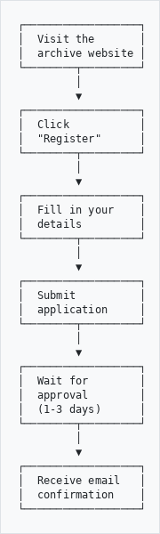
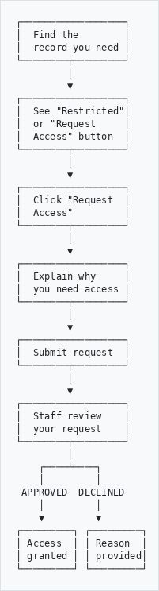
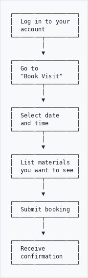
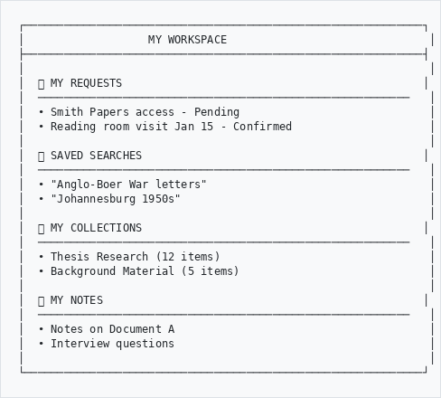
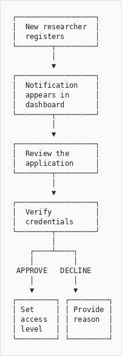
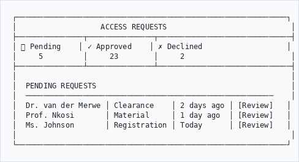
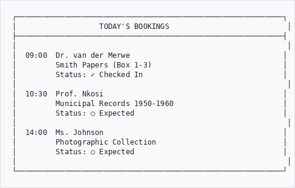

# Access Requests & Researcher Portal

## A Guide for Researchers and Staff

---

## What is the Researcher Portal?

The Researcher Portal is your gateway to accessing archival materials. It helps you:
- Register as a researcher
- Request access to restricted materials
- Book reading room visits
- Manage your research workspace

---

## For Researchers

### Registering as a Researcher

```
┌──────────────────┐
│  Visit the       │
│  archive website │
└────────┬─────────┘
         │
         ▼
┌──────────────────┐
│  Click           │
│  "Register"      │
└────────┬─────────┘
         │
         ▼
┌──────────────────┐
│  Fill in your    │
│  details         │
└────────┬─────────┘
         │
         ▼
┌──────────────────┐
│  Submit          │
│  application     │
└────────┬─────────┘
         │
         ▼
┌──────────────────┐
│  Wait for        │
│  approval        │
│  (1-3 days)      │
└────────┬─────────┘
         │
         ▼
┌──────────────────┐
│  Receive email   │
│  confirmation    │
└──────────────────┘

```

### Registration Form

You'll need to provide:

| Field | Why We Need It |
|-------|----------------|
| Full name | For identification |
| Email | For communication |
| Organisation | Your institution or affiliation |
| Research purpose | What you're researching |
| ID/Passport number | For access to restricted materials |
| Phone number | For urgent contact |

---

### Requesting Access to Materials

Some materials have restrictions. To request access:

```
┌──────────────────┐
│  Find the        │
│  record you need │
└────────┬─────────┘
         │
         ▼
┌──────────────────┐
│  See "Restricted"│
│  or "Request     │
│  Access" button  │
└────────┬─────────┘
         │
         ▼
┌──────────────────┐
│  Click "Request  │
│  Access"         │
└────────┬─────────┘
         │
         ▼
┌──────────────────┐
│  Explain why     │
│  you need access │
└────────┬─────────┘
         │
         ▼
┌──────────────────┐
│  Submit request  │
└────────┬─────────┘
         │
         ▼
┌──────────────────┐
│  Staff review    │
│  your request    │
└────────┬─────────┘
         │
    ┌────┴────┐
    │         │
 APPROVED  DECLINED
    │         │
    ▼         ▼
┌─────────┐ ┌─────────┐
│ Access  │ │ Reason  │
│ granted │ │ provided│
└─────────┘ └─────────┘

```

### Request Types

| Type | Description |
|------|-------------|
| **Clearance Request** | Request higher security clearance |
| **Material Access** | Access to specific restricted item |
| **Repository Access** | Access to an entire collection |
| **Researcher Registration** | New researcher application |

---

### Booking a Reading Room Visit

```
┌──────────────────┐
│  Log in to your  │
│  account         │
└────────┬─────────┘
         │
         ▼
┌──────────────────┐
│  Go to           │
│  "Book Visit"    │
└────────┬─────────┘
         │
         ▼
┌──────────────────┐
│  Select date     │
│  and time        │
└────────┬─────────┘
         │
         ▼
┌──────────────────┐
│  List materials  │
│  you want to see │
└────────┬─────────┘
         │
         ▼
┌──────────────────┐
│  Submit booking  │
└────────┬─────────┘
         │
         ▼
┌──────────────────┐
│  Receive         │
│  confirmation    │
└──────────────────┘

```

### Your Workspace

Once registered, you have a personal workspace:

```
┌─────────────────────────────────────────────────────────────┐
│                   MY WORKSPACE                               │
├─────────────────────────────────────────────────────────────┤
│                                                              │
│  📋 MY REQUESTS                                              │
│  ─────────────────────────────────────────────────────────   │
│  • Smith Papers access - Pending                             │
│  • Reading room visit Jan 15 - Confirmed                     │
│                                                              │
│  🔖 SAVED SEARCHES                                           │
│  ─────────────────────────────────────────────────────────   │
│  • "Anglo-Boer War letters"                                  │
│  • "Johannesburg 1950s"                                      │
│                                                              │
│  📁 MY COLLECTIONS                                           │
│  ─────────────────────────────────────────────────────────   │
│  • Thesis Research (12 items)                                │
│  • Background Material (5 items)                             │
│                                                              │
│  📝 MY NOTES                                                 │
│  ─────────────────────────────────────────────────────────   │
│  • Notes on Document A                                       │
│  • Interview questions                                       │
│                                                              │
└─────────────────────────────────────────────────────────────┘

```

### Generating Citations

Need to cite materials? Use the citation generator:

1. Go to any record
2. Click **Cite**
3. Choose your style:

| Style | Example |
|-------|---------|
| **Chicago** | Smith Papers, Box 1, File 3. Provincial Archives... |
| **MLA** | "Letter to John." Smith Papers. Provincial Archives... |
| **APA** | Smith, J. (1920). Letter to John. Smith Papers... |
| **Harvard/UNISA** | Provincial Archives (1920) Smith Papers... |

---

## For Archive Staff

### Approving Researcher Registrations

```
┌──────────────────┐
│  New researcher  │
│  registers       │
└────────┬─────────┘
         │
         ▼
┌──────────────────┐
│  Notification    │
│  appears in      │
│  dashboard       │
└────────┬─────────┘
         │
         ▼
┌──────────────────┐
│  Review the      │
│  application     │
└────────┬─────────┘
         │
         ▼
┌──────────────────┐
│  Verify          │
│  credentials     │
└────────┬─────────┘
         │
    ┌────┴────┐
    │         │
 APPROVE   DECLINE
    │         │
    ▼         ▼
┌─────────┐ ┌─────────┐
│ Set     │ │ Provide │
│ access  │ │ reason  │
│ level   │ │         │
└─────────┘ └─────────┘

```

### Processing Access Requests

When someone requests access to restricted materials:

1. Go to **Admin → Access Requests**
2. Review the pending request
3. Check:
   - Is the researcher registered?
   - Is their research purpose legitimate?
   - Do they have appropriate clearance?
4. Approve or decline with reason

### The Approval Dashboard

```
┌─────────────────────────────────────────────────────────────┐
│                   ACCESS REQUESTS                            │
├───────────────┬───────────────┬──────────────────────────────┤
│ 👤 Pending    │ ✓ Approved    │ ✗ Declined                   │
│     5         │     23        │     2                        │
├───────────────┴───────────────┴──────────────────────────────┤
│                                                              │
│  PENDING REQUESTS                                            │
│  ────────────────────────────────────────────────────────    │
│  Dr. van der Merwe │ Clearance    │ 2 days ago │ [Review]   │
│  Prof. Nkosi       │ Material     │ 1 day ago  │ [Review]   │
│  Ms. Johnson       │ Registration │ Today      │ [Review]   │
│                                                              │
└─────────────────────────────────────────────────────────────┘

```

### Managing Reading Room Bookings

View and manage bookings:

1. Go to **Admin → Reading Room → Bookings**
2. See calendar view of all bookings
3. Check in researchers when they arrive
4. Record materials issued and returned

```
┌─────────────────────────────────────────────────────────────┐
│                   TODAY'S BOOKINGS                           │
├─────────────────────────────────────────────────────────────┤
│                                                              │
│  09:00  Dr. van der Merwe                                   │
│         Smith Papers (Box 1-3)                              │
│         Status: ✓ Checked In                                │
│                                                              │
│  10:30  Prof. Nkosi                                         │
│         Municipal Records 1950-1960                         │
│         Status: ○ Expected                                  │
│                                                              │
│  14:00  Ms. Johnson                                         │
│         Photographic Collection                             │
│         Status: ○ Expected                                  │
│                                                              │
└─────────────────────────────────────────────────────────────┘

```

---

## Access Levels Explained

| Level | Who Gets It | What They Can See |
|-------|-------------|-------------------|
| **Public** | Anyone | Published records, no restrictions |
| **Registered** | Approved researchers | + Some restricted materials |
| **Researcher** | Verified academics | + Research-restricted items |
| **Staff** | Archive employees | + Internal materials |
| **Administrator** | Senior staff | Everything |

---

## Tips for Researchers

**Before visiting:**
- Book in advance (at least 24 hours)
- List specific materials you need
- Bring ID matching your registration

**During your visit:**
- Sign in at reception
- Handle materials carefully
- No pens (pencils only)
- Photography may require permission

**After your visit:**
- Return all materials
- Sign out
- Complete any feedback forms

---

## Troubleshooting

| Problem | Solution |
|---------|----------|
| Can't register | Check all required fields are filled |
| Request rejected | Contact the archive for clarification |
| Booking not confirmed | Allow 24 hours for processing |
| Can't see materials | Check your access level |
| Forgot password | Use password reset link |

---

*For assistance, contact the reading room staff.*
