# Advanced Search

## User Guide

Find records using powerful search filters, field-specific queries, and saved searches.

---

## Overview
```
┌─────────────────────────────────────────────────────────────┐
│                    ADVANCED SEARCH                          │
├─────────────────────────────────────────────────────────────┤
│                                                             │
│  Basic Search         Advanced Search        Saved Searches │
│      │                     │                      │         │
│      ▼                     ▼                      ▼         │
│  Quick keyword       Multiple fields        Reuse queries   │
│  lookup              Boolean operators      Share with team │
│                      Date ranges                            │
│                      Facet filters                          │
│                                                             │
└─────────────────────────────────────────────────────────────┘
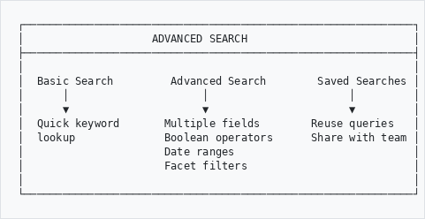
```

---

## Accessing Advanced Search
```
  Main Menu
      │
      ▼
   Browse
      │
      ▼
   Click "Advanced Search" link
      │
      ▼
   ┌─────────────────────────────────────────────────────────┐
   │                  ADVANCED SEARCH PANEL                  │
   │                                                         │
   │  [Basic] [Content] [Access Points] [Dates] [Filters]   │
   │                                                         │
   └─────────────────────────────────────────────────────────┘
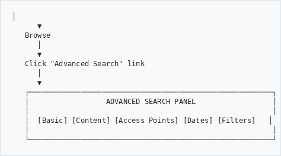
```

---

## Search Tabs

### Basic Tab
```
┌─────────────────────────────────────────────────────────────┐
│  BASIC SEARCH                                               │
├─────────────────────────────────────────────────────────────┤
│                                                             │
│  Search Terms:    [                              ] [Search] │
│                                                             │
│  Search In:       [All Fields              ▼]               │
│                   • All Fields                              │
│                   • Title                                   │
│                   • Reference Code                          │
│                   • Creator                                 │
│                   • Scope and Content                       │
│                                                             │
│  Match:           ○ All words (AND)                         │
│                   ○ Any word (OR)                           │
│                   ○ Exact phrase                            │
│                                                             │
└─────────────────────────────────────────────────────────────┘
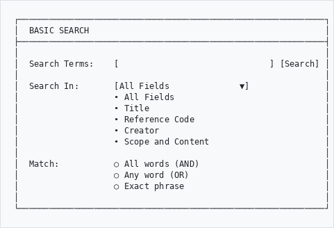
```

### Content Tab
```
┌─────────────────────────────────────────────────────────────┐
│  CONTENT SEARCH                                             │
├─────────────────────────────────────────────────────────────┤
│                                                             │
│  Title Contains:           [                        ]       │
│                                                             │
│  Reference Code:           [                        ]       │
│                                                             │
│  Identifier:               [                        ]       │
│                                                             │
│  Scope and Content:        [                        ]       │
│                                                             │
│  Extent and Medium:        [                        ]       │
│                                                             │
│  Archival History:         [                        ]       │
│                                                             │
│  Finding Aids:             [                        ]       │
│                                                             │
└─────────────────────────────────────────────────────────────┘
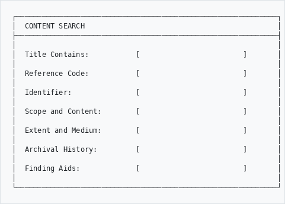
```

### Access Points Tab
```
┌─────────────────────────────────────────────────────────────┐
│  ACCESS POINTS                                              │
├─────────────────────────────────────────────────────────────┤
│                                                             │
│  Subject:         [                        ] [+ Add]        │
│                   ┌────────────────────────────────┐        │
│                   │ Agriculture            [×]    │        │
│                   │ Mining                 [×]    │        │
│                   └────────────────────────────────┘        │
│                                                             │
│  Place:           [                        ] [+ Add]        │
│                   ┌────────────────────────────────┐        │
│                   │ Cape Town              [×]    │        │
│                   └────────────────────────────────┘        │
│                                                             │
│  Name/Creator:    [                        ] [+ Add]        │
│                                                             │
│  Genre:           [                        ] [+ Add]        │
│                                                             │
└─────────────────────────────────────────────────────────────┘
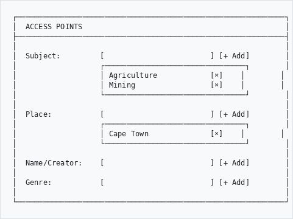
```

### Dates Tab
```
┌─────────────────────────────────────────────────────────────┐
│  DATE SEARCH                                                │
├─────────────────────────────────────────────────────────────┤
│                                                             │
│  Date Range:                                                │
│                                                             │
│  From:            [         ] [📅]                          │
│                   YYYY or YYYY-MM-DD                        │
│                                                             │
│  To:              [         ] [📅]                          │
│                   YYYY or YYYY-MM-DD                        │
│                                                             │
│  Date Type:       [All Date Types          ▼]               │
│                   • All Date Types                          │
│                   • Creation Date                           │
│                   • Accumulation Date                       │
│                   • Date of Content                         │
│                                                             │
│  ─────────────────────────────────────────────────────────  │
│                                                             │
│  Quick Select:                                              │
│  [19th Century] [1900-1950] [1950-2000] [This Year]        │
│                                                             │
└─────────────────────────────────────────────────────────────┘
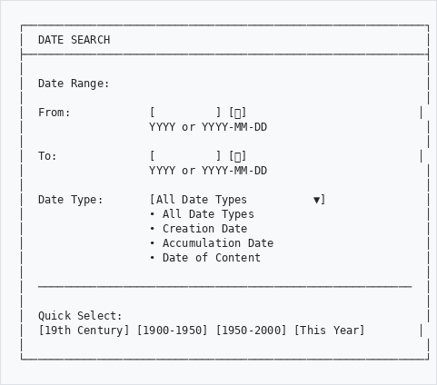
```

### Filters Tab
```
┌─────────────────────────────────────────────────────────────┐
│  FILTERS                                                    │
├─────────────────────────────────────────────────────────────┤
│                                                             │
│  Repository:      [All Repositories        ▼]               │
│                                                             │
│  Level of Description:                                      │
│  ☑ Fonds                                                   │
│  ☑ Sub-fonds                                               │
│  ☑ Series                                                  │
│  ☑ Sub-series                                              │
│  ☑ File                                                    │
│  ☑ Item                                                    │
│                                                             │
│  Sector:                                                    │
│  [All Sectors] [Archive] [Museum] [Library] [Gallery] [DAM]│
│                                                             │
│  Media Type:      [All Types               ▼]               │
│                   • All Types                               │
│                   • With Digital Objects                    │
│                   • Images Only                             │
│                   • Audio Only                              │
│                   • Video Only                              │
│                   • Documents Only                          │
│                                                             │
│  Publication Status:                                        │
│  ○ All            ○ Published Only         ○ Draft Only    │
│                                                             │
└─────────────────────────────────────────────────────────────┘
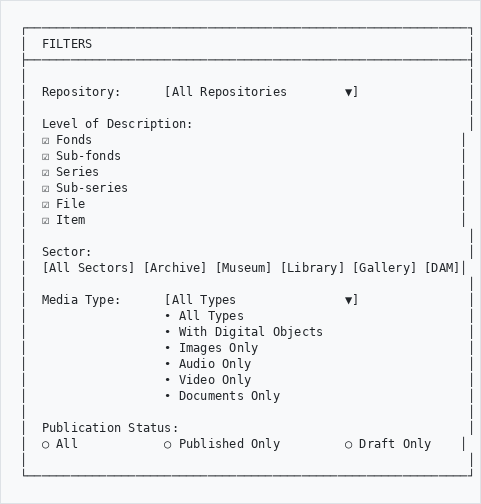
```

---

## Boolean Operators

Combine search terms with operators:
```
┌─────────────────────────────────────────────────────────────┐
│  BOOLEAN SEARCH                                             │
├─────────────────────────────────────────────────────────────┤
│                                                             │
│  AND     - Both terms must appear                           │
│            Example: mining AND gold                         │
│                                                             │
│  OR      - Either term can appear                           │
│            Example: photo OR photograph                     │
│                                                             │
│  NOT     - Exclude a term                                   │
│            Example: diamond NOT industrial                  │
│                                                             │
│  " "     - Exact phrase                                     │
│            Example: "Cape Town harbour"                     │
│                                                             │
│  *       - Wildcard (any characters)                        │
│            Example: Johan* (finds Johann, Johannesburg)     │
│                                                             │
│  ?       - Single character wildcard                        │
│            Example: wom?n (finds woman, women)              │
│                                                             │
└─────────────────────────────────────────────────────────────┘
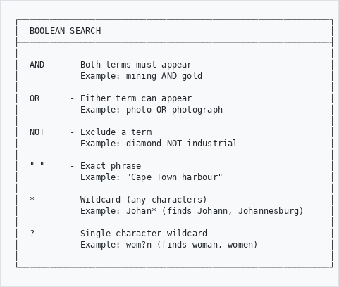
```

### Examples
```
┌─────────────────────────────────────────────────────────────┐
│  SEARCH EXAMPLES                                            │
├─────────────────────────────────────────────────────────────┤
│                                                             │
│  Find records about gold mining in Johannesburg:            │
│  ──────────────────────────────────────────────────────────│
│  gold AND mining AND Johannesburg                           │
│                                                             │
│  Find photos or photographs of ships:                       │
│  ──────────────────────────────────────────────────────────│
│  (photo OR photograph) AND ship                             │
│                                                             │
│  Find all variations of a name:                             │
│  ──────────────────────────────────────────────────────────│
│  Smit* (finds Smith, Smit, Smits, Smitman)                 │
│                                                             │
│  Find an exact title:                                       │
│  ──────────────────────────────────────────────────────────│
│  "Annual Report 1985"                                       │
│                                                             │
│  Find correspondence but not circulars:                     │
│  ──────────────────────────────────────────────────────────│
│  correspondence NOT circular                                │
│                                                             │
└─────────────────────────────────────────────────────────────┘
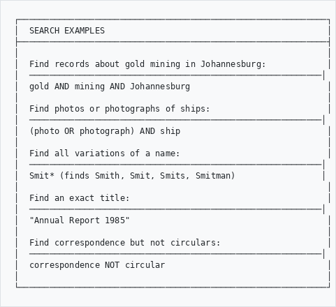
```

---

## Search Results

### Results Display
```
┌─────────────────────────────────────────────────────────────┐
│  SEARCH RESULTS                        Showing 1-25 of 342  │
├─────────────────────────────────────────────────────────────┤
│                                                             │
│  Sort by: [Relevance ▼]  View: [List ▼]  Per page: [25 ▼]  │
│                                                             │
│  ─────────────────────────────────────────────────────────  │
│                                                             │
│  📁 Annual Reports of the Mining Commissioner               │
│     Reference: MIN/REP/1890-1920                            │
│     Date: 1890-1920                                         │
│     Level: Series                                           │
│     ...contains reports on gold mining operations...        │
│                                                             │
│  📄 Gold Mining Regulations                                 │
│     Reference: MIN/REG/1895/001                             │
│     Date: 1895                                              │
│     Level: File                                             │
│     ...regulations governing gold extraction...             │
│                                                             │
└─────────────────────────────────────────────────────────────┘
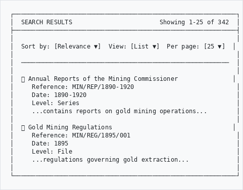
```

### Facet Filters

Narrow results using facets on the side:
```
┌─────────────────────────────────────────────────────────────┐
│  REFINE RESULTS                                             │
├─────────────────────────────────────────────────────────────┤
│                                                             │
│  REPOSITORY                                                 │
│  ├── National Archives (156)                               │
│  ├── Mining Museum (89)                                    │
│  └── Chamber of Mines (97)                                 │
│                                                             │
│  LEVEL                                                      │
│  ├── Fonds (12)                                            │
│  ├── Series (45)                                           │
│  ├── File (198)                                            │
│  └── Item (87)                                             │
│                                                             │
│  DATE                                                       │
│  ├── 1850-1899 (45)                                        │
│  ├── 1900-1949 (167)                                       │
│  ├── 1950-1999 (98)                                        │
│  └── 2000-present (32)                                     │
│                                                             │
│  SUBJECT                                                    │
│  ├── Gold mining (234)                                     │
│  ├── Labour (89)                                           │
│  ├── Regulations (56)                                      │
│  └── More...                                               │
│                                                             │
│  [Clear All Filters]                                        │
│                                                             │
└─────────────────────────────────────────────────────────────┘
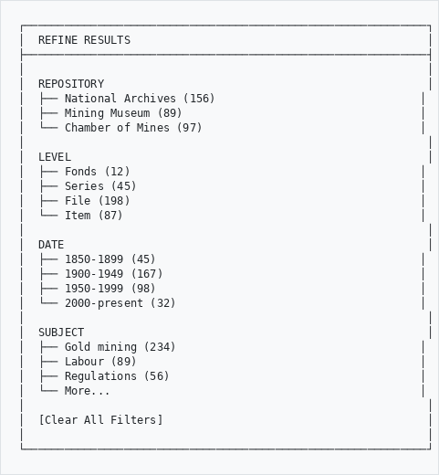
```

---

## Saving Searches

### Save a Search

After searching, click **Save Search**:
```
┌─────────────────────────────────────────────────────────────┐
│  SAVE SEARCH                                                │
├─────────────────────────────────────────────────────────────┤
│                                                             │
│  Search Name:     [Gold mining records 1890-1920  ]         │
│                                                             │
│  Description:     [All records related to gold    ]         │
│                   [mining in the Transvaal        ]         │
│                                                             │
│  Visibility:      ○ Private (only me)                       │
│                   ○ Shared (all users)                      │
│                                                             │
│  ☐ Email me when new results match this search             │
│                                                             │
│              [Cancel]    [Save Search]                      │
│                                                             │
└─────────────────────────────────────────────────────────────┘
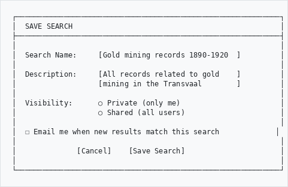
```

### Access Saved Searches
```
┌─────────────────────────────────────────────────────────────┐
│  MY SAVED SEARCHES                                          │
├─────────────────────────────────────────────────────────────┤
│                                                             │
│  Name                          Results    Last Run          │
│  ─────────────────────────────────────────────────────────  │
│  Gold mining records 1890-1920   342      Today             │
│  [Run] [Edit] [Delete]                                      │
│                                                             │
│  Photographs of Cape Town        1,245    Yesterday         │
│  [Run] [Edit] [Delete]                                      │
│                                                             │
│  New acquisitions 2025           89       3 days ago        │
│  [Run] [Edit] [Delete]                                      │
│                                                             │
└─────────────────────────────────────────────────────────────┘
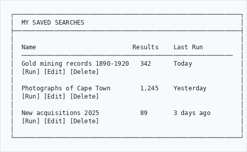
```

---

## Search Tips

### Finding What You Need
```
┌─────────────────────────────────────────────────────────────┐
│  SEARCH STRATEGIES                                          │
├─────────────────────────────────────────────────────────────┤
│                                                             │
│  Start Broad, Then Narrow                                   │
│  ──────────────────────────────────────────────────────────│
│  1. Begin with a simple keyword search                      │
│  2. Review the results                                      │
│  3. Use facets to narrow down                               │
│  4. Add more specific terms if needed                       │
│                                                             │
│  Try Synonyms                                               │
│  ──────────────────────────────────────────────────────────│
│  • photo OR photograph OR image                             │
│  • letter OR correspondence OR memo                         │
│  • map OR plan OR chart                                     │
│                                                             │
│  Use Wildcards for Variations                               │
│  ──────────────────────────────────────────────────────────│
│  • organi* (finds organize, organisation, organization)     │
│  • coloni* (finds colonial, colonialism, colonies)          │
│                                                             │
└─────────────────────────────────────────────────────────────┘
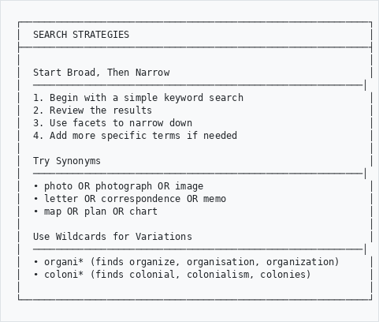
```

### Best Practices
```
┌────────────────────────────────────────────────────────────┐
│  ✓ DO                          │  ✗ DON'T                  │
├────────────────────────────────┼────────────────────────────┤
│  Use specific terms            │  Search for "documents"   │
│  Try alternative spellings     │  Assume one spelling      │
│  Use date filters              │  Search all time          │
│  Check facets for options      │  Ignore filter options    │
│  Save useful searches          │  Rebuild complex searches │
│  Use quotes for phrases        │  Search phrase as words   │
└────────────────────────────────┴────────────────────────────┘
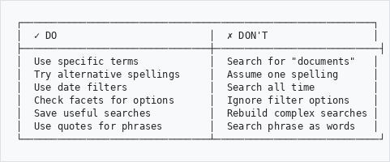
```

---

## Fuzzy Search (Typo Tolerance)

The GLAM Browse page includes automatic typo detection and correction. When you misspell a search term, the system will suggest or auto-correct your query.

### What You'll See
```
┌─────────────────────────────────────────────────────────────┐
│  FUZZY SEARCH ALERTS                                        │
├─────────────────────────────────────────────────────────────┤
│                                                             │
│  "Did you mean: archives?"                                  │
│     Appears when the system detects a likely typo.          │
│     Click the suggestion to search with the corrected term. │
│                                                             │
│  "Showing results for archives"                             │
│     Appears when the system is confident and auto-corrects. │
│     Click "Search instead for" to use your original term.   │
│                                                             │
│  "Showing fuzzy matches from search index"                  │
│     Appears when no exact results found, but approximate    │
│     matches were found via the search index.                │
│                                                             │
└─────────────────────────────────────────────────────────────┘
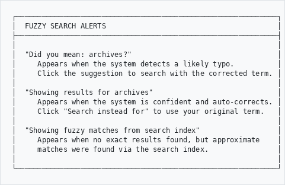
```

### How It Works

Fuzzy search combines four techniques:

1. **Levenshtein distance** - Detects character-level typos ("musem" → "museum")
2. **Phonetic matching** - Finds words that sound alike ("Jonson" → "Johnson")
3. **FULLTEXT search** - Matches word variations ("mining" finds "mine", "miner")
4. **Search index fallback** - Finds approximate matches when SQL returns nothing

For full details, see the [Fuzzy Search User Guide](fuzzy-search-user-guide.md).

---

## Troubleshooting
```
Problem                          Solution
───────────────────────────────────────────────────────────
Too many results              →  Add more search terms
                                 Use AND between words
                                 Apply facet filters
                                 
No results found              →  Remove some filters
                                 Try broader terms
                                 Check spelling
                                 Use wildcards (*)
                                 Check "Did you mean?" suggestion
                                 
Results not relevant          →  Use exact phrase (" ")
                                 Search specific fields
                                 Try different keywords
                                 
Search is slow                →  Narrow date range
                                 Add more filters
                                 Use specific fields
```

---

## Keyboard Shortcuts
```
┌─────────────────────────────────────────────────────────────┐
│  KEY              │  ACTION                                 │
├───────────────────┼─────────────────────────────────────────┤
│  Enter            │  Execute search                         │
│  Ctrl + K         │  Focus search box                       │
│  Escape           │  Clear search box                       │
│  Tab              │  Move between fields                    │
└───────────────────┴─────────────────────────────────────────┘
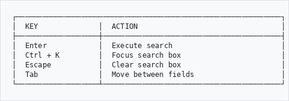
```

---

## Need Help?

Contact your system administrator or archivist if you need assistance finding records.

---

*Part of the AtoM AHG Framework*
