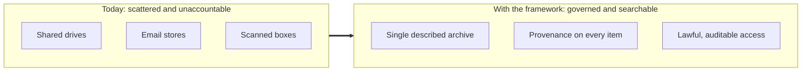
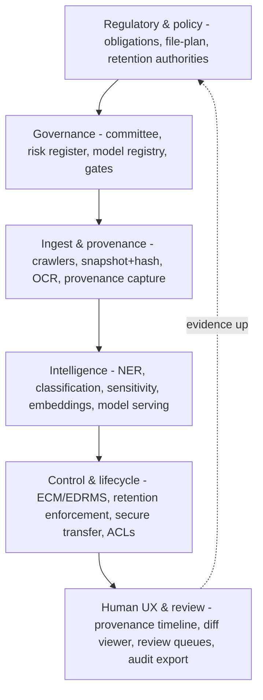
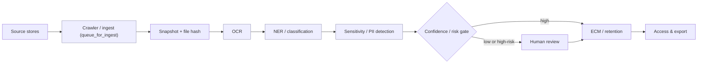
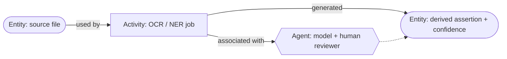
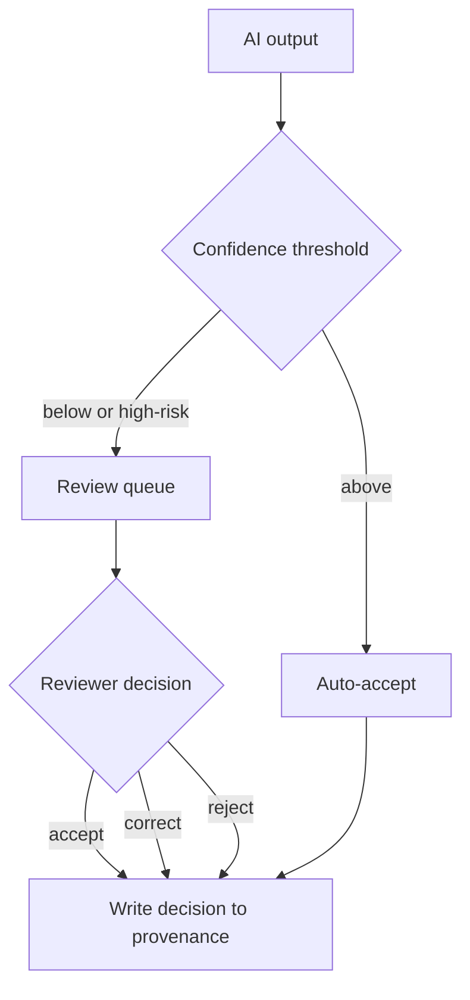
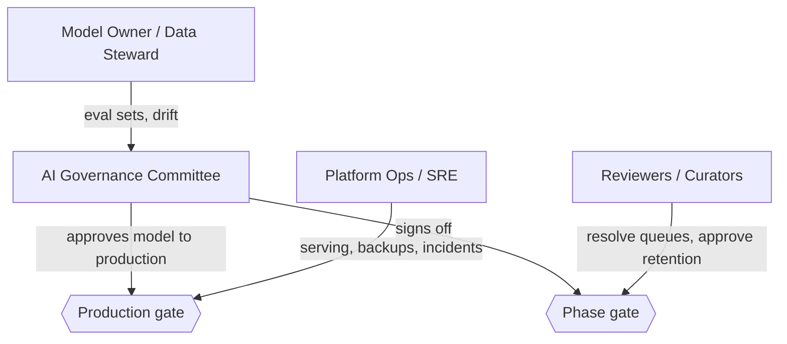
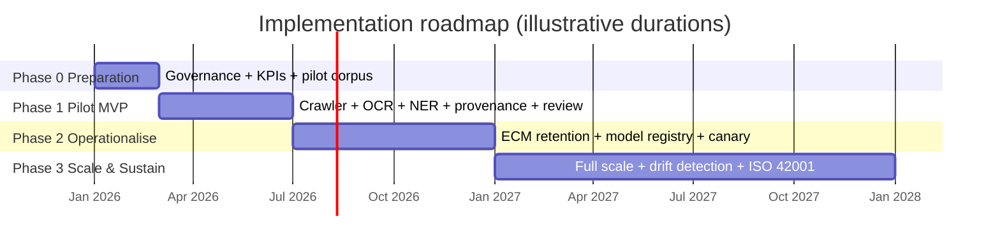
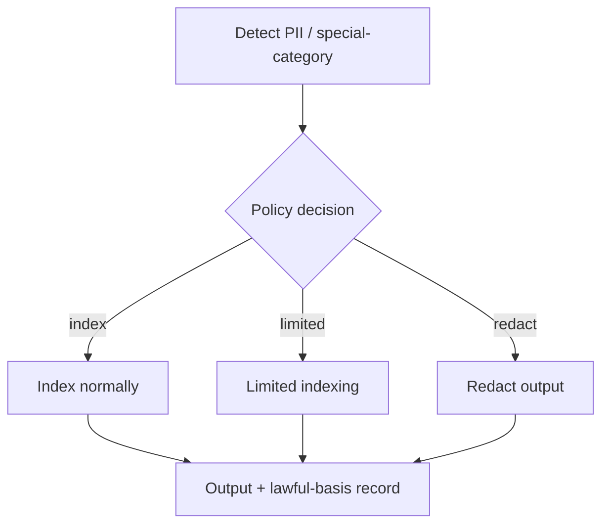
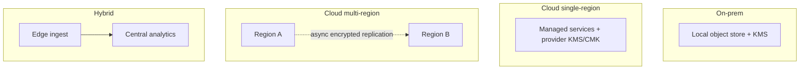
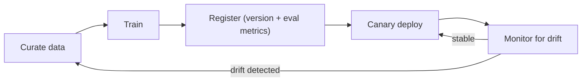

# AI RAM Framework: Diagram Set

Eleven figures as renderable Mermaid source. They render natively on GitHub and in most
markdown viewers, and can be exported (SVG/PNG) or restyled for slides and articles.
Numbers match the placeholders in `workbook.md` and the .docx. Each figure serves both
the specialist and the lay reader; captions carry the plain-language reading.

---

## Figure 1 - The problem and the outcome

*Conceptual before/after. For: lay readers and executives.*

---

## Figure 2 - Layered reference architecture

*Stacked layers. Policy/control flows down; evidence/provenance flows up.*

---

## Figure 3 - Ingest-to-access pipeline

*Left-to-right data flow; a provenance event is emitted at every stage.*

---

## Figure 4 - Provenance event model (PROV-O)

*W3C PROV triad. Plain reading: what produced this, who or what ran it, when, how confident.*

---

## Figure 5 - Human-in-the-loop review workflow

*Where a human stays in control of high-risk actions.*

---

## Figure 6 - Governance roles and decision gates

*Who owns which gate.*

---

## Figure 7 - Phased implementation roadmap

*Timeline with deliverables. For: executives.*

---

## Figure 8 - Sensitivity and PII handling decision flow

*Makes privacy-by-design concrete.*

---

## Figure 9 - Deployment topologies and data residency

*Where the data physically lives and who holds the keys.*

---

## Figure 10 - Regime-to-control mapping matrix

*The legal-mapping annex made visual. Mermaid is weak at matrices, so this figure is a
table; a designer can render it as a heatmap.*

| Obligation \ Control | C-PRV-01 | C-PRV-02 | C-PRV-03 | C-RES-02 | C-ACC-05 | C-SEC-03 |
|---|:---:|:---:|:---:|:---:|:---:|:---:|
| General data-protection regulation | x | x | x | x | | |
| Access-to-information statute | | | | | x | |
| Sectoral health-data regime | | x | | | | x |

---

## Figure 11 - Model governance lifecycle

*How the AI is kept accurate and accountable over time.*

