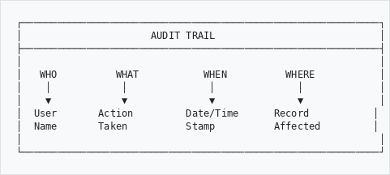
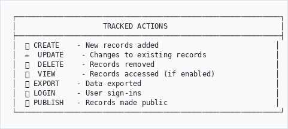
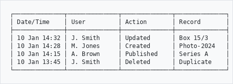
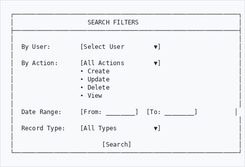
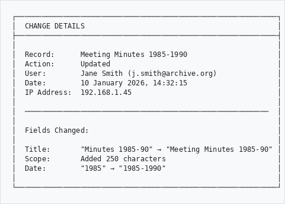
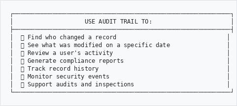
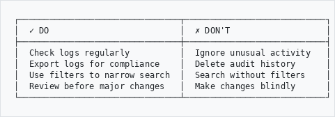
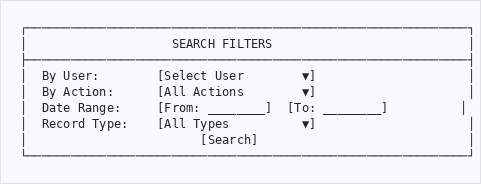
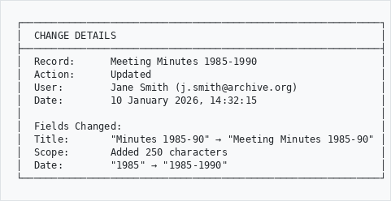
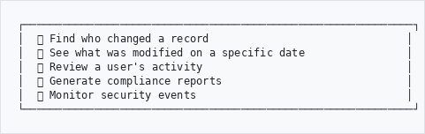

# Audit Trail

## User Guide

Track all changes made to records in your archive, including who made changes and when.

---

## Overview
```
┌─────────────────────────────────────────────────────────────┐
│                      AUDIT TRAIL                            │
├─────────────────────────────────────────────────────────────┤
│                                                             │
│   WHO          WHAT           WHEN          WHERE           │
│    │            │              │              │             │
│    ▼            ▼              ▼              ▼             │
│  User       Action         Date/Time      Record           │
│  Name       Taken          Stamp          Affected         │
│                                                             │
└─────────────────────────────────────────────────────────────┘

```

---

## What Gets Tracked
```
┌─────────────────────────────────────────────────────────────┐
│                    TRACKED ACTIONS                          │
├─────────────────────────────────────────────────────────────┤
│  ➕ CREATE    - New records added                           │
│  ✏️  UPDATE    - Changes to existing records                │
│  🗑️  DELETE    - Records removed                            │
│  👁️  VIEW      - Records accessed (if enabled)              │
│  📤 EXPORT    - Data exported                               │
│  🔐 LOGIN     - User sign-ins                               │
│  📋 PUBLISH   - Records made public                         │
└─────────────────────────────────────────────────────────────┘

```

---

## How to Access
```
  Main Menu
      │
      ▼
   Admin
      │
      ▼
   AHG Settings
      │
      ▼
   Audit Trail ─────────────────────────────────────┐
      │                                              │
      ├──▶ Recent Activity    (latest changes)       │
      │                                              │
      ├──▶ Search History     (find specific)        │
      │                                              │
      └──▶ Export Logs        (download report)      │
```

---

## Viewing Recent Activity

### Step 1: Open Audit Trail

Go to **Admin** → **AHG Settings** → **Audit Trail**

### Step 2: Browse Changes

You'll see a list of recent changes:
```
┌──────────────┬──────────────┬──────────────┬──────────────┐
│ Date/Time    │ User         │ Action       │ Record       │
├──────────────┼──────────────┼──────────────┼──────────────┤
│ 10 Jan 14:32 │ J. Smith     │ Updated      │ Box 15/3     │
│ 10 Jan 14:28 │ M. Jones     │ Created      │ Photo-2024   │
│ 10 Jan 14:15 │ A. Brown     │ Published    │ Series A     │
│ 10 Jan 13:45 │ J. Smith     │ Deleted      │ Duplicate    │
└──────────────┴──────────────┴──────────────┴──────────────┘

```

---

## Searching the Audit Trail

### Filter Options
```
┌─────────────────────────────────────────────────────────────┐
│                    SEARCH FILTERS                           │
├─────────────────────────────────────────────────────────────┤
│                                                             │
│  By User:        [Select User        ▼]                     │
│                                                             │
│  By Action:      [All Actions        ▼]                     │
│                  • Create                                   │
│                  • Update                                   │
│                  • Delete                                   │
│                  • View                                     │
│                                                             │
│  Date Range:     [From: ________]  [To: ________]          │
│                                                             │
│  Record Type:    [All Types          ▼]                     │
│                                                             │
│                        [Search]                             │
└─────────────────────────────────────────────────────────────┘

```

---

## Viewing Change Details

Click on any audit entry to see full details:
```
┌─────────────────────────────────────────────────────────────┐
│  CHANGE DETAILS                                             │
├─────────────────────────────────────────────────────────────┤
│                                                             │
│  Record:      Meeting Minutes 1985-1990                     │
│  Action:      Updated                                       │
│  User:        Jane Smith (j.smith@archive.org)              │
│  Date:        10 January 2026, 14:32:15                     │
│  IP Address:  192.168.1.45                                  │
│                                                             │
│  ─────────────────────────────────────────────────────────  │
│                                                             │
│  Fields Changed:                                            │
│                                                             │
│  Title:       "Minutes 1985-90" → "Meeting Minutes 1985-90" │
│  Scope:       Added 250 characters                          │
│  Date:        "1985" → "1985-1990"                          │
│                                                             │
└─────────────────────────────────────────────────────────────┘

```

---

## Exporting Audit Logs

### Step 1: Set Filters

Choose the date range and filters for your export

### Step 2: Click Export

Select your format:
- **CSV** - For spreadsheets
- **PDF** - For reports

### Step 3: Download

The file will download to your computer

---

## Common Uses
```
┌─────────────────────────────────────────────────────────────┐
│                    USE AUDIT TRAIL TO:                      │
├─────────────────────────────────────────────────────────────┤
│  🔍 Find who changed a record                               │
│  📅 See what was modified on a specific date                │
│  👤 Review a user's activity                                │
│  📊 Generate compliance reports                             │
│  🔄 Track record history                                    │
│  🔐 Monitor security events                                 │
│  📋 Support audits and inspections                          │
└─────────────────────────────────────────────────────────────┘

```

---

## Tips
```
┌────────────────────────────────┬────────────────────────────┐
│  ✓ DO                          │  ✗ DON'T                   │
├────────────────────────────────┼────────────────────────────┤
│  Check logs regularly          │  Ignore unusual activity   │
│  Export logs for compliance    │  Delete audit history      │
│  Use filters to narrow search  │  Search without filters    │
│  Review before major changes   │  Make changes blindly      │
└────────────────────────────────┴────────────────────────────┘

```

---

## Need Help?

Contact your system administrator if you experience issues.

---

*Part of the AtoM AHG Framework*
# Audit Trail

## User Guide

Track all changes made to records in your archive, including who made changes and when.

---

## Overview
```
┌─────────────────────────────────────────────────────────────┐
│                      AUDIT TRAIL                            │
├─────────────────────────────────────────────────────────────┤
│                                                             │
│   WHO          WHAT           WHEN          WHERE           │
│    │            │              │              │             │
│    ▼            ▼              ▼              ▼             │
│  User       Action         Date/Time      Record           │
│  Name       Taken          Stamp          Affected         │
│                                                             │
└─────────────────────────────────────────────────────────────┘

```

---

## What Gets Tracked
```
┌─────────────────────────────────────────────────────────────┐
│                    TRACKED ACTIONS                          │
├─────────────────────────────────────────────────────────────┤
│  ➕ CREATE    - New records added                           │
│  ✏️  UPDATE    - Changes to existing records                │
│  🗑️  DELETE    - Records removed                            │
│  👁️  VIEW      - Records accessed (if enabled)              │
│  📤 EXPORT    - Data exported                               │
│  🔐 LOGIN     - User sign-ins                               │
│  📋 PUBLISH   - Records made public                         │
└─────────────────────────────────────────────────────────────┘

```

---

## How to Access
```
  Main Menu
      │
      ▼
   Admin
      │
      ▼
   AHG Settings
      │
      ▼
   Audit Trail ─────────────────────────────────────┐
      │                                              │
      ├──▶ Recent Activity    (latest changes)       │
      │                                              │
      ├──▶ Search History     (find specific)        │
      │                                              │
      └──▶ Export Logs        (download report)      │
```

---

## Viewing Recent Activity

### Step 1: Open Audit Trail

Go to **Admin** → **AHG Settings** → **Audit Trail**

### Step 2: Browse Changes

You'll see a list of recent changes:
```
┌──────────────┬──────────────┬──────────────┬──────────────┐
│ Date/Time    │ User         │ Action       │ Record       │
├──────────────┼──────────────┼──────────────┼──────────────┤
│ 10 Jan 14:32 │ J. Smith     │ Updated      │ Box 15/3     │
│ 10 Jan 14:28 │ M. Jones     │ Created      │ Photo-2024   │
│ 10 Jan 14:15 │ A. Brown     │ Published    │ Series A     │
│ 10 Jan 13:45 │ J. Smith     │ Deleted      │ Duplicate    │
└──────────────┴──────────────┴──────────────┴──────────────┘

```

---

## Searching the Audit Trail

### Filter Options
```
┌─────────────────────────────────────────────────────────────┐
│                    SEARCH FILTERS                           │
├─────────────────────────────────────────────────────────────┤
│  By User:        [Select User        ▼]                     │
│  By Action:      [All Actions        ▼]                     │
│  Date Range:     [From: ________]  [To: ________]          │
│  Record Type:    [All Types          ▼]                     │
│                        [Search]                             │
└─────────────────────────────────────────────────────────────┘

```

---

## Viewing Change Details

Click on any audit entry to see full details:
```
┌─────────────────────────────────────────────────────────────┐
│  CHANGE DETAILS                                             │
├─────────────────────────────────────────────────────────────┤
│  Record:      Meeting Minutes 1985-1990                     │
│  Action:      Updated                                       │
│  User:        Jane Smith (j.smith@archive.org)              │
│  Date:        10 January 2026, 14:32:15                     │
│                                                             │
│  Fields Changed:                                            │
│  Title:       "Minutes 1985-90" → "Meeting Minutes 1985-90" │
│  Scope:       Added 250 characters                          │
│  Date:        "1985" → "1985-1990"                          │
└─────────────────────────────────────────────────────────────┘

```

---

## Exporting Audit Logs

1. Set your date range and filters
2. Click **Export**
3. Choose format: **CSV** or **PDF**
4. File downloads to your computer

---

## Common Uses
```
┌─────────────────────────────────────────────────────────────┐
│  🔍 Find who changed a record                               │
│  📅 See what was modified on a specific date                │
│  👤 Review a user's activity                                │
│  📊 Generate compliance reports                             │
│  🔐 Monitor security events                                 │
└─────────────────────────────────────────────────────────────┘

```

---

## Need Help?

Contact your system administrator if you experience issues.

---

*Part of the AtoM AHG Framework*
