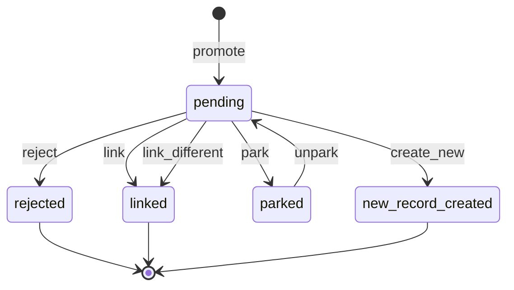

# AHG Authority Resolution Engine

The **AHG Authority Resolution Engine** turns NER-extracted name mentions
into archivally-defensible authority links. The archivist is always in the
loop: the engine assembles evidence, ranks candidates, and presents one of
five outcomes. The engine never auto-links.

## What it is

A single resolution engine implemented twice, once per codebase:

- **Heratio (Laravel 12)** - `packages/ahg-authority-resolution/`
- **AtoM Heratio (Symfony 1.4)** - `atom-ahg-plugins/ahgAuthorityResolutionPlugin/`

Both implementations share:

- The same six MySQL tables (plus `ahg_ner_feedback`).
- The same five decision outcomes.
- The same ten evidence evaluators.
- The same RDF-Star provenance shape, written to the same Fuseki dataset
  (`/openric-model`), isolated by named-graph URI.
- The same seven external authority adapters (VIAF, Wikidata, GeoNames,
  TGN, GND, ISNI, SAGNC).

The UI layer differs (Tailwind 4 in Heratio, Bootstrap 5 in AtoM), but the
data layer, the service contracts, and the provenance model converge.

## What it is NOT

- It is **not** an auto-linker. Every authority link is the result of an
  explicit archivist decision recorded in `ahg_mention_decision`.
- It is **not** SA-specific. SAGNC is one regional adapter among many. The
  core platform is jurisdiction-neutral; the adapter set is pluggable.
- It is **not** a NER service. NER runs upstream and writes
  `ahg_ner_entity` rows. The engine *promotes* selected rows into the
  resolution workflow.

## The five outcomes



See [The Five-Outcome Decision Tree](workflow/decision-tree.md) for the
full state machine.

## Quick start

### Status snapshot

```bash
sudo -u www-data php artisan auth-res:status
```

### Promote a sample mention

```bash
sudo -u www-data php artisan auth-res:promote-sample --object-id=901990
```

### Reprocess one mention end-to-end

```bash
sudo -u www-data php artisan auth-res:reprocess --mention-id=24
```

### Open the review screen

Heratio: `/admin/authority-resolution/review/24`
AtoM:    `/;authorityResolution/review?id=24`

## Reference architecture

```
upstream NER  ->  ahg_ner_entity  ->  (promote)  ->  ahg_mention
                                                     |
                                                     +-> ahg_mention_context
                                                     |
                                                     +-> ahg_mention_candidate (ranked)
                                                     |
                                                     +-> ahg_mention_decision (audit)
                                                     |    \--> RDF-Star to Fuseki
                                                     |
                                                     +-> ahg_mention_park (optional)
                                                     |
                                                     +-> ahg_ner_feedback (on reject)
```

External lookups (VIAF / Wikidata / ...) are cached in
`ahg_authority_lookup_cache` and surfaced during the `create_new` flow to
pre-fill the new authority record.

## Where to go next

- [Workflow overview](workflow/overview.md) - the operator's mental model.
- [Settings keys](config/settings.md) - everything you can tune.
- [CLI commands (Laravel)](ops/cli-laravel.md) - the 11 artisan commands.
- [Schema reference](reference/schema.md) - every column in every table.
- [SPARQL recipes](provenance/sparql.md) - read the provenance back.
