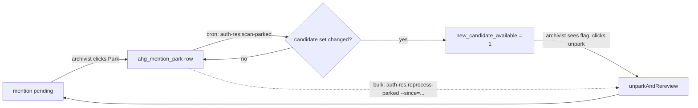

# Park queue

The park queue is the engine's "I cannot decide yet" outlet. Mentions that
are parked stay alive, get re-scanned for new candidates, and re-surface
when the upstream authority store changes.

## Lifecycle



## When to park

- The mention is real but the right authority record doesn't exist yet
  (an import is pending).
- The mention is real but the document context is ambiguous and needs
  off-line research.
- The mention is real but the candidate scoring is unsafe (close ties,
  the wrong one is highest).
- The mention may be a NER false positive but the archivist isn't sure
  enough to reject (rejection writes NER training data, so we want it to
  be confident).

## Park screen

- Heratio: `/admin/authority-resolution/park`
- AtoM:    `/;authorityResolution/park`

Filters:

- by archivist (defaults to "mine")
- by entity_type
- by `new_candidate_available` (yes / no / any)
- by parked_at range
- by reason text (LIKE)
- sort: parked_at desc/asc, entity_type, new_candidate flag

Per-row actions:

- **Unpark + review** -> calls `ParkQueueService::unparkAndRereview()`,
  redirects to the review screen with fresh candidates
- **Show context** -> expands the surrounding text + the original NER
  entity row
- **Discard** -> permanent reject (writes `decision_type=reject` and
  removes the park row)

## Background scan

`auth-res:scan-parked` walks every parked row and computes the candidate
fingerprint (sorted CSV of `source|authority_id|fuseki_uri|display_name`
tuples). If the fingerprint has changed since the last scan, it flips
`new_candidate_available=1` + records `new_candidate_check_at=now()`.

The scan is cheap (one candidate-generator pass per parked mention) and
idempotent (re-running with no upstream change just updates the
`new_candidate_check_at` column to "now"). Suggested cron: hourly.

```cron
0 * * * * www-data /usr/bin/php /usr/share/nginx/heratio/artisan auth-res:scan-parked >/dev/null 2>&1
```

## Bulk re-review

`auth-res:reprocess-parked --since=YYYY-MM-DD` re-runs every parked
mention parked on/after the given date. Useful when:

- a new external adapter went live and may surface new candidates
- a large MARC / EAD import landed and refreshed the local actor store
- you want to flush the park queue before a major release

```bash
$ sudo -u www-data php artisan auth-res:reprocess-parked --since=2026-05-01
Re-reviewing 1 parked mention(s) (parked >= 2026-05-01)...
  mention 24: unparked, 2 candidates, 2 scored.
Done. 1 re-reviewed, 0 failed, 1 now have at least one candidate.
```

## Data model

`ahg_mention_park`:

| column                       | purpose                                                        |
|------------------------------|----------------------------------------------------------------|
| `mention_id`                 | UNIQUE - one active park row per mention                       |
| `parked_by_user_id`          | for "my parked" filter + per-archivist counts                  |
| `parked_at`                  | timestamp; sort key + `--since` filter                         |
| `reason`                     | free text; LIKE-searchable                                     |
| `new_candidate_available`    | 0/1 flag set by `scan-parked`                                  |
| `new_candidate_check_at`     | timestamp of last scan                                         |

## Counts widget

`ParkQueueService::countsByArchivist()` returns
`[archivist_user_id => count]`. The dashboard widget
(`_park-dashboard-widget.blade.php`) renders this as a sortable list.
"Mine" is wired to the logged-in user.

## Edge cases

- **Unpark with no candidates**: `unparkAndRereview()` always returns;
  the candidate list may be empty. The review screen handles this with a
  "create new" prompt.
- **Re-parking**: parking an already-parked mention is a no-op (the
  UNIQUE constraint on `mention_id` prevents duplicates; the existing
  row's `reason` is updated).
- **Park then reject elsewhere**: rejecting from the review screen
  deletes the park row in the same transaction.
