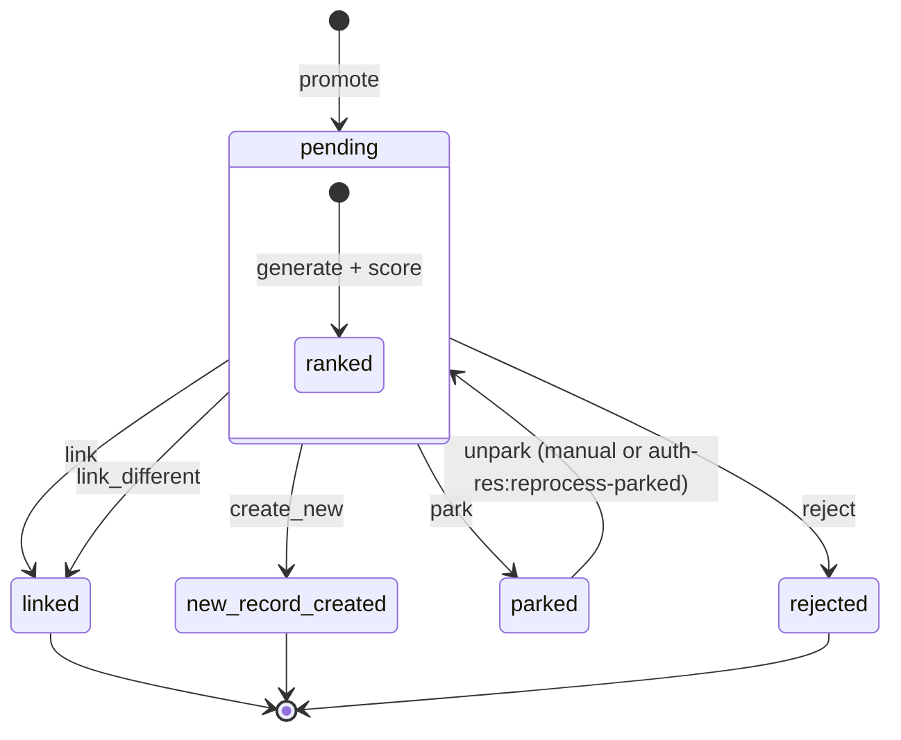

# The Five-Outcome Decision Tree

Every mention ends in exactly one of five outcomes. Each click writes an
immutable row to `ahg_mention_decision` and triggers downstream side
effects.

## State machine

`parked` is the only non-terminal state. `linked`,
`new_record_created`, and `rejected` are terminal.

## Outcome 1: `link`

The top-ranked candidate is correct. One click commits it.

| Field                              | Value                                              |
|------------------------------------|----------------------------------------------------|
| `decision_type`                    | `link`                                             |
| `chosen_candidate_id`              | rank-1 candidate                                   |
| `chosen_authority_id`              | candidate's actor.id (or term.id)                  |
| `original_system_top_score`        | composite_score of rank-1                          |
| `evidence_snapshot`                | frozen copy of rank-1's evidence_signals + data    |
| `candidates_visible_snapshot`      | full visible candidate list (rank, name, id)       |

Side effects:

- `ahg_mention.state` -> `linked`
- `ahg_ner_entity.linked_actor_id` set (back-compat contract)
- Decision provenance written to Fuseki

## Outcome 2: `link_different`

A lower-ranked candidate is correct. The archivist picks any row in the
candidate list. The "why I chose the non-top" snapshot makes it easy to
audit ranking failures later.

| Field                              | Value                                              |
|------------------------------------|----------------------------------------------------|
| `decision_type`                    | `link_different`                                   |
| `chosen_candidate_id`              | the picked candidate (rank > 1)                    |
| `chosen_authority_id`              | picked candidate's actor.id / term.id              |
| `original_system_top_score`        | rank-1's composite_score (NOT the picked one's)    |
| `evidence_snapshot`                | frozen copy of the picked candidate's evidence     |
| `candidates_visible_snapshot`      | full visible candidate list                        |

Side effects: same as `link`.

## Outcome 3: `create_new`

None of the candidates fit. The archivist creates a fresh authority record.
The Task-6 pre-fill engine queries the registered external sources (VIAF,
Wikidata, GeoNames, ...) and pre-fills the new-authority form. The
archivist may accept, override, or skip each pre-filled field.

| Field                              | Value                                              |
|------------------------------------|----------------------------------------------------|
| `decision_type`                    | `create_new`                                       |
| `chosen_candidate_id`              | NULL                                               |
| `chosen_authority_id`              | newly-inserted actor.id / term.id                  |
| `original_system_top_score`        | rank-1's composite_score                           |
| `evidence_snapshot`                | NULL                                               |
| `candidates_visible_snapshot`      | full visible candidate list                        |

Side effects:

- `ahg_mention.state` -> `new_record_created`
- New row in `actor` / `term` (+ i18n tables)
- Per-field RDF-Star assertions written to the field-provenance graph
  (each accepted pre-fill carries its source URI + retrieved-at)
- Decision provenance written to the decisions graph

## Outcome 4: `park`

The decision is not safe to make yet. Maybe the document needs more
research; maybe an expected candidate is missing and an upstream import
is pending. The mention stays alive but parked. The background scan job
(`auth-res:scan-parked`) flips `new_candidate_available=1` when the
candidate set changes; the archivist sees the flag on the park screen and
can unpark.

| Field                              | Value                                              |
|------------------------------------|----------------------------------------------------|
| `decision_type`                    | `park`                                             |
| `chosen_candidate_id`              | NULL                                               |
| `chosen_authority_id`              | NULL                                               |
| `original_system_top_score`        | rank-1's composite_score                           |

Side effects:

- `ahg_mention.state` -> `parked`
- New row in `ahg_mention_park` (with `reason`)
- Decision provenance written

To unpark in bulk: `php artisan auth-res:reprocess-parked --since=...`.
See [Park queue](../ops/park-queue.md).

## Outcome 5: `reject`

The NER model was wrong. "Pretoria" was not a place in this context; it
was a horse named Pretoria, or a brand, or a typo. The mention is
suppressed and the row becomes NER training data.

| Field                              | Value                                              |
|------------------------------------|----------------------------------------------------|
| `decision_type`                    | `reject`                                           |
| `chosen_candidate_id`              | NULL                                               |
| `chosen_authority_id`              | NULL                                               |
| `evidence_snapshot`                | NULL                                               |

Side effects:

- `ahg_mention.state` -> `rejected`
- New row in `ahg_ner_feedback` (source text + span offsets +
  `rejection_reason`) - captured via `NerFeedbackService` inside a
  try/catch so the decision is never blocked
- Decision provenance written

The NER feedback is later exported (`auth-res:export-ner-feedback`) to a
JSONL training file consumed by the /opt/ahg-ai retrainer.
See [NER feedback export](../ops/ner-feedback.md).

## Immutability + corrections

A decision is **immutable**. You cannot undo a `link`. To correct a
mistake:

1. Decide again on the same mention (the engine records the new decision).
2. The audit row from step 1 is now visible alongside the new row.
3. The most recent decision wins for the `state` column.

Some pre-Task-10 deployments enforced "one decision per mention". The
current schema does not - `ahg_mention_decision` accepts multiple rows per
`mention_id` and the audit history is the source of truth.
