# Condition Assessment

## User Guide

Document and track the physical condition of objects in your collection for conservation, loans, and insurance purposes.

---

## Workflow Overview
```
┌──────────────┐    ┌──────────────┐    ┌──────────────┐    ┌──────────────┐
│   Select     │    │   Record     │    │   Document   │    │   Schedule   │
│   Object     │ ──▶│   Condition  │ ──▶│   Damage     │ ──▶│   Treatment  │
│              │    │              │    │              │    │              │
│ Find item   │    │ Overall      │    │ Photos       │    │ Priority     │
│ to assess    │    │ rating       │    │ Annotations  │    │ Follow-up    │
└──────────────┘    └──────────────┘    └──────────────┘    └──────────────┘
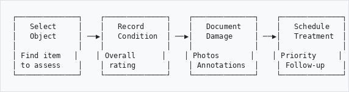
```

---

## When to Use
```
┌─────────────────────────────────────────────────────────────┐
│               USE CONDITION ASSESSMENT FOR:                 │
├─────────────────────────────────────────────────────────────┤
│                                                             │
│  📦 ACQUISITION                                             │
│     Document condition when items arrive                    │
│                                                             │
│  🚚 LOANS                                                   │
│     Before sending out and when returned                    │
│                                                             │
│  🖼️  EXHIBITION                                              │
│     Pre and post-exhibition checks                          │
│                                                             │
│  📋 ROUTINE                                                 │
│     Regular collection surveys                              │
│                                                             │
│  ⚠️  INCIDENT                                                │
│     After damage, flood, or emergency                       │
│                                                             │
│  💰 INSURANCE                                               │
│     Valuation and claims documentation                      │
│                                                             │
└─────────────────────────────────────────────────────────────┘
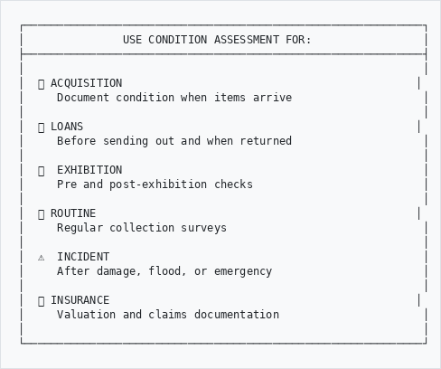
```

---

## How to Access
```
Option A: From a Record                Option B: From Dashboard
───────────────────────                ─────────────────────────
                                       
  View Object Record                     Main Menu
         │                                   │
         ▼                                   ▼
  Click "More" menu                      GLAM/DAM
         │                                   │
         ▼                                   ▼
  "Condition Assessment"                  More
         │                                   │
         ▼                                   ▼
  Assessment Form                        Condition
                                             │
                                             ▼
                                        Dashboard
```

---

## Part 1: Condition Dashboard

### Overview Screen
```
┌─────────────────────────────────────────────────────────────┐
│ CONDITION DASHBOARD                                         │
├──────────────────┬──────────────────┬───────────────────────┤
│                  │                  │                       │
│  COLLECTION      │  HIGH RISK       │   UPCOMING            │
│  OVERVIEW        │  ITEMS           │   ASSESSMENTS         │
│                  │                  │                       │
│  🟢 Good    65%  │     12           │       8               │
│  🟡 Fair    25%  │   need urgent    │   due this month      │
│  🔴 Poor    10%  │   attention      │                       │
│                  │                  │                       │
└──────────────────┴──────────────────┴───────────────────────┘

┌─────────────────────────────────────────────────────────────┐
│ RECENT ASSESSMENTS                                          │
├─────────────────────────────────────────────────────────────┤
│ Date       │ Object           │ Rating  │ Assessor │ Type   │
├────────────┼──────────────────┼─────────┼──────────┼────────┤
│ 10 Jan 26  │ Photo Album 1935 │ 🟡 Fair │ J Smith  │ Loan   │
│ 09 Jan 26  │ Oil Painting     │ 🟢 Good │ M Jones  │ Routine│
│ 08 Jan 26  │ Textile Fragment │ 🔴 Poor │ J Smith  │ Incident│
└────────────┴──────────────────┴─────────┴──────────┴────────┘
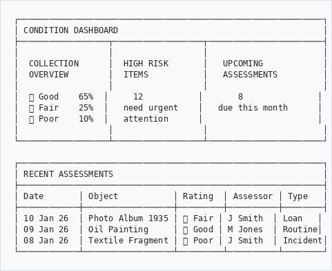
```

---

## Part 2: Creating an Assessment

### Assessment Types
```
┌─────────────────────────────────────────────────────────────┐
│  TYPE              │  WHEN TO USE                          │
├────────────────────┼────────────────────────────────────────┤
│  Acquisition       │  New item entering collection         │
│  Loan Out          │  Before sending on loan               │
│  Loan In           │  Borrowed item arriving               │
│  Loan Return       │  Item coming back from loan           │
│  Exhibition        │  Before/after display                 │
│  Storage           │  Items in storage areas               │
│  Conservation      │  After treatment                      │
│  Routine           │  Regular scheduled check              │
│  Incident          │  After damage/emergency               │
│  Insurance         │  For valuation/claims                 │
│  Deaccession       │  Before disposal/transfer             │
└────────────────────┴────────────────────────────────────────┘
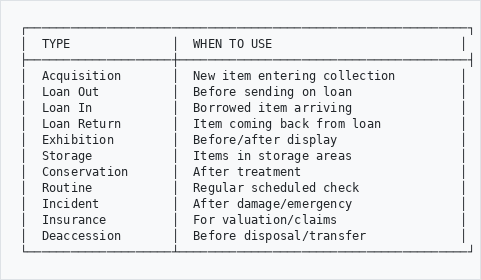
```

---

### Condition Rating Scale
```
┌─────────────────────────────────────────────────────────────┐
│                    CONDITION RATINGS                        │
├─────────────────────────────────────────────────────────────┤
│                                                             │
│  🟢 EXCELLENT (1-2)                                         │
│     Like new, no visible issues                             │
│     No treatment needed                                     │
│                                                             │
│  🟢 GOOD (3-4)                                              │
│     Minor wear consistent with age                          │
│     Stable, monitor only                                    │
│                                                             │
│  🟡 FAIR (5-6)                                              │
│     Some damage but stable                                  │
│     Treatment recommended                                   │
│                                                             │
│  🔴 POOR (7-8)                                              │
│     Significant damage or deterioration                     │
│     Treatment required                                      │
│                                                             │
│  🔴 CRITICAL (9-10)                                         │
│     Severe damage, at risk                                  │
│     Urgent intervention needed                              │
│                                                             │
└─────────────────────────────────────────────────────────────┘
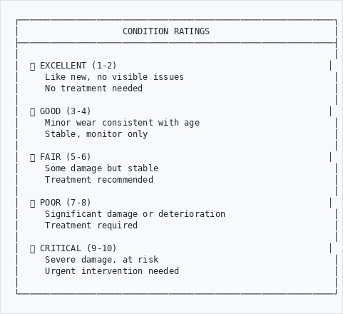
```

---

### Assessment Form
```
┌─────────────────────────────────────────────────────────────┐
│ NEW CONDITION ASSESSMENT                                    │
├─────────────────────────────────────────────────────────────┤
│                                                             │
│  Object:          ABC/001/012 - Photograph Album 1935       │
│                                                             │
│  Assessment Type: [ Loan Out               ▼]               │
│                                                             │
│  Date:            [ 10/01/2026  📅]                        │
│                                                             │
│  Assessor:        [ Jane Smith             ▼]               │
│                                                             │
├─────────────────────────────────────────────────────────────┤
│  OVERALL CONDITION                                          │
│                                                             │
│  Rating:          [ Fair                   ▼]               │
│                   ┌─────────────────────────┐               │
│                   │ Excellent               │               │
│                   │ Good                    │               │
│                   │ Fair          ←         │               │
│                   │ Poor                    │               │
│                   │ Critical                │               │
│                   └─────────────────────────┘               │
│                                                             │
│  Numeric Score:   [====●=====] 5/10                         │
│                                                             │
│  Summary:                                                   │
│  [Album shows age-related wear. Spine is detached at      ]│
│  [upper hinge. Pages are yellowed but stable. Photos are  ]│
│  [intact with minor foxing.                               ]│
│                                                             │
└─────────────────────────────────────────────────────────────┘
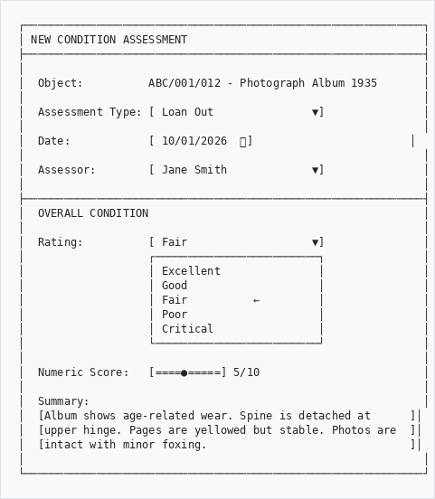
```

---

## Part 3: Recording Damage

### Damage Types
```
┌─────────────────────────────────────────────────────────────┐
│                     DAMAGE CATEGORIES                       │
├─────────────────────────────────────────────────────────────┤
│                                                             │
│  💥 PHYSICAL                              Risk: 1.0x        │
│     Tears, breaks, cracks, abrasion, loss                   │
│     Warping, dents, chips, scratches                        │
│                                                             │
│  🦠 BIOLOGICAL                            Risk: 1.3x        │
│     Insect damage, rodent damage                            │
│     Biofilm, algae growth                                   │
│                                                             │
│  🧪 CHEMICAL                              Risk: 1.2x        │
│     Corrosion, oxidation, acid damage                       │
│     Discoloration, staining                                 │
│                                                             │
│  💧 WATER                                 Risk: 1.3x        │
│     Water stains, tide lines                                │
│     Swelling, cockling                                      │
│                                                             │
│  🔥 FIRE                                  Risk: 1.2x        │
│     Charring, smoke damage                                  │
│     Heat distortion                                         │
│                                                             │
│  🍄 MOULD                                 Risk: 1.5x        │
│     Active mould growth                                     │
│     Mould staining, musty odour                             │
│                                                             │
└─────────────────────────────────────────────────────────────┘
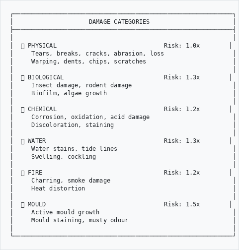
```

---

### Severity Levels
```
         SEVERITY SCALE
         
   NONE      MINOR     MODERATE    SEVERE    CRITICAL
    │          │          │          │          │
    ▼          ▼          ▼          ▼          ▼
   ━━━━━━━━━━━━━━━━━━━━━━━━━━━━━━━━━━━━━━━━━━━━━━━▶
    0          2          4          7         10
    
   No         Surface    Affecting  Major      Immediate
   damage     only       stability  damage     risk


Risk Score = Severity × Damage Type Multiplier

Example: Mould (1.5x) with Severe damage (7)
         Risk Score = 7 × 1.5 = 10.5 (HIGH PRIORITY)
```

---

### Add Damage Record
```
┌─────────────────────────────────────────────────────────────┐
│ ADD DAMAGE OBSERVATION                                      │
├─────────────────────────────────────────────────────────────┤
│                                                             │
│  Damage Type:     [ Physical              ▼]                │
│                                                             │
│  Specific Type:   [ Tear                  ▼]                │
│                   ┌─────────────────────────┐               │
│                   │ Crack                   │               │
│                   │ Tear           ←        │               │
│                   │ Loss                    │               │
│                   │ Abrasion                │               │
│                   │ Break                   │               │
│                   └─────────────────────────┘               │
│                                                             │
│  Severity:        [ Moderate              ▼]                │
│                                                             │
│  Location:        [Upper spine, front hinge___________]     │
│                                                             │
│  Material:        [ Leather               ▼]                │
│                                                             │
│  Description:                                               │
│  [3cm tear along spine where front board meets spine.     ]│
│  [Leather is brittle at this point. Board still attached  ]│
│  [but hinge is weak.                                      ]│
│                                                             │
│                                   [ Cancel ]  [ Add ]       │
│                                                             │
└─────────────────────────────────────────────────────────────┘
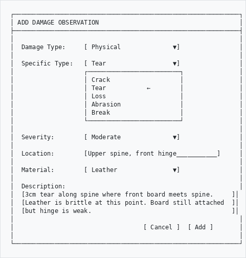
```

---

## Part 4: Photo Documentation

### Taking Condition Photos
```
┌─────────────────────────────────────────────────────────────┐
│                   PHOTO GUIDELINES                          │
├─────────────────────────────────────────────────────────────┤
│                                                             │
│  📷 OVERALL SHOTS                                           │
│     • Front view                                            │
│     • Back view                                             │
│     • Top/bottom if relevant                                │
│                                                             │
│  🔍 DETAIL SHOTS                                            │
│     • Each area of damage                                   │
│     • Include scale ruler                                   │
│     • Good lighting, no shadows                             │
│                                                             │
│  📏 SCALE                                                   │
│     • Include colour chart if possible                      │
│     • Use consistent backgrounds                            │
│                                                             │
│  ⚡ BEFORE/AFTER                                            │
│     • Same angle for comparison                             │
│     • Document all treatments                               │
│                                                             │
└─────────────────────────────────────────────────────────────┘
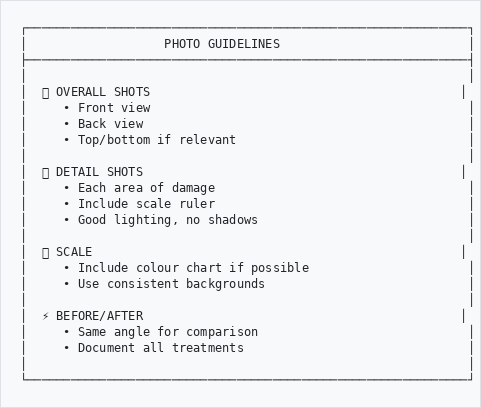
```

---

### Image Annotator
```
┌─────────────────────────────────────────────────────────────┐
│ CONDITION ANNOTATOR                              [Fit View] │
├─────────────────────────────────────────────────────────────┤
│                                                             │
│  Tools:  [📍Pin] [□ Box] [○ Circle] [✏️ Draw] [💬 Note]     │
│                                                             │
│  ┌─────────────────────────────────────────────────────┐   │
│  │                                                     │   │
│  │                    📷                               │   │
│  │              Object Image                           │   │
│  │                                                     │   │
│  │        ┌───┐                                        │   │
│  │        │ 1 │ ← Tear marked                          │   │
│  │        └───┘                                        │   │
│  │                         ┌───┐                       │   │
│  │                         │ 2 │ ← Stain marked        │   │
│  │                         └───┘                       │   │
│  │                                                     │   │
│  └─────────────────────────────────────────────────────┘   │
│                                                             │
│  ANNOTATIONS:                                               │
│  1. Tear - Moderate - Upper spine                           │
│  2. Stain - Minor - Lower right corner                      │
│                                                             │
│                              [ Clear All ]  [ Save ]        │
│                                                             │
└─────────────────────────────────────────────────────────────┘
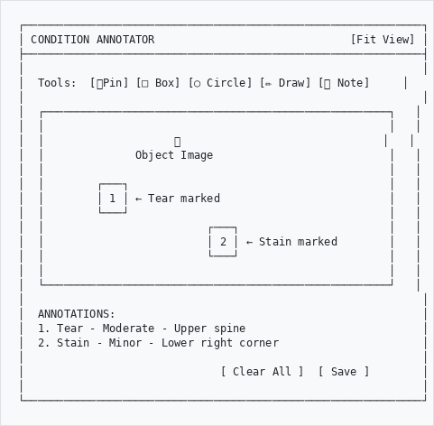
```

---

## Part 5: Treatment Recommendations

### Priority Levels
```
         TREATMENT PRIORITY
         
    LOW        MEDIUM       HIGH        URGENT
     │            │           │            │
     ▼            ▼           ▼            ▼
┌─────────┐ ┌─────────┐ ┌─────────┐ ┌─────────┐
│ Address │ │ Normal  │ │ Prompt  │ │Immediate│
│ when    │ │workflow │ │attention│ │ action  │
│ able    │ │         │ │ needed  │ │ required│
└─────────┘ └─────────┘ └─────────┘ └─────────┘
  Months      Weeks       Days        Now
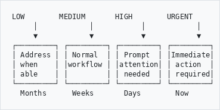
```

---

### Treatment Form
```
┌─────────────────────────────────────────────────────────────┐
│ TREATMENT RECOMMENDATION                                    │
├─────────────────────────────────────────────────────────────┤
│                                                             │
│  Treatment Required:  ● Yes  ○ No                           │
│                                                             │
│  Priority:           [ High                  ▼]             │
│                                                             │
│  Recommended Actions:                                       │
│  ☑ Stabilization                                            │
│  ☑ Cleaning                                                 │
│  ☐ Repair                                                   │
│  ☑ Rebinding                                                │
│  ☐ Fumigation                                               │
│  ☐ Digitization (preservation copy)                         │
│                                                             │
│  Estimated Cost:     [ R 2,500.00________]                  │
│                                                             │
│  Recommended Vendor: [ ACME Conservation   ▼]               │
│                                                             │
│  Notes:                                                     │
│  [Recommend stabilizing spine before loan. Full rebind    ]│
│  [can wait until post-loan. Create digital copy before   ]│
│  [treatment.                                              ]│
│                                                             │
└─────────────────────────────────────────────────────────────┘
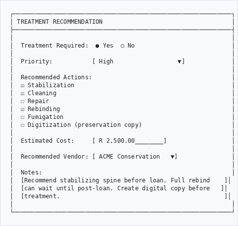
```

---

## Part 6: Condition History

### Object Timeline
```
┌─────────────────────────────────────────────────────────────┐
│ CONDITION HISTORY - Photo Album 1935                        │
├─────────────────────────────────────────────────────────────┤
│                                                             │
│  Timeline:                                                  │
│                                                             │
│  10 Jan 2026  ●──── Loan Out Check ───────── 🟡 Fair       │
│               │     Spine damage noted                      │
│               │     Treatment recommended                   │
│               │                                             │
│  15 Oct 2025  ●──── Routine Check ────────── 🟡 Fair       │
│               │     Stable, monitor                         │
│               │                                             │
│  03 Mar 2025  ●──── Conservation ─────────── 🟢 Good       │
│               │     Post-treatment                          │
│               │     Pages stabilized                        │
│               │                                             │
│  01 Mar 2025  ●──── Conservation ─────────── 🟡 Fair       │
│               │     Pre-treatment                           │
│               │     Foxing throughout                       │
│               │                                             │
│  12 Dec 2024  ●──── Acquisition ──────────── 🟡 Fair       │
│                     Initial assessment                      │
│                     Donor: Smith Estate                     │
│                                                             │
│                                            [ View Details ] │
│                                                             │
└─────────────────────────────────────────────────────────────┘
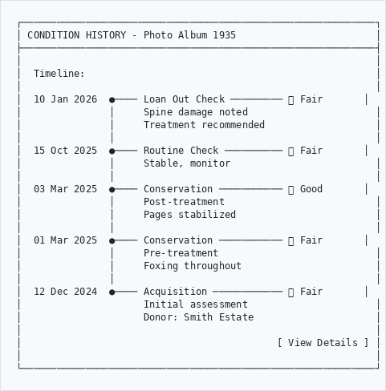
```

---

## Part 7: Reports

### Available Reports
```
┌─────────────────────────────────────────────────────────────┐
│  REPORT                │  DESCRIPTION                       │
├────────────────────────┼────────────────────────────────────┤
│  Collection Survey     │  Overall collection condition      │
│  High Risk Items       │  Items needing urgent attention    │
│  Treatment Queue       │  Pending conservation work         │
│  Loan Condition        │  Pre/post loan comparisons         │
│  Assessment Schedule   │  Upcoming assessments due          │
│  Assessor Activity     │  Work by staff member              │
│  Damage Statistics     │  Types and frequency of damage     │
│  Cost Estimates        │  Treatment budget planning         │
└────────────────────────┴────────────────────────────────────┘
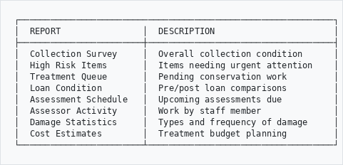
```

---

### Generate Report
```
┌─────────────────────────────────────────────────────────────┐
│ GENERATE CONDITION REPORT                                   │
├─────────────────────────────────────────────────────────────┤
│                                                             │
│  Report Type:      [ Collection Survey     ▼]               │
│                                                             │
│  Date Range:       [ 01/01/2025 ] to [ 31/12/2025 ]        │
│                                                             │
│  Filter By:                                                 │
│                                                             │
│  Condition:        ☑ Excellent  ☑ Good  ☑ Fair             │
│                    ☑ Poor       ☑ Critical                  │
│                                                             │
│  Location:         [ All Locations         ▼]               │
│                                                             │
│  Format:           ○ PDF  ● Excel  ○ CSV                    │
│                                                             │
│  Include:          ☑ Photos  ☑ Annotations  ☐ Full history │
│                                                             │
│                              [ Cancel ]  [ Generate ]       │
│                                                             │
└─────────────────────────────────────────────────────────────┘
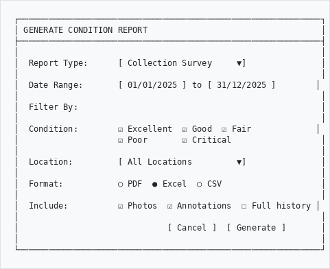
```

---

## Quick Reference
```
┌─────────────────────────────────────────────────────────────┐
│  TASK                      │  HOW TO DO IT                  │
├────────────────────────────┼────────────────────────────────┤
│  New assessment            │  Record → More → Condition     │
│  View dashboard            │  GLAM/DAM → More → Condition   │
│  Add damage record         │  In assessment → Add Damage    │
│  Upload photos             │  In assessment → Add Photo     │
│  Annotate image            │  Photo → Open Annotator        │
│  Schedule assessment       │  Dashboard → Schedule          │
│  Generate report           │  Dashboard → Reports           │
│  View history              │  Record → Condition tab        │
└────────────────────────────┴────────────────────────────────┘
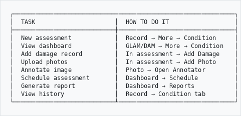
```

---

## Tips for Best Practice
```
┌─────────────────────────────────────────────────────────────┐
│  ✓ DO                          │  ✗ DON'T                  │
├────────────────────────────────┼────────────────────────────┤
│  Use consistent lighting       │  Take blurry photos       │
│  Include scale reference       │  Skip damage details      │
│  Be specific about location    │  Use vague descriptions   │
│  Take before/after photos      │  Forget to save           │
│  Note environmental factors    │  Ignore minor damage      │
│  Schedule regular checks       │  Only check after damage  │
│  Link to treatments            │  Leave recommendations    │
│                                │  incomplete               │
└────────────────────────────────┴────────────────────────────┘
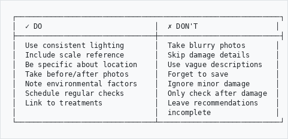
```

---

## Troubleshooting
```
Problem                          Solution
───────────────────────────────────────────────────────────
Can't find Condition option   →  Check GLAM/DAM → More menu
                                 May need permission
                                 
Photo won't upload            →  Check file size (<10MB)
                                 Use JPEG or PNG format
                                 
Annotator not loading         →  Refresh page
                                 Clear browser cache
                                 Try different browser
                                 
Can't save assessment         →  Complete required fields
                                 Check you have edit access
                                 
Report won't generate         →  Reduce date range
                                 Uncheck "Include photos"
                                 for large reports
```

---

## Need Help?

Contact your system administrator if you experience issues.

---

*Part of the AtoM AHG Framework*
