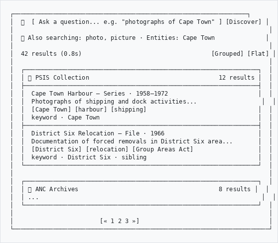

# Discovery Search User Guide

## Overview

Discovery Search lets you search across your entire archive using natural language - plain English questions instead of exact keywords. It understands dates, place names, people, organizations, and automatically expands your search with synonyms and related terms.

**Example:** Searching for *"ANC education policy 1960s"* will find records about ANC education policy from 1960–1969, even if the exact phrase doesn't appear in any single record.

---

## Getting Started

### Accessing Discovery

Navigate to **Discovery** from the main menu, or go directly to:

```
https://your-site.com/discovery
```

### Your First Search

1. Type a question or topic in the search box
2. Click **Discover** or press **Enter**
3. Browse results grouped by collection

```
┌─────────────────────────────────────────────────────────────────┐
│  🔍  [ Ask a question... e.g. "photographs of Cape Town" ] [Discover] │
│                                                                       │
│  💡 Also searching: photo, picture · Entities: Cape Town              │
│                                                                       │
│  42 results (0.8s)                                    [Grouped] [Flat] │
│                                                                       │
│  ┌─────────────────────────────────────────────────────────────────┐  │
│  │ 📦 PSIS Collection                                    12 results │  │
│  ├─────────────────────────────────────────────────────────────────┤  │
│  │  Cape Town Harbour - Series · 1958–1972                         │  │
│  │  Photographs of shipping and dock activities...                  │  │
│  │  [Cape Town] [harbour] [shipping]                               │  │
│  │  keyword · Cape Town                                            │  │
│  ├─────────────────────────────────────────────────────────────────┤  │
│  │  District Six Relocation - File · 1966                          │  │
│  │  Documentation of forced removals in District Six area...       │  │
│  │  [District Six] [relocation] [Group Areas Act]                  │  │
│  │  keyword · District Six · sibling                               │  │
│  └─────────────────────────────────────────────────────────────────┘  │
│                                                                       │
│  ┌─────────────────────────────────────────────────────────────────┐  │
│  │ 📦 ANC Archives                                       8 results │  │
│  │ ...                                                              │  │
│  └─────────────────────────────────────────────────────────────────┘  │
│                                                                       │
│                        [« 1 2 3 »]                                    │
└───────────────────────────────────────────────────────────────────────┘

```

---

## Search Features

### Natural Language Queries

You don't need to know the exact catalogue terms. Just type what you're looking for:

| You type | Discovery understands |
|----------|----------------------|
| `photographs of Cape Town in the 1960s` | Keywords: cape, town · Date range: 1960–1969 · Entity: Cape Town |
| `ANC education policy` | Keywords: anc, education, policy |
| `letters from Nelson Mandela` | Keywords: letters · Entity: Nelson Mandela |
| `19th century maps` | Keywords: maps · Date range: 1800–1899 |
| `documents before 1900` | Date range: up to 1900 |
| `"Group Areas Act"` | Exact phrase: Group Areas Act |

### Date Recognition

Discovery automatically detects dates in your query:

| Format | Example | Range |
|--------|---------|-------|
| Decade | `1960s` | 1960–1969 |
| Century | `19th century` | 1800–1899 |
| Year range | `1960-1969` or `1960 to 1969` | 1960–1969 |
| Single year | `1960` | 1960 |
| Before/after | `before 1900`, `after 1950` | Open-ended range |

### Phrase Detection

Discovery identifies multi-word names and proper nouns:

- **Quoted phrases**: `"District Six"` - searches as an exact phrase
- **Capitalized names**: `Nelson Mandela`, `Group Areas Act` - detected as entity names automatically

### Synonym Expansion

If the ahgSemanticSearchPlugin thesaurus is populated, Discovery automatically expands your search with related terms:

- `archive` → also searches: repository, depot, record office
- `photograph` → also searches: photo, picture, image

The expansion is shown below the search box so you know what was added.

---

## Understanding Results

### Result Cards

Each result shows:

| Element | Description |
|---------|-------------|
| **Title** | Record title (click to open the full record) |
| **Metadata line** | Level of description · Dates · Creator · Repository |
| **Scope and content** | First 2 sentences, with search terms highlighted in yellow |
| **Entity tags** | Colour-coded NER entities found in the record |
| **Match reasons** | Badges showing why this record matched |

### Match Reason Badges

| Badge | Meaning |
|-------|---------|
| `keyword` | Matched via full-text keyword search |
| `Nelson Mandela` (green) | Matched via NER entity |
| `sibling` | Related record - same parent as a direct match |
| `child` | Related record - child of a matching collection/series |

### Entity Tag Colours

| Colour | Entity Type |
|--------|-------------|
| Blue | Person |
| Green | Organization |
| Yellow | Place (GPE) |
| Light blue | Location |
| Grey | Date |

### Grouped vs Flat View

Toggle between two display modes using the buttons in the top-right:

- **Grouped** (default) - Results organized under their root fonds/collection, with a count badge. Collapse or expand each group.
- **Flat** - All results in a single ranked list ordered by relevance score.

---

## Popular Searches

When you first open Discovery (before searching), you'll see **Popular searches** - topics frequently searched by other users in the last 30 days. Click any topic to run that search instantly.

---

## Tips for Better Results

1. **Be specific**: `ANC education policy Dar es Salaam` finds more relevant results than just `education`
2. **Use quotes for exact phrases**: `"Group Areas Act"` ensures those words appear together
3. **Include dates**: `photographs 1960s` narrows results to that decade
4. **Use proper names**: Capitalized names like `Nelson Mandela` or `Cape Town` are detected as entities and matched against NER data
5. **Try different angles**: If `photographs` finds nothing, try `pictures` or `images` - synonym expansion may help

---

## Related Content (Sidebar)

On individual record view pages, Discovery can show a **Related Content** sidebar - records that share the same NER entities (people, places, organizations) as the record you're viewing. This helps you explore related materials across different collections.

> **Note:** Related content requires the ahgAIPlugin to have run NER extraction on your records.

---

## Requirements

| Requirement | Purpose |
|-------------|---------|
| ahgCorePlugin | Required dependency |
| OpenSearch / Elasticsearch | Powers the keyword search strategy |
| ahgAIPlugin (optional) | NER entities improve entity-based search and related content |
| ahgSemanticSearchPlugin (optional) | Thesaurus synonyms improve query expansion |

---

## Troubleshooting

| Issue | Solution |
|-------|----------|
| No results for any query | Check OpenSearch is running: `curl http://localhost:9200` |
| No results but no errors | Run `php symfony search:populate` to rebuild the search index |
| Entity tags never appear | Run `php symfony ai:ner-extract` to extract NER entities |
| Synonyms not expanding | Populate the thesaurus in ahgSemanticSearchPlugin |
| Search is slow | Results are cached for 1 hour - first search may be slower |
| Popular searches empty | Needs at least 2 searches for the same query in the last 30 days |
