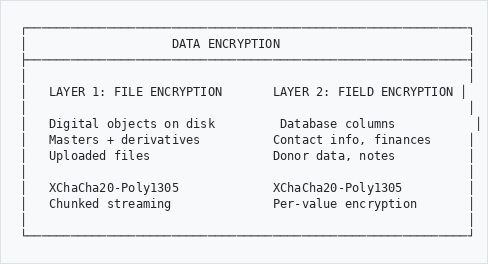
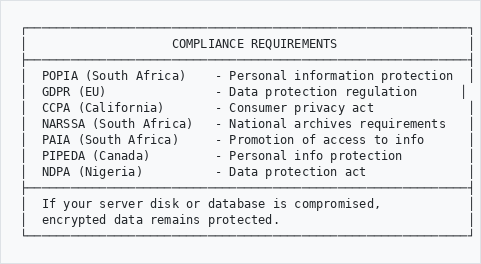
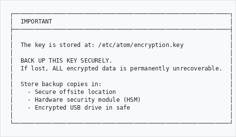
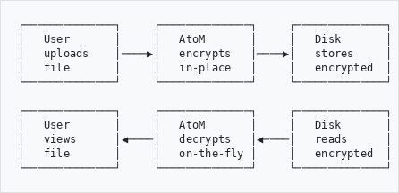
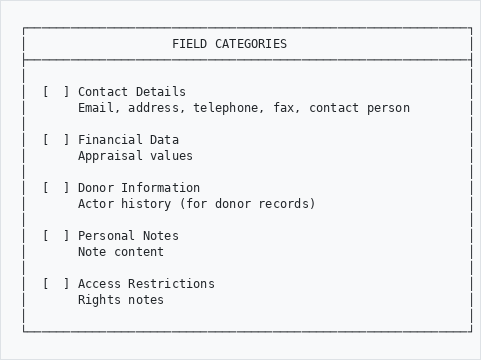
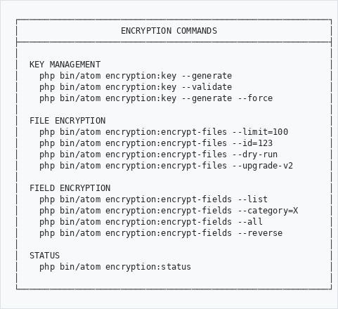

# Data Encryption

## User Guide

Protect sensitive data at rest with two-layer encryption for digital objects and database fields.

---

## Overview
```
┌─────────────────────────────────────────────────────────────┐
│                    DATA ENCRYPTION                          │
├─────────────────────────────────────────────────────────────┤
│                                                             │
│   LAYER 1: FILE ENCRYPTION       LAYER 2: FIELD ENCRYPTION │
│                                                             │
│   Digital objects on disk         Database columns           │
│   Masters + derivatives          Contact info, finances     │
│   Uploaded files                 Donor data, notes          │
│                                                             │
│   XChaCha20-Poly1305             XChaCha20-Poly1305         │
│   Chunked streaming              Per-value encryption       │
│                                                             │
└─────────────────────────────────────────────────────────────┘

```

---

## Why Encrypt?
```
┌─────────────────────────────────────────────────────────────┐
│                    COMPLIANCE REQUIREMENTS                  │
├─────────────────────────────────────────────────────────────┤
│  POPIA (South Africa)    - Personal information protection  │
│  GDPR (EU)               - Data protection regulation      │
│  CCPA (California)       - Consumer privacy act             │
│  NARSSA (South Africa)   - National archives requirements   │
│  PAIA (South Africa)     - Promotion of access to info      │
│  PIPEDA (Canada)         - Personal info protection         │
│  NDPA (Nigeria)          - Data protection act              │
├─────────────────────────────────────────────────────────────┤
│  If your server disk or database is compromised,            │
│  encrypted data remains protected.                          │
└─────────────────────────────────────────────────────────────┘

```

---

## How to Access
```
  Main Menu
      │
      ▼
   Admin
      │
      ▼
   AHG Settings
      │
      ▼
   Encryption ───────────────────────────────────────┐
      │                                               │
      ├──▶ Key Status        (view key info)          │
      │                                               │
      ├──▶ Master Toggle     (enable/disable)         │
      │                                               │
      ├──▶ File Options      (derivatives toggle)     │
      │                                               │
      └──▶ Field Categories  (select what to encrypt) │
```

---

## Initial Setup

### Step 1: Generate Encryption Key

An administrator must generate the master encryption key via CLI:

```bash
php bin/atom encryption:key --generate
```

```
┌─────────────────────────────────────────────────────────────┐
│  IMPORTANT                                                  │
├─────────────────────────────────────────────────────────────┤
│                                                             │
│  The key is stored at: /etc/atom/encryption.key             │
│                                                             │
│  BACK UP THIS KEY SECURELY.                                 │
│  If lost, ALL encrypted data is permanently unrecoverable.  │
│                                                             │
│  Store backup copies in:                                    │
│    - Secure offsite location                                │
│    - Hardware security module (HSM)                         │
│    - Encrypted USB drive in safe                            │
│                                                             │
└─────────────────────────────────────────────────────────────┘

```

### Step 2: Verify Key

```bash
php bin/atom encryption:key --validate
```

Expected output:
```
  Key is valid.
    Path: /etc/atom/encryption.key
    Key ID: 1
    Algorithm: XChaCha20-Poly1305 (libsodium)
    Permissions: 0600
    Round-trip test: PASSED
```

### Step 3: Enable Encryption in Settings

Go to **Admin** > **AHG Settings** > **Encryption**

---

## Layer 1: File Encryption

Encrypts uploaded digital objects (images, documents, audio, video) on disk.

### How It Works
```
┌──────────────┐     ┌──────────────┐     ┌──────────────┐
│   User       │     │   AtoM       │     │   Disk       │
│   uploads    │────▶│   encrypts   │────▶│   stores     │
│   file       │     │   in-place   │     │   encrypted  │
└──────────────┘     └──────────────┘     └──────────────┘

┌──────────────┐     ┌──────────────┐     ┌──────────────┐
│   User       │     │   AtoM       │     │   Disk       │
│   views      │◀────│   decrypts   │◀────│   reads      │
│   file       │     │   on-the-fly │     │   encrypted  │
└──────────────┘     └──────────────┘     └──────────────┘

```

### Enable File Encryption

1. Go to **Admin** > **AHG Settings** > **Encryption**
2. Set **Enable File Encryption** to **Yes**
3. Set **Encrypt Derivatives** to **Yes** (recommended)
4. Click **Save**

### Encrypt Existing Files

New uploads are encrypted automatically. For files already on disk:

```bash
# Preview what would be encrypted
php bin/atom encryption:encrypt-files --dry-run

# Encrypt first 100 unencrypted files
php bin/atom encryption:encrypt-files --limit=100

# Encrypt a specific digital object
php bin/atom encryption:encrypt-files --id=123 --with-derivatives

# Encrypt all files (set high limit)
php bin/atom encryption:encrypt-files --limit=10000
```

### User Experience

Encryption is **transparent** to users:
- Viewing, downloading, and streaming work exactly as before
- IIIF viewer, media player, and thumbnails function normally
- No action required from regular users

---

## Layer 2: Field Encryption

Encrypts sensitive database columns so raw SQL access shows encrypted blobs instead of personal data.

### Available Categories
```
┌─────────────────────────────────────────────────────────────┐
│                    FIELD CATEGORIES                         │
├─────────────────────────────────────────────────────────────┤
│                                                             │
│  [  ] Contact Details                                       │
│       Email, address, telephone, fax, contact person        │
│                                                             │
│  [  ] Financial Data                                        │
│       Appraisal values                                      │
│                                                             │
│  [  ] Donor Information                                     │
│       Actor history (for donor records)                     │
│                                                             │
│  [  ] Personal Notes                                        │
│       Note content                                          │
│                                                             │
│  [  ] Access Restrictions                                   │
│       Rights notes                                          │
│                                                             │
└─────────────────────────────────────────────────────────────┘

```

### Enable Field Encryption

1. Go to **Admin** > **AHG Settings** > **Encryption**
2. Check the categories you want to encrypt
3. Click **Save**
4. Run the encryption command:

```bash
# Encrypt specific category
php bin/atom encryption:encrypt-fields --category=contact_details

# Encrypt all enabled categories
php bin/atom encryption:encrypt-fields --all

# List available categories
php bin/atom encryption:encrypt-fields --list
```

### Decrypt Fields (Reversible)

Field encryption is reversible:

```bash
# Decrypt a specific category
php bin/atom encryption:encrypt-fields --category=contact_details --reverse

# Decrypt all categories
php bin/atom encryption:encrypt-fields --all --reverse
```

### Important Notes

- Encrypted fields are **not searchable** in the search bar or advanced search
- Detail pages display decrypted values for authorized users
- Direct database queries (MySQL) show encrypted blobs
- Encryption/decryption requires CLI access

---

## Status Dashboard

Check the overall encryption status at any time:

```bash
php bin/atom encryption:status
```

Example output:
```
=======================================
  Heratio Encryption Dashboard
=======================================

MASTER KEY
----------
  Path: /etc/atom/encryption.key
  Status: Valid
  Key ID: 1
  Algorithm: XChaCha20-Poly1305 (libsodium)
  Sodium: Available (v1.0.18)
  Subkeys: HKDF-SHA256 (file, field, hmac)
  Permissions: 0600

SETTINGS
--------
  [ON ] Master toggle
  [ON ] Encrypt derivatives
  [ON ] Field: Contact details
  [OFF] Field: Financial data
  [OFF] Field: Donor information
  [OFF] Field: Personal notes
  [OFF] Field: Access restrictions

FILE ENCRYPTION (Layer 1)
------------------------
  Total digital objects: 898
  Sample (50 files):
    Encrypted V2 (sodium): 3
    Encrypted V1 (legacy): 0
    Plaintext: 47
    Missing:   0
  Estimated encryption rate: 6%

FIELD ENCRYPTION (Layer 2)
-------------------------
  [ENC] contact_details: Encrypted (6 fields)
  [   ] financial_data: Plaintext (1 fields)
  [   ] donor_information: Plaintext (1 fields)
  [   ] personal_notes: Plaintext (1 fields)
  [   ] access_restrictions: Plaintext (1 fields)

AUDIT LOG
---------
  Total operations: 3
    encrypt: 3
  Last operation: encrypt (file) - success
```

---

## CLI Command Reference
```
┌─────────────────────────────────────────────────────────────┐
│                    ENCRYPTION COMMANDS                      │
├─────────────────────────────────────────────────────────────┤
│                                                             │
│  KEY MANAGEMENT                                             │
│    php bin/atom encryption:key --generate                   │
│    php bin/atom encryption:key --validate                   │
│    php bin/atom encryption:key --generate --force           │
│                                                             │
│  FILE ENCRYPTION                                            │
│    php bin/atom encryption:encrypt-files --limit=100        │
│    php bin/atom encryption:encrypt-files --id=123           │
│    php bin/atom encryption:encrypt-files --dry-run          │
│    php bin/atom encryption:encrypt-files --upgrade-v2       │
│                                                             │
│  FIELD ENCRYPTION                                           │
│    php bin/atom encryption:encrypt-fields --list            │
│    php bin/atom encryption:encrypt-fields --category=X      │
│    php bin/atom encryption:encrypt-fields --all             │
│    php bin/atom encryption:encrypt-fields --reverse         │
│                                                             │
│  STATUS                                                     │
│    php bin/atom encryption:status                           │
│                                                             │
└─────────────────────────────────────────────────────────────┘

```

---

## Frequently Asked Questions

### What happens if I lose the encryption key?
All encrypted data becomes permanently unrecoverable. Always maintain secure backups of `/etc/atom/encryption.key`.

### Can I change the encryption key?
Yes. Generate a new key with `--force`, then re-encrypt all data. The old data must be decrypted first with the old key, or the system handles V1/V2 transitions automatically.

### Does encryption slow down the system?
No measurable impact. Files are encrypted/decrypted on demand using streaming (never loaded fully into memory). A 75MB file has only ~20KB of encryption overhead.

### Can I encrypt only some file types?
Currently, encryption applies to all digital objects when enabled. Selective file-type encryption is planned for a future release.

### What if sodium is not installed?
The system falls back to AES-256-GCM (V1). This is secure but loads entire files into memory. Install `php-sodium` for the recommended V2 behavior.

### Are encrypted fields searchable?
No. When a field category is encrypted, those values are not indexed in Elasticsearch. Detail pages decrypt on the fly for authorized users.

### Can I upgrade V1 encrypted files to V2?
Yes: `php bin/atom encryption:encrypt-files --upgrade-v2`
