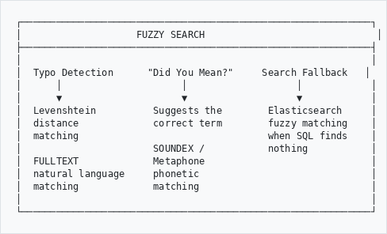
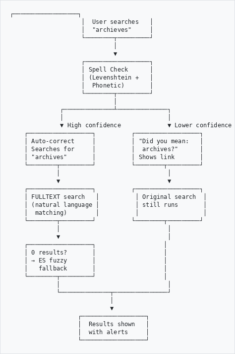
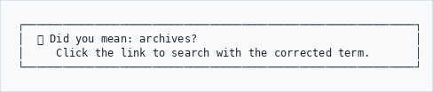
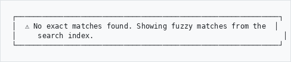
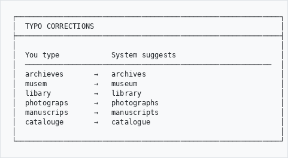
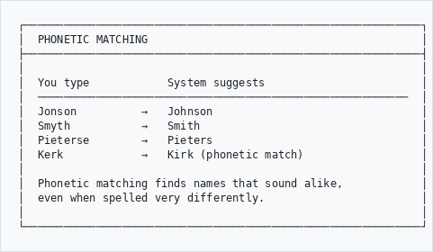
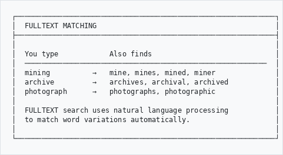
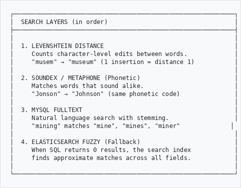
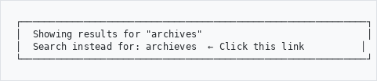
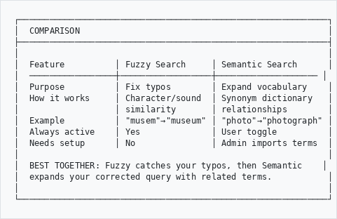

# Fuzzy Search (Typo-Tolerant Search)

## User Guide

Find records even when you misspell search terms. Fuzzy Search automatically detects typos and suggests corrections.

---

## Overview
```
┌─────────────────────────────────────────────────────────────┐
│                    FUZZY SEARCH                              │
├─────────────────────────────────────────────────────────────┤
│                                                             │
│  Typo Detection      "Did You Mean?"     Search Fallback   │
│      │                     │                   │            │
│      ▼                     ▼                   ▼            │
│  Levenshtein          Suggests the        Elasticsearch     │
│  distance             correct term        fuzzy matching    │
│  matching                                 when SQL finds    │
│                       SOUNDEX /           nothing           │
│  FULLTEXT             Metaphone                             │
│  natural language     phonetic                              │
│  matching             matching                              │
│                                                             │
└─────────────────────────────────────────────────────────────┘

```

---

## How It Works

When you search on the GLAM Browse page, fuzzy search runs automatically behind the scenes:

```
                    ┌──────────────────┐
                    │  User searches   │
                    │  "archieves"     │
                    └────────┬─────────┘
                             │
                             ▼
                    ┌──────────────────┐
                    │ Spell Check      │
                    │ (Levenshtein +   │
                    │  Phonetic)       │
                    └────────┬─────────┘
                             │
              ┌──────────────┴──────────────┐
              │                             │
              ▼ High confidence             ▼ Lower confidence
    ┌──────────────────┐          ┌──────────────────┐
    │ Auto-correct     │          │ "Did you mean:   │
    │ Searches for     │          │  archives?"      │
    │ "archives"       │          │ Shows link       │
    └────────┬─────────┘          └────────┬─────────┘
             │                              │
             ▼                              ▼
    ┌──────────────────┐          ┌──────────────────┐
    │ FULLTEXT search   │          │ Original search  │
    │ (natural language │          │ still runs       │
    │  matching)        │          │                  │
    └────────┬─────────┘          └────────┬─────────┘
             │                              │
             ▼                              │
    ┌──────────────────┐                   │
    │ 0 results?       │                   │
    │ → ES fuzzy       │                   │
    │   fallback       │                   │
    └────────┬─────────┘                   │
             │                              │
             └──────────────┬───────────────┘
                            │
                            ▼
                   ┌──────────────────┐
                   │  Results shown   │
                   │  with alerts     │
                   └──────────────────┘

```

---

## What You'll See

### "Did You Mean?" Suggestion

When fuzzy search detects a likely typo, you'll see a suggestion:

```
┌─────────────────────────────────────────────────────────────┐
│  ℹ️ Did you mean: archives?                                  │
│     Click the link to search with the corrected term.       │
└─────────────────────────────────────────────────────────────┘

```

Click the suggested term to re-run the search with the correction.

### Auto-Corrected Search

When the system is very confident about a correction, it automatically searches with the corrected term:

```
┌─────────────────────────────────────────────────────────────┐
│  ✅ Showing results for "archives"                           │
│     Search instead for: archieves                           │
└─────────────────────────────────────────────────────────────┘

```

Click "Search instead for" to see results for your original (uncorrected) term.

### Fuzzy Matches from Search Index

When no exact matches are found, the system uses the search index to find approximate matches:

```
┌─────────────────────────────────────────────────────────────┐
│  ⚠️ No exact matches found. Showing fuzzy matches from the  │
│     search index.                                            │
└─────────────────────────────────────────────────────────────┘

```

---

## Examples

### Spelling Mistakes
```
┌─────────────────────────────────────────────────────────────┐
│  TYPO CORRECTIONS                                           │
├─────────────────────────────────────────────────────────────┤
│                                                             │
│  You type            System suggests                        │
│  ─────────────────────────────────────────────────────────  │
│  archieves       →   archives                               │
│  musem           →   museum                                 │
│  libary          →   library                                │
│  photograps      →   photographs                            │
│  manuscrips      →   manuscripts                            │
│  catalouge       →   catalogue                              │
│                                                             │
└─────────────────────────────────────────────────────────────┘

```

### Phonetic Matching (Sounds-Like)
```
┌─────────────────────────────────────────────────────────────┐
│  PHONETIC MATCHING                                          │
├─────────────────────────────────────────────────────────────┤
│                                                             │
│  You type            System suggests                        │
│  ─────────────────────────────────────────────────────────  │
│  Jonson          →   Johnson                                │
│  Smyth           →   Smith                                  │
│  Pieterse        →   Pieters                                │
│  Kerk            →   Kirk (phonetic match)                  │
│                                                             │
│  Phonetic matching finds names that sound alike,            │
│  even when spelled very differently.                        │
│                                                             │
└─────────────────────────────────────────────────────────────┘

```

### Stemming and Natural Language
```
┌─────────────────────────────────────────────────────────────┐
│  FULLTEXT MATCHING                                          │
├─────────────────────────────────────────────────────────────┤
│                                                             │
│  You type            Also finds                             │
│  ─────────────────────────────────────────────────────────  │
│  mining          →   mine, mines, mined, miner              │
│  archive         →   archives, archival, archived           │
│  photograph      →   photographs, photographic              │
│                                                             │
│  FULLTEXT search uses natural language processing           │
│  to match word variations automatically.                    │
│                                                             │
└─────────────────────────────────────────────────────────────┘

```

---

## Search Layers

Fuzzy search combines four techniques for maximum coverage:

```
┌─────────────────────────────────────────────────────────────┐
│  SEARCH LAYERS (in order)                                   │
├─────────────────────────────────────────────────────────────┤
│                                                             │
│  1. LEVENSHTEIN DISTANCE                                    │
│     Counts character-level edits between words.             │
│     "musem" → "museum" (1 insertion = distance 1)           │
│                                                             │
│  2. SOUNDEX / METAPHONE (Phonetic)                          │
│     Matches words that sound alike.                         │
│     "Jonson" → "Johnson" (same phonetic code)               │
│                                                             │
│  3. MYSQL FULLTEXT                                          │
│     Natural language search with stemming.                  │
│     "mining" matches "mine", "mines", "miner"              │
│                                                             │
│  4. ELASTICSEARCH FUZZY (Fallback)                          │
│     When SQL returns 0 results, the search index            │
│     finds approximate matches across all fields.            │
│                                                             │
└─────────────────────────────────────────────────────────────┘

```

---

## Disabling Fuzzy Correction

If you want to search for your exact term without correction:

1. After a corrected search, click **"Search instead for: [original term]"**
2. This adds `noCorrect=1` to the URL, bypassing correction

```
┌─────────────────────────────────────────────────────────────┐
│  Showing results for "archives"                             │
│  Search instead for: archieves  ← Click this link          │
└─────────────────────────────────────────────────────────────┘

```

---

## Fuzzy Search vs. Semantic Search

Fuzzy search and semantic search are complementary features:

```
┌─────────────────────────────────────────────────────────────┐
│  COMPARISON                                                 │
├─────────────────────────────────────────────────────────────┤
│                                                             │
│  Feature          │ Fuzzy Search     │ Semantic Search      │
│  ─────────────────┼──────────────────┼──────────────────── │
│  Purpose          │ Fix typos        │ Expand vocabulary    │
│  How it works     │ Character/sound  │ Synonym dictionary   │
│                   │ similarity       │ relationships        │
│  Example          │ "musem"→"museum" │ "photo"→"photograph" │
│  Always active    │ Yes              │ User toggle          │
│  Needs setup      │ No               │ Admin imports terms  │
│                                                             │
│  BEST TOGETHER: Fuzzy catches your typos, then Semantic    │
│  expands your corrected query with related terms.           │
│                                                             │
└─────────────────────────────────────────────────────────────┘

```

---

## Troubleshooting
```
Problem                          Solution
───────────────────────────────────────────────────────────
Wrong suggestion shown       →   Click "Search instead for"
                                 to use your original term

No suggestion offered        →   The term may be too different
                                 from any known vocabulary
                                 Try a different spelling

Results still empty          →   The search index may need
                                 rebuilding. Contact your
                                 system administrator.

Suggestion is a different    →   Fuzzy search matches against
word entirely                    known vocabulary. The closest
                                 match may not be what you want.
                                 Use "Search instead for" link.
```

---

## Need Help?

Contact your system administrator or archivist if you need assistance finding records.

---

*Part of the AtoM AHG Framework*
*Last Updated: February 2026*
