# Gallery Module

## User Guide

Catalog visual artworks using CCO (Cataloging Cultural Objects) standards for paintings, sculptures, photographs, and other art objects.

---

## Overview
```
┌─────────────────────────────────────────────────────────────┐
│                      GALLERY MODULE                         │
├─────────────────────────────────────────────────────────────┤
│                                                             │
│  🎨 Paintings     🗿 Sculptures    📷 Photographs           │
│     │                │                │                     │
│     ▼                ▼                ▼                     │
│  Oil, Acrylic    Bronze, Stone    Prints, Digital           │
│  Watercolor      Wood, Metal      Negatives                 │
│  Mixed Media     Installation     Albums                    │
│                                                             │
└─────────────────────────────────────────────────────────────┘
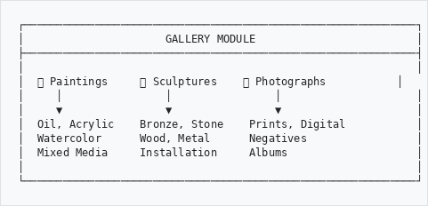
```

---

## When to Use Gallery Module
```
┌─────────────────────────────────────────────────────────────┐
│  USE GALLERY MODULE FOR:                                    │
├─────────────────────────────────────────────────────────────┤
│                                                             │
│  🎨 Paintings (oil, acrylic, watercolor, tempera)           │
│  🗿 Sculptures (bronze, stone, wood, mixed media)           │
│  📷 Fine art photography                                    │
│  🖼️  Prints and editions (lithographs, etchings, serigraphs)│
│  ✏️  Drawings and sketches                                   │
│  🎭 Installation art                                        │
│  📹 Video art and new media                                 │
│  🏺 Decorative arts with artistic merit                     │
│                                                             │
└─────────────────────────────────────────────────────────────┘
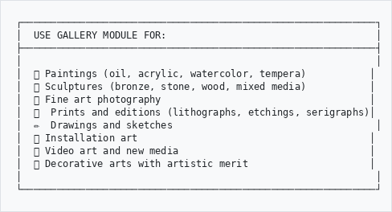
```

---

## How to Access
```
  Main Menu
      │
      ▼
   GLAM/DAM
      │
      ▼
   Gallery ───────────────────────────────────────────────────┐
      │                                                        │
      ├──▶ Browse Artworks     (view collection)               │
      │                                                        │
      ├──▶ Add Artwork         (create new record)             │
      │                                                        │
      ├──▶ Artists             (authority records)             │
      │                                                        │
      └──▶ Exhibitions         (exhibition history)            │
```

---

## Adding an Artwork

### Step 1: Click Add Artwork

Go to **GLAM/DAM** → **Gallery** → **Add**

### Step 2: Choose Work Type
```
┌─────────────────────────────────────────────────────────────┐
│  SELECT WORK TYPE                                           │
├─────────────────────────────────────────────────────────────┤
│                                                             │
│  ○ Painting                                                 │
│  ○ Sculpture                                                │
│  ○ Drawing                                                  │
│  ○ Print                                                    │
│  ○ Photograph                                               │
│  ○ Mixed Media                                              │
│  ○ Installation                                             │
│  ○ Video / New Media                                        │
│  ○ Decorative Art                                           │
│                                                             │
└─────────────────────────────────────────────────────────────┘
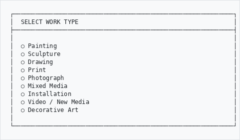
```

### Step 3: Fill in the Form
```
┌─────────────────────────────────────────────────────────────┐
│  ADD ARTWORK                                                │
├─────────────────────────────────────────────────────────────┤
│                                                             │
│  OBJECT IDENTIFICATION                                      │
│  ─────────────────────────────────────────────────────────  │
│  Accession Number: [GAL-2025-00089           ]              │
│  Title:            [Sunset over Table Mountain]              │
│  Title Type:       [Original Title           ▼]             │
│  Other Titles:     [                         ]              │
│                                                             │
│  CLASSIFICATION                                             │
│  ─────────────────────────────────────────────────────────  │
│  Work Type:        [Painting                 ▼]             │
│  Classification:   [Landscape                ▼]             │
│                                                             │
│  CREATION                                                   │
│  ─────────────────────────────────────────────────────────  │
│  Artist:           [Pierneef, Jacob Hendrik  ] [Select]     │
│  Role:             [Artist                   ▼]             │
│  Attribution:      [Attributed to            ▼]             │
│                                                             │
│  Date Created:     [1928                     ]              │
│  Date Display:     [circa 1928               ]              │
│                                                             │
└─────────────────────────────────────────────────────────────┘
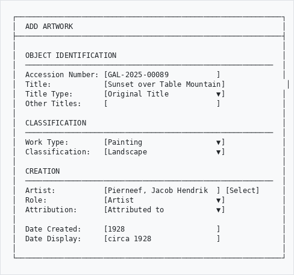
```

---

## Key CCO Fields Explained

### Object Identification
```
┌─────────────────────────────────────────────────────────────┐
│  FIELD             │  WHAT TO ENTER                         │
├────────────────────┼────────────────────────────────────────┤
│  Accession Number  │  Unique collection identifier          │
│  Title             │  Name of the artwork                   │
│  Title Type        │  Original, translated, popular, etc.   │
│  Other Titles      │  Alternative names                     │
│  Work Type         │  Painting, sculpture, print, etc.      │
└────────────────────┴────────────────────────────────────────┘
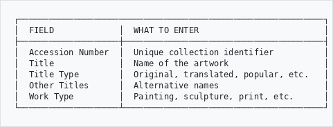
```

### Creator Information
```
┌─────────────────────────────────────────────────────────────┐
│  CREATOR                                                    │
├─────────────────────────────────────────────────────────────┤
│                                                             │
│  Artist:          [Pierneef, Jacob Hendrik     ] [Select]   │
│                                                             │
│  Role:            [Artist                    ▼]             │
│                   • Artist                                  │
│                   • Printmaker                              │
│                   • Sculptor                                │
│                   • Photographer                            │
│                                                             │
│  Attribution:     [Attributed to             ▼]             │
│                   • By (certain)                            │
│                   • Attributed to                           │
│                   • Workshop of                             │
│                   • Circle of                               │
│                   • Follower of                             │
│                   • Manner of                               │
│                   • After                                   │
│                   • Unknown                                 │
│                                                             │
│  [+ Add Another Creator]                                    │
│                                                             │
└─────────────────────────────────────────────────────────────┘
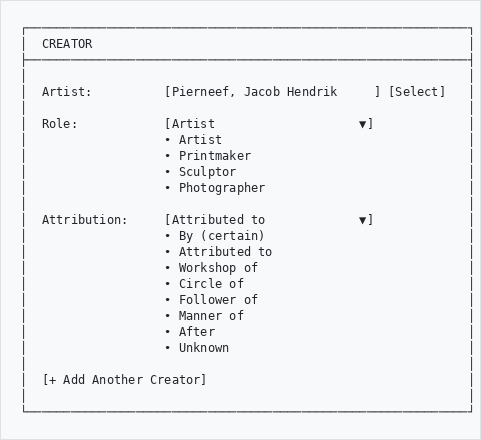
```

### Physical Description
```
┌─────────────────────────────────────────────────────────────┐
│  PHYSICAL DESCRIPTION                                       │
├─────────────────────────────────────────────────────────────┤
│                                                             │
│  MATERIALS & TECHNIQUES                                     │
│  Medium:          [Oil on canvas             ]              │
│  Support:         [Canvas                    ]              │
│  Technique:       [Impasto                   ]              │
│                                                             │
│  DIMENSIONS                                                 │
│  Height:          [90         ] cm   (unframed)             │
│  Width:           [120        ] cm                          │
│                                                             │
│  Framed Height:   [110        ] cm                          │
│  Framed Width:    [140        ] cm                          │
│  Framed Depth:    [8          ] cm                          │
│                                                             │
│  INSCRIPTIONS                                               │
│  Signature:       [Signed lower right: "J.H. Pierneef"]     │
│  Date on Work:    [1928                      ]              │
│  Other Marks:     [Gallery label verso       ]              │
│                                                             │
└─────────────────────────────────────────────────────────────┘
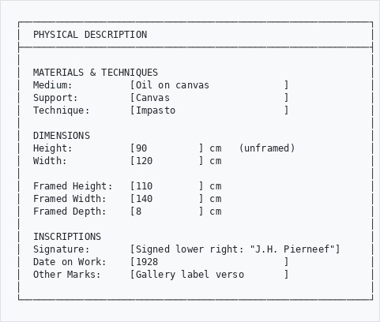
```

---

## Subject Matter

Describe what the artwork depicts:
```
┌─────────────────────────────────────────────────────────────┐
│  SUBJECT                                                    │
├─────────────────────────────────────────────────────────────┤
│                                                             │
│  Subject Type:    [Landscape                 ▼]             │
│                   • Portrait                                │
│                   • Landscape                               │
│                   • Still Life                              │
│                   • Abstract                                │
│                   • Religious                               │
│                   • Historical                              │
│                   • Genre Scene                             │
│                                                             │
│  Depicted Place:  [Table Mountain, Cape Town  ]             │
│                                                             │
│  Subject Terms:                                             │
│  ┌─────────────────────────────────────────────────────┐   │
│  │ Mountains                                       [×] │   │
│  │ Sunset                                          [×] │   │
│  │ South African landscape                         [×] │   │
│  └─────────────────────────────────────────────────────┘   │
│  [+ Add Subject]                                            │
│                                                             │
│  Description:                                               │
│  [Panoramic view of Table Mountain at sunset, with         ]│
│  [characteristic flat-topped silhouette against orange     ]│
│  [and purple sky. Foreground shows Cape fynbos vegetation. ]│
│                                                             │
└─────────────────────────────────────────────────────────────┘
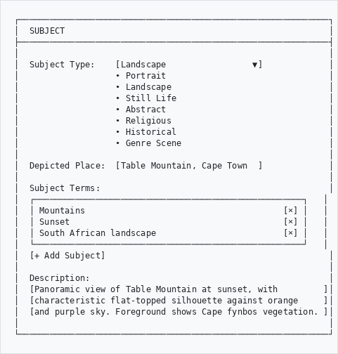
```

---

## Provenance (Ownership History)
```
┌─────────────────────────────────────────────────────────────┐
│  PROVENANCE                                                 │
├─────────────────────────────────────────────────────────────┤
│                                                             │
│  Ownership History:                                         │
│                                                             │
│  1. Artist's studio (1928)                                  │
│  2. Commissioned by mining magnate J. Robinson (1928-1945)  │
│  3. Private collection, Johannesburg (1945-1980)            │
│  4. Sotheby's auction, London, 15 May 1980, lot 45          │
│  5. Corporate collection, Standard Bank (1980-2015)         │
│  6. Donated to gallery (2015)                               │
│                                                             │
│  [+ Add Provenance Entry]                                   │
│                                                             │
│  ─────────────────────────────────────────────────────────  │
│  Acquisition Method:   [Donation             ▼]             │
│  Acquisition Date:     [01 June 2015          ]             │
│  Acquisition Source:   [Standard Bank Art Collection]       │
│  Credit Line:          [Gift of Standard Bank, 2015]        │
│                                                             │
└─────────────────────────────────────────────────────────────┘
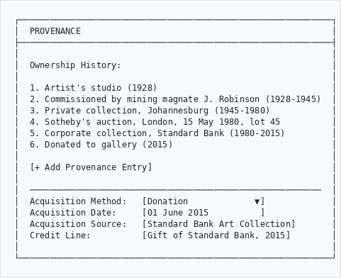
```

---

## Exhibition History

Track where the artwork has been displayed:
```
┌─────────────────────────────────────────────────────────────┐
│  EXHIBITION HISTORY                                         │
├─────────────────────────────────────────────────────────────┤
│                                                             │
│  Past Exhibitions:                                          │
│                                                             │
│  ┌─────────────────────────────────────────────────────┐   │
│  │ "Pierneef: Master of the South African Landscape"   │   │
│  │ Iziko South African National Gallery                │   │
│  │ 15 March - 30 June 2020                             │   │
│  │ Catalogue no. 45                                    │   │
│  └─────────────────────────────────────────────────────┘   │
│                                                             │
│  ┌─────────────────────────────────────────────────────┐   │
│  │ "South African Art: 1850-1950"                      │   │
│  │ Johannesburg Art Gallery                            │   │
│  │ 01 September - 15 December 2018                     │   │
│  └─────────────────────────────────────────────────────┘   │
│                                                             │
│  [+ Add Exhibition]                                         │
│                                                             │
└─────────────────────────────────────────────────────────────┘
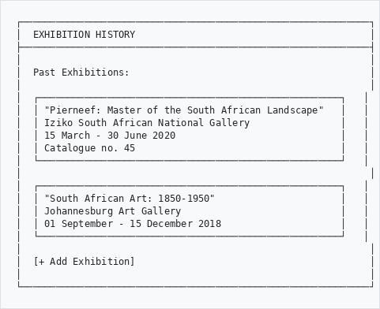
```

---

## Prints and Editions

For multiples (prints, photographs, sculptures):
```
┌─────────────────────────────────────────────────────────────┐
│  EDITION INFORMATION                                        │
├─────────────────────────────────────────────────────────────┤
│                                                             │
│  Edition Number:   [15/50                    ]              │
│  Edition Size:     [50                       ]              │
│  Edition Type:     [Limited Edition          ▼]             │
│                    • Unique                                 │
│                    • Limited Edition                        │
│                    • Artist's Proof (A/P)                   │
│                    • Printer's Proof (P/P)                  │
│                    • Open Edition                           │
│                                                             │
│  Printer/Foundry:  [The Artists' Press       ]              │
│  Print Date:       [1985                     ]              │
│                                                             │
└─────────────────────────────────────────────────────────────┘
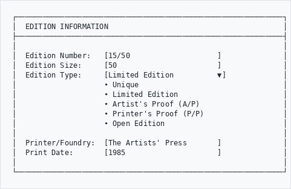
```

---

## Condition and Conservation
```
┌─────────────────────────────────────────────────────────────┐
│  CONDITION                                                  │
├─────────────────────────────────────────────────────────────┤
│                                                             │
│  Overall Condition:  [Good                  ▼]              │
│                                                             │
│  Condition Notes:                                           │
│  [Minor craquelure in sky area, consistent with age.       ]│
│  [Frame shows some wear to gilt on corners.                ]│
│  [Varnish slightly yellowed - consider cleaning.           ]│
│                                                             │
│  Conservation History:                                      │
│  ┌─────────────────────────────────────────────────────┐   │
│  │ 2010 - Cleaned and revarnished by J. Conservator   │   │
│  │ 1995 - Reframed (original frame preserved)         │   │
│  └─────────────────────────────────────────────────────┘   │
│                                                             │
│  [+ Add Conservation Treatment]                             │
│                                                             │
└─────────────────────────────────────────────────────────────┘
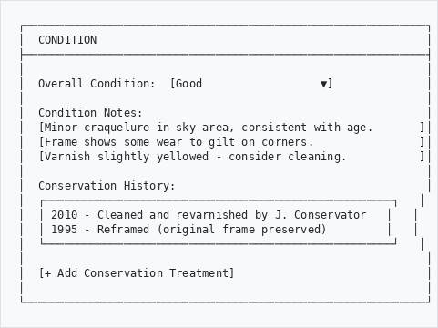
```

---

## Related Works

Link to related artworks:
```
┌─────────────────────────────────────────────────────────────┐
│  RELATED WORKS                                              │
├─────────────────────────────────────────────────────────────┤
│                                                             │
│  Related Works in Collection:                               │
│                                                             │
│  • Study for Sunset (GAL-2025-00045) - Preparatory sketch   │
│  • Table Mountain, Morning (GAL-2020-00123) - Companion     │
│                                                             │
│  Related Works Elsewhere:                                   │
│                                                             │
│  • Similar composition at Pretoria Art Museum               │
│  • Study in private collection, London                      │
│                                                             │
│  [+ Add Related Work]                                       │
│                                                             │
└─────────────────────────────────────────────────────────────┘
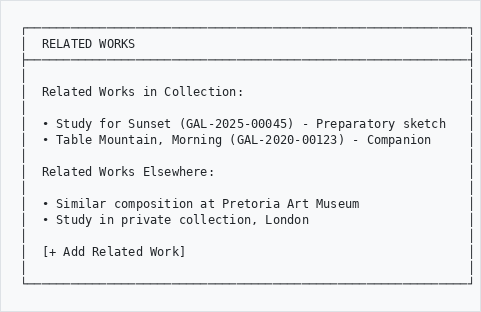
```

---

## Tips for Cataloging Art
```
┌────────────────────────────────────────────────────────────┐
│  ✓ DO                          │  ✗ DON'T                  │
├────────────────────────────────┼────────────────────────────┤
│  Use controlled vocabularies   │  Invent terminology       │
│  Note attribution level        │  Assume certainty         │
│  Include all inscriptions      │  Skip signatures/marks    │
│  Record both framed/unframed   │  Only measure one way     │
│  Document provenance fully     │  Leave gaps in history    │
│  Link to artist authority      │  Create duplicate artists │
│  Photograph recto and verso    │  Only capture front       │
└────────────────────────────────┴────────────────────────────┘
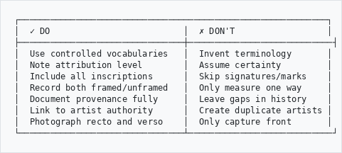
```

---

## Optional Features

Some sidebar and admin menu items only appear when the corresponding plugins are enabled on your system. If you don't see a feature listed below, ask your administrator to enable the plugin.

| Feature | Requires Plugin |
|---------|----------------|
| Provenance (CCO) | ahgProvenancePlugin |
| Condition Assessment | ahgConditionPlugin |
| SPECTRUM Procedures | ahgSpectrumPlugin |
| Heritage Accounting (GRAP) | ahgHeritageAccountingPlugin |
| Digital Preservation (OAIS) | ahgPreservationPlugin |
| Research Requests | ahgResearchPlugin |

---

## Need Help?

Contact your system administrator or curator if you need assistance.

---

*Part of the AtoM AHG Framework*
*Last Updated: February 2026*
