# Harris Matrix user guide

The Harris Matrix in Heratio is an analytical object, not a drawing. It records which
context is later than which, checks that the record makes sense, and moves that
sequence in and out of the other tools an excavation uses. This guide covers all of
it: recording relationships, reading the consistency report, and the four import and
three export formats.

Screenshots come from the Heratio demo at `heratio.org`, using the Blaauwbosch Farm
demonstration dig (`BLB-2026`).

**Who this is for.** Excavators and post-excavation staff entering or checking
stratigraphy, and anyone moving a site archive between Heratio and BASP Harris,
Stratify, ArchEd, PHASER or a Data Package consumer.

**What you need.** An account with update permission on the archaeology module. The
Harris Matrix pages sit behind login. Everything below assumes the `ahg-archaeology`
module is installed; the Harris Matrix plugin reads its tables and adds none of its
own.

---

## 1. The ideas behind the screens

Three distinctions do most of the work, and the software takes all three seriously.

**A context is a single recorded event.** A layer of ash, a wall, a pit. Contexts get
a number, and that number is how every other part of the system refers to them.

**Deposits and interfaces are not the same kind of thing.** Harris divided
stratigraphic units into deposits, which are bodies of material, and interfaces,
which are surfaces left by removal. A cut is an interface. It is not a thin deposit.
Heratio treats context types named `Cut` or `Interface` as interfaces and everything
else recorded here as a deposit, and it matches on the type's name rather than on an
id, because a taxonomy term created by the seeder gets whatever id that particular
installation handed out.

**A relationship is one observation, stored twice.** When you record that 1001 is
above 1002, Heratio also writes that 1002 is below 1001. Both rows exist so that
either context can be read on its own, but they are a single statement made by the
excavator. This matters later: the CSV export deliberately emits 22 rows for the 44
stored on Blaauwbosch, because 22 is the number of observations that were actually
made.

### The nine relationship types

| Type | Reads as | Reciprocal | Direction |
|---|---|---|---|
| `above` | is above | `below` | later |
| `below` | is below | `above` | earlier |
| `cuts` | cuts | `cut_by` | later |
| `cut_by` | is cut by | `cuts` | earlier |
| `fills` | fills | `filled_by` | later |
| `filled_by` | is filled by | `fills` | earlier |
| `same_as` | is the same as | `same_as` | none |
| `bonds_with` | bonds with | `bonds_with` | none |
| `abuts` | abuts | `abuts` | none |

The directional six carry the sequence. The symmetric three assert a relation without
ordering: `same_as` says two records describe one unit, while `bonds_with` and `abuts`
both assert physical contact.

There is no `contemporary_with`. That is deliberate and is explained in section 5.

---

## 2. Finding the stratigraphy

The archaeology module lives at **Archaeology** in the main navigation.

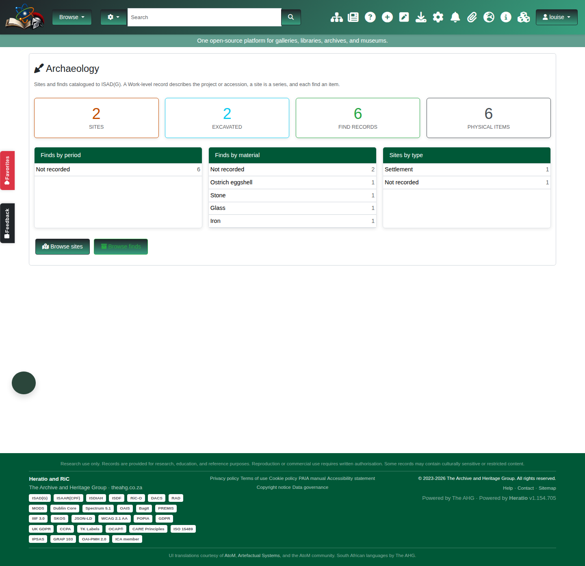

**Sites** lists the excavations recorded on this installation.

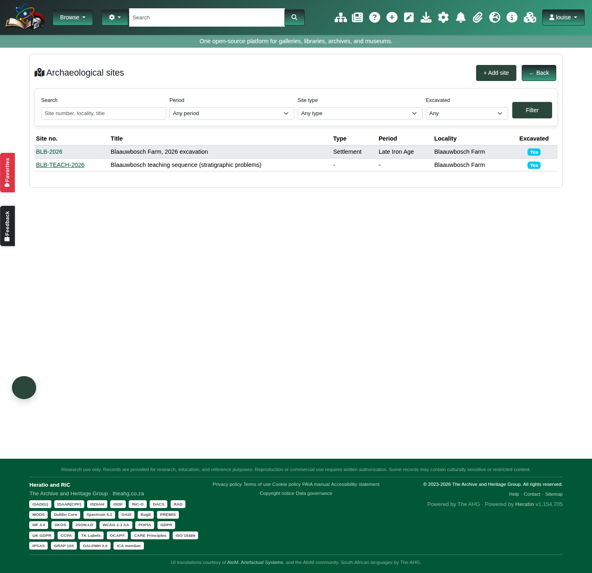

Opening a site shows its record, its location, and links through to its contexts.

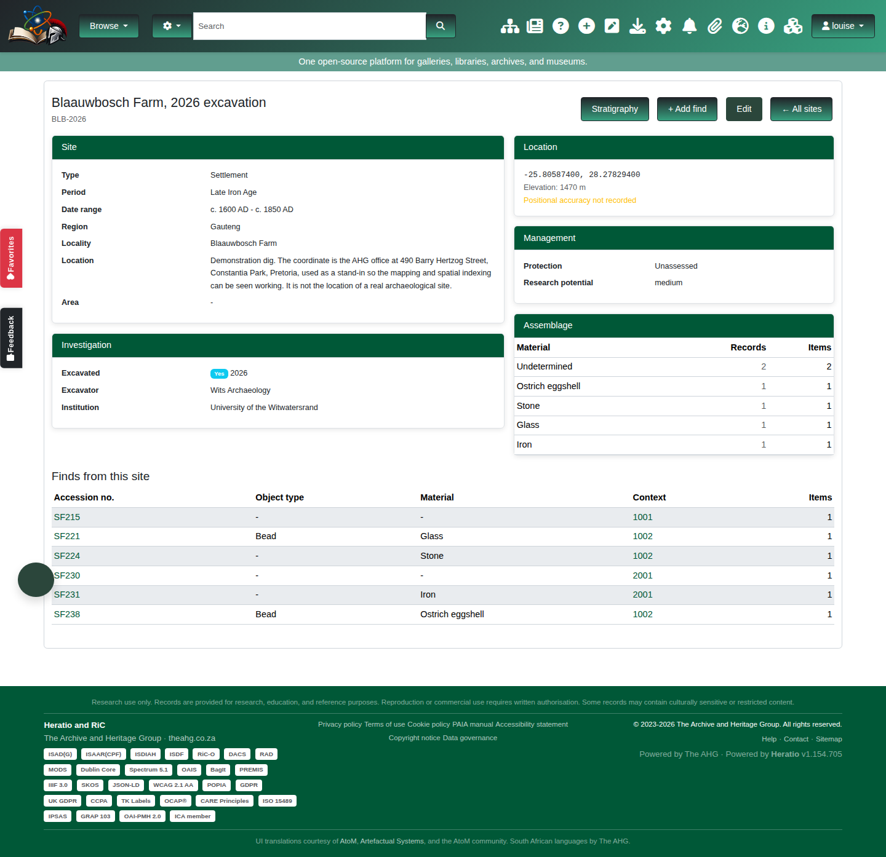

**Stratigraphy** is the context list for one site. This is where relationships are
entered and where the matrix is assembled.

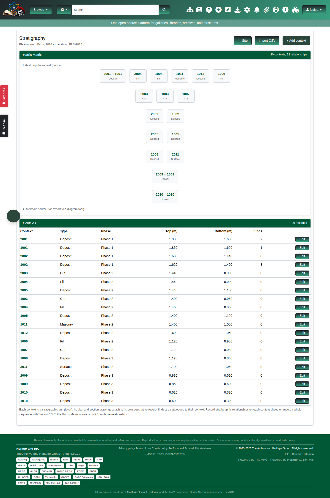

Each context also has its own record, with its description, interpretation,
elevations, excavation details, relationships and any finds tied to it. A printable
context sheet is available from here.

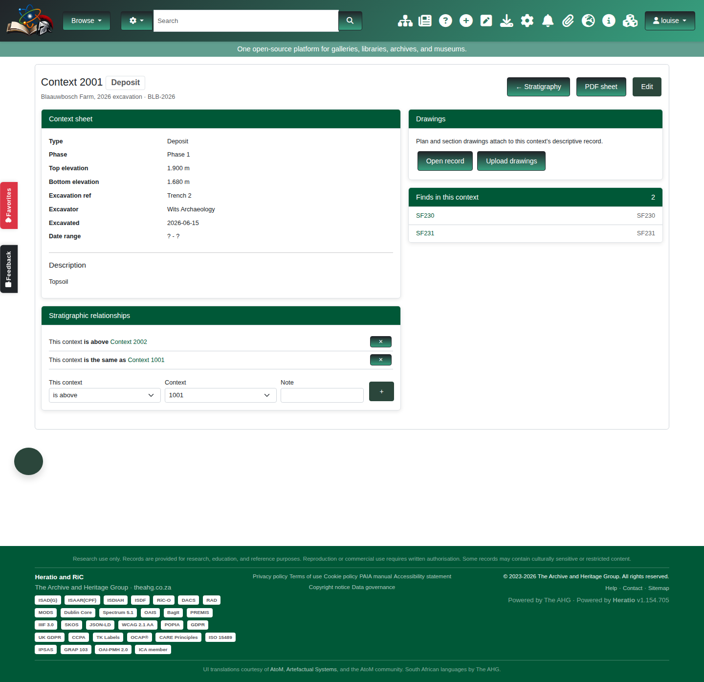

---

## 3. Recording relationships by hand

On the stratigraphy page, choose the two contexts and the relationship between them.
Three things happen that are worth knowing about.

**The reciprocal is written for you.** Record `1001 above 1002` and `1002 below 1001`
appears without being asked for. Never enter both halves yourself.

**A context cannot relate to itself.** Refused outright.

**A relationship that would close a loop is refused.** If 1001 is already later than
1002, Heratio will not accept anything that also makes 1002 later than 1001. A
sequence containing a loop cannot be ordered, so the matrix cannot be drawn at all.
Better to refuse the entry than to accept it and produce an undrawable matrix.

> **One gap to know about.** The loop guard checks *directional* relationships. A
> `same_as` between two contexts that are already superposed can still introduce a
> contradiction, because `same_as` has no direction of its own to check. The
> consistency report catches this afterwards and reports it as a loop, which is what
> the teaching example in section 5 demonstrates.

---

## 4. Importing a sequence

Heratio reads four things. Which one you want depends on where the sequence is
coming from.

| Source | Format | Where |
|---|---|---|
| Contexts and their relationships together | Context CSV | Stratigraphy → Import contexts |
| BASP Harris, Stratify, ArchEd | LST | Consistency page → Import LST |
| PHASER, or a spreadsheet of relationships | Relationship CSV | Consistency page → Import relationships CSV |
| Another Heratio site | Relationship CSV | Export from one, import to the other |

### Preview always comes first

Every importer previews before it writes, and the preview is not an estimate. It is
the real import, run inside a database transaction that is then rolled back. The
counts and the refusals you see are the ones a commit would produce, because they
came from the same code doing the same work. Nothing is written until you upload the
file a second time and press **Commit import**.

### Context CSV

Contexts and their relationships in one file. Download the template, fill it in, and
the relationship columns (`above`, `below`, `cuts`, `cut_by`, `fills`, `filled_by`,
`same_as`, `bonds_with`, `abuts`) take one or more context numbers.

The import runs in two passes: every context is created or updated first, then the
relationship columns are resolved. That is why a row may safely name a context
defined further down the same file.

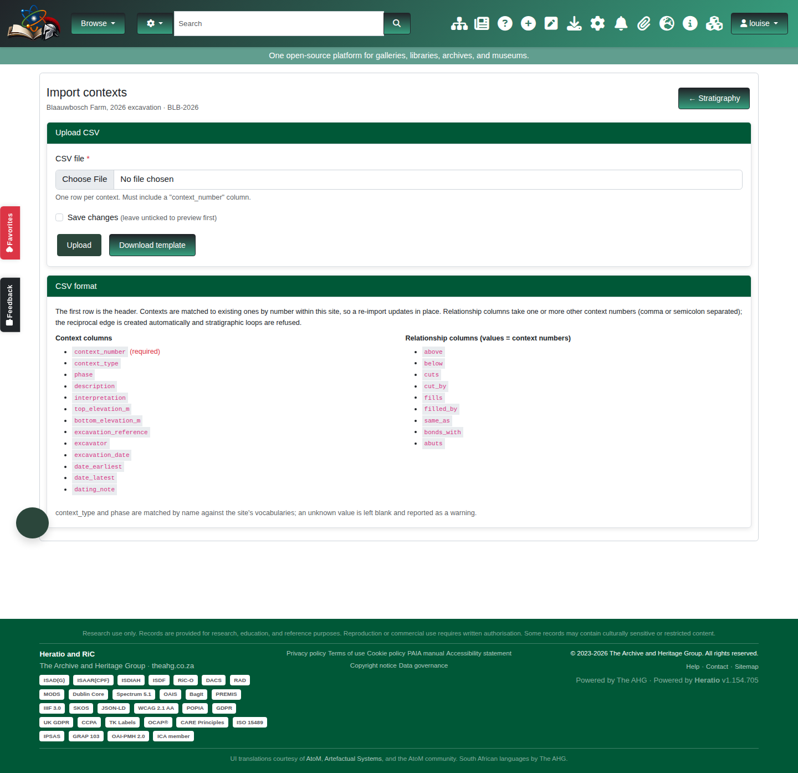

### LST

LST is what BASP Harris, Stratify and ArchEd write, so it is usually how an existing
site archive arrives. The parser skips three header lines, then advances in blocks of
five: a unit name followed by exactly four relationship lines, in the order `above`,
`contemporary_with`, `equal_to`, `below`. All four lines are always present, which is
why the parser never has to guess what it is reading.

Units are matched to existing contexts by context number. **Import the contexts
first.** Anything unmatched is listed by name on the preview rather than dropped
quietly, because an import that silently discarded half a site archive would look
exactly like a success.

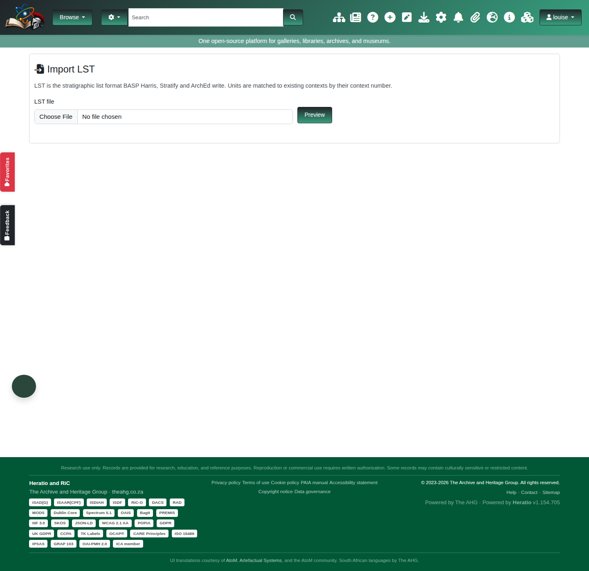

### Relationship CSV

Four columns, as PHASER writes them:

```
siteCode,sourceID,stratRelationship,targetID
BLB-2026,1002,above,1005
```

Download the template from the import page, or export an existing site to see the
shape.

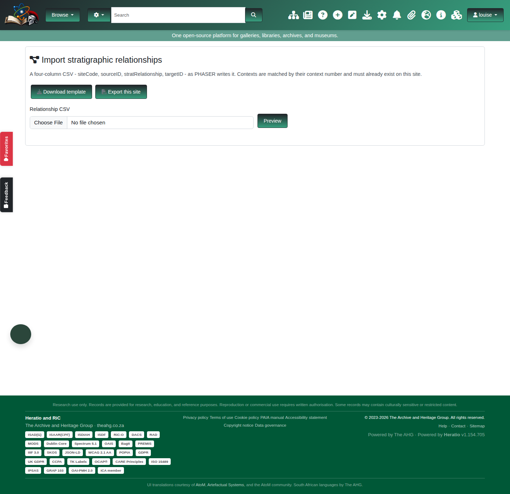

`siteCode` is read but is never used to *choose* the site. You already picked the
site; silently importing into whatever a file names is how one excavation's
stratigraphy ends up written into another's. Rows naming a different code are counted
and reported separately, so a file covering several digs says so rather than
appearing to import cleanly.

---

## 5. What the importer refuses, and why

This is the preview of a deliberately flawed file. Every refusal is named with its
line number.

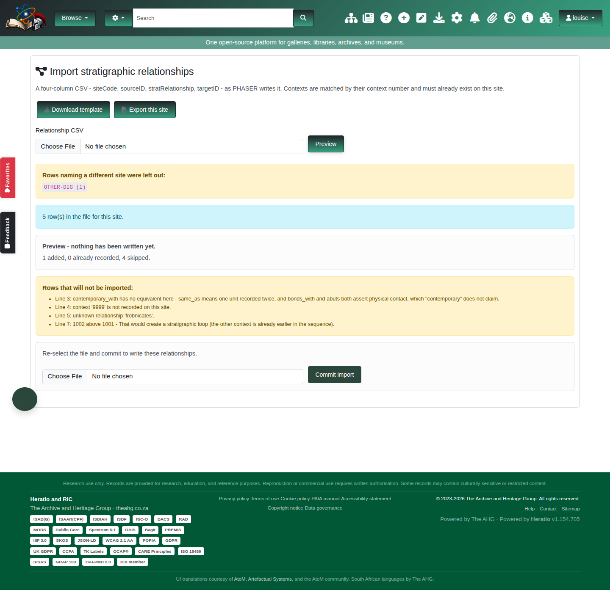

Reading it line by line:

**Rows naming a different site were left out: `OTHER-DIG (1)`.** Reported above the
result, not buried in the warnings.

**`contemporary_with` has no equivalent here.** This is the one refusal that is a
judgement rather than a validation. Heratio records `same_as`, meaning one unit
written down twice, and `bonds_with` and `abuts`, which both assert physical contact.
"Contemporary with" claims none of those. It is a chronological statement about two
distinct units. Mapping it to `same_as` would merge contexts that are not the same
context, so it is reported and left out. LST import treats it the same way and counts
the pairs it saw.

**`context '9999' is not recorded on this site`.** Context numbers are matched, never
created, by a relationship import.

**`unknown relationship 'frobnicates'`.** The name did not resolve to one of the nine
types.

**`That would create a stratigraphic loop`.** The same guard that protects typed
entry. An import cannot introduce a contradiction the form itself would have refused,
because both paths now go through the same code.

### Spellings that are understood

Separators are folded before matching, so `cut by`, `cut_by` and `Cut-By` are one
thing. On top of that:

| You write | Heratio records |
|---|---|
| later, later than, over, overlies | `above` |
| earlier, earlier than, under, underlies | `below` |
| equal, equal to, equals, same as, correlates with | `same_as` |
| butts, abuts against | `abuts` |
| bonds with | `bonds_with` |
| cut by | `cut_by` |
| filled by | `filled_by` |

### Re-importing is safe

A relationship that is already recorded counts as a duplicate, not a failure.
Re-importing the same file reports every row as already recorded and changes nothing.
Exporting Blaauwbosch and importing it straight back gives 0 added, 22 already
recorded, 0 warnings.

---

## 6. The consistency report

Cycle detection alone only catches the error that makes a matrix impossible to draw.
The consistency report looks for the errors that leave you with a matrix that can be
drawn and is wrong.

Reach it from the site's stratigraphy page. A correctly recorded site reports nothing
and says which checks it ran.

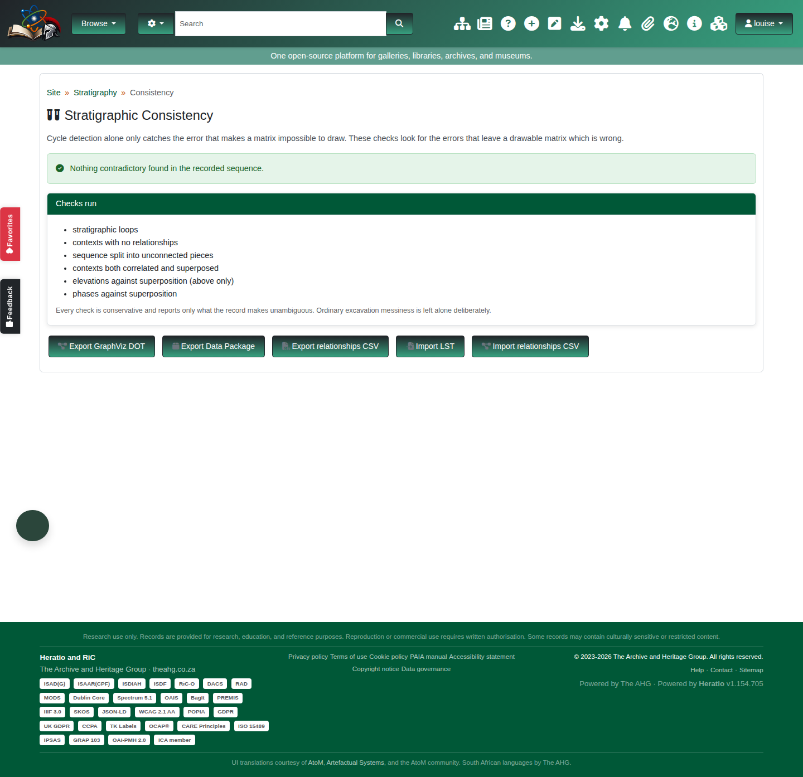

The demo also carries a teaching site, `BLB-TEACH-2026`, recorded wrong on purpose so
the report has something to find.

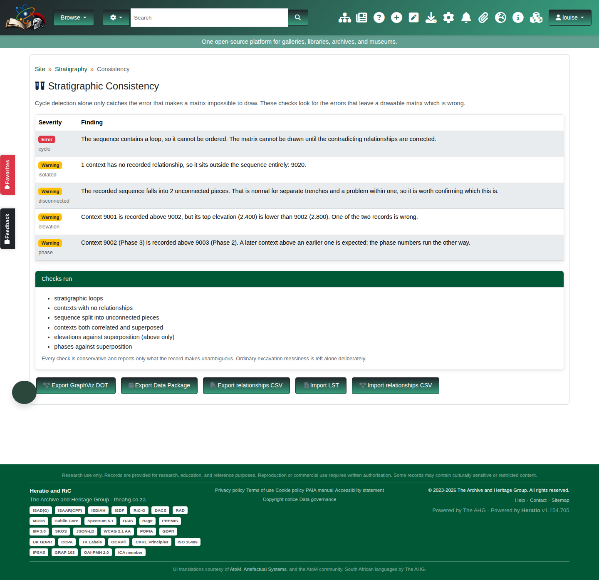

### The six checks

**Stratigraphic loops** (Error). The sequence contradicts itself and cannot be
ordered. Nothing else can be trusted until this is fixed. In the teaching site the
loop comes from a `same_as` recorded between two contexts that are also superposed.

**Contexts with no relationships** (Warning). The context sits outside the sequence
entirely. Sometimes correct for an unstratified find; usually it means the
relationships were never entered.

**Sequence split into unconnected pieces** (Warning). The record falls into separate
groups with nothing joining them. Normal for separate trenches, a problem within one
trench, and the report says so rather than guessing which you have. The check is
deliberately undirected: the question is whether the record ties the dig together at
all, not which way any single relationship runs.

**Contexts both correlated and superposed** (Warning). `same_as` says two contexts are
one unit; `above` says one is later than the other. Both cannot be true.

**Elevations against superposition** (Warning). Only `above` is checked, and only
where both elevations are recorded. A context above another should not start below
it. In the example, 9001 is recorded above 9002 but its top elevation is 2.400
against 9002's 2.800, so one of the two records is wrong.

**Phases against superposition** (Warning). Only flagged where both phase labels lead
with a number and they sort the wrong way round. The example has 9002 (Phase 3)
recorded above 9003 (Phase 2).

### Why the report is quiet

Every check is conservative and reports only what the data makes unambiguous.
Contexts with no phase are ignored, because an unphased context is not a
contradiction, it is simply not interpreted yet. Elevation checks skip anything less
than clear-cut. This is a deliberate trade: a report that cried wolf over ordinary
excavation messiness would be switched off within a week, and would then catch
nothing at all.

---

## 7. Exporting

Three formats, all from the consistency page.

### GraphViz DOT

The reduced matrix as a `digraph`, for rendering with GraphViz or editing in any tool
that reads DOT.

```
dot -Tpdf harris-site-2.dot -o matrix.pdf
```

### Harris Matrix Data Package

A Frictionless tabular data package following Thomas Dye's `hm` table schema, which
the Harris Matrix Data Package specification builds on. Two resources:

- `contexts` - label, unit type, position, period, phase, url
- `observations` - younger, older, url

`observations` carries no relation-type column. That is the format's design, not a
loss in this implementation: nine relation types reduce to later-than pairs, which is
what the schema asks for. Please do not "fix" it.

### Relationship CSV

The same four-column format the importer reads, so it is also how you copy a sequence
from one Heratio site to another.

**One row per logical relationship.** Blaauwbosch stores 44 relationship rows and
exports 22. The table holds both directions of every relationship, so emitting every
stored row would hand a consumer 44 statements where the excavator made 22. For
directional types the later-than direction is kept, because that is the one carrying
the sequence. Symmetric types are canonicalised on the sorted pair, since neither
direction is preferable.

---

## 8. Troubleshooting

**The Harris Matrix menu or pages are not there.** The plugin is guarded on the base
archaeology module and registers nothing without it. If archaeology is switched off
for this instance, the Harris Matrix goes with it, which is correct. If archaeology
is present and the pages still 404, the plugin's autoload entry may not have been
applied on this installation.

**Everything imported but nothing appears.** Check that you imported *contexts*
before *relationships*. A relationship import matches context numbers and never
creates them, and the preview lists every unmatched number.

**The preview shows rows added, but the numbers do not change.** A preview never
writes. Upload the file again and press **Commit import**.

**A relationship was refused as a loop and you believe it is correct.** Then something
already recorded is wrong. Run the consistency report and fix the existing
contradiction first, rather than trying to force the new relationship in.

**The report says the sequence is in unconnected pieces.** If the site has more than
one trench, that is expected. Within a single trench it means relationships are
missing between the groups.

---

## 9. Quick reference

| Task | Where |
|---|---|
| Enter a relationship | Stratigraphy page for the site |
| Check the record | Stratigraphy → Stratigraphic Consistency |
| Import contexts + relationships | Stratigraphy → Import contexts (CSV) |
| Import from BASP Harris / Stratify / ArchEd | Consistency page → Import LST |
| Import PHASER relationships | Consistency page → Import relationships CSV |
| Relationship CSV template | Import relationships page → Download template |
| Export for GraphViz | Consistency page → Export GraphViz DOT |
| Export a data package | Consistency page → Export Data Package |
| Export relationships | Consistency page → Export relationships CSV |
| Print a context sheet | Context record → PDF |

---

*Heratio v1.154.705. Figures captured from the demo instance; regenerate them with
`tests/e2e/docs-harris-matrix-screenshots.spec.js`.*
