# IIIF Integration

## User Guide

View high-resolution images, stream audio/video, browse 3D models, annotate content, and manage IIIF collections.

---

## Overview
```
┌─────────────────────────────────────────────────────────────┐
│                    IIIF INTEGRATION                          │
├─────────────────────────────────────────────────────────────┤
│                                                             │
│  Images          Audio/Video       3D Models     Documents  │
│     │                │                │              │      │
│     ▼                ▼                ▼              ▼      │
│  Deep Zoom       Streaming +      AR/WebXR       PDF.js    │
│  OpenSeadragon   Transcoding      model-viewer   viewer    │
│  Mirador         Transcription                              │
│                  Snippets                                    │
│                                                             │
│  Annotations     Collections      Comparison  Authentication│
│     │                │                │                      │
│     ▼                ▼                ▼                      │
│  W3C standard    Curated sets     Login/Clickthrough        │
│  Draw on images  of manifests     Token-based access        │
│                                                             │
└─────────────────────────────────────────────────────────────┘
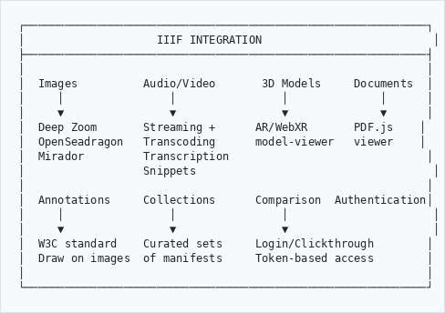
```

---

## What is IIIF?
```
┌─────────────────────────────────────────────────────────────┐
│  IIIF BENEFITS                                              │
├─────────────────────────────────────────────────────────────┤
│                                                             │
│  Deep Zoom       - View tiny details at full resolution     │
│  Fast Loading    - Only loads the tiles you're viewing      │
│  Multi-page      - Browse documents page by page            │
│  Shareable       - Link directly to specific views          │
│  Comparable      - View images side by side                 │
│  Interoperable   - Works with external IIIF resources       │
│  Media Streaming - Play audio/video with on-the-fly         │
│                    transcoding of legacy formats             │
│  3D Support      - View 3D models with AR capability        │
│  Annotations     - Draw and comment on images               │
│                                                             │
└─────────────────────────────────────────────────────────────┘
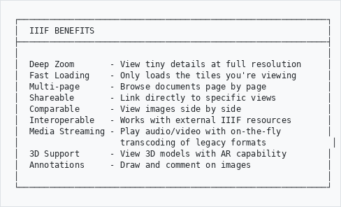
```

---

## How It Works

When you view a record with digital objects, the IIIF system automatically:

```
   Record has digital objects
          │
          ├─ Image (JPEG, TIFF, PNG, etc.)
          │     │
          │     ▼
          │   IIIF manifest generated → Deep zoom viewer
          │   (OpenSeadragon or Mirador)
          │
          ├─ PDF document
          │     │
          │     ▼
          │   PDF.js viewer (page navigation, zoom)
          │
          ├─ Audio/Video (any format)
          │     │
          │     ▼
          │   HTML5 player with on-the-fly transcoding
          │   (legacy formats converted to MP4/MP3)
          │
          ├─ 3D Model (GLB, OBJ, STL, PLY, USDZ)
          │     │
          │     ▼
          │   model-viewer with AR support
          │
          └─ Multi-page TIFF
                │
                ▼
              One canvas per page, thumbnail strip navigation
```

---

## Viewers

### Choosing a Viewer

The system auto-selects the best viewer for your content. For images, you can switch between viewers using the toolbar:

```
┌─────────────────────────────────────────────────────────────┐
│  VIEWER TOOLBAR                                             │
├─────────────────────────────────────────────────────────────┤
│                                                             │
│  [OpenSeadragon] [Mirador]  │  [Fullscreen] [Download]     │
│       ↑              ↑      │  [Annotations] [IIIF Badge]  │
│       │              │      │                               │
│   Fast deep      Rich IIIF  │  Common controls              │
│   zoom viewer    workspace   │  available in all viewers     │
│                              │                               │
└─────────────────────────────────────────────────────────────┘
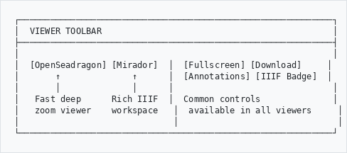
```

Your viewer preference is saved in your browser for next time.

### OpenSeadragon (Image Deep Zoom)
```
┌─────────────────────────────────────────────────────────────┐
│  OPENSEADRAGON                                              │
├─────────────────────────────────────────────────────────────┤
│                                                             │
│  ┌─────────────────────────────────────────────────────┐   │
│  │                                                     │   │
│  │              High Resolution Image                  │   │
│  │                                                     │   │
│  │                  Zoom & Pan                         │   │
│  │                                                     │   │
│  │                              ┌──────┐               │   │
│  │                              │ Mini │               │   │
│  │                              │ Map  │               │   │
│  │                              └──────┘               │   │
│  └─────────────────────────────────────────────────────┘   │
│                                                             │
│  [+] [-] [Home] [Full] [Rotate] [Flip]                     │
│                                                             │
│  Best for: Fast browsing, examining details                 │
│                                                             │
└─────────────────────────────────────────────────────────────┘
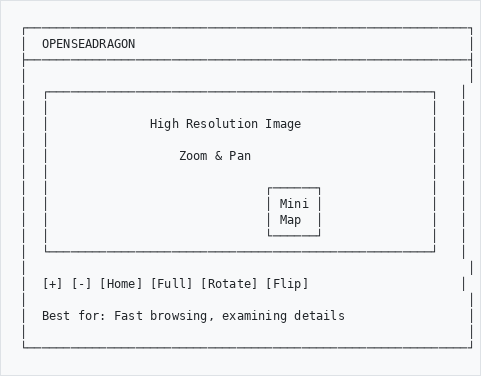
```

### Mirador (Rich IIIF Workspace)
```
┌─────────────────────────────────────────────────────────────┐
│  MIRADOR                                                    │
├─────────────────────────────────────────────────────────────┤
│                                                             │
│  ┌────────────────────────────────────┬────────────────┐   │
│  │                                    │  Side Panel    │   │
│  │         Image Viewer               │  - Info        │   │
│  │                                    │  - Attribution │   │
│  │         (deep zoom)                │  - Annotations │   │
│  │                                    │  - Search      │   │
│  │                                    │  - Canvas list │   │
│  └────────────────────────────────────┴────────────────┘   │
│                                                             │
│  [Thumbnails]  Page 3 of 25  [<] [>]                        │
│                                                             │
│  Best for: Research, annotations, multi-window comparison   │
│                                                             │
└─────────────────────────────────────────────────────────────┘
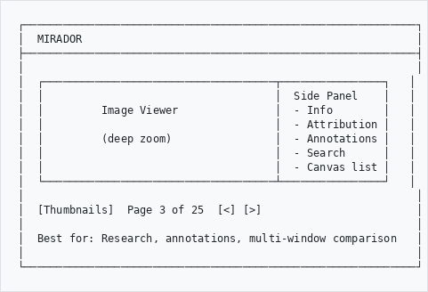
```

### PDF.js (Document Viewer)
```
┌─────────────────────────────────────────────────────────────┐
│  PDF VIEWER                                                 │
├─────────────────────────────────────────────────────────────┤
│                                                             │
│  ┌─────────────────────────────────────────────────────┐   │
│  │                                                     │   │
│  │              PDF Document                           │   │
│  │                                                     │   │
│  │              Rendered with PDF.js                   │   │
│  │              (no browser plugin needed)             │   │
│  │                                                     │   │
│  └─────────────────────────────────────────────────────┘   │
│                                                             │
│  [<] Page 5 of 42 [>]  [+] [-]  [Download]                 │
│                                                             │
│  Best for: Reports, correspondence, scanned documents       │
│                                                             │
└─────────────────────────────────────────────────────────────┘
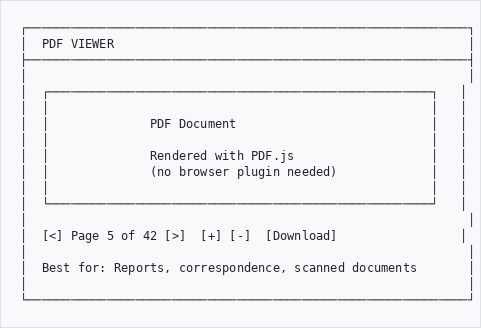
```

### 3D Model Viewer
```
┌─────────────────────────────────────────────────────────────┐
│  3D MODEL VIEWER                                            │
├─────────────────────────────────────────────────────────────┤
│                                                             │
│  ┌─────────────────────────────────────────────────────┐   │
│  │                                                     │   │
│  │              3D Model                               │   │
│  │                                                     │   │
│  │           Rotate / Zoom / Pan                       │   │
│  │                                                     │   │
│  │                              [AR]                   │   │
│  │                                                     │   │
│  └─────────────────────────────────────────────────────┘   │
│                                                             │
│  Supported: GLB, GLTF, OBJ, STL, PLY, USDZ               │
│  AR: WebXR (Android), Quick Look (iOS)                      │
│                                                             │
│  Best for: Museum objects, archaeological finds, sculptures │
│                                                             │
└─────────────────────────────────────────────────────────────┘
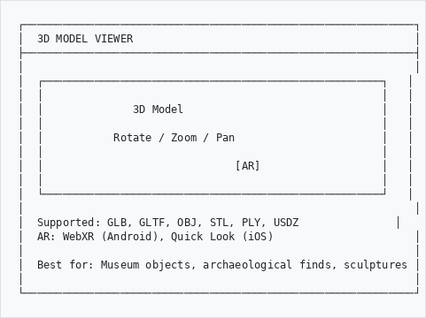
```

### Audio/Video Player
```
┌─────────────────────────────────────────────────────────────┐
│  MEDIA PLAYER                                               │
├─────────────────────────────────────────────────────────────┤
│                                                             │
│  ┌─────────────────────────────────────────────────────┐   │
│  │                                                     │   │
│  │              Video / Audio Content                  │   │
│  │                                                     │   │
│  │         Legacy formats transcoded on-the-fly        │   │
│  │         (AVI, MOV, WMV, FLAC → MP4/MP3)            │   │
│  │                                                     │   │
│  └─────────────────────────────────────────────────────┘   │
│                                                             │
│  [Play] ──────────●──────────── 05:23 / 21:15              │
│  [Volume] [Speed] [Fullscreen] [Download]                   │
│                                                             │
│  Best for: Oral history, film archives, music recordings    │
│                                                             │
└─────────────────────────────────────────────────────────────┘
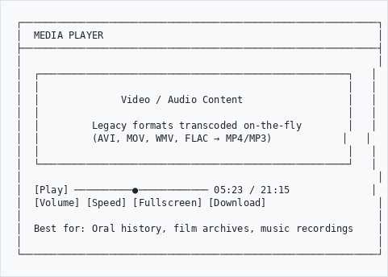
```

---

## Basic Navigation

### Zooming (Images)
```
┌─────────────────────────────────────────────────────────────┐
│  ZOOM CONTROLS                                              │
├─────────────────────────────────────────────────────────────┤
│                                                             │
│  [+]  Click        - Zoom in                                │
│  [-]  Click        - Zoom out                               │
│  Scroll wheel      - Zoom in/out                            │
│  Double-click      - Zoom to that point                     │
│  [Home]            - Reset to full view                     │
│                                                             │
└─────────────────────────────────────────────────────────────┘
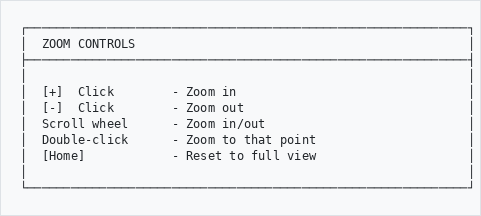
```

### Panning
```
  Click and drag to move around the image

  ┌───────────────────────────────────────┐
  │                                       │
  │     ←  Drag to move  →                │
  │           ↑                           │
  │           ↓                           │
  │                                       │
  └───────────────────────────────────────┘
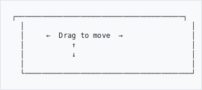
```

### Multi-Page Documents
```
┌─────────────────────────────────────────────────────────────┐
│  PAGE NAVIGATION                                            │
├─────────────────────────────────────────────────────────────┤
│                                                             │
│  [<] Previous  │  Page 3 of 25  │  Next [>]                │
│                                                             │
│  ┌─────┐ ┌─────┐ ┌─────┐ ┌─────┐ ┌─────┐                   │
│  │  1  │ │  2  │ │ [3] │ │  4  │ │  5  │  ...              │
│  └─────┘ └─────┘ └─────┘ └─────┘ └─────┘                   │
│                                                             │
│  Click thumbnail or use arrows to navigate.                 │
│  Multi-page TIFFs auto-detected (up to 100 pages).         │
│                                                             │
└─────────────────────────────────────────────────────────────┘
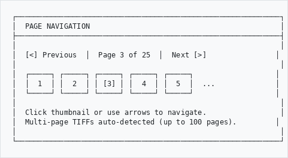
```

---

## Media Streaming

### Supported Formats

The system plays any format by transcoding legacy files to browser-compatible formats:

```
┌─────────────────────────────────────────────────────────────┐
│  MEDIA FORMAT SUPPORT                                       │
├─────────────────────────────────────────────────────────────┤
│                                                             │
│  Native (no transcoding):                                   │
│  • Video: MP4 (H.264), WebM                                │
│  • Audio: MP3, AAC, OGG, WAV                               │
│                                                             │
│  Transcoded on-the-fly (FFmpeg):                            │
│  • Video: AVI, MOV, WMV, FLV, MKV, MXF, MPEG, 3GP, VOB   │
│  • Audio: AIFF, FLAC, WMA, AC3, AU                         │
│                                                             │
│  All transcoded to MP4 (H.264+AAC) or MP3 for playback.    │
│  Seeking (range requests) supported for native formats.     │
│                                                             │
└─────────────────────────────────────────────────────────────┘
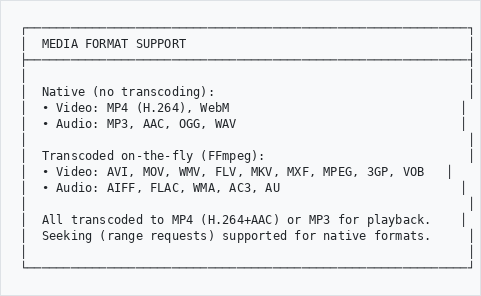
```

### Transcription (Whisper)

Audio and video files can be transcribed to text:

```
┌─────────────────────────────────────────────────────────────┐
│  TRANSCRIPTION                                              │
├─────────────────────────────────────────────────────────────┤
│                                                             │
│  1. Open an audio/video record                              │
│  2. Click "Transcribe" button                               │
│  3. Wait for processing (runs in background)                │
│  4. View timestamped transcript below the player            │
│                                                             │
│  Export formats:                                            │
│  • JSON  - Full data with timestamps and confidence         │
│  • VTT   - Web Video Text Tracks (captions)                 │
│  • SRT   - SubRip subtitles                                 │
│  • TXT   - Plain text transcript                            │
│                                                             │
│  Languages: Auto-detected or manually specified             │
│                                                             │
└─────────────────────────────────────────────────────────────┘
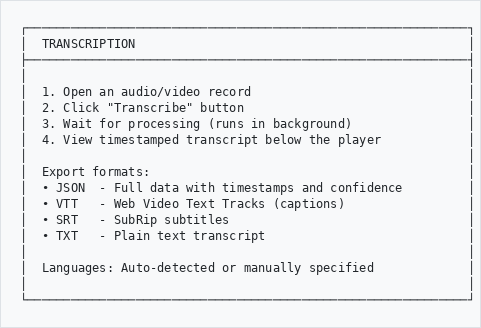
```

### Media Snippets

Create named clips from audio/video recordings:

```
┌─────────────────────────────────────────────────────────────┐
│  SNIPPETS                                                   │
├─────────────────────────────────────────────────────────────┤
│                                                             │
│  Create bookmarks for specific sections:                    │
│                                                             │
│  Title               Start     End       Notes              │
│  ─────────────────────────────────────────────────────────  │
│  Opening remarks     00:00     02:15     Introduction       │
│  Key testimony       05:30     12:45     Main evidence      │
│  Closing statement   18:00     21:15     Summary            │
│                                                             │
│  Click a snippet to jump to that section.                   │
│  Playback auto-pauses at the end marker.                    │
│                                                             │
└─────────────────────────────────────────────────────────────┘
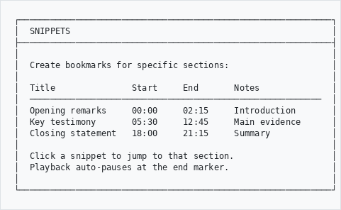
```

### Metadata Extraction

Technical metadata is automatically extracted from media files:

```
┌─────────────────────────────────────────────────────────────┐
│  EXTRACTED METADATA (via FFprobe)                           │
├─────────────────────────────────────────────────────────────┤
│                                                             │
│  Duration:      21:15                                       │
│  Bitrate:       1,500 kbps                                  │
│  File Size:     45.2 MB                                     │
│                                                             │
│  Audio:         AAC, 44100 Hz, stereo, 128 kbps             │
│  Video:         H.264, 1920x1080, 25 fps                    │
│                                                             │
│  Tags:          Title, Artist, Album, Year, Copyright       │
│                                                             │
└─────────────────────────────────────────────────────────────┘
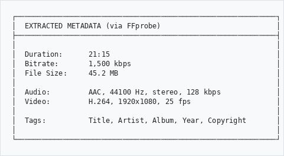
```

---

## Format Conversion

The system can convert non-viewable formats for browser display:

```
┌─────────────────────────────────────────────────────────────┐
│  FORMAT CONVERSION                                          │
├─────────────────────────────────────────────────────────────┤
│                                                             │
│  Source Format         Converted To        Tool             │
│  ─────────────────────────────────────────────────────────  │
│  PSD, CR2 (RAW)   →   JPEG               ImageMagick       │
│  DOCX, XLSX, PPTX →   PDF                LibreOffice       │
│  ZIP, RAR, TGZ    →   File listing       Built-in          │
│  TXT, CSV, XML    →   Plain text view    Built-in          │
│  SVG              →   Rendered image     Browser native     │
│                                                             │
│  Conversions are cached - fast on repeat views.             │
│                                                             │
└─────────────────────────────────────────────────────────────┘
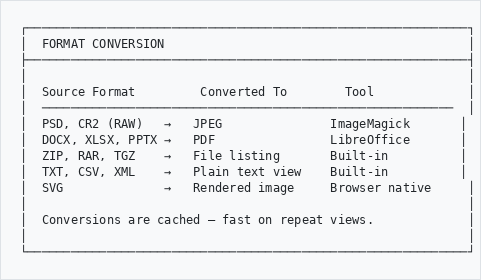
```

---

## Annotations

### Drawing on Images

With OpenSeadragon, you can annotate images using the Annotorious tool:

```
┌─────────────────────────────────────────────────────────────┐
│  ANNOTATION TOOLS                                           │
├─────────────────────────────────────────────────────────────┤
│                                                             │
│  Click [Annotations] in the toolbar to enable, then:        │
│                                                             │
│  [Rectangle] - Draw a box around an area                    │
│  [Polygon]   - Draw a custom shape                          │
│  [Freehand]  - Draw freehand                                │
│                                                             │
│  After drawing:                                             │
│  1. A text box appears                                      │
│  2. Type your comment                                       │
│  3. Choose a purpose: Comment, Tag, Describe, Transcribe    │
│  4. Click Save                                              │
│                                                             │
│  Annotations are saved to the server and visible to         │
│  other users viewing the same record.                       │
│                                                             │
└─────────────────────────────────────────────────────────────┘
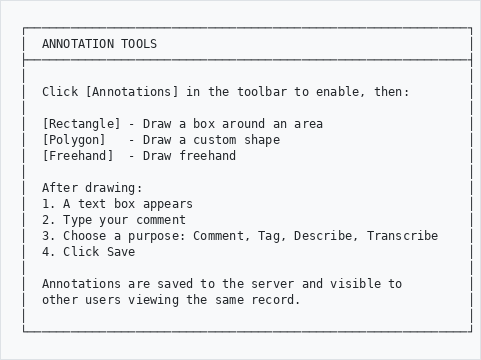
```

### Viewing Annotations

Existing annotations appear as colored overlays on the image:

```
┌─────────────────────────────────────────────────────────────┐
│  ┌─────────────────────────────────────────────────────┐   │
│  │                                                     │   │
│  │     ┌────────────────┐                              │   │
│  │     │  Annotation 1  │ ← Click to read comment      │   │
│  │     └────────────────┘                              │   │
│  │                                                     │   │
│  │                    ┌─────────┐                       │   │
│  │                    │ Anno 2  │                       │   │
│  │                    └─────────┘                       │   │
│  │                                                     │   │
│  └─────────────────────────────────────────────────────┘   │
│                                                             │
│  Hover over an annotation to see the comment.               │
│  Click to edit or delete (if you created it).               │
│                                                             │
└─────────────────────────────────────────────────────────────┘
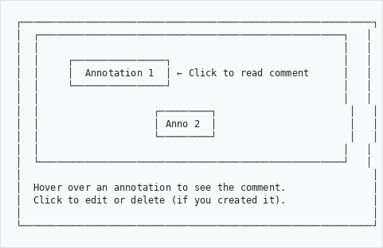
```

---

## IIIF Collections

### What Are Collections?

Collections are curated groups of IIIF manifests - your own records or external resources from other institutions.

### Browsing Collections
```
┌─────────────────────────────────────────────────────────────┐
│  IIIF COLLECTIONS                                           │
├─────────────────────────────────────────────────────────────┤
│                                                             │
│  South African Heritage Photography                         │
│  ├── Cape Town Historical Views (12 items)                  │
│  ├── Johannesburg Mining Era (8 items)                      │
│  └── KwaZulu-Natal Cultural Heritage (15 items)             │
│                                                             │
│  External IIIF Resources                                    │
│  ├── British Library - Africa Collection (external)         │
│  └── Smithsonian - African Art (external)                   │
│                                                             │
│  [+ New Collection]                                         │
│                                                             │
└─────────────────────────────────────────────────────────────┘
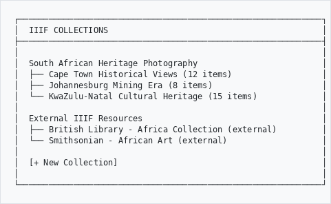
```

### Creating a Collection (Admin)

1. Go to **IIIF Collections** (via admin menu)
2. Click **New Collection**
3. Fill in name, description, attribution
4. Add items - search your records or paste external manifest URIs
5. Reorder items by drag-and-drop

Each collection generates a IIIF Collection manifest at:
`/manifest-collection/:slug/manifest.json`

This URL can be loaded in any IIIF-compatible viewer worldwide.

---

## Protected Content

Some images may require authentication to view at full resolution.

### Access Levels
```
┌─────────────────────────────────────────────────────────────┐
│  ACCESS TYPES                                               │
├─────────────────────────────────────────────────────────────┤
│                                                             │
│  Public          - No login required                        │
│  Clickthrough    - Agree to terms of use                    │
│  Login Required  - Must have an account                     │
│  Kiosk           - Only accessible on-premises              │
│  Restricted      - Special permission needed                │
│                                                             │
└─────────────────────────────────────────────────────────────┘
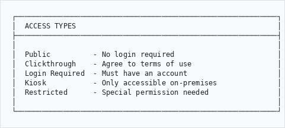
```

### Clickthrough Access

Some content requires you to agree to terms before viewing:
```
┌─────────────────────────────────────────────────────────────┐
│                     ACCESS REQUIRED                          │
├─────────────────────────────────────────────────────────────┤
│                                                             │
│  This resource requires acknowledgment of terms.            │
│                                                             │
│  By clicking "I Agree" you acknowledge that:                │
│  - This material is for personal research only              │
│  - You will not redistribute without permission             │
│  - Copyright may apply to this content                      │
│                                                             │
│                    [ I Agree ]                              │
│                                                             │
└─────────────────────────────────────────────────────────────┘
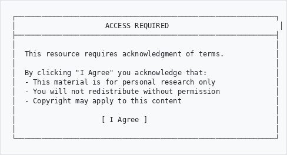
```

### What You See Without Access
```
Without authentication:          After authentication:
┌──────────────────────┐        ┌──────────────────────┐
│                      │        │                      │
│   ┌──────────┐       │        │  Full resolution     │
│   │ Low-res  │       │        │  image with          │
│   │ thumbnail│       │        │  deep zoom           │
│   └──────────┘       │        │                      │
│                      │        │                      │
│  Login to view full  │        │  Full access granted  │
│                      │        │                      │
└──────────────────────┘        └──────────────────────┘
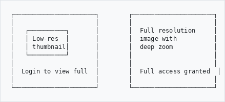
```

### Authentication Flow
```
1. View protected image
         │
         ▼
2. Click "Login" or "I Agree"
         │
         ▼
3. Pop-up window opens
         │
         ▼
4. Log in or accept terms → Window closes automatically
         │
         ▼
5. Full image loads
```

---

## Keyboard Shortcuts
```
┌─────────────────────────────────────────────────────────────┐
│  KEY              │  ACTION                                 │
├───────────────────┼─────────────────────────────────────────┤
│  + or =           │  Zoom in                                │
│  - or _           │  Zoom out                               │
│  0 (zero)         │  Reset view                             │
│  F                │  Toggle fullscreen                      │
│  ← →              │  Previous / Next page                   │
│  Home             │  First page                             │
│  End              │  Last page                              │
│  R                │  Rotate 90 degrees                      │
│  Escape           │  Exit fullscreen                        │
└───────────────────┴─────────────────────────────────────────┘
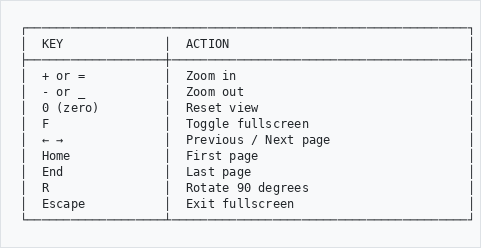
```

---

## Fullscreen Mode

Click the **Fullscreen** button or press **F** to enter fullscreen.
Press **Escape** or click the button again to exit.

```
┌─────────────────────────────────────────────────────────────┐
│                                                             │
│                                                             │
│                    FULLSCREEN VIEW                          │
│                                                             │
│              Best for detailed examination                  │
│                                                             │
│                                                             │
│                                    [Press ESC to exit]      │
└─────────────────────────────────────────────────────────────┘
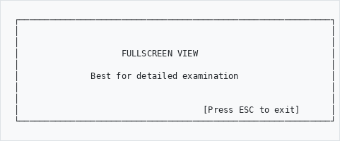
```

---

## Comparing Images (Mirador)

Mirador allows side-by-side comparison in a multi-window workspace:
```
┌────────────────────────┬────────────────────────┐
│                        │                        │
│    Image 1             │    Image 2             │
│                        │                        │
│  (Before restoration)  │  (After restoration)   │
│                        │                        │
└────────────────────────┴────────────────────────┘

  Both windows have independent zoom and pan.
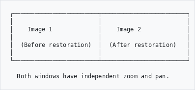
```

### Dedicated Comparison Page

You can also compare images from different records using the dedicated comparison viewer:

```
URL: /iiif/compare?slugs=slug1,slug2

Example: /iiif/compare?slugs=historical-photo-1,historical-photo-2
```

This opens a full-screen Mirador workspace in mosaic mode, with each manifest in its own panel. You can add more windows from the workspace controls.

From the researcher workspace (ahgResearchPlugin), use the "Compare selected" button to open selected items in the comparison viewer.

---

## Tips
```
┌────────────────────────────────┬────────────────────────────┐
│  DO                            │  DON'T                     │
├────────────────────────────────┼────────────────────────────┤
│  Use fullscreen for detail     │  Squint at small views     │
│  Let tiles load before moving  │  Pan rapidly               │
│  Use keyboard for speed        │  Click everything slowly   │
│  Use Mirador for research      │  Screenshot low resolution │
│  Create snippets for AV clips  │  Note timestamps manually  │
│  Annotate findings on images   │  Describe locations in text│
│  Create collections for groups │  Bookmark individual items │
│  Download originals when needed│  Save compressed copies    │
└────────────────────────────────┴────────────────────────────┘
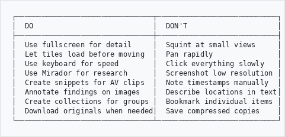
```

---

## Troubleshooting
```
Problem                          Solution
───────────────────────────────────────────────────────────
Image loads slowly            →  Wait for tiles to load
                                 Check internet connection

Blurry when zoomed            →  Wait for high-res tiles
                                 May be limit of original scan

Viewer won't load             →  Refresh the page
                                 Try a different browser
                                 Check browser console for errors

Video won't play              →  Wait for transcoding to start
                                 Legacy formats take a moment
                                 Check FFmpeg is installed

Transcription not appearing   →  Processing runs in background
                                 Check back in a few minutes
                                 Large files take longer

3D model black/empty          →  File may be corrupt
                                 Try a different format (GLB)
                                 Check browser WebGL support

Annotations not saving        →  Check you are logged in
                                 Refresh and try again

Fullscreen not working        →  Browser may block it
                                 Try F11 for browser fullscreen

Auth popup blocked            →  Whitelist the domain in your
                                 browser popup settings
```

---

## Need Help?

Contact your system administrator if you experience issues.

---

*Part of the AtoM AHG Framework*
*Last Updated: March 2026*
