# Library Module

## User Guide

Catalog library materials using Dublin Core and MARC-based fields for books, journals, and other published materials.

---

## Overview
```
┌─────────────────────────────────────────────────────────────┐
│                      LIBRARY MODULE                         │
├─────────────────────────────────────────────────────────────┤
│                                                             │
│  📚 Books         📰 Journals      📀 Media                 │
│     │                │                │                     │
│     ▼                ▼                ▼                     │
│  Monographs      Serials          CDs/DVDs                  │
│  Collections     Periodicals      Audiobooks                │
│  Reference       Magazines        E-resources               │
│                                                             │
└─────────────────────────────────────────────────────────────┘
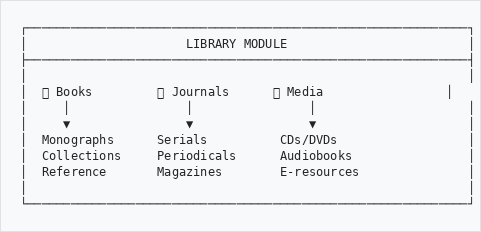
```

---

## When to Use Library Module
```
┌─────────────────────────────────────────────────────────────┐
│  USE LIBRARY MODULE FOR:                                    │
├─────────────────────────────────────────────────────────────┤
│                                                             │
│  📕 Published books and monographs                          │
│  📰 Journals, magazines, and serials                        │
│  📖 Reference materials (encyclopedias, dictionaries)       │
│  💿 Audio/visual materials (CDs, DVDs, audiobooks)          │
│  📄 Pamphlets and ephemera                                  │
│  🗺️  Maps and atlases                                       │
│  🎵 Sheet music and scores                                  │
│                                                             │
└─────────────────────────────────────────────────────────────┘
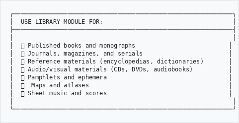
```

---

## How to Access
```
  Main Menu
      │
      ▼
   GLAM/DAM
      │
      ▼
   Library ──────────────────────────────────────────────────┐
      │                                                       │
      ├──▶ Browse Library       (view all items)              │
      │                                                       │
      ├──▶ Add Library Item     (create new record)           │
      │                                                       │
      └──▶ Import MARC          (bulk import)                 │
```

---

## Adding a Library Item

### Step 1: Click Add Library Item

Go to **GLAM/DAM** → **Library** → **Add**

### Step 2: Choose Material Type
```
┌─────────────────────────────────────────────────────────────┐
│  SELECT MATERIAL TYPE                                       │
├─────────────────────────────────────────────────────────────┤
│                                                             │
│  ○ Book / Monograph                                         │
│  ○ Journal / Serial                                         │
│  ○ Article                                                  │
│  ○ Audio Recording                                          │
│  ○ Video Recording                                          │
│  ○ Map                                                      │
│  ○ Music Score                                              │
│  ○ Electronic Resource                                      │
│  ○ Other                                                    │
│                                                             │
└─────────────────────────────────────────────────────────────┘
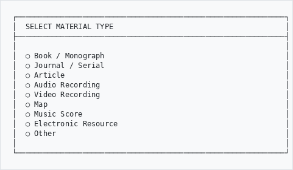
```

### Step 3: Fill in the Form
```
┌─────────────────────────────────────────────────────────────┐
│  ADD LIBRARY ITEM                                           │
├─────────────────────────────────────────────────────────────┤
│                                                             │
│  TITLE INFORMATION                                          │
│  ─────────────────────────────────────────────────────────  │
│  Title:           [A History of South Africa      ]         │
│  Subtitle:        [From 1652 to Present           ]         │
│  Uniform Title:   [                               ]         │
│                                                             │
│  CREATOR INFORMATION                                        │
│  ─────────────────────────────────────────────────────────  │
│  Author:          [Thompson, Leonard              ]         │
│  Other Authors:   [+ Add another                  ]         │
│  Editor:          [                               ]         │
│                                                             │
│  PUBLICATION                                                │
│  ─────────────────────────────────────────────────────────  │
│  Publisher:       [Yale University Press          ]         │
│  Place:           [New Haven                      ]         │
│  Date:            [2014                           ]         │
│  Edition:         [4th edition                    ]         │
│                                                             │
│  IDENTIFIERS                                                │
│  ─────────────────────────────────────────────────────────  │
│  ISBN:            [978-0-300-20723-0              ]         │
│  Call Number:     [DT1787 .T56 2014               ]         │
│  Accession No:    [LIB-2025-00142                 ]         │
│                                                             │
└─────────────────────────────────────────────────────────────┘
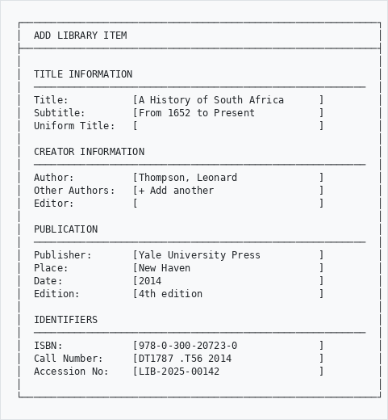
```

---

## Key Fields Explained

### Title Area
```
┌─────────────────────────────────────────────────────────────┐
│  FIELD             │  WHAT TO ENTER                         │
├────────────────────┼────────────────────────────────────────┤
│  Title             │  Main title of the work                │
│  Subtitle          │  Secondary title after colon           │
│  Uniform Title     │  Standard title for variants           │
│  Series Title      │  Name of book series                   │
│  Volume/Issue      │  Volume number or issue                │
└────────────────────┴────────────────────────────────────────┘
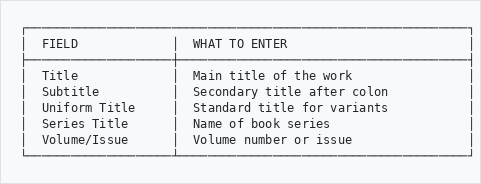
```

### Creator Area
```
┌─────────────────────────────────────────────────────────────┐
│  FIELD             │  WHAT TO ENTER                         │
├────────────────────┼────────────────────────────────────────┤
│  Author            │  Primary creator (Last, First)         │
│  Editor            │  Person who edited the work            │
│  Translator        │  Person who translated                 │
│  Illustrator       │  Person who created illustrations      │
│  Corporate Author  │  Organization as author                │
└────────────────────┴────────────────────────────────────────┘
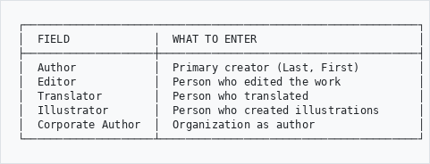
```

### Physical Description
```
┌─────────────────────────────────────────────────────────────┐
│  FIELD             │  WHAT TO ENTER                         │
├────────────────────┼────────────────────────────────────────┤
│  Extent            │  Number of pages (e.g., "324 pages")   │
│  Dimensions        │  Size (e.g., "24 cm")                  │
│  Illustrations     │  Type (e.g., "color illustrations")    │
│  Accompanying      │  Included materials (e.g., "1 CD-ROM") │
└────────────────────┴────────────────────────────────────────┘
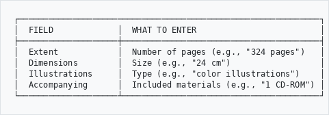
```

---

## Subject and Classification

### Adding Subjects
```
┌─────────────────────────────────────────────────────────────┐
│  SUBJECTS                                                   │
├─────────────────────────────────────────────────────────────┤
│                                                             │
│  Subject Headings:                                          │
│  ┌─────────────────────────────────────────────────────┐   │
│  │ South Africa -- History                             │   │
│  │ [×]                                                 │   │
│  └─────────────────────────────────────────────────────┘   │
│  ┌─────────────────────────────────────────────────────┐   │
│  │ Apartheid -- South Africa                           │   │
│  │ [×]                                                 │   │
│  └─────────────────────────────────────────────────────┘   │
│                                                             │
│  [+ Add Subject]                                            │
│                                                             │
│  Genre/Form:       [History          ▼]                     │
│                                                             │
└─────────────────────────────────────────────────────────────┘
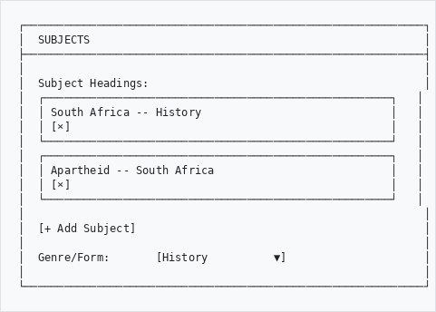
```

### Classification Numbers
```
┌─────────────────────────────────────────────────────────────┐
│  CLASSIFICATION                                             │
├─────────────────────────────────────────────────────────────┤
│                                                             │
│  Call Number:      [DT1787 .T56 2014        ]               │
│                                                             │
│  Dewey Decimal:    [968                     ]               │
│                                                             │
│  LC Classification:[DT1787                  ]               │
│                                                             │
└─────────────────────────────────────────────────────────────┘
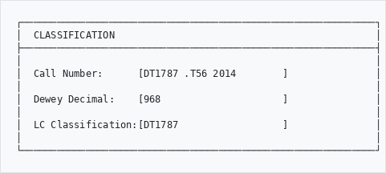
```

---

## Cataloging Serials (Journals)

For journals and periodicals:
```
┌─────────────────────────────────────────────────────────────┐
│  SERIAL INFORMATION                                         │
├─────────────────────────────────────────────────────────────┤
│                                                             │
│  Title:           [South African Historical Journal]        │
│                                                             │
│  ISSN:            [0258-2473                       ]        │
│                                                             │
│  Frequency:       [Quarterly        ▼]                      │
│                   • Annual                                  │
│                   • Semi-annual                             │
│                   • Quarterly  ←                            │
│                   • Monthly                                 │
│                   • Weekly                                  │
│                                                             │
│  Holdings:        [Vol. 1 (1969) - Vol. 75 (2023)  ]        │
│                                                             │
│  Gaps:            [Vol. 45-47 missing             ]         │
│                                                             │
└─────────────────────────────────────────────────────────────┘
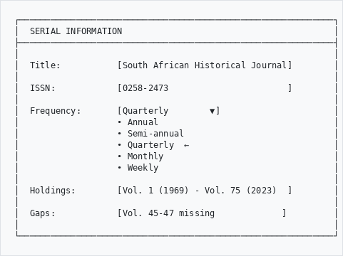
```

---

## Browsing the Library

### Filter Options
```
┌─────────────────────────────────────────────────────────────┐
│  BROWSE LIBRARY                                             │
├─────────────────────────────────────────────────────────────┤
│                                                             │
│  Search: [                              ] [Search]          │
│                                                             │
│  Filter by:                                                 │
│  ┌────────────┐ ┌────────────┐ ┌────────────┐              │
│  │ All Types  │ │ All Dates  │ │ All Subjects│              │
│  │     ▼      │ │     ▼      │ │     ▼      │              │
│  └────────────┘ └────────────┘ └────────────┘              │
│                                                             │
│  Sort by: [Title A-Z           ▼]                           │
│                                                             │
└─────────────────────────────────────────────────────────────┘
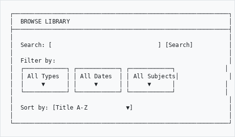
```

### Search Tips
```
┌─────────────────────────────────────────────────────────────┐
│  SEARCH EXAMPLES                                            │
├─────────────────────────────────────────────────────────────┤
│                                                             │
│  By Title:        "History of Cape Town"                    │
│  By Author:       author:Thompson                           │
│  By ISBN:         isbn:9780300207230                        │
│  By Call Number:  call:DT1787                               │
│  By Subject:      subject:apartheid                         │
│  By Date:         date:2014                                 │
│                                                             │
└─────────────────────────────────────────────────────────────┘
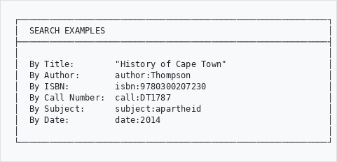
```

---

## Digital Objects

Attach digital files to library records:
```
┌─────────────────────────────────────────────────────────────┐
│  DIGITAL OBJECTS                                            │
├─────────────────────────────────────────────────────────────┤
│                                                             │
│  Attached Files:                                            │
│                                                             │
│  📄 Table_of_Contents.pdf        [View] [Delete]            │
│  📄 Cover_Image.jpg              [View] [Delete]            │
│                                                             │
│  [+ Upload File]                                            │
│                                                             │
│  Or link to external resource:                              │
│  URL: [https://...                          ]               │
│                                                             │
└─────────────────────────────────────────────────────────────┘
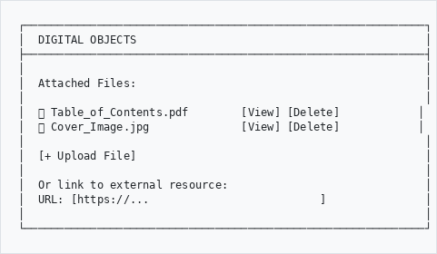
```

---

## Tips for Cataloging
```
┌────────────────────────────────────────────────────────────┐
│  ✓ DO                          │  ✗ DON'T                  │
├────────────────────────────────┼────────────────────────────┤
│  Enter ISBN/ISSN               │  Skip identifiers         │
│  Use standard subject headings │  Make up your own terms   │
│  Include physical description  │  Leave extent blank       │
│  Add call numbers              │  Forget classification    │
│  Note condition issues         │  Ignore damage            │
│  Link related works            │  Catalog in isolation     │
└────────────────────────────────┴────────────────────────────┘
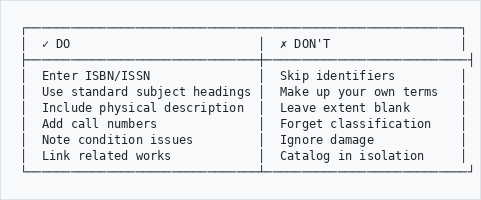
```

---

## Need Help?

Contact your system administrator or cataloging librarian if you need assistance.

---

*Part of the AtoM AHG Framework*
