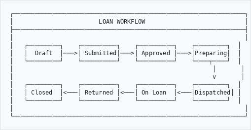

# Loan Module User Guide

## Overview

The AHG Loan Module provides comprehensive loan management for GLAM (Galleries, Libraries, Archives, Museums) institutions. Whether you're lending artworks for an exhibition, borrowing archival materials for research, or licensing digital assets, this module handles the entire loan lifecycle.

## Supported Sectors

The loan module adapts to your institution type:

| Sector | What You Can Loan | Key Features |
|--------|-------------------|--------------|
| **Museums** | Artifacts, artworks, specimens | Condition reports, facility assessments, insurance tracking |
| **Galleries** | Artworks, sculptures | Consignment support, artist notifications, sales tracking |
| **Archives** | Documents, records, photographs | Reading room access, surrogates, restricted materials |
| **Digital Assets** | Images, videos, documents | Licensing, usage rights, download management |

---

## Getting Started

### Accessing the Loan Module

1. Log in to AtoM with your credentials
2. Navigate to **Loans** in the main menu
3. You'll see the Loan Dashboard with an overview of all loan activities

### Understanding Loan Types

- **Loan Out**: You are lending items to another institution
- **Loan In**: You are borrowing items from another institution

---

## Creating a New Loan

### Step 1: Start a New Loan

1. Click **New Loan Out** or **New Loan In** button
2. Select the purpose of the loan

### Step 2: Enter Partner Details

Fill in information about the other institution:
- Institution name
- Contact person
- Email and phone
- Address

### Step 3: Set Loan Dates

- **Start Date**: When the loan period begins
- **End Date**: When items should be returned

### Step 4: Add Objects

1. Click **Add Object**
2. Search for items in your collection
3. Select the items to include
4. Add any special requirements for each item

### Step 5: Insurance Information

Enter insurance details:
- Insurance type (borrower covers, lender covers, shared)
- Total value
- Policy number (if known)

### Step 6: Submit

Click **Save** to create the loan in draft status.

---

## Loan Workflow

### How a Loan Progresses

```
┌─────────────────────────────────────────────────────────────────┐
│                        LOAN WORKFLOW                            │
├─────────────────────────────────────────────────────────────────┤
│                                                                 │
│   ┌─────────┐    ┌──────────┐    ┌──────────┐    ┌─────────┐  │
│   │  Draft  │───>│ Submitted│───>│ Approved │───>│Preparing│  │
│   └─────────┘    └──────────┘    └──────────┘    └────┬────┘  │
│                                                        │       │
│                                                        v       │
│   ┌─────────┐    ┌──────────┐    ┌──────────┐    ┌─────────┐  │
│   │ Closed  │<───│ Returned │<───│ On Loan  │<───│Dispatched│ │
│   └─────────┘    └──────────┘    └──────────┘    └─────────┘  │
│                                                                 │
└─────────────────────────────────────────────────────────────────┘

```

### Status Descriptions

| Status | What It Means | Who Acts |
|--------|---------------|----------|
| **Draft** | Loan is being prepared | You |
| **Submitted** | Awaiting review | Supervisor/Curator |
| **Under Review** | Being evaluated | Curator/Director |
| **Approved** | Ready to proceed | Registrar |
| **Preparing** | Getting objects ready | Collections staff |
| **Dispatched** | Objects sent | Courier/Registrar |
| **On Loan** | At borrower location | Borrower |
| **Returned** | Objects back | Collections staff |
| **Closed** | Loan complete | Registrar |

---

## Managing Loans

### Viewing Loan Details

Click on any loan number to see:
- Full loan information
- List of objects included
- Documents attached
- Status history
- Available actions

### Filtering and Searching

Use the filter bar to find loans by:
- **Type**: Loans Out or Loans In
- **Status**: Active, Overdue, Returned, etc.
- **Partner**: Search by institution name
- **Overdue**: Show only overdue loans

### Taking Actions

Available actions depend on the current status:

| Current Status | Available Actions |
|----------------|-------------------|
| Draft | Edit, Submit, Cancel |
| Submitted | Review, Request Info, Reject |
| Approved | Send Agreement, Cancel |
| Preparing | Start Packing, Record Condition |
| Dispatched | Mark In Transit, Confirm Receipt |
| On Loan | Initiate Return, Extend |
| Returned | Verify Condition, Close |

---

## Condition Reports

### Why Condition Reports Matter

Condition reports document the state of objects before and after loans. This protects both lender and borrower.

### Creating a Condition Report

1. Open the loan details
2. Click **Add Condition Report**
3. Select the object
4. Record the condition:
   - Overall condition (Excellent/Good/Fair/Poor/Critical)
   - Structural condition notes
   - Surface condition notes
   - Any existing damage
5. Add photographs
6. Save the report

### Comparing Conditions

After a loan returns, compare pre-loan and post-loan conditions:
1. Open the returned loan
2. Click **Compare Conditions**
3. Review any changes highlighted

---

## Facility Reports

### What is a Facility Report?

A facility report assesses whether the borrower's venue is suitable for your objects. This is especially important for museums.

### Completing a Facility Report

1. Open the loan
2. Click **Facility Report**
3. Enter venue details
4. Assess:
   - **Environmental controls**: Climate, humidity, UV
   - **Security**: Alarms, CCTV, guards
   - **Display setup**: Cases, barriers, lighting
5. Add photos of the venue
6. Provide an overall rating
7. Submit for approval

### Facility Ratings

| Rating | Meaning |
|--------|---------|
| **Excellent** | Exceeds all requirements |
| **Good** | Meets all requirements |
| **Acceptable** | Meets minimum standards |
| **Marginal** | Improvements needed |
| **Unacceptable** | Cannot proceed |

---

## Shipping and Transport

### Arranging Shipment

1. Open the loan details
2. Click **Arrange Shipment**
3. Select or add a courier
4. Enter pickup and delivery details
5. Add tracking number when available

### Tracking Shipments

The system tracks shipment status:
- Planned
- Picked Up
- In Transit
- Out for Delivery
- Delivered

### Recording Costs

Track all loan-related costs:
- Transport
- Insurance
- Packing/crating
- Customs duties
- Courier fees

---

## Calendar and Scheduling

### Viewing the Loan Calendar

1. Navigate to **Loans** > **Calendar**
2. See all loans visually:
   - Loan periods as bars
   - Start and end dates marked
   - Overdue items highlighted in red

### Checking Object Availability

Before creating a loan:
1. Search for the object
2. Click **Check Availability**
3. See when the object is already committed

---

## Notifications and Reminders

### Automatic Reminders

The system sends reminders:
- **30 days before due**: Initial reminder
- **14 days before due**: Action required
- **7 days before due**: Urgent reminder
- **Overdue**: Immediate attention needed

### Managing Notifications

View notification history in loan details under **Notifications** tab.

---

## Reports and Dashboard

### Dashboard Overview

The loan dashboard shows:
- Total active loans
- Overdue count
- Due this month
- Insurance exposure
- Recent activity

### Available Reports

| Report | What It Shows |
|--------|---------------|
| **Active Loans** | All current loans |
| **Overdue Report** | Loans past due date |
| **Partner Summary** | Loans by institution |
| **Annual Statistics** | Yearly loan activity |
| **Insurance Report** | Total values at risk |

### Exporting Data

1. Go to **Loans** > **Dashboard**
2. Click **Export**
3. Choose format (CSV, PDF)
4. Select report type

---

## Best Practices

### Before Creating a Loan

1. Verify object availability
2. Confirm insurance requirements
3. Check any restrictions on the object
4. Gather partner contact details

### During the Loan

1. Keep documentation updated
2. Monitor due dates
3. Track shipment status
4. Respond promptly to issues

### After Loan Return

1. Complete post-loan condition report immediately
2. Document any damage or changes
3. Close the loan properly
4. File all documentation

---

## Troubleshooting

### Common Issues

| Problem | Solution |
|---------|----------|
| Can't find an object | Check if it's already on loan |
| Status won't change | Ensure you have the required permissions |
| Missing notifications | Check email settings and spam folder |
| Report won't generate | Try a different browser or clear cache |

### Getting Help

- Contact your system administrator
- Check the technical documentation
- Submit a support request through the system

---

## Glossary

| Term | Definition |
|------|------------|
| **Borrower** | Institution receiving items on loan |
| **Lender** | Institution providing items for loan |
| **Condition Report** | Document recording object's physical state |
| **Facility Report** | Assessment of borrower's venue |
| **Loan Agreement** | Legal contract between parties |
| **Consignment** | Artwork placed for potential sale |
| **Surrogate** | Copy used instead of original |
| **Wall-to-wall** | Insurance coverage for entire journey |

---

## Quick Reference Card

### Creating a Loan
1. Loans > New Loan Out/In
2. Add partner details
3. Set dates
4. Add objects
5. Enter insurance
6. Save and submit

### Processing a Return
1. Open loan
2. Click "Initiate Return"
3. Arrange shipment
4. Confirm receipt
5. Complete condition report
6. Close loan

### Key Shortcuts
- **Ctrl+N**: New loan
- **Ctrl+F**: Find loan
- **Ctrl+S**: Save changes

---

*Last Updated: January 2026*
*Version: 1.0.0*
*AHG Loan Module - Part of the AtoM AHG Framework*
