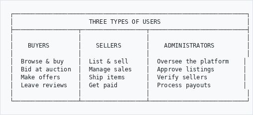
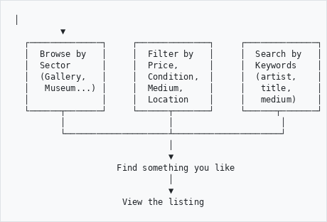
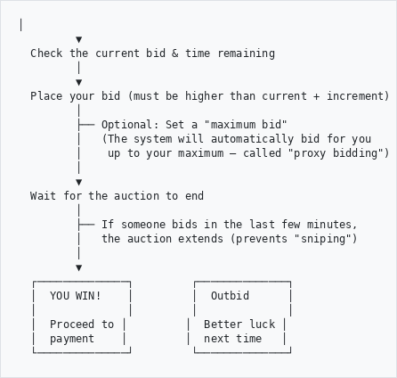
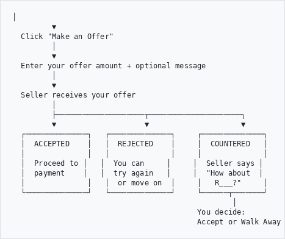
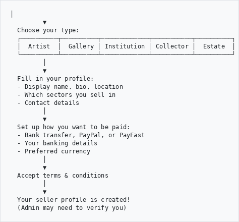
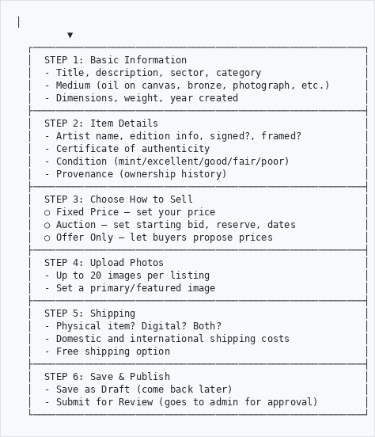
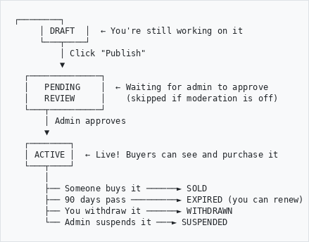
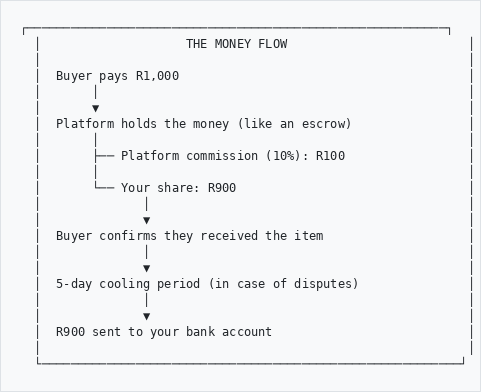
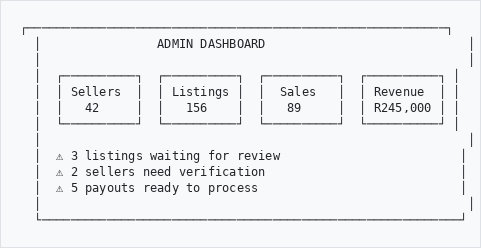

# Heratio Marketplace - How It Works

A plain-language guide to understanding the online marketplace built into your Heratio platform.

---

## What Is the Marketplace?

Think of it as an **online art gallery + auction house + shop**, all built into your Heratio archival system. Instead of just cataloguing and preserving items, your institution can now **sell** them too - or let independent artists and collectors sell through your platform.

**Three ways to sell:**
- **Fixed Price** - Set a price, buyer pays it. Simple as a shop.
- **Auction** - Buyers compete by bidding. Highest bid wins. Like Sotheby's, but online.
- **Make an Offer** - Buyer proposes a price. Seller can accept, reject, or counter. Like haggling at a market.

**Works for all GLAM sectors:**

| Sector | What You Can Sell |
|--------|-------------------|
| **Gallery** | Original artworks, prints, sculptures, digital art |
| **Museum** | Reproductions, merchandise, catalogs, artifact replicas |
| **Archive** | Digital scans, research packages, image licenses |
| **Library** | Rare books, e-books, manuscript facsimiles |
| **DAM** | Stock photos, video clips, audio, design assets |

**International:** Supports multiple currencies (Rand, Dollar, Euro, Pound, Australian Dollar).

---

## Who Uses the Marketplace?

```
┌─────────────────────────────────────────────────────────────────┐
│                     THREE TYPES OF USERS                        │
├──────────────────┬──────────────────┬───────────────────────────┤
│                  │                  │                           │
│    BUYERS        │    SELLERS       │    ADMINISTRATORS         │
│                  │                  │                           │
│  Browse & buy    │  List & sell     │  Oversee the platform    │
│  Bid at auction  │  Manage sales    │  Approve listings        │
│  Make offers     │  Ship items      │  Verify sellers          │
│  Leave reviews   │  Get paid        │  Process payouts         │
│                  │                  │                           │
└──────────────────┴──────────────────┴───────────────────────────┘

```

---

## The Buying Journey

### 1. Browsing

```
  Visit the Marketplace
         │
         ▼
  ┌──────────────┐     ┌──────────────┐     ┌──────────────┐
  │  Browse by   │     │  Filter by   │     │  Search by   │
  │  Sector      │     │  Price,      │     │  Keywords    │
  │  (Gallery,   │     │  Condition,  │     │  (artist,    │
  │   Museum...) │     │  Medium,     │     │   title,     │
  │              │     │  Location    │     │   medium)    │
  └──────┬───────┘     └──────┬───────┘     └──────┬───────┘
         │                    │                     │
         └────────────────────┴─────────────────────┘
                              │
                              ▼
                    Find something you like
                              │
                              ▼
                     View the listing

```

You can browse by sector (Gallery, Museum, etc.), use filters to narrow down results, or search by keyword. Switch between grid and list view. Sort by newest, price, or popularity.

### 2. Buying at a Fixed Price

This is the simplest way - like shopping online.

```
  See an item you want
         │
         ▼
  Click "Buy Now"
         │
         ▼
  Item goes to your cart
         │
         ▼
  Proceed to checkout
         │
         ▼
  Pay online (PayFast)
         │
         ▼
  Seller ships the item
         │
         ▼
  You receive it
         │
         ▼
  Confirm receipt
         │
         ▼
  Leave a review (optional)
```

### 3. Bidding at Auction

Like a traditional auction, but online with some clever features.

```
  See an auction listing
         │
         ▼
  Check the current bid & time remaining
         │
         ▼
  Place your bid (must be higher than current + increment)
         │
         ├── Optional: Set a "maximum bid"
         │   (The system will automatically bid for you
         │    up to your maximum - called "proxy bidding")
         │
         ▼
  Wait for the auction to end
         │
         ├── If someone bids in the last few minutes,
         │   the auction extends (prevents "sniping")
         │
         ▼
  ┌──────────────┐         ┌──────────────┐
  │  YOU WIN!    │         │  Outbid      │
  │              │         │              │
  │  Proceed to │         │  Better luck │
  │  payment    │         │  next time   │
  └──────────────┘         └──────────────┘

```

**Key auction concepts in plain language:**

- **Reserve Price** - A secret minimum the seller will accept. If no bid reaches it, the item doesn't sell. Think of it as a safety net for the seller.
- **Proxy Bidding** - You tell the system "I'll pay up to R5,000" and it bids on your behalf, only going as high as needed to stay in the lead. You might win for much less than your maximum.
- **Anti-Sniping** - If someone places a bid in the last 5 minutes, the clock adds more time. This prevents people from winning by bidding at the very last second.
- **Buy Now** - Some auctions let you skip the bidding and buy immediately at a set price.

### 4. Making an Offer

Like negotiating at a market stall, but in writing.

```
  See an item (fixed price or offer-only)
         │
         ▼
  Click "Make an Offer"
         │
         ▼
  Enter your offer amount + optional message
         │
         ▼
  Seller receives your offer
         │
         ├────────────────────┬─────────────────────┐
         ▼                    ▼                     ▼
  ┌──────────────┐   ┌──────────────┐     ┌──────────────┐
  │  ACCEPTED    │   │  REJECTED    │     │  COUNTERED   │
  │              │   │              │     │              │
  │  Proceed to │   │  You can     │     │  Seller says │
  │  payment    │   │  try again   │     │  "How about  │
  │              │   │  or move on  │     │   R___?"     │
  └──────────────┘   └──────────────┘     └──────┬───────┘
                                                  │
                                          You decide:
                                          Accept or Walk Away

```

Offers expire after 7 days if the seller doesn't respond. You can withdraw your offer at any time.

### 5. Sending an Enquiry

For "Price on Request" items, or if you just have a question:

- Click "Send Enquiry" on any listing
- Write your question
- The seller receives it and can reply directly
- No commitment - it's just a conversation

### 6. Your Account Pages

Once you've been active on the marketplace, you have these personal pages:

| Page | What It Shows |
|------|---------------|
| **My Purchases** | Everything you've bought, with shipping tracking and receipt confirmation |
| **My Bids** | Your active auction bids - are you winning or outbid? |
| **My Offers** | Offers you've sent - pending, accepted, countered, or expired |
| **Following** | Sellers you follow - get notified when they list new items |
| **Reviews** | Rate sellers 1-5 stars after a completed purchase |

---

## The Selling Journey

### 1. Register as a Seller

```
  Click "Become a Seller"
         │
         ▼
  Choose your type:
  ┌──────────┬──────────┬─────────────┬───────────┬──────────┐
  │  Artist  │  Gallery │ Institution │ Collector │  Estate  │
  └──────────┴──────────┴─────────────┴───────────┴──────────┘
         │
         ▼
  Fill in your profile:
  - Display name, bio, location
  - Which sectors you sell in
  - Contact details
         │
         ▼
  Set up how you want to be paid:
  - Bank transfer, PayPal, or PayFast
  - Your banking details
  - Preferred currency
         │
         ▼
  Accept terms & conditions
         │
         ▼
  Your seller profile is created!
  (Admin may need to verify you)

```

### 2. Create a Listing

```
  Click "Create New Listing"
         │
         ▼
  ┌──────────────────────────────────────────────────────────┐
  │  STEP 1: Basic Information                               │
  │  - Title, description, sector, category                  │
  │  - Medium (oil on canvas, bronze, photograph, etc.)      │
  │  - Dimensions, weight, year created                      │
  ├──────────────────────────────────────────────────────────┤
  │  STEP 2: Item Details                                    │
  │  - Artist name, edition info, signed?, framed?           │
  │  - Certificate of authenticity                           │
  │  - Condition (mint/excellent/good/fair/poor)             │
  │  - Provenance (ownership history)                        │
  ├──────────────────────────────────────────────────────────┤
  │  STEP 3: Choose How to Sell                              │
  │  ○ Fixed Price - set your price                          │
  │  ○ Auction - set starting bid, reserve, dates            │
  │  ○ Offer Only - let buyers propose prices                │
  ├──────────────────────────────────────────────────────────┤
  │  STEP 4: Upload Photos                                   │
  │  - Up to 20 images per listing                           │
  │  - Set a primary/featured image                          │
  ├──────────────────────────────────────────────────────────┤
  │  STEP 5: Shipping                                        │
  │  - Physical item? Digital? Both?                         │
  │  - Domestic and international shipping costs             │
  │  - Free shipping option                                  │
  ├──────────────────────────────────────────────────────────┤
  │  STEP 6: Save & Publish                                  │
  │  - Save as Draft (come back later)                       │
  │  - Submit for Review (goes to admin for approval)        │
  └──────────────────────────────────────────────────────────┘

```

### 3. The Listing Lifecycle

```
     ┌────────┐
     │ DRAFT  │  ← You're still working on it
     └───┬────┘
         │ Click "Publish"
         ▼
  ┌──────────────┐
  │   PENDING    │  ← Waiting for admin to approve
  │   REVIEW     │    (skipped if moderation is off)
  └───┬──────────┘
      │ Admin approves
      ▼
  ┌────────┐
  │ ACTIVE │  ← Live! Buyers can see and purchase it
  └───┬────┘
      │
      ├── Someone buys it ──────► SOLD
      ├── 90 days pass ─────────► EXPIRED (you can renew)
      ├── You withdraw it ──────► WITHDRAWN
      └── Admin suspends it ───► SUSPENDED

```

### 4. When Someone Buys

```
  Sale happens (fixed price / auction win / offer accepted)
         │
         ▼
  You get notified: "You have a sale!"
         │
         ▼
  Buyer pays online
         │
         ▼
  You see "Paid" on your dashboard
         │
         ▼
  Pack the item carefully
         │
         ▼
  Enter the tracking number & courier name
         │
         ▼
  Click "Mark as Shipped"
         │
         ▼
  Buyer receives the item
         │
         ▼
  Buyer clicks "Confirm Receipt"
         │
         ▼
  Sale is complete!
```

### 5. Getting Paid

```
  ┌──────────────────────────────────────────────────────────┐
  │                    THE MONEY FLOW                         │
  │                                                           │
  │  Buyer pays R1,000                                        │
  │       │                                                   │
  │       ▼                                                   │
  │  Platform holds the money (like an escrow)                │
  │       │                                                   │
  │       ├── Platform commission (10%): R100                 │
  │       │                                                   │
  │       └── Your share: R900                                │
  │              │                                            │
  │              ▼                                            │
  │  Buyer confirms they received the item                    │
  │              │                                            │
  │              ▼                                            │
  │  5-day cooling period (in case of disputes)               │
  │              │                                            │
  │              ▼                                            │
  │  R900 sent to your bank account                           │
  │                                                           │
  └──────────────────────────────────────────────────────────┘

```

**Key points about payment:**
- The platform takes a small commission on each sale (default 10%, may vary)
- Money is held safely until the buyer confirms they received the item
- There's a short waiting period (5 days) after delivery, in case there's a problem
- Then the money is transferred to your bank account
- You can track all your payouts on your dashboard

### 6. Your Seller Dashboard

Your dashboard shows you everything at a glance:

| Section | What You See |
|---------|-------------|
| **Dashboard** | Sales stats, revenue, pending offers, recent orders |
| **Listings** | All your items - draft, active, sold, expired |
| **Offers** | Incoming offers from buyers - accept, reject, or counter |
| **Sales** | Completed transactions with shipping and payment status |
| **Payouts** | Money owed to you and payment history |
| **Reviews** | What buyers have said about you |
| **Collections** | Themed groups of your listings (like a virtual exhibition) |
| **Analytics** | Charts and stats about your sales performance |
| **Enquiries** | Questions from potential buyers |

---

## For Platform Administrators

### What You See on the Admin Dashboard

```
  ┌──────────────────────────────────────────────────────────┐
  │                ADMIN DASHBOARD                            │
  │                                                           │
  │  ┌──────────┐  ┌──────────┐  ┌──────────┐  ┌──────────┐ │
  │  │ Sellers  │  │ Listings │  │  Sales   │  │ Revenue  │ │
  │  │   42     │  │   156    │  │   89     │  │ R245,000 │ │
  │  └──────────┘  └──────────┘  └──────────┘  └──────────┘ │
  │                                                           │
  │  ⚠ 3 listings waiting for review                         │
  │  ⚠ 2 sellers need verification                           │
  │  ⚠ 5 payouts ready to process                            │
  │                                                           │
  └──────────────────────────────────────────────────────────┘

```

### Daily Tasks

1. **Check for pending listings** - Review new listings, approve or reject them
2. **Verify new sellers** - Check their identity documents and approve
3. **Process payouts** - Send money to sellers for completed sales

### Monthly Tasks

1. **Review revenue reports** - Total sales, commission earned, top sellers
2. **Update exchange rates** - Keep currency conversions current
3. **Manage categories** - Add or reorganise item categories per sector
4. **Check flagged reviews** - Handle any disputed or inappropriate reviews

### Settings You Control

| Setting | What It Does | Default |
|---------|-------------|---------|
| Commission Rate | Percentage the platform keeps from each sale | 10% |
| Listing Moderation | Whether new listings need approval before going live | On |
| Listing Duration | How many days a listing stays active | 90 days |
| Offer Expiry | Days before an unanswered offer expires | 7 days |
| Payout Cooling Period | Days after delivery before payout is released | 5 days |
| VAT Rate | Tax rate applied to sales | 15% |
| Seller Registration | Whether new sellers can sign up | Open |

---

## Reviews & Trust

After every completed purchase, buyers can rate sellers:

```
  ★ ★ ★ ★ ★   Excellent
  ★ ★ ★ ★ ☆   Very Good
  ★ ★ ★ ☆ ☆   Good
  ★ ★ ☆ ☆ ☆   Fair
  ★ ☆ ☆ ☆ ☆   Poor
```

**Seller trust levels build over time:**

| Level | How You Get There |
|-------|-------------------|
| **New** | Just registered |
| **Active** | Verified by admin |
| **Trusted** | Consistent sales and good reviews |
| **Premium** | Top-tier sellers with excellent track records |

Verified sellers get a checkmark badge next to their name, so buyers know they're legitimate.

---

## Curated Collections

Sellers can group their listings into themed collections - like creating a virtual exhibition:

- "Abstract Landscapes" - a gallery's themed showcase
- "19th Century Photographs" - an archive's curated selection
- "Holiday Gift Ideas" - a seasonal promotion
- "New Acquisitions" - fresh items just listed

Collections can be featured on the marketplace homepage by administrators.

---

## Frequently Asked Questions

**How much does it cost to list an item?**
Currently free. There are no listing fees.

**What commission does the platform take?**
The default is 10% of the sale price. This can be adjusted by the platform administrator, and special rates can be set for individual sellers.

**How long before I get paid after a sale?**
After the buyer confirms they received the item, there's a 5-day waiting period (to handle any disputes), then your payout is processed.

**Can I cancel a listing?**
Yes. You can withdraw any active listing at any time. Draft listings can simply be deleted.

**What if a buyer doesn't pay?**
If payment isn't received, the transaction is cancelled and your item automatically becomes available again.

**How are auctions kept fair?**
Three safeguards: (1) Reserve prices protect sellers, (2) proxy bidding lets buyers set a maximum without babysitting, and (3) anti-sniping extends the auction if last-minute bids come in.

**What payment methods are accepted?**
Currently PayFast (widely used in South Africa). Stripe integration is planned for international payments.

**Can I sell digital items?**
Yes. Listings can be marked as digital-only, physical-only, or both. Digital delivery uses secure download tokens.

**Do I need to be an institution to sell?**
No. Individual artists, collectors, and estates can all register as sellers. You choose your seller type when you register.

**What sectors can use the marketplace?**
All five: Gallery, Museum, Archive, Library, and Digital Asset Management (DAM). Each sector has its own categories tailored to what that type of institution typically sells.

---

*This marketplace is part of the Heratio platform by The Archive and Heritage Group.*
