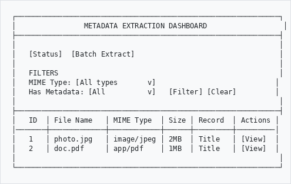
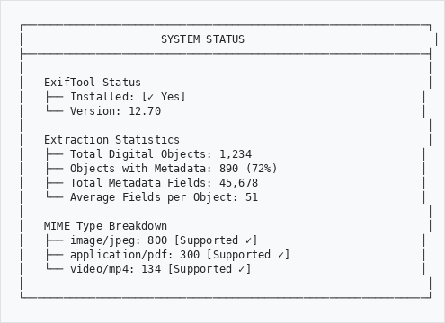
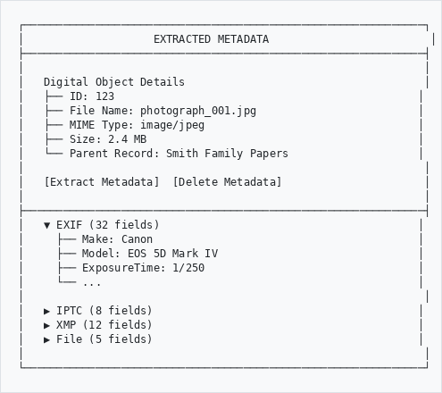

# Metadata Extraction

## User Guide

Automatically extract embedded metadata from uploaded digital objects and populate archival description fields.

---

## Overview
```
+-------------------------------------------------------------+
|                   METADATA EXTRACTION                        |
+-------------------------------------------------------------+
|                                                             |
|   UPLOAD          EXTRACT           MAP            APPLY    |
|     |               |                |               |      |
|     v               v                v               v      |
|   File    -->   Read EXIF   -->   Match to   -->  Update    |
|   Added         IPTC/XMP          AtoM Fields     Record    |
|                                                             |
+-------------------------------------------------------------+
```

---

## Supported File Types
```
+-------------------------------------------------------------+
|                    SUPPORTED FORMATS                         |
+-------------------------------------------------------------+
|                                                             |
|  IMAGES        - JPEG, PNG, TIFF, WebP, GIF, BMP            |
|                 (EXIF, IPTC, XMP metadata)                  |
|                                                             |
|  DOCUMENTS     - PDF (title, author, keywords)              |
|                - DOCX, XLSX, PPTX (Open XML)                |
|                - DOC, XLS, PPT (Legacy Office)              |
|                                                             |
|  VIDEO         - MP4, WebM, MKV, MOV, AVI, OGG              |
|                 (duration, resolution, codec)               |
|                                                             |
|  AUDIO         - MP3, WAV, FLAC, OGG, AAC, M4A              |
|                 (ID3 tags, duration, bitrate)               |
|                                                             |
+-------------------------------------------------------------+
```

---

## How It Works

### Automatic Extraction

When you upload a digital object, the plugin automatically:

1. Detects the file type
2. Extracts embedded metadata
3. Maps metadata to AtoM fields
4. Populates the archival description

```
  Upload File
      |
      v
  +-------------------+
  | Detect File Type  |
  +-------------------+
      |
      +---> Image? ---> Extract EXIF/IPTC/XMP
      |
      +---> PDF? -----> Extract Document Info
      |
      +---> Office? --> Extract Open XML Properties
      |
      +---> Video? ---> Extract Media Info (FFprobe)
      |
      +---> Audio? ---> Extract ID3 Tags
      |
      v
  +-------------------+
  | Map to AtoM Fields|
  +-------------------+
      |
      v
  +-------------------+
  | Update Record     |
  +-------------------+
```

---

## What Gets Extracted

### Images (EXIF/IPTC/XMP)
```
+-------------------------------------------------------------+
|                    IMAGE METADATA                            |
+-------------------------------------------------------------+
|                                                             |
|  DESCRIPTIVE                                                |
|  - Title / Object Name                                      |
|  - Description / Caption                                    |
|  - Keywords / Tags                                          |
|  - Creator / Photographer                                   |
|  - Copyright Notice                                         |
|  - Date Taken                                               |
|                                                             |
|  LOCATION                                                   |
|  - GPS Coordinates                                          |
|  - City, State, Country                                     |
|  - Altitude                                                 |
|                                                             |
|  TECHNICAL                                                  |
|  - Camera Make/Model                                        |
|  - Exposure Settings                                        |
|  - Image Dimensions                                         |
|  - Color Space                                              |
|                                                             |
+-------------------------------------------------------------+
```

### PDF Documents
```
+-------------------------------------------------------------+
|                     PDF METADATA                             |
+-------------------------------------------------------------+
|                                                             |
|  - Title                                                    |
|  - Author                                                   |
|  - Subject                                                  |
|  - Keywords                                                 |
|  - Creator Application                                      |
|  - Producer                                                 |
|  - Creation Date                                            |
|  - Modification Date                                        |
|  - Page Count                                               |
|                                                             |
+-------------------------------------------------------------+
```

### Office Documents (DOCX, XLSX, PPTX)
```
+-------------------------------------------------------------+
|                   OFFICE METADATA                            |
+-------------------------------------------------------------+
|                                                             |
|  CORE PROPERTIES                                            |
|  - Title                                                    |
|  - Creator / Author                                         |
|  - Subject                                                  |
|  - Description                                              |
|  - Keywords                                                 |
|  - Category                                                 |
|                                                             |
|  APPLICATION PROPERTIES                                     |
|  - Application Name & Version                               |
|  - Company                                                  |
|  - Manager                                                  |
|  - Total Editing Time                                       |
|  - Page/Word/Character Counts                               |
|  - Slide Count (PPTX)                                       |
|                                                             |
|  CUSTOM PROPERTIES                                          |
|  - Any custom metadata fields defined in the document       |
|                                                             |
+-------------------------------------------------------------+
```

### Video Files
```
+-------------------------------------------------------------+
|                    VIDEO METADATA                            |
+-------------------------------------------------------------+
|                                                             |
|  GENERAL                                                    |
|  - Title                                                    |
|  - Artist/Creator                                           |
|  - Date Created                                             |
|  - Comment                                                  |
|                                                             |
|  TECHNICAL                                                  |
|  - Duration (HH:MM:SS)                                      |
|  - Resolution (width x height)                              |
|  - Frame Rate (fps)                                         |
|  - Video Codec                                              |
|  - Audio Codec                                              |
|  - Bitrate                                                  |
|  - Container Format                                         |
|                                                             |
+-------------------------------------------------------------+
```

### Audio Files
```
+-------------------------------------------------------------+
|                    AUDIO METADATA                            |
+-------------------------------------------------------------+
|                                                             |
|  ID3 TAGS                                                   |
|  - Title                                                    |
|  - Artist                                                   |
|  - Album                                                    |
|  - Year                                                     |
|  - Genre                                                    |
|  - Track Number                                             |
|  - Composer                                                 |
|  - Publisher                                                |
|  - Copyright                                                |
|                                                             |
|  TECHNICAL                                                  |
|  - Duration                                                 |
|  - Bitrate                                                  |
|  - Sample Rate                                              |
|  - Channels                                                 |
|  - Audio Codec                                              |
|                                                             |
+-------------------------------------------------------------+
```

---

## AtoM Field Mapping

Extracted metadata is mapped to AtoM's archival description fields:

```
+----------------------+--------------------------------+
| Extracted Field      | AtoM Field                     |
+----------------------+--------------------------------+
| Title                | Title (if empty)               |
| Description/Caption  | Scope and Content              |
| Creator/Artist       | Name Access Point (Creator)    |
| Keywords             | Subject Access Points          |
| Date Created         | Event Date (Creation)          |
| Copyright            | Access Conditions              |
| GPS Coordinates      | Scope and Content (appended)   |
| Technical Summary    | Physical Characteristics       |
+----------------------+--------------------------------+
```

---

## Configuration Settings

### How to Access Settings
```
  Main Menu
      |
      v
   Admin
      |
      v
   AHG Settings
      |
      v
   Metadata Extraction --------------------------------+
      |                                                |
      +---> Enable/Disable Extraction                  |
      |                                                |
      +---> Select Metadata Types                      |
      |     (EXIF, IPTC, XMP)                          |
      |                                                |
      +---> Field Mapping Options                      |
      |                                                |
      +---> Technical Metadata Location                |
                                                       |
+------------------------------------------------------+
```

### Available Settings
```
+-------------------------------------------------------------+
|                   EXTRACTION SETTINGS                        |
+-------------------------------------------------------------+
|                                                             |
|  [x] Enable metadata extraction                             |
|                                                             |
|  METADATA TYPES                                             |
|  [x] Extract EXIF data                                      |
|  [x] Extract IPTC data                                      |
|  [x] Extract XMP data                                       |
|                                                             |
|  FIELD BEHAVIOR                                             |
|  [ ] Overwrite existing title                               |
|  [ ] Overwrite existing description                         |
|  [x] Auto-generate keywords from metadata                   |
|  [x] Extract GPS coordinates                                |
|                                                             |
|  TECHNICAL METADATA                                         |
|  [x] Add technical metadata summary                         |
|  Target field: [Physical Characteristics    v]              |
|                                                             |
|                        [Save Settings]                      |
+-------------------------------------------------------------+
```

### Setting Descriptions

| Setting | Default | Description |
|---------|---------|-------------|
| Enable extraction | On | Master switch for metadata extraction |
| Extract EXIF | On | Extract camera/technical data from images |
| Extract IPTC | On | Extract editorial metadata from images |
| Extract XMP | On | Extract Adobe XMP metadata |
| Overwrite title | Off | Replace existing title with extracted title |
| Overwrite description | Off | Replace existing description |
| Auto-generate keywords | On | Create subject access points from keywords |
| Extract GPS | On | Extract and store GPS coordinates |
| Add technical metadata | On | Add technical summary to record |
| Target field | Physical Characteristics | Where to store technical metadata |

---

## Viewing Extracted Metadata

After upload, extracted metadata appears in the record:

### Title and Description
```
+-------------------------------------------------------------+
|  ARCHIVAL DESCRIPTION                                        |
+-------------------------------------------------------------+
|                                                             |
|  Title: [Extracted from metadata if record was untitled]    |
|                                                             |
|  Scope and Content:                                         |
|  [Original description]                                     |
|                                                             |
|  [Extracted description/caption if available]               |
|                                                             |
+-------------------------------------------------------------+
```

### Physical Characteristics (Technical Metadata)
```
+-------------------------------------------------------------+
|  PHYSICAL CHARACTERISTICS                                    |
+-------------------------------------------------------------+
|                                                             |
|  === FILE INFO ===                                          |
|  Name: photograph_001.jpg                                   |
|  Size: 2.4 MB                                               |
|  Type: image/jpeg                                           |
|                                                             |
|  === IMAGE ===                                              |
|  Dimensions: 4032 x 3024 pixels                             |
|  Camera: Canon EOS 5D Mark IV                               |
|  Date: 2025-06-15                                           |
|                                                             |
|  === GPS ===                                                |
|  Coordinates: -33.918861, 18.423300                         |
|  Altitude: 42m                                              |
|                                                             |
+-------------------------------------------------------------+
```

### Access Points
```
+-------------------------------------------------------------+
|  ACCESS POINTS                                               |
+-------------------------------------------------------------+
|                                                             |
|  Name Access Points:                                        |
|  - John Smith (Creator)                                     |
|                                                             |
|  Subject Access Points:                                     |
|  - Architecture                                             |
|  - Historical Buildings                                     |
|  - Cape Town                                                |
|                                                             |
+-------------------------------------------------------------+
```

---

## Metadata Extraction Dashboard

### Accessing the Dashboard

Navigate to `/metadataExtraction` to access the metadata extraction management interface.

```
┌──────────────────────────────────────────────────────────────┐
│                METADATA EXTRACTION DASHBOARD                  │
├──────────────────────────────────────────────────────────────┤
│                                                              │
│   [Status]  [Batch Extract]                                  │
│                                                              │
│   FILTERS                                                    │
│   MIME Type: [All types       v]                            │
│   Has Metadata: [All          v]   [Filter] [Clear]         │
│                                                              │
├──────────────────────────────────────────────────────────────┤
│   ID  │ File Name   │ MIME Type  │ Size │ Record  │ Actions │
│───────┼─────────────┼────────────┼──────┼─────────┼─────────│
│   1   │ photo.jpg   │ image/jpeg │ 2MB  │ Title   │ [View]  │
│   2   │ doc.pdf     │ app/pdf    │ 1MB  │ Title   │ [View]  │
│                                                              │
└──────────────────────────────────────────────────────────────┘

```

### Dashboard Features

| Feature | Description |
|---------|-------------|
| **MIME Type Filter** | Filter by file type (image, PDF, video, etc.) |
| **Extraction Status Filter** | Show only extracted/not extracted objects |
| **Batch Extract** | Process up to 50 unextracted objects at once |
| **Status Page** | View ExifTool status and extraction statistics |
| **View Metadata** | See all extracted fields for any object |

### Status Page

The status page (`/metadataExtraction/status`) shows:

```
┌──────────────────────────────────────────────────────────────┐
│                     SYSTEM STATUS                             │
├──────────────────────────────────────────────────────────────┤
│                                                              │
│   ExifTool Status                                            │
│   ├── Installed: [✓ Yes]                                    │
│   └── Version: 12.70                                        │
│                                                              │
│   Extraction Statistics                                      │
│   ├── Total Digital Objects: 1,234                          │
│   ├── Objects with Metadata: 890 (72%)                      │
│   ├── Total Metadata Fields: 45,678                         │
│   └── Average Fields per Object: 51                         │
│                                                              │
│   MIME Type Breakdown                                        │
│   ├── image/jpeg: 800 [Supported ✓]                         │
│   ├── application/pdf: 300 [Supported ✓]                    │
│   └── video/mp4: 134 [Supported ✓]                          │
│                                                              │
└──────────────────────────────────────────────────────────────┘

```

---

## Manual Extraction

### From the Dashboard

1. Navigate to `/metadataExtraction`
2. Find the digital object in the list
3. Click the **Extract** button (download icon)
4. Metadata is extracted and saved automatically

### From the Detail View

1. Navigate to `/metadataExtraction/view/:id`
2. Click **Extract Metadata** button
3. View extracted metadata grouped by category (EXIF, IPTC, XMP, etc.)

### Batch Extraction

1. Navigate to `/metadataExtraction`
2. Click **Batch Extract** button
3. Up to 50 unextracted objects are processed
4. Repeat if more objects remain

---

## Viewing Extracted Metadata

### Metadata Detail View

Navigate to `/metadataExtraction/view/:id` to see all extracted metadata:

```
┌──────────────────────────────────────────────────────────────┐
│                    EXTRACTED METADATA                         │
├──────────────────────────────────────────────────────────────┤
│                                                              │
│   Digital Object Details                                     │
│   ├── ID: 123                                               │
│   ├── File Name: photograph_001.jpg                         │
│   ├── MIME Type: image/jpeg                                 │
│   ├── Size: 2.4 MB                                          │
│   └── Parent Record: Smith Family Papers                    │
│                                                              │
│   [Extract Metadata]  [Delete Metadata]                      │
│                                                              │
├──────────────────────────────────────────────────────────────┤
│   ▼ EXIF (32 fields)                                        │
│     ├── Make: Canon                                         │
│     ├── Model: EOS 5D Mark IV                               │
│     ├── ExposureTime: 1/250                                 │
│     └── ...                                                 │
│                                                              │
│   ▶ IPTC (8 fields)                                         │
│   ▶ XMP (12 fields)                                         │
│   ▶ File (5 fields)                                         │
│                                                              │
└──────────────────────────────────────────────────────────────┘

```

Metadata is organized into collapsible sections by source (EXIF, IPTC, XMP, File, etc.).

---

## Troubleshooting

### Common Issues

```
+--------------------+----------------------------------------+
| Issue              | Solution                               |
+--------------------+----------------------------------------+
| No metadata        | Check if file contains embedded        |
| extracted          | metadata. Not all files have metadata. |
+--------------------+----------------------------------------+
| Missing EXIF       | Ensure PHP EXIF extension is enabled.  |
|                    | Check with: php -m | grep exif         |
+--------------------+----------------------------------------+
| Video metadata     | Install FFprobe:                       |
| not extracting     | sudo apt install ffmpeg                |
+--------------------+----------------------------------------+
| ExifTool errors    | Install ExifTool:                      |
|                    | sudo apt install libimage-exiftool-perl|
+--------------------+----------------------------------------+
| GPS not appearing  | Check if GPS extraction is enabled     |
|                    | in settings.                           |
+--------------------+----------------------------------------+
| Keywords not       | Ensure auto-generate keywords is       |
| created            | enabled in settings.                   |
+--------------------+----------------------------------------+
```

### Checking System Requirements

```bash
# Check PHP EXIF extension
php -m | grep exif

# Check ExifTool
which exiftool
exiftool -ver

# Check FFprobe (for video/audio)
which ffprobe
ffprobe -version
```

---

## Best Practices

### Before Upload
```
+--------------------------------+--------------------------------+
|  DO                            |  DON'T                         |
+--------------------------------+--------------------------------+
|  Embed metadata in files       |  Strip metadata before upload  |
|  before uploading              |                                |
+--------------------------------+--------------------------------+
|  Use standard metadata         |  Use proprietary metadata      |
|  formats (EXIF, IPTC, XMP)     |  formats                       |
+--------------------------------+--------------------------------+
|  Include descriptive titles    |  Leave metadata fields empty   |
|  and keywords                  |                                |
+--------------------------------+--------------------------------+
|  Add copyright information     |  Assume copyright will be      |
|                                |  added later                   |
+--------------------------------+--------------------------------+
```

### Setting Up
- Configure extraction settings before bulk uploads
- Test with sample files to verify field mapping
- Decide whether to overwrite existing fields

### Regular Use
- Review extracted metadata after upload
- Supplement with additional description as needed
- Check GPS coordinates for sensitive locations

---

## Privacy Considerations

### GPS Data
```
+-------------------------------------------------------------+
|                    GPS PRIVACY WARNING                       |
+-------------------------------------------------------------+
|                                                             |
|  Photos from mobile devices often contain GPS coordinates.  |
|  This can reveal:                                           |
|  - Home addresses                                           |
|  - Work locations                                           |
|  - Travel patterns                                          |
|                                                             |
|  RECOMMENDATION: Review GPS data before publishing records. |
|  Disable GPS extraction if location data is sensitive.      |
|                                                             |
+-------------------------------------------------------------+
```

### Personal Information
- Creator names may identify individuals
- Keywords may contain sensitive terms
- Document properties may reveal organization details

---

## Use Cases

### Photograph Collections
- Automatically capture photographer name
- Extract camera and exposure information
- Map GPS coordinates to locate image subjects
- Populate keywords from IPTC tags

### Document Archives
- Extract author and title information
- Capture creation and modification dates
- Identify creating application

### Audio/Visual Archives
- Record duration and technical specifications
- Extract title and artist information
- Document codec and quality settings

---

## Need Help?

Contact your system administrator if you experience issues with metadata extraction.

---

*Part of the AtoM AHG Framework*
