# Museum Module

## User Guide

Catalog museum objects using Spectrum 5.0 and CCO standards for artifacts, artworks, specimens, and collections. Manage exhibitions, loans, provenance, and condition assessments.

---

## Overview
```
┌─────────────────────────────────────────────────────────────┐
│                      MUSEUM MODULE                          │
├─────────────────────────────────────────────────────────────┤
│                                                             │
│  🏺 Objects       🎨 Exhibitions    📋 Loans               │
│     │                │                │                     │
│     ▼                ▼                ▼                     │
│  Artifacts       Temporary        Loans In                  │
│  Furniture       Permanent        Loans Out                 │
│  Textiles        Traveling        Object Entry              │
│                  Online           Object Exit               │
│                                                             │
└─────────────────────────────────────────────────────────────┘
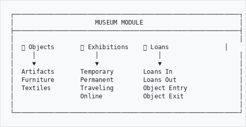
```

---

## When to Use Museum Module
```
┌─────────────────────────────────────────────────────────────┐
│  USE MUSEUM MODULE FOR:                                     │
├─────────────────────────────────────────────────────────────┤
│                                                             │
│  🏺 Historical artifacts and antiquities                    │
│  🎨 Fine art (paintings, sculptures, prints)                │
│  👗 Costumes and textiles                                   │
│  🪑 Furniture and decorative arts                           │
│  🦴 Natural history specimens                               │
│  ⚱️ Archaeological finds                                    │
│  🔧 Tools and industrial objects                            │
│  🎖️ Medals, coins, and numismatics                          │
│  🖼️ Exhibition planning and management                      │
│  📋 Loan tracking (incoming and outgoing)                   │
│                                                             │
└─────────────────────────────────────────────────────────────┘
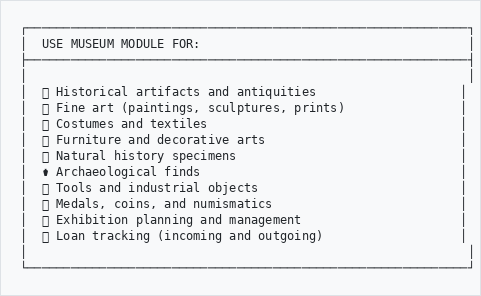
```

---

## How to Access
```
  Main Menu
      │
      ├──▶ Manage ──▶ Exhibitions     (exhibition management)
      │
      └──▶ GLAM/DAM
              │
              ▼
           Museum ─────────────────────────────────────────────┐
              │                                                 │
              ├──▶ Browse Objects      (view collection)        │
              ├──▶ Add Object          (create new record)      │
              ├──▶ Spectrum Procedures (loans, movements)       │
              ├──▶ Condition Reports   (assess condition)       │
              └──▶ CCO Dashboard       (overview and stats)     │
```

---

## Exhibition Management (NEW)

### Accessing Exhibitions

Go to **Manage** → **Exhibitions** or access the **Museum Dashboard** from the Central Dashboard.

### Exhibition Dashboard
```
┌─────────────────────────────────────────────────────────────┐
│  EXHIBITION DASHBOARD                                       │
├─────────────────────────────────────────────────────────────┤
│                                                             │
│  ┌─────────┐  ┌─────────┐  ┌─────────┐  ┌─────────┐       │
│  │   12    │  │    3    │  │    2    │  │   156   │       │
│  │  Total  │  │  Open   │  │Upcoming │  │ Objects │       │
│  └─────────┘  └─────────┘  └─────────┘  └─────────┘       │
│                                                             │
│  Currently Open:                                            │
│  • African Art Through the Ages (closes Mar 2026)          │
│  • Industrial Heritage Collection (permanent)               │
│                                                             │
│  Upcoming:                                                  │
│  • Maritime History (opens Apr 2026)                        │
│                                                             │
└─────────────────────────────────────────────────────────────┘
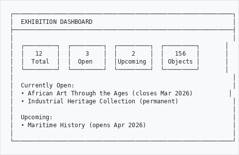
```

### Creating an Exhibition

1. Click **New Exhibition** from the dashboard or list view
2. Fill in the form:

```
┌─────────────────────────────────────────────────────────────┐
│  NEW EXHIBITION                                             │
├─────────────────────────────────────────────────────────────┤
│                                                             │
│  BASIC INFORMATION                                          │
│  Title:           [African Art Through the Ages    ]        │
│  Subtitle:        [A Journey of Cultural Heritage  ]        │
│  Type:            [Temporary                       ▼]       │
│                   • Permanent                               │
│                   • Temporary  ←                            │
│                   • Traveling                               │
│                   • Online/Virtual                          │
│                   • Pop-up                                  │
│  Theme:           [African Art                     ]        │
│  Description:     [                                ]        │
│                                                             │
│  DATES                                                      │
│  Opening Date:    [2026-03-15                      ]        │
│  Closing Date:    [2026-09-30                      ]        │
│                                                             │
│  VENUE & TEAM                                               │
│  Venue:           [Main Gallery                    ▼]       │
│  Curator:         [Dr. Sarah Mbeki                 ]        │
│  Organized By:    [Collections Department          ]        │
│                                                             │
│  BUDGET                                                     │
│  Amount:          [150000.00                       ]        │
│  Currency:        [ZAR                             ▼]       │
│                                                             │
└─────────────────────────────────────────────────────────────┘
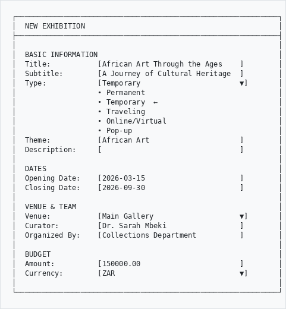
```

### Exhibition Workflow States
```
┌─────────────────────────────────────────────────────────────┐
│  EXHIBITION LIFECYCLE                                       │
├─────────────────────────────────────────────────────────────┤
│                                                             │
│  Concept ──▶ Planning ──▶ Preparation ──▶ Installation     │
│                                              │              │
│                                              ▼              │
│  Archived ◀── Closed ◀── Closing ◀────── Open             │
│                                                             │
│  Status Colors:                                             │
│  🔘 Concept (gray)                                          │
│  🔵 Planning (blue)                                         │
│  🟡 Preparation (amber)                                     │
│  🟠 Installation (orange)                                   │
│  🟢 Open (green)                                            │
│  🟣 Closing (purple)                                        │
│  ⚫ Closed (dark gray)                                      │
│  📁 Archived (light gray)                                   │
│                                                             │
└─────────────────────────────────────────────────────────────┘
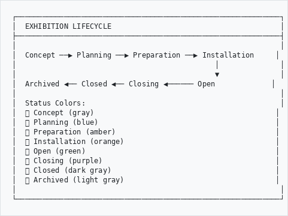
```

### Adding Objects to an Exhibition

1. Open the exhibition detail page
2. Click **Objects** tab
3. Click **Add Object**
4. Search for objects in your collection
5. Assign to a section and display location

```
┌─────────────────────────────────────────────────────────────┐
│  ADD OBJECT TO EXHIBITION                                   │
├─────────────────────────────────────────────────────────────┤
│                                                             │
│  Search Objects:  [ceremonial mask              ]           │
│                                                             │
│  Search Results:                                            │
│  ┌─────────────────────────────────────────────────────┐   │
│  │ MUS-2024-00234 - Ceremonial Mask (Zulu)            │   │
│  │ MUS-2024-00456 - Ancestor Mask (Venda)             │   │
│  └─────────────────────────────────────────────────────┘   │
│                                                             │
│  Section:         [Introduction               ▼]            │
│  Display Location:[Gallery A, Case 5          ]            │
│  Display Notes:   [Mount at eye level         ]            │
│                                                             │
└─────────────────────────────────────────────────────────────┘
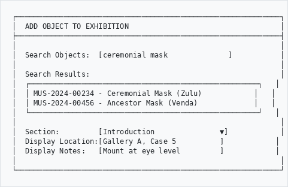
```

### Exhibition Sections

Organize your exhibition into logical sections:

```
┌─────────────────────────────────────────────────────────────┐
│  SECTIONS                                                   │
├─────────────────────────────────────────────────────────────┤
│                                                             │
│  ┌──────────────────────────────────────────────────────┐  │
│  │ 1. Introduction                      (12 objects)    │  │
│  │    Gallery A - Welcome Hall                          │  │
│  └──────────────────────────────────────────────────────┘  │
│  ┌──────────────────────────────────────────────────────┐  │
│  │ 2. Origins and Traditions            (24 objects)    │  │
│  │    Gallery B - East Wing                             │  │
│  └──────────────────────────────────────────────────────┘  │
│  ┌──────────────────────────────────────────────────────┐  │
│  │ 3. Contemporary Expressions          (18 objects)    │  │
│  │    Gallery C - Modern Space                          │  │
│  └──────────────────────────────────────────────────────┘  │
│                                                             │
│  [+ Add Section]                                            │
│                                                             │
└─────────────────────────────────────────────────────────────┘
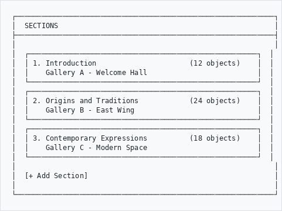
```

### Storylines and Narratives

Create guided tours and narrative journeys:

```
┌─────────────────────────────────────────────────────────────┐
│  STORYLINES                                                 │
├─────────────────────────────────────────────────────────────┤
│                                                             │
│  Main Tour                              (12 stops, 45 min)  │
│  Type: General | Audience: All visitors                     │
│  ────────────────────────────────────────────────────────── │
│  1. Welcome → 2. Origins → 3. Traditions → ... → 12. Exit  │
│                                                             │
│  Family Trail                           (8 stops, 30 min)   │
│  Type: Educational | Audience: Families with Children       │
│  ────────────────────────────────────────────────────────── │
│  Interactive stops with activities for children             │
│                                                             │
│  [+ Create Storyline]                                       │
│                                                             │
└─────────────────────────────────────────────────────────────┘
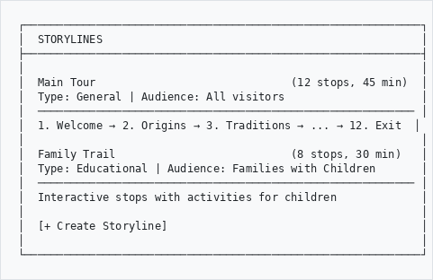
```

### Exhibition Events

Schedule events related to the exhibition:

```
┌─────────────────────────────────────────────────────────────┐
│  EVENTS                                                     │
├─────────────────────────────────────────────────────────────┤
│                                                             │
│  March 2026                                                 │
│  ┌──────────────────────────────────────────────────────┐  │
│  │ 15  Opening Night                    18:00-21:00     │  │
│  │     Private View | Registration Required | Free      │  │
│  └──────────────────────────────────────────────────────┘  │
│  ┌──────────────────────────────────────────────────────┐  │
│  │ 22  Curator's Talk                   14:00-15:30     │  │
│  │     Talk/Lecture | Lecture Hall | R50                │  │
│  └──────────────────────────────────────────────────────┘  │
│                                                             │
│  [+ Add Event]                                              │
│                                                             │
└─────────────────────────────────────────────────────────────┘
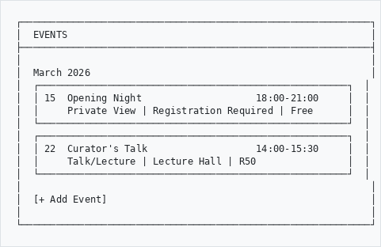
```

### Checklists

Track tasks for each exhibition phase:

```
┌─────────────────────────────────────────────────────────────┐
│  PLANNING CHECKLIST                              75%        │
├─────────────────────────────────────────────────────────────┤
│  ████████████████████░░░░░░░                               │
│                                                             │
│  ☑ Concept approved                                         │
│  ☑ Budget allocated                                         │
│  ☑ Curator assigned                                         │
│  ☑ Venue confirmed                                          │
│  ☑ Object selection complete                                │
│  ☑ Loan requests sent                                       │
│  ☐ Insurance arranged                   Due: 2026-02-15    │
│  ☐ Marketing materials designed         Due: 2026-02-28    │
│                                                             │
└─────────────────────────────────────────────────────────────┘
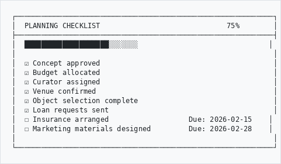
```

### Object List Report

Generate printable object lists for exhibitions:

```
┌─────────────────────────────────────────────────────────────┐
│  EXHIBITION OBJECT LIST                                     │
│  African Art Through the Ages                               │
│  Generated: 19 Jan 2026                                     │
├─────────────────────────────────────────────────────────────┤
│                                                             │
│  Section: Introduction (12 objects)                         │
│  ───────────────────────────────────────────────────────── │
│  #  Object Number    Title              Location    Value   │
│  1  MUS-2024-00234   Ceremonial Mask    Case 5    R45,000  │
│  2  MUS-2024-00235   Beaded Necklace    Case 5    R12,000  │
│  ...                                                        │
│                                                             │
│  Section Total: R245,000                                    │
│  ───────────────────────────────────────────────────────── │
│                                                             │
│  GRAND TOTAL: R1,250,000 (54 objects)                      │
│                                                             │
│  [Print] [Export CSV]                                       │
│                                                             │
└─────────────────────────────────────────────────────────────┘
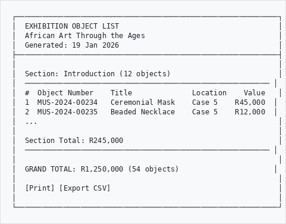
```

---

## Adding a Museum Object

### Step 1: Click Add Object

Go to **GLAM/DAM** → **Museum** → **Add**

### Step 2: Choose Object Type
```
┌─────────────────────────────────────────────────────────────┐
│  SELECT OBJECT TYPE                                         │
├─────────────────────────────────────────────────────────────┤
│                                                             │
│  ○ Artifact / Historical Object                             │
│  ○ Painting                                                 │
│  ○ Sculpture                                                │
│  ○ Photograph                                               │
│  ○ Print / Drawing                                          │
│  ○ Textile / Costume                                        │
│  ○ Furniture                                                │
│  ○ Natural History Specimen                                 │
│  ○ Archaeological Object                                    │
│  ○ Numismatic (Coin/Medal)                                  │
│                                                             │
└─────────────────────────────────────────────────────────────┘
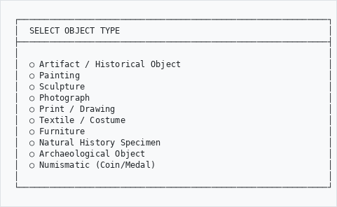
```

### Step 3: Fill in the Form
```
┌─────────────────────────────────────────────────────────────┐
│  ADD MUSEUM OBJECT                                          │
├─────────────────────────────────────────────────────────────┤
│                                                             │
│  IDENTIFICATION                                             │
│  ─────────────────────────────────────────────────────────  │
│  Object Number:   [MUS-2025-00156            ]              │
│  Object Name:     [Ceremonial headdress      ]              │
│  Other Names:     [Isicholo                  ]              │
│  Object Type:     [Headwear                  ▼]             │
│                                                             │
│  DESCRIPTION                                                │
│  ─────────────────────────────────────────────────────────  │
│  Brief Description:                                         │
│  [Traditional Zulu married woman's headdress made of       ]│
│  [woven grass and ochre-dyed cotton, circa 1920            ]│
│                                                             │
│  PRODUCTION                                                 │
│  ─────────────────────────────────────────────────────────  │
│  Creator/Maker:   [Unknown                   ]              │
│  Culture:         [Zulu                      ]              │
│  Place Made:      [KwaZulu-Natal, South Africa]             │
│  Date Made:       [circa 1920                ]              │
│                                                             │
└─────────────────────────────────────────────────────────────┘
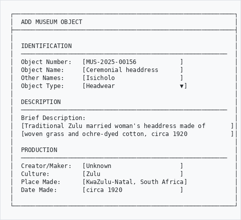
```

---

## Key Fields Explained

### Identification
```
┌─────────────────────────────────────────────────────────────┐
│  FIELD             │  WHAT TO ENTER                         │
├────────────────────┼────────────────────────────────────────┤
│  Object Number     │  Unique accession number               │
│  Object Name       │  What the object is called             │
│  Other Names       │  Alternative or local names            │
│  Object Type       │  Category (furniture, textile, etc.)   │
│  Classification    │  Subject classification                │
└────────────────────┴────────────────────────────────────────┘
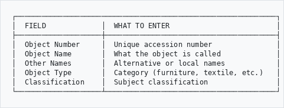
```

### Physical Description
```
┌─────────────────────────────────────────────────────────────┐
│  PHYSICAL DESCRIPTION                                       │
├─────────────────────────────────────────────────────────────┤
│                                                             │
│  DIMENSIONS                                                 │
│  Height:          [25         ] cm                          │
│  Width:           [30         ] cm                          │
│  Depth:           [28         ] cm                          │
│  Weight:          [0.5        ] kg                          │
│                                                             │
│  MATERIALS                                                  │
│  Primary:         [Woven grass               ]              │
│  Secondary:       [Cotton, ochre pigment     ]              │
│                                                             │
│  TECHNIQUES                                                 │
│  [Weaving, dyeing                            ]              │
│                                                             │
│  INSCRIPTIONS                                               │
│  [None                                       ]              │
│                                                             │
└─────────────────────────────────────────────────────────────┘
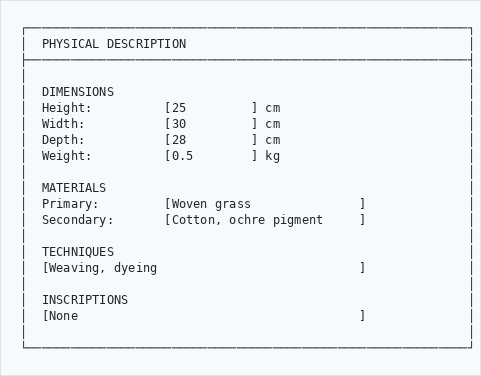
```

### Production and History
```
┌─────────────────────────────────────────────────────────────┐
│  PRODUCTION                                                 │
├─────────────────────────────────────────────────────────────┤
│                                                             │
│  Creator/Maker:   [                          ]              │
│  Role:            [Maker                     ▼]             │
│                                                             │
│  Culture/People:  [Zulu                      ]              │
│  Period:          [Early 20th century        ]              │
│                                                             │
│  Place Made:                                                │
│  Country:         [South Africa              ]              │
│  Region:          [KwaZulu-Natal             ]              │
│  Locality:        [                          ]              │
│                                                             │
│  Date:            [circa 1920                ]              │
│  Date Type:       [Made                      ▼]             │
│                                                             │
└─────────────────────────────────────────────────────────────┘
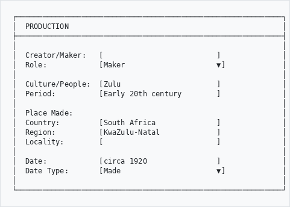
```

---

## Provenance (Ownership History)

Track the object's history of ownership with interactive visualization:
```
┌─────────────────────────────────────────────────────────────┐
│  PROVENANCE                                                 │
├─────────────────────────────────────────────────────────────┤
│                                                             │
│  Previous Owners:                                           │
│                                                             │
│  ┌─────────────────────────────────────────────────────┐   │
│  │ 1. Original owner unknown (before 1950)             │   │
│  │ 2. Smith Family Collection (1950-1985)              │   │
│  │ 3. Private collector, Cape Town (1985-2020)         │   │
│  │ 4. Donated to museum (2020)                         │   │
│  └─────────────────────────────────────────────────────┘   │
│                                                             │
│  [+ Add Provenance Entry]  [View Timeline]                  │
│                                                             │
│  Acquisition:                                               │
│  Method:          [Donation               ▼]                │
│  Date:            [15 March 2020           ]                │
│  Source:          [Estate of J. van der Berg]               │
│                                                             │
└─────────────────────────────────────────────────────────────┘
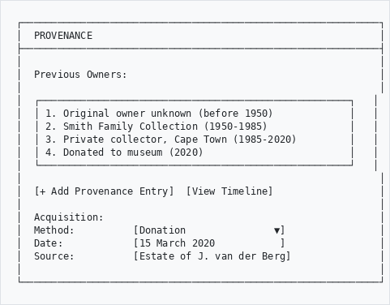
```

The provenance module includes D3.js visualization for ownership chains.

---

## Loans Management

### Loans Out (Lending Objects)
```
┌─────────────────────────────────────────────────────────────┐
│  LOAN OUT                                                   │
├─────────────────────────────────────────────────────────────┤
│                                                             │
│  Borrower:        [National Gallery of Art     ]            │
│  Contact:         [curator@gallery.org         ]            │
│                                                             │
│  Objects:                                                   │
│  ┌─────────────────────────────────────────────────────┐   │
│  │ MUS-2024-00234 - Ceremonial Mask        R45,000     │   │
│  │ MUS-2024-00456 - Ancestor Figure        R120,000    │   │
│  └─────────────────────────────────────────────────────┘   │
│  Total Insurance Value: R165,000                            │
│                                                             │
│  Loan Period:     [2026-06-01] to [2026-12-31]             │
│  Purpose:         [Exhibition                  ▼]           │
│  Exhibition:      [African Heritage Show       ]            │
│                                                             │
│  Conditions:                                                │
│  ☑ Climate control required (18-22°C, 45-55% RH)           │
│  ☑ Professional art handlers only                           │
│  ☑ No photography without permission                        │
│                                                             │
└─────────────────────────────────────────────────────────────┘
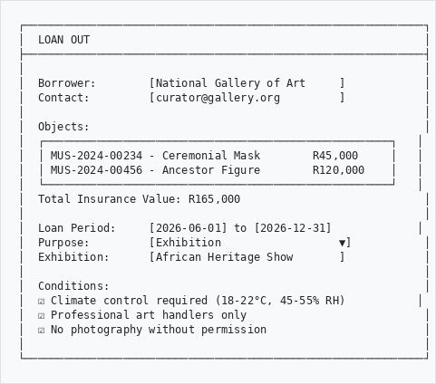
```

### Loans In (Borrowing Objects)
```
┌─────────────────────────────────────────────────────────────┐
│  LOAN IN                                                    │
├─────────────────────────────────────────────────────────────┤
│                                                             │
│  Lender:          [Private Collection Trust    ]            │
│  Contact:         [trust@email.com             ]            │
│                                                             │
│  Objects Being Borrowed:                                    │
│  ┌─────────────────────────────────────────────────────┐   │
│  │ PC-001 - Gold Ceremonial Bowl           R500,000    │   │
│  └─────────────────────────────────────────────────────┘   │
│                                                             │
│  For Exhibition:  [Treasures of Africa         ]            │
│  Loan Period:     [2026-03-01] to [2026-09-30]             │
│                                                             │
│  Our Responsibilities:                                      │
│  ☑ Insurance coverage arranged                              │
│  ☑ Climate-controlled display case                          │
│  ☑ Security escort during transport                         │
│                                                             │
└─────────────────────────────────────────────────────────────┘
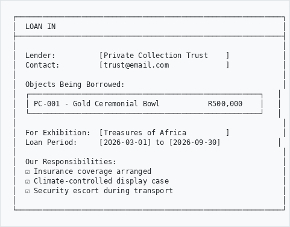
```

### Loan Workflow States
```
  Requested ──▶ Approved ──▶ In Transit ──▶ On Loan
                                              │
  Closed ◀── Returned ◀── Return Transit ◀───┘
```

---

## Location Tracking

Know where every object is:
```
┌─────────────────────────────────────────────────────────────┐
│  LOCATION                                                   │
├─────────────────────────────────────────────────────────────┤
│                                                             │
│  Current Location:                                          │
│  Building:        [Main Museum             ▼]               │
│  Room:            [Gallery 3 - African Art ▼]               │
│  Unit:            [Display Case 12         ▼]               │
│  Shelf/Position:  [Top shelf, center        ]               │
│                                                             │
│  Location Status: [On Display              ▼]               │
│                   • On Display                              │
│                   • In Storage                              │
│                   • On Loan                                 │
│                   • In Conservation                         │
│                   • In Transit                              │
│                   • Missing                                 │
│                                                             │
│  [View Movement History]                                    │
│                                                             │
└─────────────────────────────────────────────────────────────┘
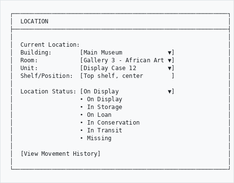
```

---

## Condition Assessment

Record the object's physical state:
```
┌─────────────────────────────────────────────────────────────┐
│  CONDITION                                                  │
├─────────────────────────────────────────────────────────────┤
│                                                             │
│  Overall Condition:  [Good                  ▼]              │
│                      • Excellent                            │
│                      • Good  ←                              │
│                      • Fair                                 │
│                      • Poor                                 │
│                      • Unacceptable                         │
│                                                             │
│  Condition Notes:                                           │
│  [Minor fading to ochre pigment on left side.              ]│
│  [Small tear (2cm) at base, stable.                        ]│
│                                                             │
│  Last Checked:    [10 January 2026          ]               │
│  Checked By:      [M. Ndlovu                ]               │
│                                                             │
│  [Add Full Condition Report]                                │
│                                                             │
└─────────────────────────────────────────────────────────────┘
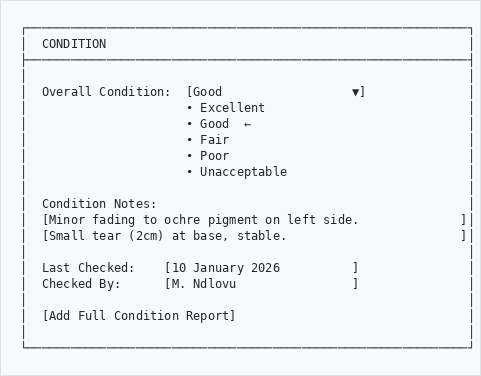
```

---

## Spectrum Procedures

Access collection management workflows:
```
┌─────────────────────────────────────────────────────────────┐
│  SPECTRUM PROCEDURES                                        │
├─────────────────────────────────────────────────────────────┤
│                                                             │
│  📥 Object Entry        - Record incoming objects           │
│  📤 Object Exit         - Record outgoing objects           │
│  📍 Location Movement   - Track object moves                │
│  📋 Loans In            - Borrow from others                │
│  📋 Loans Out           - Lend to others                    │
│  🔍 Condition Check     - Assess physical state             │
│  💰 Valuation           - Record insurance values           │
│  📸 Documentation       - Photography and records           │
│  🗑️  Deaccession         - Remove from collection           │
│                                                             │
└─────────────────────────────────────────────────────────────┘
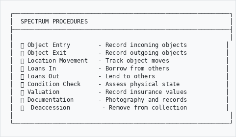
```

---

## Valuation and Insurance
```
┌─────────────────────────────────────────────────────────────┐
│  VALUATION                                                  │
├─────────────────────────────────────────────────────────────┤
│                                                             │
│  Current Value:                                             │
│  Amount:          [R 45,000.00              ]               │
│  Currency:        [ZAR                      ▼]              │
│  Type:            [Insurance Value          ▼]              │
│  Date:            [01 January 2026           ]              │
│  Valued By:       [ABC Valuers (Pty) Ltd     ]              │
│                                                             │
│  [View Valuation History]                                   │
│                                                             │
└─────────────────────────────────────────────────────────────┘
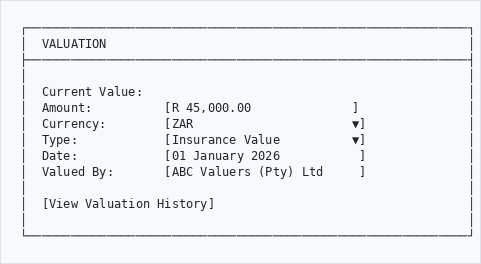
```

---

## Getty Vocabulary Integration

The museum module integrates with Getty vocabularies for standardized terminology:

- **AAT** (Art & Architecture Thesaurus) - Object types, materials, techniques
- **ULAN** (Union List of Artist Names) - Creator/maker names
- **TGN** (Thesaurus of Geographic Names) - Place names

### Local AAT Cache (Recommended)

By default, autocomplete fields query the remote Getty SPARQL endpoint on every keystroke, which can be slow. To enable **instant local autocomplete**, sync AAT terms to a local database cache:

```bash
# Initial sync — downloads ~1,000+ AAT terms across all categories
php symfony museum:aat-sync

# Deeper sync for more granular terms (depth 3)
php symfony museum:aat-sync --category=object_types --depth=3

# View cache statistics
php symfony museum:aat-sync --stats
```

Once synced, the CCO cataloguing form autocomplete fields search MySQL locally first and only fall back to the Getty API for terms not in the cache. Any Getty API results are also automatically cached for future searches (write-through caching).

| Category | Typical Terms (depth 2) | Typical Terms (depth 3) |
|----------|------------------------|------------------------|
| Object Types | ~310 | ~785 |
| Materials | ~136 | ~300+ |
| Techniques | ~78 | ~200+ |
| Styles/Periods | ~58 | ~100+ |

**Re-sync monthly** or after Getty updates their vocabulary. Use `--clear` to start fresh.

```
┌─────────────────────────────────────────────────────────────┐
│  MATERIAL (AAT Lookup)                                      │
├─────────────────────────────────────────────────────────────┤
│                                                             │
│  [ivory                                     ]               │
│                                                             │
│  Suggestions from AAT:                                      │
│  ┌─────────────────────────────────────────────────────┐   │
│  │ ivory (animal material) - 300011857                 │   │
│  │ ivory (color) - 300127906                           │   │
│  │ vegetable ivory - 300012970                         │   │
│  └─────────────────────────────────────────────────────┘   │
│                                                             │
└─────────────────────────────────────────────────────────────┘
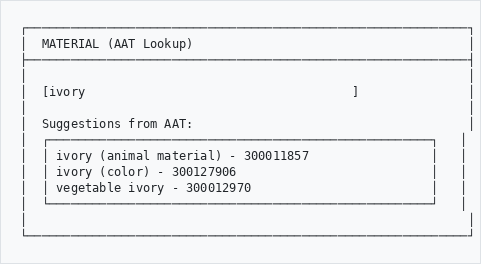
```

---

## CLI Commands

For administrators, the museum module provides CLI commands:

```bash
# --- AAT Vocabulary Cache ---
# Sync all Getty AAT categories to local cache (recommended after install)
php symfony museum:aat-sync

# Sync specific category with deeper hierarchy
php symfony museum:aat-sync --category=object_types --depth=3

# View cache statistics
php symfony museum:aat-sync --stats

# Clear and re-sync
php symfony museum:aat-sync --clear

# Preview without writing
php symfony museum:aat-sync --dry-run

# --- Getty Term Linking ---
# Link taxonomy terms to Getty vocabulary URIs
php symfony museum:getty-link --taxonomy-id=35

# --- Exhibitions ---
# List exhibitions
php symfony museum:exhibition --list

# Show exhibition details
php symfony museum:exhibition --show --id=5

# Get exhibition statistics
php symfony museum:exhibition --statistics

# Generate object list for exhibition
php symfony museum:exhibition --object-list --id=5

# Install exhibition schema (first time setup)
php symfony museum:exhibition --install-schema
```

---

## Tips for Cataloging
```
┌────────────────────────────────────────────────────────────┐
│  ✓ DO                          │  ✗ DON'T                  │
├────────────────────────────────┼────────────────────────────┤
│  Measure in metric             │  Mix measurement units     │
│  Use controlled vocabularies   │  Make up terminology       │
│  Document provenance fully     │  Skip ownership history    │
│  Photograph all sides          │  Only capture one view     │
│  Note condition issues         │  Ignore damage             │
│  Update location when moved    │  Forget to track moves     │
│  Record cultural context       │  Strip cultural meaning    │
│  Plan exhibitions in advance   │  Rush exhibition setup     │
│  Use checklists for phases     │  Skip quality checks       │
└────────────────────────────────┴────────────────────────────┘
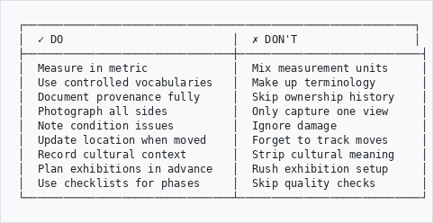
```

---

## Optional Features

Some menu items and sections only appear when the corresponding plugins are enabled. If you don't see a feature listed below, ask your administrator to enable the plugin.

| Feature | Requires Plugin |
|---------|----------------|
| SPECTRUM Procedures | ahgSpectrumPlugin |
| Condition Reports (Add link) | ahgSpectrumPlugin |
| Heritage Accounting (GRAP) section | ahgHeritageAccountingPlugin |
| Provenance (CCO) | ahgProvenancePlugin |

---

## Need Help?

Contact your system administrator or collections manager if you need assistance.

---

*Part of the AtoM AHG Framework - Museum Module v1.2*
*Last updated: February 2026*
