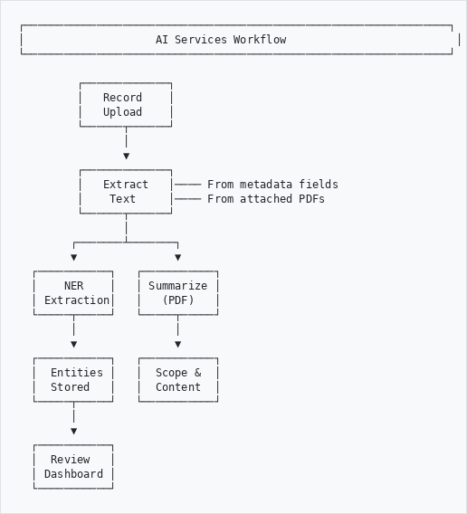
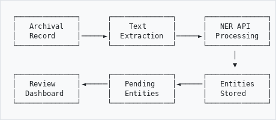
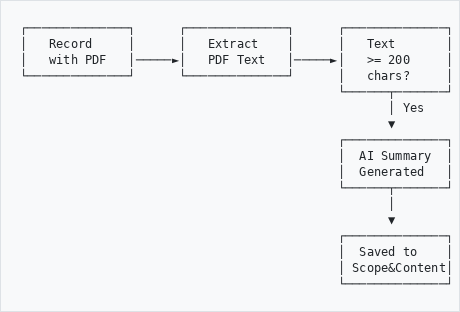
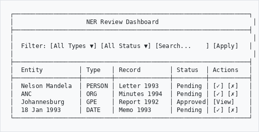

# AI Services & NER - User Guide

## Version 1.6.x | January 2026

---

## Table of Contents

1. [Introduction](#introduction)
2. [Accessing AI Services Settings](#accessing-ai-services-settings)
3. [Configuration Options](#configuration-options)
4. [Named Entity Recognition (NER)](#named-entity-recognition-ner)
5. [AI Summarization](#ai-summarization)
6. [Spell Checking](#spell-checking)
7. [NER Review Dashboard](#ner-review-dashboard)
8. [Batch Processing](#batch-processing)
9. [Troubleshooting](#troubleshooting)

---

## Introduction

The AI Services module provides intelligent automation for archival description:

- **Named Entity Recognition (NER)**: Automatically extract people, organizations, places, and dates
- **AI Summarization**: Generate summaries from PDF documents
- **Spell Checking**: Identify spelling errors in metadata

### Workflow Overview
```
┌─────────────────────────────────────────────────────────────────┐
│                    AI Services Workflow                          │
└─────────────────────────────────────────────────────────────────┘

         ┌─────────────┐
         │   Record    │
         │   Upload    │
         └──────┬──────┘
                │
                ▼
         ┌─────────────┐
         │   Extract   │──── From metadata fields
         │    Text     │──── From attached PDFs
         └──────┬──────┘
                │
        ┌───────┴───────┐
        ▼               ▼
  ┌───────────┐   ┌───────────┐
  │    NER    │   │ Summarize │
  │ Extraction│   │   (PDF)   │
  └─────┬─────┘   └─────┬─────┘
        │               │
        ▼               ▼
  ┌───────────┐   ┌───────────┐
  │  Entities │   │  Scope &  │
  │  Stored   │   │  Content  │
  └─────┬─────┘   └───────────┘
        │
        ▼
  ┌───────────┐
  │  Review   │
  │ Dashboard │
  └───────────┘

```

---

## Accessing AI Services Settings

1. Log in as administrator
2. Navigate to **Admin** → **AHG Settings** → **AI Services**
3. Or go directly to: `/admin/ahg-settings/ai-services`

---

## Configuration Options

### API Configuration

| Setting | Description | Default |
|---------|-------------|---------|
| **API URL** | AI service endpoint | `http://localhost:5004/ai/v1` |
| **API Key** | Authentication key | - |
| **Timeout** | Request timeout (seconds) | 60 |
| **Processing Mode** | `Hybrid` (direct) or `Job` (Gearman) | Job |

### NER Settings

| Setting | Description | Default |
|---------|-------------|---------|
| **Enable NER** | Turn NER on/off | ✓ On |
| **Extract from PDFs** | Extract text from attached PDFs | ✓ On |
| **Auto-extract on Upload** | Run NER when records created | Off |
| **Require Review** | Manual review before linking | ✓ On |
| **Entity Types** | Types to extract | PERSON, ORG, GPE, DATE |

### Summarization Settings

| Setting | Description | Default |
|---------|-------------|---------|
| **Enable Summarization** | Turn on/off | ✓ On |
| **Target Field** | Where to save summaries | Scope and Content |
| **Min Length** | Minimum characters | 100 |
| **Max Length** | Maximum characters | 500 |

### Spell Check Settings

| Setting | Description | Default |
|---------|-------------|---------|
| **Enable Spell Check** | Turn on/off | Off |
| **Language** | Dictionary language | en_ZA |
| **Fields to Check** | Metadata fields | title, scopeAndContent |

---

## Named Entity Recognition (NER)

### What is NER?

NER automatically identifies and classifies named entities in text into predefined categories.

### Entity Types

| Type | Code | Examples |
|------|------|----------|
| **Person** | PERSON | Nelson Mandela, Cheryl Carolus |
| **Organization** | ORG | ANC, Department of Education |
| **Location** | GPE | Johannesburg, South Africa |
| **Date** | DATE | 18 January 1993, 1994 |

### How It Works
```
┌──────────────┐      ┌──────────────┐      ┌──────────────┐
│   Archival   │      │    Text      │      │   NER API    │
│   Record     │─────►│  Extraction  │─────►│  Processing  │
└──────────────┘      └──────────────┘      └──────────────┘
                                                   │
                                                   ▼
┌──────────────┐      ┌──────────────┐      ┌──────────────┐
│   Review     │◄─────│   Pending    │◄─────│   Entities   │
│  Dashboard   │      │   Entities   │      │   Stored     │
└──────────────┘      └──────────────┘      └──────────────┘

```

### Text Sources

NER extracts text from multiple sources:

1. **Metadata Fields**
   - Title
   - Scope and Content
   - Archival History

2. **Attached PDFs** (when "Extract from PDFs" is enabled)
   - Uses `pdftotext` for text extraction
   - Limited to first 50,000 characters per document
   - PDFs must contain searchable text (not scanned images)

### Viewing Extracted Entities

1. Navigate to a record's view page
2. Look for the **Entities** section in the sidebar
3. Entities are grouped by type (People, Organizations, Places, Dates)

---

## AI Summarization

### Overview

AI Summarization automatically generates concise summaries from PDF documents and saves them to the specified metadata field (typically Scope and Content).

### Workflow
```
┌──────────────┐      ┌──────────────┐      ┌──────────────┐
│   Record     │      │   Extract    │      │   Text       │
│   with PDF   │─────►│   PDF Text   │─────►│   >= 200     │
└──────────────┘      └──────────────┘      │   chars?     │
                                            └──────┬───────┘
                                                   │ Yes
                                                   ▼
                                            ┌──────────────┐
                                            │  AI Summary  │
                                            │  Generated   │
                                            └──────┬───────┘
                                                   │
                                                   ▼
                                            ┌──────────────┐
                                            │  Saved to    │
                                            │ Scope&Content│
                                            └──────────────┘

```

### Requirements

- PDF must contain **searchable text** (not scanned images)
- Minimum **200 characters** of extractable text
- For scanned documents, run OCR first

### Best Practices

1. **Review generated summaries** - AI summaries should be reviewed for accuracy
2. **OCR scanned documents** - Run OCR before summarization for best results
3. **Check historical documents** - Names and places may need verification

---

## Spell Checking

### Overview

Spell checking identifies potential spelling errors in metadata fields using language-specific dictionaries.

### Supported Languages

| Code | Language |
|------|----------|
| en_ZA | English (South Africa) |
| en_US | English (United States) |
| en_GB | English (United Kingdom) |
| af_ZA | Afrikaans |

### Fields Checked

By default, spell checking runs on:
- Title
- Scope and Content

Additional fields can be configured in settings.

### Result Status

| Status | Description |
|--------|-------------|
| **Pending** | Not yet reviewed |
| **Reviewed** | Corrections applied |
| **Ignored** | Marked as false positive |

---

## NER Review Dashboard

### Accessing the Dashboard

Navigate to: `/ner/review` or **Admin** → **NER Review**

### Dashboard Interface
```
┌─────────────────────────────────────────────────────────────────┐
│                    NER Review Dashboard                          │
├─────────────────────────────────────────────────────────────────┤
│                                                                  │
│  Filter: [All Types ▼] [All Status ▼] [Search...    ] [Apply]   │
│                                                                  │
├─────────────────────────────────────────────────────────────────┤
│  Entity          │ Type   │ Record        │ Status  │ Actions   │
├──────────────────┼────────┼───────────────┼─────────┼───────────┤
│  Nelson Mandela  │ PERSON │ Letter 1993   │ Pending │ [✓] [✗]   │
│  ANC             │ ORG    │ Minutes 1994  │ Pending │ [✓] [✗]   │
│  Johannesburg    │ GPE    │ Report 1992   │ Approved│ [View]    │
│  18 Jan 1993     │ DATE   │ Memo 1993     │ Pending │ [✓] [✗]   │
└─────────────────────────────────────────────────────────────────┘

```

### Review Actions

| Action | Icon | Description |
|--------|------|-------------|
| **Approve** | ✓ | Confirm entity is correct |
| **Reject** | ✗ | Mark entity as incorrect |
| **Edit** | ✎ | Modify value or type |
| **Link** | 🔗 | Link to existing authority record |

### Bulk Actions

- **Approve Selected**: Approve multiple entities at once
- **Reject Selected**: Reject multiple entities
- **Export**: Export entities to CSV for external processing

### Linking to Authority Records

When approving a PERSON or ORG entity, you can link it to an existing authority record:

1. Click **Approve** on the entity
2. Search for existing authority record
3. Select match or create new
4. Entity is linked for future reference

---

## Batch Processing

### Overview

For large archives, batch processing via CLI is more efficient than processing records individually.

### CLI Commands

#### NER Extraction
```bash
# Extract from all unprocessed records
php symfony ner:extract --all --limit=1000

# Extract from specific repository
php symfony ner:extract --repository=5 --limit=500

# Extract from single record
php symfony ner:extract --object=12345

# Preview only (dry run)
php symfony ner:extract --all --dry-run --limit=10

# Force PDF extraction regardless of setting
php symfony ner:extract --all --with-pdf --limit=100
```

#### Summarization
```bash
# Summarize records with empty scope_and_content
php symfony ner:summarize --all-empty --limit=100

# Summarize specific record
php symfony ner:summarize --object=12345

# Specify different target field
php symfony ner:summarize --all-empty --field=abstract --limit=100
```

#### Spell Check
```bash
# Check all records
php symfony ner:spellcheck --all --limit=100

# Check specific repository
php symfony ner:spellcheck --repository=5 --limit=500

# Use different language
php symfony ner:spellcheck --all --language=af_ZA --limit=100
```

### Running Long Batches

For large-scale processing, use `screen` to run in the background:
```bash
# Start a screen session
screen -S batch_ner

# Run the batch
php symfony ner:extract --all --limit=100000

# Detach from screen: Ctrl+A, then D
# Reattach later: screen -r batch_ner
```

### Monitoring Progress
```bash
# Quick status check
mysql -u root database -e "
SELECT COUNT(*) as processed FROM ahg_ner_extraction;
SELECT COUNT(*) as entities FROM ahg_ner_entity;
"

# Detailed progress
mysql -u root database -e "
SELECT 
    (SELECT COUNT(*) FROM ahg_ner_extraction) as processed,
    (SELECT COUNT(*) FROM ahg_ner_entity) as entities,
    (SELECT COUNT(*) FROM information_object WHERE id != 1) - 
    (SELECT COUNT(*) FROM ahg_ner_extraction) as pending;
"
```

---

## Troubleshooting

### Common Issues

#### No Entities Found

**Symptoms**: Records processed but no entities extracted

**Possible Causes**:
1. Empty metadata fields
2. No PDF attached
3. PDF is image-only (not searchable)
4. "Extract from PDFs" disabled

**Solutions**:
1. Enable "Extract from PDFs" in settings
2. Ensure PDFs contain searchable text
3. Run OCR on scanned documents first
4. Check record has content in metadata fields

#### "Text too short" Error

**Symptoms**: Summarization fails with "Text too short"

**Cause**: Document has less than 200 characters of text

**Solution**: This is normal for brief records - summarization is skipped. No action needed.

#### API Connection Error

**Symptoms**: "API error: HTTP 0" or timeout errors

**Solutions**:
1. Verify API URL in settings is correct
2. Check AI service is running: `curl http://API_URL/health`
3. Verify API key is correct
4. Increase timeout for large documents

#### Elasticsearch Errors

**Symptoms**: Errors when saving records after processing

**Solutions**:
1. Check ES running: `systemctl status elasticsearch`
2. Verify Elastica version matches Elasticsearch version
3. Rebuild index: `php symfony search:populate`

#### Summary Not Saving

**Symptoms**: "Processed" reported but no summary in record

**Possible Cause**: Field name mismatch

**Solution**: Ensure `summary_field` setting is `scope_and_content` (with underscores)

---

## Quick Reference Card

### URLs

| Page | URL |
|------|-----|
| AI Settings | `/admin/ahg-settings/ai-services` |
| NER Review | `/ner/review` |

### CLI Commands
```bash
# NER
php symfony ner:extract --all --limit=N
php symfony ner:extract --object=ID

# Summarize
php symfony ner:summarize --all-empty --limit=N
php symfony ner:summarize --object=ID

# Spell Check
php symfony ner:spellcheck --all --limit=N
```

### Monitor Progress
```sql
SELECT COUNT(*) FROM ahg_ner_extraction;  -- Processed
SELECT COUNT(*) FROM ahg_ner_entity;       -- Entities
```

### Entity Types

| Type | Description |
|------|-------------|
| PERSON | Individual names |
| ORG | Organizations |
| GPE | Places/Locations |
| DATE | Dates and periods |

---

## May 2026 update - 16 settings keys now wired

The form at `/admin/ahgSettings/aiServices` previously had 16 of 20 fields that saved to `ahg_ner_settings` but were never read by any consumer. v1.53.23 wired them through a new `AhgAiServices\Support\AiServicesSettings` helper. The four master gates - `summarizer_enabled`, `spellcheck_enabled`, `translation_enabled`, `ner_enabled` - now act as global kill switches that sit ABOVE the per-session ingest toggles. Both must be on for the step to run.

### Processing mode

`ai_services_processing_mode` (local | cloud | hybrid). Cloud mode posts to a single hosted endpoint configured via `ai_services_api_url` + `ai_services_api_key` + `ai_services_api_timeout`, bypassing the per-provider config table at `/admin/ai/llm-config`. Use it when you want one stable hosted endpoint to handle every AI call instead of registering each provider individually.

### Translation mode

`translation_mode` (mt | llm). The `mt` mode posts to `mt_endpoint` with `mt_timeout` (e.g. for an NLLB-200 sidecar) and falls through to the LLM round-trip on failure or when the endpoint is missing. `llm` mode skips the MT endpoint entirely and uses the configured LLM with a translation prompt.

### Discovery / Qdrant fallback

The vector search service now falls back to `qdrant_url`, `qdrant_collection`, `qdrant_model`, `qdrant_min_score` (the keys exposed on the AI Services form) when the canonical `semantic_qdrant_*` settings are unset. So you don't have to know about both tables - the AI Services tile is enough. `qdrant_min_score` is sent to Qdrant as `score_threshold` and filters out hits below the floor.

### Auto-extract on upload

New `auto_extract_on_upload` toggle - when on, file uploads of digital objects auto-trigger Donut document extraction. URL/FTP-linked objects bypass since they have no local file. Result lands in `ahg_ai_inference` with full PROV-O provenance (see "AI Inference Provenance - User Guide" for the trace endpoint and override workflow).

### Master gate + per-session interplay

For ingest sessions (the wizard at `/admin/ingest/...`), every per-session `process_*` toggle is now AND-ed against its master gate:

| Per-session toggle | Master gate (AI Services settings) |
|---|---|
| `process_summarize` | `summarizer_enabled` |
| `process_spellcheck` | `spellcheck_enabled` |
| `process_translate` | `translation_enabled` |
| `process_face_detect` | `face_enabled` (new in v1.53.21) |
| `process_ner` | `ner_enabled` |

Turning a master gate off silently disables the step across every ingest session, regardless of per-session settings. Useful for cost control and emergency disable.

---

*Part of the Heratio platform | Updated May 2026*
