# OpenSeadragon Image Viewer

## User Guide

View high-resolution images with deep zoom capability for examining fine details in photographs, documents, and artwork.

---

## Overview
```
┌─────────────────────────────────────────────────────────────┐
│                    OPENSEADRAGON VIEWER                     │
├─────────────────────────────────────────────────────────────┤
│                                                             │
│  ┌─────────────────────────────────────────────────────┐   │
│  │                                                     │   │
│  │           High Resolution Deep Zoom                 │   │
│  │                                                     │   │
│  │      Scroll to zoom • Drag to pan                   │   │
│  │                                                     │   │
│  └─────────────────────────────────────────────────────┘   │
│                                                             │
│    🏠 Home  │  🔍+ Zoom In  │  🔍- Zoom Out  │  ⬜ Full     │
│                                                             │
└─────────────────────────────────────────────────────────────┘
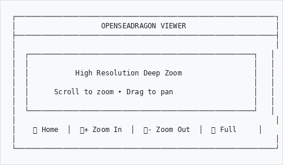
```

---

## What is OpenSeadragon?
```
┌─────────────────────────────────────────────────────────────┐
│  OPENSEADRAGON FEATURES                                     │
├─────────────────────────────────────────────────────────────┤
│                                                             │
│  🔍 Deep Zoom       - Examine smallest details              │
│  ⚡ Smooth          - Fluid zoom and pan animations         │
│  📱 Touch Ready     - Works on tablets and phones           │
│  🖼️ Any Size        - Handles massive images                │
│  🔗 IIIF Compatible - International image standard          │
│                                                             │
└─────────────────────────────────────────────────────────────┘
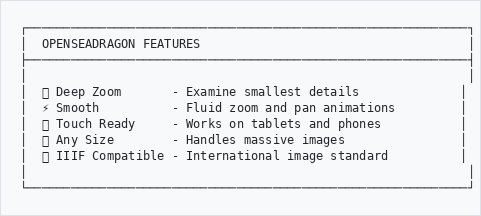
```

---

## Opening the Viewer

### From a Record

1. Browse to a record with an image
2. Click on the image thumbnail
3. The viewer opens automatically
```
┌─────────────────────────────────────────────────────────────┐
│  RECORD VIEW                                                │
├─────────────────────────────────────────────────────────────┤
│                                                             │
│  ┌───────────┐                                              │
│  │           │                                              │
│  │  [Image]  │  ← Click to open in viewer                   │
│  │           │                                              │
│  └───────────┘                                              │
│                                                             │
│  Title: Historical Map of Cape Town, 1850                   │
│  Reference: MAP/1850/001                                    │
│                                                             │
└─────────────────────────────────────────────────────────────┘
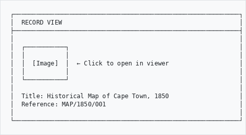
```

---

## Navigation Controls

### Mouse Controls
```
┌─────────────────────────────────────────────────────────────┐
│  ACTION              │  HOW TO                              │
├──────────────────────┼──────────────────────────────────────┤
│  Zoom in             │  Scroll wheel UP                     │
│                      │  or click 🔍+ button                 │
│                      │  or double-click                     │
│                      │                                      │
│  Zoom out            │  Scroll wheel DOWN                   │
│                      │  or click 🔍- button                 │
│                      │                                      │
│  Pan / Move          │  Click and drag                      │
│                      │                                      │
│  Reset view          │  Click 🏠 Home button                │
└──────────────────────┴──────────────────────────────────────┘
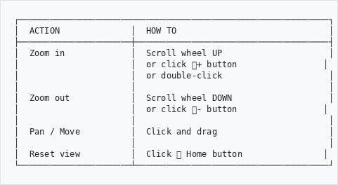
```

### Touch Controls (Mobile/Tablet)
```
┌─────────────────────────────────────────────────────────────┐
│  ACTION              │  HOW TO                              │
├──────────────────────┼──────────────────────────────────────┤
│  Zoom in             │  Pinch outward with two fingers      │
│                      │  or double-tap                       │
│                      │                                      │
│  Zoom out            │  Pinch inward with two fingers       │
│                      │                                      │
│  Pan / Move          │  Drag with one finger                │
│                      │                                      │
│  Reset view          │  Tap 🏠 Home button                  │
└──────────────────────┴──────────────────────────────────────┘
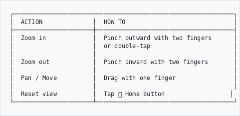
```

---

## Toolbar Buttons
```
┌─────────────────────────────────────────────────────────────┐
│  TOOLBAR                                                    │
├─────────────────────────────────────────────────────────────┤
│                                                             │
│  🏠  Home         - Reset to full image view                │
│                                                             │
│  🔍+ Zoom In      - Magnify the image                       │
│                                                             │
│  🔍- Zoom Out     - See more of the image                   │
│                                                             │
│  ⬜  Fullscreen   - Expand viewer to full screen            │
│                                                             │
│  📐  Rotate       - Turn image 90 degrees (if enabled)      │
│                                                             │
└─────────────────────────────────────────────────────────────┘
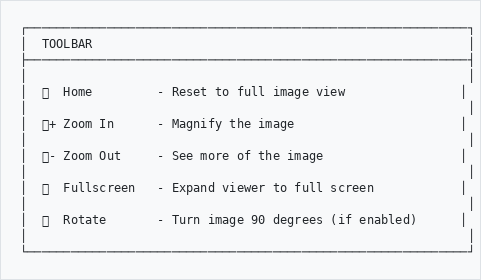
```

---

## Navigator (Mini-map)

A small overview helps you track your position:
```
┌─────────────────────────────────────────────────────────────┐
│                                              ┌───────────┐  │
│                                              │ ┌───┐     │  │
│         MAIN VIEW                            │ │You│     │  │
│                                              │ │are│     │  │
│    (Zoomed in area)                          │ │here│    │  │
│                                              │ └───┘     │  │
│                                              │  Mini-map │  │
│                                              └───────────┘  │
└─────────────────────────────────────────────────────────────┘

  The rectangle shows which part of the image you're viewing
  Click on the mini-map to jump to that area
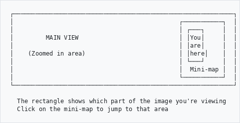
```

---

## Fullscreen Mode

### Enter Fullscreen

- Click the **Fullscreen** button (⬜)
- Or press **F** on your keyboard

### Exit Fullscreen

- Press **Escape**
- Or click the fullscreen button again
```
┌─────────────────────────────────────────────────────────────┐
│                                                             │
│                                                             │
│                    FULLSCREEN MODE                          │
│                                                             │
│           Maximum screen space for viewing                  │
│                                                             │
│                                                             │
│                                    [Press ESC to exit]      │
└─────────────────────────────────────────────────────────────┘
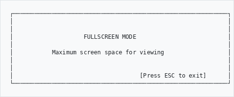
```

---

## Viewing Multiple Images

If a record has several images:
```
┌─────────────────────────────────────────────────────────────┐
│  IMAGE STRIP                                                │
├─────────────────────────────────────────────────────────────┤
│                                                             │
│  ┌─────┐ ┌─────┐ ┌─────┐ ┌─────┐ ┌─────┐                   │
│  │     │ │     │ │     │ │     │ │     │                   │
│  │  1  │ │ [2] │ │  3  │ │  4  │ │  5  │                   │
│  │     │ │     │ │     │ │     │ │     │                   │
│  └─────┘ └─────┘ └─────┘ └─────┘ └─────┘                   │
│                                                             │
│  Click a thumbnail to view that image                       │
│  Use ◀ ▶ arrows to navigate                                 │
│                                                             │
└─────────────────────────────────────────────────────────────┘
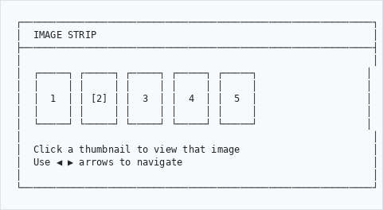
```

---

## Keyboard Shortcuts
```
┌─────────────────────────────────────────────────────────────┐
│  KEY              │  ACTION                                 │
├───────────────────┼─────────────────────────────────────────┤
│  + or =           │  Zoom in                                │
│  - or _           │  Zoom out                               │
│  0 (zero)         │  Reset to home view                     │
│  F                │  Toggle fullscreen                      │
│  Arrow keys       │  Pan left/right/up/down                 │
│  W                │  Zoom in                                │
│  S                │  Zoom out                               │
│  A                │  Pan left                               │
│  D                │  Pan right                              │
└───────────────────┴─────────────────────────────────────────┘
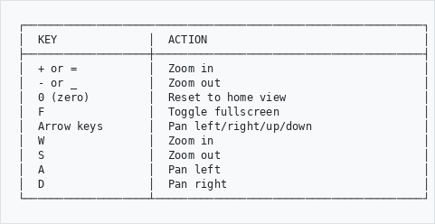
```

---

## Tips for Viewing
```
┌────────────────────────────────────────────────────────────┐
│  VIEWING DIFFERENT CONTENT                                 │
├────────────────────────────────────────────────────────────┤
│                                                            │
│  📜 Documents    - Zoom to read handwriting or small text  │
│                                                            │
│  🗺️  Maps         - Explore regions, find place names      │
│                                                            │
│  📷 Photographs  - Examine faces, details, backgrounds     │
│                                                            │
│  🎨 Artwork      - Study brushstrokes, signatures, damage  │
│                                                            │
│  📋 Forms        - Read filled-in entries                  │
│                                                            │
└────────────────────────────────────────────────────────────┘
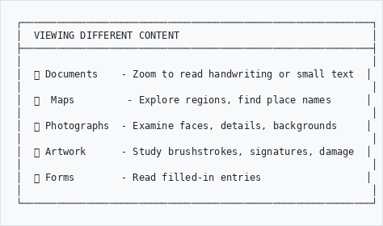
```

---

## Best Practices
```
┌────────────────────────────────┬────────────────────────────┐
│  ✓ DO                          │  ✗ DON'T                   │
├────────────────────────────────┼────────────────────────────┤
│  Use fullscreen for detail     │  Squint at small views     │
│  Wait for image to sharpen     │  Pan while loading         │
│  Use navigator to orient       │  Get lost in large images  │
│  Try keyboard shortcuts        │  Only use mouse            │
│  Zoom gradually                │  Jump max zoom immediately │
└────────────────────────────────┴────────────────────────────┘
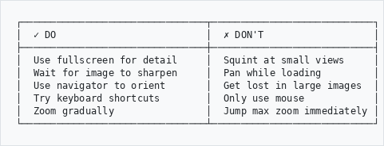
```

---

## Troubleshooting
```
Problem                          Solution
───────────────────────────────────────────────────────────
Image blurry when zoomed      →  Wait for tiles to load
                                 High detail loads progressively
                                 
Controls not responding       →  Click inside the viewer first
                                 Refresh the page
                                 
Navigator missing             →  May be hidden - look for 
                                 toggle button
                                 
Zoom feels jerky              →  Close other browser tabs
                                 Try a different browser
```

---

## Need Help?

Contact your system administrator if you experience issues.

---

*Part of the AtoM AHG Framework*
