# Privacy Compliance

## User Guide

Manage data protection compliance for POPIA, GDPR, PIPEDA, CCPA, and other privacy regulations.

---

## Workflow Overview
```
┌──────────────┐    ┌──────────────┐    ┌──────────────┐    ┌──────────────┐
│   Configure  │    │   Record     │    │   Respond    │    │   Report     │
│   Settings   │ ──▶│   Activities │ ──▶│   Requests   │ ──▶│   Compliance │
│              │    │              │    │              │    │              │
│ Jurisdictions│    │ ROPA         │    │ DSARs        │    │ Dashboard    │
│ Officers     │    │ Consent      │    │ Breaches     │    │ Audit Trail  │
└──────────────┘    └──────────────┘    └──────────────┘    └──────────────┘
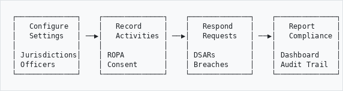
```

---

## Supported Jurisdictions
```
┌─────────────────────────────────────────────────────────────┐
│                 PRIVACY REGULATIONS                         │
├─────────────────────────────────────────────────────────────┤
│                                                             │
│  🌍 AFRICA                                                  │
│     🇿🇦 POPIA   - South Africa (2021)                        │
│     🇳🇬 NDPA    - Nigeria (2023)                             │
│     🇰🇪 DPA     - Kenya (2019)                               │
│                                                             │
│  🌍 EUROPE                                                  │
│     🇪🇺 GDPR    - European Union (2018)                      │
│                                                             │
│  🌎 NORTH AMERICA                                           │
│     🇨🇦 PIPEDA  - Canada (2000)                              │
│     🇺🇸 CCPA    - California, USA (2020)                     │
│                                                             │
└─────────────────────────────────────────────────────────────┘
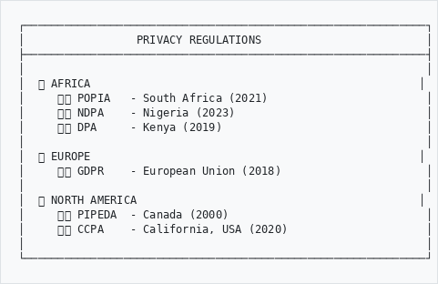
```

---

## Key Requirements by Jurisdiction
```
┌─────────────────────────────────────────────────────────────┐
│  REQUIREMENT        │ POPIA │ GDPR │ PIPEDA │ CCPA │ NDPA  │
├─────────────────────┼───────┼──────┼────────┼──────┼───────┤
│  DSAR Response Days │  30   │  30  │   30   │  45  │  30   │
│  Breach Notify Hrs  │  72   │  72  │  ASAP  │  72  │  72   │
│  DPO/IO Required    │  Yes  │ Some │   No   │  No  │  Yes  │
│  Consent Records    │  Yes  │  Yes │  Yes   │  Yes │  Yes  │
│  ROPA Required      │  Yes  │  Yes │   No   │  No  │  Yes  │
│  Cross-border Rules │  Yes  │  Yes │  Yes   │  Yes │  Yes  │
└─────────────────────┴───────┴──────┴────────┴──────┴───────┘
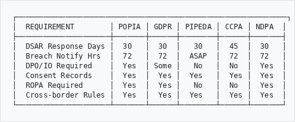
```

---

## How to Access
```
  Main Menu
      │
      ▼
   Admin
      │
      ▼
   Privacy Compliance ────────────────────────────────────┐
      │                                                   │
      ├──▶ Dashboard        (overview and stats)          │
      │                                                   │
      ├──▶ Configuration    (jurisdiction settings)       │
      │                                                   │
      ├──▶ DSAR Requests    (data subject requests)       │
      │                                                   │
      ├──▶ Breach Register  (incident tracking)           │
      │                                                   │
      ├──▶ ROPA             (processing activities)       │
      │                                                   │
      ├──▶ Consent Records  (consent management)          │
      │                                                   │
      └──▶ Information Officers (DPO/IO management)       │
```

---

## Part 1: Configuration

### Enable Jurisdictions
```
┌─────────────────────────────────────────────────────────────┐
│ JURISDICTION CONFIGURATION                                  │
├─────────────────────────────────────────────────────────────┤
│                                                             │
│  Select jurisdictions that apply to your organisation:      │
│                                                             │
│  ☑ 🇿🇦 POPIA (South Africa)                                  │
│     Response deadline: [ 30 ] days                          │
│     Breach notification: [ 72 ] hours                       │
│                                                             │
│  ☐ 🇪🇺 GDPR (European Union)                                 │
│     Response deadline: [ 30 ] days                          │
│     Breach notification: [ 72 ] hours                       │
│                                                             │
│  ☐ 🇨🇦 PIPEDA (Canada)                                       │
│     Response deadline: [ 30 ] days                          │
│     Breach notification: [ As soon as possible ]            │
│                                                             │
│  ☐ 🇺🇸 CCPA (California)                                     │
│     Response deadline: [ 45 ] days                          │
│     Breach notification: [ 72 ] hours                       │
│                                                             │
│                                   [ Save Configuration ]    │
│                                                             │
└─────────────────────────────────────────────────────────────┘
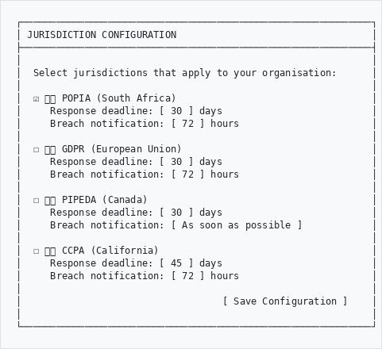
```

---

### Organisation Settings
```
┌─────────────────────────────────────────────────────────────┐
│ ORGANISATION DETAILS                                        │
├─────────────────────────────────────────────────────────────┤
│                                                             │
│  Organisation Name *   [The Archive Museum____________]     │
│                                                             │
│  Registration Number   [2020/123456/07_______________]      │
│                                                             │
│  Data Protection Email [privacy@archive.org.za_______]      │
│                                                             │
│  Physical Address      [123 Heritage Street__________]      │
│                        [Pretoria, 0001_______________]      │
│                                                             │
│  Default Retention     [ 7 ] years                          │
│                                                             │
│                                                             │
│                                        [ Save Settings ]    │
│                                                             │
└─────────────────────────────────────────────────────────────┘
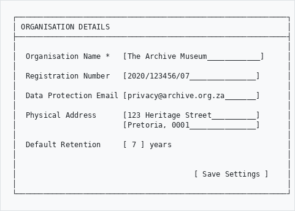
```

---

## Part 2: Information Officers

### What is an Information Officer?
```
┌─────────────────────────────────────────────────────────────┐
│                                                             │
│  POPIA: Information Officer (IO)                            │
│  GDPR:  Data Protection Officer (DPO)                       │
│  NDPA:  Data Protection Officer (DPO)                       │
│                                                             │
│  Responsibilities:                                          │
│  • Handle data subject requests                             │
│  • Report breaches to regulator                             │
│  • Ensure compliance with regulations                       │
│  • Conduct privacy impact assessments                       │
│  • Train staff on data protection                           │
│                                                             │
│  POPIA requires registration with Information Regulator     │
│                                                             │
└─────────────────────────────────────────────────────────────┘
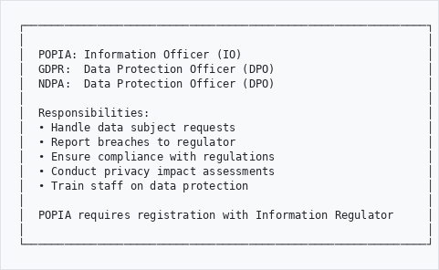
```

---

### Register Information Officer
```
┌─────────────────────────────────────────────────────────────┐
│ ADD INFORMATION OFFICER                                     │
├─────────────────────────────────────────────────────────────┤
│                                                             │
│  Name *               [Jane Smith___________________]       │
│                                                             │
│  Position *           [Records Manager______________]       │
│                                                             │
│  Email *              [jane.smith@archive.org.za____]       │
│                                                             │
│  Phone                [012 345 6789_________________]       │
│                                                             │
│  Jurisdiction *       [ POPIA                    ▼]         │
│                                                             │
│  Registration Status  [ Registered               ▼]         │
│                       ┌─────────────────────────────┐       │
│                       │ Pending                     │       │
│                       │ Registered            ←     │       │
│                       │ Expired                     │       │
│                       └─────────────────────────────┘       │
│                                                             │
│  Registration Number  [IO/2024/12345________________]       │
│                                                             │
│  Registration Date    [ 15/03/2024  📅]                    │
│                                                             │
│                              [ Cancel ]  [ Save Officer ]   │
│                                                             │
└─────────────────────────────────────────────────────────────┘
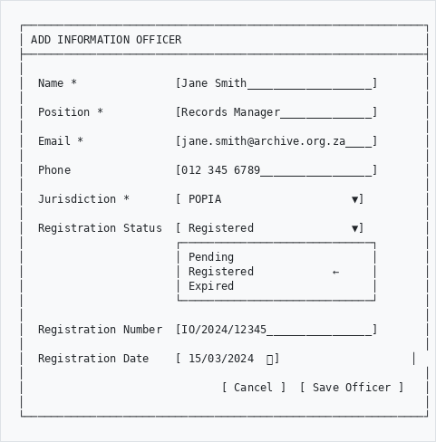
```

---

## Part 3: DSAR Management

### What is a DSAR?
```
┌─────────────────────────────────────────────────────────────┐
│                                                             │
│   DSAR = Data Subject Access Request                        │
│                                                             │
│   A person's right to:                                      │
│   • Know what personal data you hold about them             │
│   • Get a copy of their data                                │
│   • Have incorrect data corrected                           │
│   • Have data deleted (right to erasure)                    │
│   • Object to processing                                    │
│   • Data portability                                        │
│                                                             │
│   YOU MUST RESPOND WITHIN THE DEADLINE:                     │
│   • POPIA/GDPR/NDPA: 30 days                               │
│   • CCPA: 45 days                                           │
│                                                             │
└─────────────────────────────────────────────────────────────┘
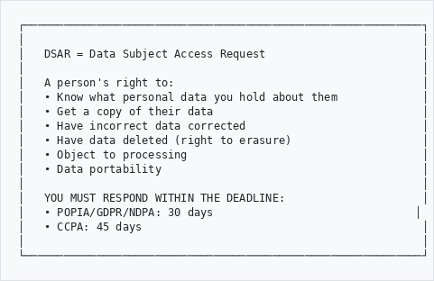
```

---

### DSAR Workflow
```
                      Request Received
                            │
                            ▼
               ┌────────────────────────┐
               │   Verify Identity      │
               │   (Is this really      │
               │    the data subject?)  │
               └───────────┬────────────┘
                           │
              ┌────────────┴────────────┐
              │                         │
         Verified                  Not Verified
              │                         │
              ▼                         ▼
    ┌──────────────────┐      ┌──────────────────┐
    │  Search for      │      │  Request more    │
    │  personal data   │      │  information     │
    └────────┬─────────┘      └──────────────────┘
             │
             ▼
    ┌──────────────────┐
    │  Compile         │
    │  response        │
    └────────┬─────────┘
             │
        ┌────┴────┐
        │         │
    Data Found  No Data
        │         │
        ▼         ▼
   ┌─────────┐ ┌─────────┐
   │ Provide │ │ Inform  │
   │ data    │ │ subject │
   └────┬────┘ └────┬────┘
        │           │
        └─────┬─────┘
              │
              ▼
       ┌─────────────┐
       │   COMPLETE  │
       │  Log outcome│
       └─────────────┘
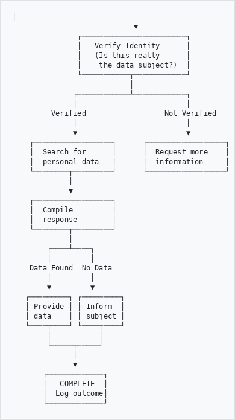
```

---

### Log New DSAR
```
┌─────────────────────────────────────────────────────────────┐
│ NEW DATA SUBJECT ACCESS REQUEST                             │
├─────────────────────────────────────────────────────────────┤
│                                                             │
│  Request Date *       [ 10/01/2026  📅]                    │
│                                                             │
│  Jurisdiction *       [ POPIA                    ▼]         │
│                                                             │
│  Due Date             [ 09/02/2026 ] (auto-calculated)      │
│                                                             │
│  Request Type *       [ Access                   ▼]         │
│                       ┌─────────────────────────────┐       │
│                       │ Access               ←      │       │
│                       │ Correction                  │       │
│                       │ Deletion                    │       │
│                       │ Objection                   │       │
│                       │ Portability                 │       │
│                       └─────────────────────────────┘       │
│                                                             │
│  ─────────────────────────────────────────────────────────  │
│  DATA SUBJECT DETAILS                                       │
│                                                             │
│  Name *               [John Doe_____________________]       │
│                                                             │
│  Email *              [john.doe@example.com_________]       │
│                                                             │
│  Phone                [082 123 4567_________________]       │
│                                                             │
│  ID Verified?         ○ Yes  ● No  ○ Pending                │
│                                                             │
│  ─────────────────────────────────────────────────────────  │
│  REQUEST DETAILS                                            │
│                                                             │
│  Description:                                               │
│  [Requesting copy of all personal data held in archive    ]│
│  [records. Specifically interested in employment records. ]│
│                                                             │
│  Attachments:         [📎 ID Copy.pdf] [📎 Request Form]    │
│                                                             │
│                              [ Cancel ]  [ Log Request ]    │
│                                                             │
└─────────────────────────────────────────────────────────────┘
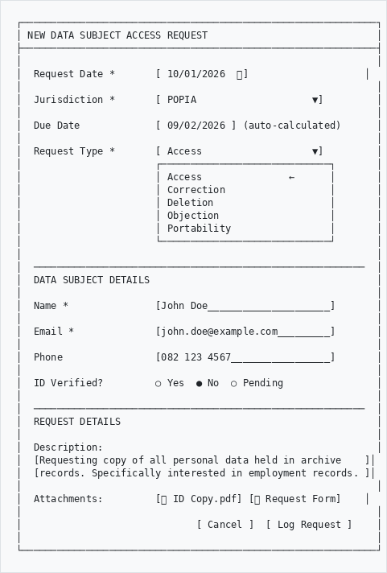
```

---

### DSAR Dashboard
```
┌─────────────────────────────────────────────────────────────┐
│ DSAR REQUESTS                                               │
├──────────────────┬──────────────────┬───────────────────────┤
│                  │                  │                       │
│  OPEN            │  DUE SOON        │   OVERDUE             │
│                  │  (7 days)        │                       │
│      8           │       3          │       1               │
│   requests       │    requests      │    request            │
│                  │      ⚠️           │      🔴               │
│                  │                  │                       │
└──────────────────┴──────────────────┴───────────────────────┘

┌─────────────────────────────────────────────────────────────┐
│ ID     │ Subject    │ Type     │ Due Date   │ Status       │
├────────┼────────────┼──────────┼────────────┼──────────────┤
│ DSR-001│ John Doe   │ Access   │ 09 Feb 26  │ 🟡 In Progress│
│ DSR-002│ Jane Smith │ Deletion │ 15 Feb 26  │ 🟡 In Progress│
│ DSR-003│ Bob Wilson │ Access   │ 🔴 02 Jan 26│ 🔴 Overdue    │
│ DSR-004│ Mary Jones │ Correct  │ 20 Feb 26  │ 🟢 New        │
└────────┴────────────┴──────────┴────────────┴──────────────┘

[ + New Request ]                        [ Export ] [ Filter ]
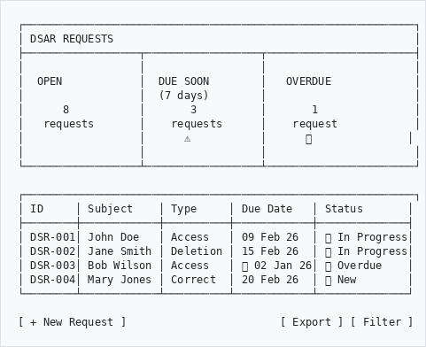
```

---

## Part 4: Breach Management

### What is a Data Breach?
```
┌─────────────────────────────────────────────────────────────┐
│                                                             │
│   BREACH = Unauthorised access, loss, or disclosure         │
│            of personal information                          │
│                                                             │
│   Examples:                                                 │
│   • Cyber attack / hacking                                  │
│   • Lost or stolen device with data                         │
│   • Email sent to wrong recipient                           │
│   • Unauthorised employee access                            │
│   • Physical theft of records                               │
│   • Accidental publication of data                          │
│                                                             │
│   YOU MUST:                                                 │
│   1. Report to regulator within 72 hours (usually)          │
│   2. Notify affected individuals if risk of harm            │
│   3. Document the incident and response                     │
│                                                             │
└─────────────────────────────────────────────────────────────┘
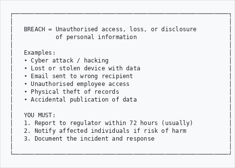
```

---

### Breach Response Workflow
```
              Breach Discovered
                    │
                    ▼
         ┌──────────────────┐
         │   CONTAIN        │
         │   Stop the       │
         │   breach         │
         └────────┬─────────┘
                  │
                  ▼
         ┌──────────────────┐
         │   ASSESS         │
         │   • What data?   │
         │   • How many?    │
         │   • What risk?   │
         └────────┬─────────┘
                  │
         ┌────────┴────────┐
         │                 │
    High Risk         Low Risk
         │                 │
         ▼                 ▼
  ┌─────────────┐   ┌─────────────┐
  │ NOTIFY      │   │ DOCUMENT    │
  │ • Regulator │   │ • Log only  │
  │   (72 hrs)  │   │ • Monitor   │
  │ • Subjects  │   └──────┬──────┘
  └──────┬──────┘          │
         │                 │
         ▼                 │
  ┌─────────────┐          │
  │ REMEDIATE   │          │
  │ Fix cause   │◀─────────┘
  │ Prevent     │
  │ recurrence  │
  └──────┬──────┘
         │
         ▼
  ┌─────────────┐
  │   REVIEW    │
  │ Lessons     │
  │ learned     │
  └─────────────┘
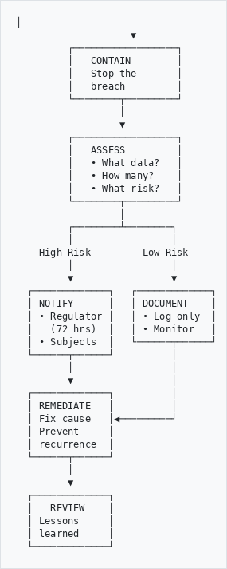
```

---

### Log Data Breach
```
┌─────────────────────────────────────────────────────────────┐
│ REPORT DATA BREACH                                          │
├─────────────────────────────────────────────────────────────┤
│                                                             │
│  Incident Date *      [ 08/01/2026  📅] at [14:30]         │
│                                                             │
│  Discovery Date *     [ 09/01/2026  📅]                    │
│                                                             │
│  Jurisdiction *       [ POPIA                    ▼]         │
│                                                             │
│  Notification Deadline [ 12/01/2026 ] (72 hours)            │
│                                                             │
│  ─────────────────────────────────────────────────────────  │
│  INCIDENT DETAILS                                           │
│                                                             │
│  Category *           [ Cyber Attack             ▼]         │
│                       ┌─────────────────────────────┐       │
│                       │ Cyber Attack          ←     │       │
│                       │ Lost/Stolen Device          │       │
│                       │ Unauthorised Access         │       │
│                       │ Misdirected Communication   │       │
│                       │ Physical Theft              │       │
│                       │ Other                       │       │
│                       └─────────────────────────────┘       │
│                                                             │
│  Data Types Affected: ☑ Names      ☑ ID Numbers            │
│                       ☑ Contact    ☐ Financial             │
│                       ☐ Health     ☐ Children's Data       │
│                                                             │
│  Estimated Records    [ 250______] affected                 │
│                                                             │
│  Description:                                               │
│  [Ransomware attack on file server. Researcher database   ]│
│  [potentially accessed. Server isolated, forensic         ]│
│  [investigation underway.                                 ]│
│                                                             │
│  ─────────────────────────────────────────────────────────  │
│  RISK ASSESSMENT                                            │
│                                                             │
│  Severity *           ○ Low  ● Medium  ○ High  ○ Critical   │
│                                                             │
│  Likelihood of Harm   ○ Low  ● Medium  ○ High               │
│                                                             │
│  ─────────────────────────────────────────────────────────  │
│  NOTIFICATIONS                                              │
│                                                             │
│  Regulator Notified?  ○ Yes  ● No  ○ Not Required           │
│                                                             │
│  Subjects Notified?   ○ Yes  ● No  ○ Not Required           │
│                                                             │
│                              [ Cancel ]  [ Log Incident ]   │
│                                                             │
└─────────────────────────────────────────────────────────────┘
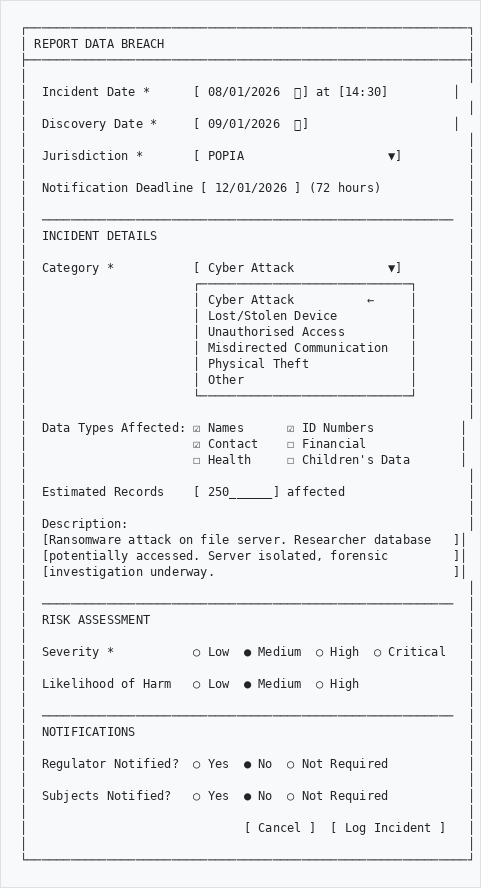
```

---

## Part 5: ROPA

### What is ROPA?
```
┌─────────────────────────────────────────────────────────────┐
│                                                             │
│   ROPA = Record of Processing Activities                    │
│                                                             │
│   Documents all processing of personal information:         │
│   • What data you collect                                   │
│   • Why you process it (legal basis)                        │
│   • Who has access                                          │
│   • How long you keep it                                    │
│   • What security measures protect it                       │
│                                                             │
│   Required under POPIA, GDPR, and NDPA                      │
│                                                             │
└─────────────────────────────────────────────────────────────┘
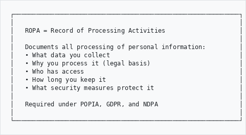
```

---

### Add Processing Activity
```
┌─────────────────────────────────────────────────────────────┐
│ ADD PROCESSING ACTIVITY                                     │
├─────────────────────────────────────────────────────────────┤
│                                                             │
│  Activity Name *      [Researcher Registration_______]      │
│                                                             │
│  Department           [Research Services_____________]      │
│                                                             │
│  Jurisdiction         [ POPIA                    ▼]         │
│                                                             │
│  ─────────────────────────────────────────────────────────  │
│  DATA CATEGORIES                                            │
│                                                             │
│  Personal Data Types: ☑ Names      ☑ Contact Details       │
│                       ☑ ID Numbers ☐ Financial             │
│                       ☐ Health     ☐ Biometric             │
│                       ☑ Photos     ☐ Children's Data       │
│                                                             │
│  ─────────────────────────────────────────────────────────  │
│  LEGAL BASIS                                                │
│                                                             │
│  Purpose *            [Registration and access control    ]│
│                       [for reading room services.         ]│
│                                                             │
│  Legal Basis *        [ Consent                  ▼]         │
│                       ┌─────────────────────────────┐       │
│                       │ Consent               ←     │       │
│                       │ Contract                    │       │
│                       │ Legal Obligation            │       │
│                       │ Vital Interests             │       │
│                       │ Public Interest             │       │
│                       │ Legitimate Interests        │       │
│                       └─────────────────────────────┘       │
│                                                             │
│  ─────────────────────────────────────────────────────────  │
│  RETENTION & SECURITY                                       │
│                                                             │
│  Retention Period     [ 5 ] years after last visit          │
│                                                             │
│  Security Measures:   ☑ Access Control  ☑ Encryption       │
│                       ☑ Backup          ☑ Audit Trail      │
│                                                             │
│  ─────────────────────────────────────────────────────────  │
│  DATA SHARING                                               │
│                                                             │
│  Recipients           [Staff only - no third parties     ]│
│                                                             │
│  Cross-border Transfer ○ Yes  ● No                          │
│                                                             │
│                              [ Cancel ]  [ Save Activity ]  │
│                                                             │
└─────────────────────────────────────────────────────────────┘
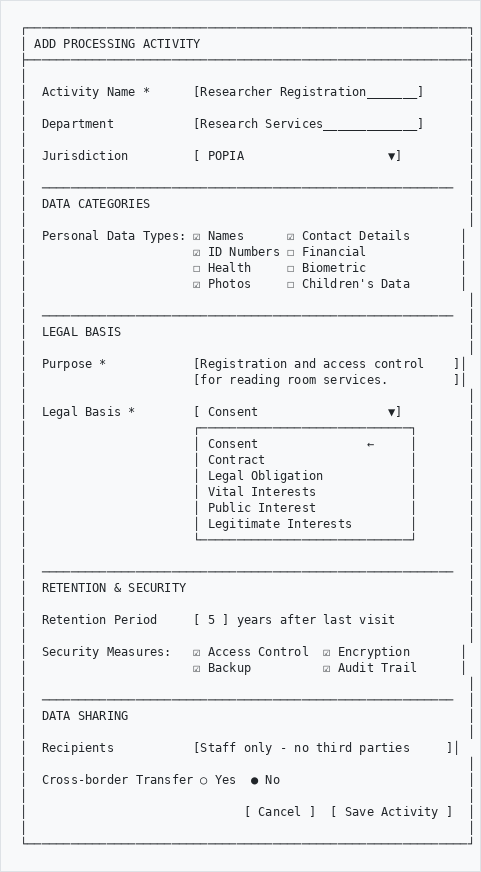
```

---

## Part 6: Consent Management

### Record Consent
```
┌─────────────────────────────────────────────────────────────┐
│ CONSENT RECORD                                              │
├─────────────────────────────────────────────────────────────┤
│                                                             │
│  Subject Name *       [Mary Johnson_________________]       │
│                                                             │
│  Subject Email        [mary.johnson@example.com_____]       │
│                                                             │
│  Consent Purpose *    [Email newsletter subscription ]      │
│                                                             │
│  Consent Given        [ 15/01/2026  📅]                    │
│                                                             │
│  Method               [ Written Form             ▼]         │
│                       ┌─────────────────────────────┐       │
│                       │ Written Form          ←     │       │
│                       │ Online Form                 │       │
│                       │ Verbal (recorded)           │       │
│                       │ Email                       │       │
│                       └─────────────────────────────┘       │
│                                                             │
│  Consent Text Shown:                                        │
│  [I agree to receive monthly newsletter updates about     ]│
│  [archive events and new collections. I understand I      ]│
│  [can unsubscribe at any time.                           ]│
│                                                             │
│  Evidence Attached:   [📎 Consent Form Signed.pdf]          │
│                                                             │
│  Jurisdiction         [ POPIA                    ▼]         │
│                                                             │
│                              [ Cancel ]  [ Save Consent ]   │
│                                                             │
└─────────────────────────────────────────────────────────────┘
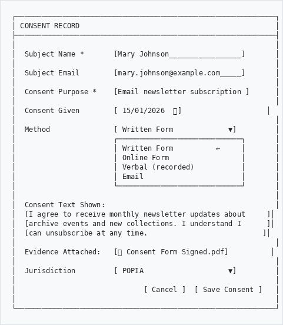
```

---

## Part 7: PAIA Requests (South Africa)

### What is PAIA?
```
┌─────────────────────────────────────────────────────────────┐
│                                                             │
│   PAIA = Promotion of Access to Information Act             │
│                                                             │
│   Gives the public the right to access:                     │
│   • Records held by government bodies                       │
│   • Records held by private bodies                          │
│     (if needed for rights protection)                       │
│                                                             │
│   Response deadline: 30 days                                │
│   (can extend by another 30 if necessary)                   │
│                                                             │
│   Related to but separate from POPIA                        │
│                                                             │
└─────────────────────────────────────────────────────────────┘
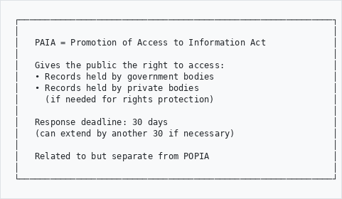
```

---

## Part 8: PII Detection

### What is PII?
```
┌─────────────────────────────────────────────────────────────┐
│                                                             │
│   PII = Personally Identifiable Information                 │
│                                                             │
│   Information that can identify an individual:              │
│   • Names                                                   │
│   • ID numbers (SA ID, passport, etc.)                      │
│   • Email addresses                                         │
│   • Phone numbers                                           │
│   • Bank account numbers                                    │
│   • Tax numbers                                             │
│                                                             │
│   The system automatically scans your records for PII       │
│   to help you comply with privacy regulations.              │
│                                                             │
└─────────────────────────────────────────────────────────────┘
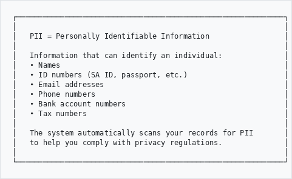
```

---

### PII Types Detected
```
┌─────────────────────────────────────────────────────────────┐
│  TYPE             │  RISK    │  EXAMPLE                     │
├───────────────────┼──────────┼──────────────────────────────┤
│  SA ID Number     │  HIGH    │  8501015800083               │
│  Nigerian NIN     │  HIGH    │  12345678901                 │
│  Passport Number  │  HIGH    │  A12345678                   │
│  Bank Account     │  HIGH    │  1234567890                  │
│  Credit Card      │  CRITICAL│  4111-1111-1111-1111         │
│  Tax Number       │  HIGH    │  0123456789                  │
│  Email Address    │  MEDIUM  │  john@example.com            │
│  Phone Number     │  MEDIUM  │  +27 82 123 4567             │
│  Person Name      │  MEDIUM  │  John Smith (via AI)         │
│  Organisation     │  LOW     │  ACME Corp (via AI)          │
│  Place            │  LOW     │  Johannesburg (via AI)       │
└───────────────────┴──────────┴──────────────────────────────┘
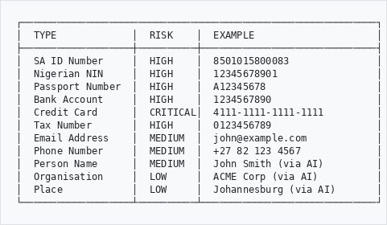
```

---

### How to Access PII Scanner
```
  Main Menu
      │
      ▼
   Admin
      │
      ▼
   Privacy Compliance
      │
      ├──▶ PII Scanner         (scan and detect PII)
      │       │
      │       ├──▶ Dashboard   (statistics overview)
      │       ├──▶ Run Scan    (batch scan records)
      │       └──▶ Review      (approve/reject findings)
      │
      └──▶ ...other options...
```

**Or from any record:**
```
  View any archival description
      │
      ▼
   Sidebar (right side)
      │
      ▼
   "Privacy & PII" section
      │
      ├──▶ Scan for PII        (scan this record)
      ├──▶ PII Review Queue    (see all pending)
      └──▶ PII Dashboard       (statistics)
```

---

### Scan Individual Record
```
┌─────────────────────────────────────────────────────────────┐
│ PII DETECTION RESULTS                                       │
├─────────────────────────────────────────────────────────────┤
│                                                             │
│  ⚠️ 3 high-risk PII entities detected!                      │
│                                                             │
│  ─────────────────────────────────────────────────────────  │
│                                                             │
│  🔴 SA ID Numbers (1)                                       │
│     ┌──────────────────────────────┐                        │
│     │ 8501****083                  │                        │
│     └──────────────────────────────┘                        │
│                                                             │
│  🟡 Email Addresses (1)                                     │
│     ┌──────────────────────────────┐                        │
│     │ jo***@example.com            │                        │
│     └──────────────────────────────┘                        │
│                                                             │
│  🔵 People (via AI) (2)                                     │
│     ┌──────────────────────────────┐                        │
│     │ John Smith    Mary Jones     │                        │
│     └──────────────────────────────┘                        │
│                                                             │
│  ─────────────────────────────────────────────────────────  │
│                                                             │
│  Risk Score: 45/100                      [ Review PII ]     │
│                                                             │
└─────────────────────────────────────────────────────────────┘
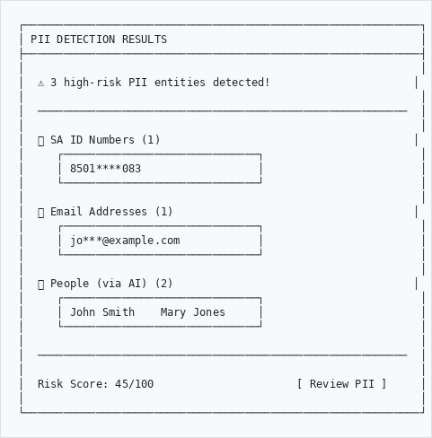
```

---

### PII Scanner Dashboard
```
┌─────────────────────────────────────────────────────────────┐
│ PII DETECTION SCANNER                                       │
├──────────────────┬──────────────────┬───────────────────────┤
│                  │                  │                       │
│  OBJECTS SCANNED │  WITH PII        │   HIGH-RISK           │
│                  │                  │                       │
│      1,245       │      156         │       23              │
│    records       │    records       │    records 🔴         │
│                  │                  │                       │
└──────────────────┴──────────────────┴───────────────────────┘

┌─────────────────────────────────────────────────────────────┐
│ RUN PII SCAN                                                │
├─────────────────────────────────────────────────────────────┤
│                                                             │
│  Repository      [ All repositories           ▼]            │
│                                                             │
│  Batch Size      [ 50 objects                 ▼]            │
│                  ┌───────────────────────────────┐          │
│                  │ 25 objects                    │          │
│                  │ 50 objects              ←     │          │
│                  │ 100 objects                   │          │
│                  │ 250 objects                   │          │
│                  └───────────────────────────────┘          │
│                                                             │
│                              [ ▶ Start Scan ]               │
│                                                             │
└─────────────────────────────────────────────────────────────┘

┌─────────────────────────────────────────────────────────────┐
│ HIGH-RISK OBJECTS                                    🔴     │
├─────────────────────────────────────────────────────────────┤
│                                                             │
│  Object              │ PII Count │ Scanned    │ Actions     │
│  ────────────────────┼───────────┼────────────┼─────────────│
│  Personnel File 1954 │    12     │ 2026-01-20 │ [View]      │
│  Medical Records Box │     8     │ 2026-01-20 │ [View]      │
│  Application Forms   │     6     │ 2026-01-19 │ [View]      │
│                                                             │
└─────────────────────────────────────────────────────────────┘
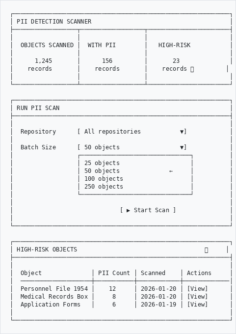
```

---

### Review PII Entities
```
┌─────────────────────────────────────────────────────────────┐
│ PII REVIEW QUEUE                              Pending: 47   │
├─────────────────────────────────────────────────────────────┤
│                                                             │
│  Status │ Type    │ Value          │ Object     │ Actions   │
│  ───────┼─────────┼────────────────┼────────────┼───────────│
│  🔴 Flag│ SA_ID   │ 8501****083    │ File #123  │ [✓][✎][✗] │
│  🟡 Pend│ EMAIL   │ jo***@mail.com │ Letter #45 │ [✓][✎][✗] │
│  🟡 Pend│ PERSON  │ John Smith     │ Report #67 │ [✓][✎][✗] │
│  🟣 ISAD│ PLACE   │ Johannesburg   │ Report #67 │ [✓][✎][✗] │
│                                                             │
└─────────────────────────────────────────────────────────────┘

┌─────────────────────────────────────────────────────────────┐
│ REVIEW ACTIONS                                              │
├─────────────────────────────────────────────────────────────┤
│                                                             │
│  ✓ APPROVE   - Not sensitive PII, can remain visible        │
│                                                             │
│  ✎ REDACT    - Is PII, should be masked/restricted          │
│               (For PDFs: black boxes applied to text)       │
│                                                             │
│  ✗ REJECT    - False positive, not actually PII             │
│                                                             │
└─────────────────────────────────────────────────────────────┘
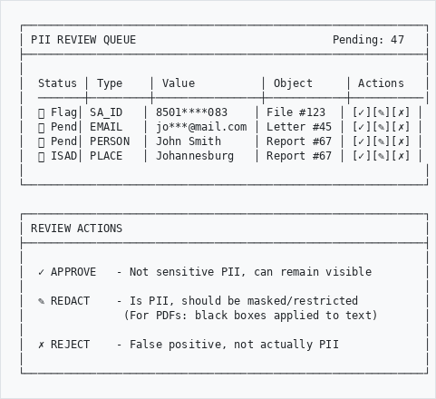
```

---

### Entity Sources (Badge Colors)
```
┌─────────────────────────────────────────────────────────────┐
│ PII ENTITY SOURCES                                          │
├─────────────────────────────────────────────────────────────┤
│                                                             │
│  🔵 NER (Blue)     - AI-extracted from text/images via NER  │
│                      Types: PERSON, ORG, GPE, DATE          │
│                                                             │
│  🔴 Regex (Red)    - Pattern-matched PII identifiers        │
│                      Types: SA_ID, EMAIL, PHONE, BANK_ACCT  │
│                                                             │
│  🟣 ISAD (Purple)  - From ISAD(G) access points             │
│                      Types: Subject, Place, Name, Date      │
│                                                             │
│  Note: ISAD access points are metadata fields you entered.  │
│  They may contain names, places, or dates that need to be   │
│  redacted from public-facing documents.                     │
│                                                             │
└─────────────────────────────────────────────────────────────┘
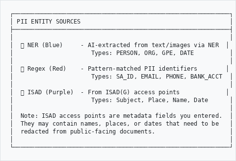
```

---

### Using the Command Line
```
┌─────────────────────────────────────────────────────────────┐
│ CLI COMMANDS FOR PII SCANNING                               │
├─────────────────────────────────────────────────────────────┤
│                                                             │
│  # Show statistics                                          │
│  php symfony privacy:scan-pii --stats                       │
│                                                             │
│  # Scan a specific record                                   │
│  php symfony privacy:scan-pii --id=123                      │
│                                                             │
│  # Batch scan 50 records                                    │
│  php symfony privacy:scan-pii --limit=50                    │
│                                                             │
│  # Scan specific repository only                            │
│  php symfony privacy:scan-pii --repository=5                │
│                                                             │
│  # Re-scan already scanned records                          │
│  php symfony privacy:scan-pii --rescan                      │
│                                                             │
│  # Show detailed output                                     │
│  php symfony privacy:scan-pii --verbose                     │
│                                                             │
└─────────────────────────────────────────────────────────────┘
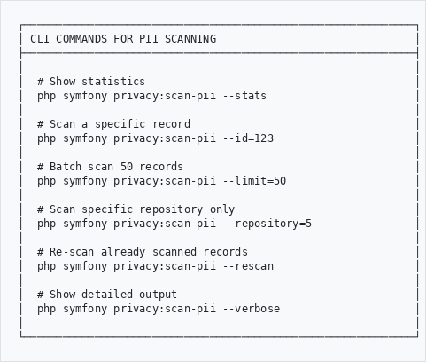
```

---

### Risk Score Explained
```
┌─────────────────────────────────────────────────────────────┐
│ RISK SCORE CALCULATION                                      │
├─────────────────────────────────────────────────────────────┤
│                                                             │
│  Score Range     │  Classification  │  Action Required      │
│  ────────────────┼──────────────────┼───────────────────────│
│    0 - 20        │  🟢 Low Risk     │  Monitor              │
│   21 - 50        │  🟡 Medium Risk  │  Review recommended   │
│   51 - 100       │  🔴 High Risk    │  Immediate review     │
│                                                             │
│  ─────────────────────────────────────────────────────────  │
│                                                             │
│  How the score is calculated:                               │
│                                                             │
│  • Critical PII (credit cards)     × 30 points each         │
│  • High-risk PII (ID numbers)      × 20 points each         │
│  • Medium-risk (email, phone)      × 5 points each          │
│  • Low-risk (names, places)        × 1 point each           │
│                                                             │
│  Maximum score: 100                                         │
│                                                             │
└─────────────────────────────────────────────────────────────┘
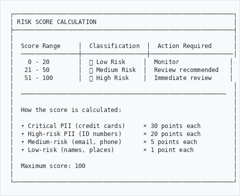
```

---

## Part 8b: PDF Redaction

### What is PDF Redaction?
```
┌─────────────────────────────────────────────────────────────┐
│                                                             │
│   PDF REDACTION = Permanently removing sensitive            │
│                   information from PDF documents            │
│                                                             │
│   When you mark a PII entity for redaction:                 │
│   • The system searches the PDF for that text               │
│   • Applies black boxes over matching text                  │
│   • Creates a new "redacted" version of the PDF             │
│   • Public users see only the redacted version              │
│                                                             │
│   Original PDFs are PRESERVED - only copies are redacted.   │
│                                                             │
└─────────────────────────────────────────────────────────────┘
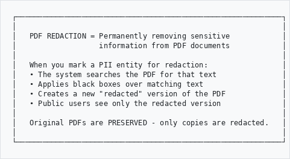
```

---

### PDF Redaction Workflow
```
                    Record has PDF
                          │
                          ▼
              ┌────────────────────────┐
              │   Scan for PII         │
              │   (Admin → Privacy →   │
              │    PII Scanner)        │
              └───────────┬────────────┘
                          │
                          ▼
              ┌────────────────────────┐
              │   Review detected      │
              │   entities             │
              └───────────┬────────────┘
                          │
         ┌────────────────┼────────────────┐
         │                │                │
    ✓ Approve        ✎ Redact         ✗ Reject
         │                │                │
         ▼                ▼                ▼
    Not PII,         Mark for        False positive,
    keep visible     redaction       remove from list
                          │
                          ▼
              ┌────────────────────────┐
              │   System generates     │
              │   redacted PDF         │
              │   (black boxes over    │
              │   sensitive text)      │
              └───────────┬────────────┘
                          │
                          ▼
              ┌────────────────────────┐
              │   Public users see     │
              │   redacted version     │
              │                        │
              │   Staff see original   │
              │   (if permissions)     │
              └────────────────────────┘
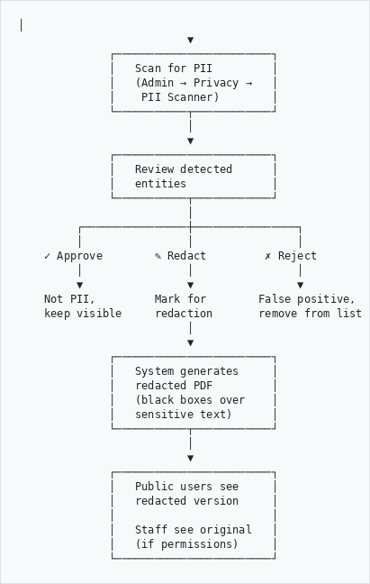
```

---

### What Gets Redacted
```
┌─────────────────────────────────────────────────────────────┐
│ SOURCES OF REDACTION TERMS                                  │
├─────────────────────────────────────────────────────────────┤
│                                                             │
│  1. NER-Extracted Entities                                  │
│     Names, organizations, places extracted from OCR text    │
│                                                             │
│  2. Regex-Detected PII                                      │
│     ID numbers, emails, phone numbers found in metadata     │
│                                                             │
│  3. ISAD Access Points                                      │
│     • Subjects: Topic terms linked to the record            │
│     • Places: Geographic locations                          │
│     • Names: People/organizations from events               │
│     • Dates: Date ranges from events                        │
│                                                             │
│  Only entities marked with status "Redact" are applied.     │
│                                                             │
└─────────────────────────────────────────────────────────────┘
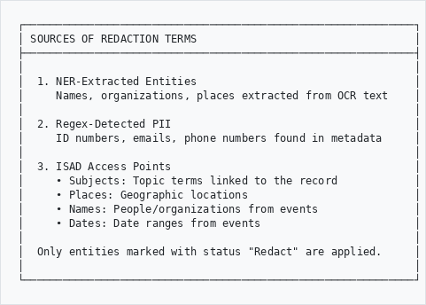
```

---

### View Redacted PDF
```
┌─────────────────────────────────────────────────────────────┐
│ HOW PUBLIC USERS SEE REDACTED PDFs                          │
├─────────────────────────────────────────────────────────────┤
│                                                             │
│  When viewing a record with redacted PII:                   │
│                                                             │
│  1. The PDF viewer shows "PII Redacted" badge               │
│  2. Sensitive text appears as black boxes: ████████         │
│  3. The underlying text is permanently removed              │
│  4. Copy/paste won't reveal original text                   │
│                                                             │
│  ┌─────────────────────────────────────────────────┐        │
│  │  📄 Document Viewer        [PII Redacted]       │        │
│  ├─────────────────────────────────────────────────┤        │
│  │                                                 │        │
│  │  Employee Name: █████████████████               │        │
│  │  ID Number: ██████████████                      │        │
│  │  Department: Human Resources                    │        │
│  │  Date: 15 March 1985                            │        │
│  │                                                 │        │
│  └─────────────────────────────────────────────────┘        │
│                                                             │
│  Note: Original file remains available to staff with        │
│  appropriate permissions.                                   │
│                                                             │
└─────────────────────────────────────────────────────────────┘
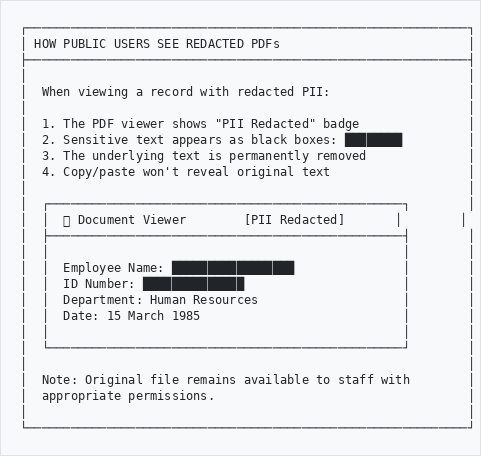
```

---

### Tips for Effective Redaction
```
┌─────────────────────────────────────────────────────────────┐
│  ✓ DO                          │  ✗ DON'T                  │
├────────────────────────────────┼────────────────────────────┤
│  Review all entities carefully │  Blindly redact everything │
│  Check ISAD access points      │  Ignore purple badges      │
│  Verify PDF has text layer     │  Assume scanned PDFs work  │
│  Test redacted output          │  Skip verification         │
│  Document your decisions       │  Leave audit trail gaps    │
│  Re-scan after metadata edits  │  Assume one scan is enough │
└────────────────────────────────┴────────────────────────────┘
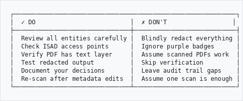
```

---

### PDF Requirements for Redaction
```
┌─────────────────────────────────────────────────────────────┐
│ PDF REQUIREMENTS                                            │
├─────────────────────────────────────────────────────────────┤
│                                                             │
│  For redaction to work, PDFs must have:                     │
│                                                             │
│  ✓ Text layer (not just scanned images)                     │
│  ✓ Searchable text (can be OCR'd or native)                 │
│                                                             │
│  If your PDF is a scan without OCR:                         │
│  1. The system cannot locate text to redact                 │
│  2. Consider running OCR first (e.g., using Tesseract)      │
│  3. Re-upload the OCR'd version                             │
│                                                             │
│  How to check if PDF has text:                              │
│  • Open PDF in viewer                                       │
│  • Try to select/highlight text                             │
│  • If you can select it, redaction will work                │
│                                                             │
└─────────────────────────────────────────────────────────────┘
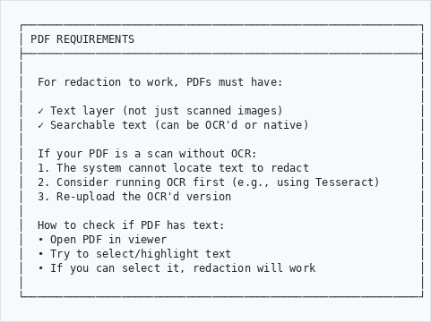
```

---

## Part 9: Compliance Dashboard

### Overview Screen
```
┌─────────────────────────────────────────────────────────────┐
│ PRIVACY COMPLIANCE DASHBOARD                                │
├──────────────────┬──────────────────┬───────────────────────┤
│                  │                  │                       │
│  DSAR REQUESTS   │  DATA BREACHES   │   COMPLIANCE          │
│                  │                  │   SCORE               │
│  Open: 8         │  This Year: 2    │                       │
│  Overdue: 1 🔴   │  Open: 0         │      87%              │
│  Avg Response:   │  Last Incident:  │   🟢 Good             │
│  18 days         │  45 days ago     │                       │
│                  │                  │                       │
└──────────────────┴──────────────────┴───────────────────────┘

┌─────────────────────────────────────────────────────────────┐
│ UPCOMING DEADLINES                                          │
├─────────────────────────────────────────────────────────────┤
│                                                             │
│  ⚠️  DSR-003 - Bob Wilson Access Request - OVERDUE 8 days   │
│  🟡 DSR-001 - John Doe Access Request - Due in 5 days       │
│  🟡 ROPA Annual Review - Due in 14 days                     │
│  🟢 IO Registration Renewal - Due in 60 days                │
│                                                             │
└─────────────────────────────────────────────────────────────┘

┌─────────────────────────────────────────────────────────────┐
│ COMPLIANCE CHECKLIST                                        │
├─────────────────────────────────────────────────────────────┤
│                                                             │
│  ☑ Information Officer registered                           │
│  ☑ ROPA documented                                          │
│  ☑ Privacy notice published                                 │
│  ☐ Annual POPIA training completed                          │
│  ☐ Operator agreements reviewed                             │
│                                                             │
└─────────────────────────────────────────────────────────────┘
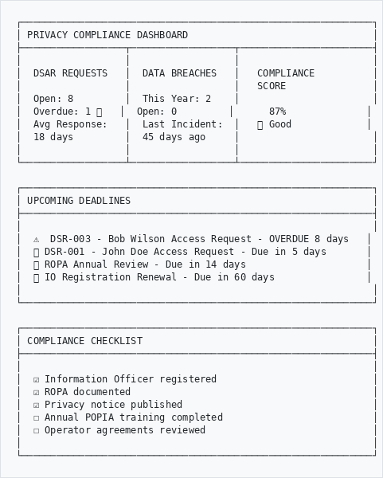
```

---

## Quick Reference
```
┌─────────────────────────────────────────────────────────────┐
│  TASK                      │  HOW TO DO IT                  │
├────────────────────────────┼────────────────────────────────┤
│  View dashboard            │  Admin → Privacy → Dashboard   │
│  Configure jurisdiction    │  Admin → Privacy → Config      │
│  Log new DSAR              │  Admin → Privacy → DSAR → Add  │
│  Report breach             │  Admin → Privacy → Breaches    │
│  Add processing activity   │  Admin → Privacy → ROPA → Add  │
│  Record consent            │  Admin → Privacy → Consent     │
│  Manage officers           │  Admin → Privacy → Officers    │
│  Generate report           │  Admin → Privacy → Reports     │
│  Scan for PII              │  Admin → Privacy → PII Scanner │
│  Scan single record        │  Record page → Scan for PII    │
│  Review PII findings       │  Admin → Privacy → PII Review  │
└────────────────────────────┴────────────────────────────────┘
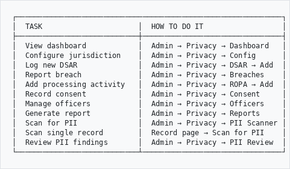
```

---

## Key Deadlines
```
┌─────────────────────────────────────────────────────────────┐
│                    RESPONSE DEADLINES                       │
├─────────────────────────────────────────────────────────────┤
│                                                             │
│  📨 DSAR REQUESTS                                           │
│     POPIA/GDPR/NDPA/Kenya: 30 calendar days                 │
│     CCPA: 45 calendar days                                  │
│     PIPEDA: 30 calendar days                                │
│                                                             │
│  🚨 BREACH NOTIFICATION                                     │
│     POPIA: As soon as reasonably possible                   │
│     GDPR: 72 hours to regulator                             │
│     NDPA: 72 hours                                          │
│     CCPA: Most expedient time possible                      │
│                                                             │
│  📋 PAIA REQUESTS (SA only)                                 │
│     Initial response: 30 days                               │
│     Extension possible: +30 days                            │
│                                                             │
└─────────────────────────────────────────────────────────────┘
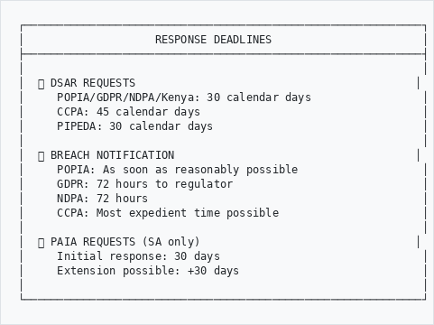
```

---

## Tips for Best Practice
```
┌─────────────────────────────────────────────────────────────┐
│  ✓ DO                          │  ✗ DON'T                  │
├────────────────────────────────┼────────────────────────────┤
│  Log all requests immediately  │  Ignore requests          │
│  Verify identity carefully     │  Release without verify   │
│  Document all decisions        │  Skip the audit trail     │
│  Train staff regularly         │  Assume everyone knows    │
│  Report breaches promptly      │  Cover up incidents       │
│  Review ROPA annually          │  Let it get outdated      │
│  Keep consent evidence         │  Assume consent           │
│  Respond within deadlines      │  Miss deadlines           │
└────────────────────────────────┴────────────────────────────┘
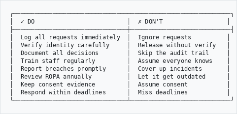
```

---

## Regulators Contact
```
┌─────────────────────────────────────────────────────────────┐
│  JURISDICTION   │  REGULATOR            │  WEBSITE          │
├─────────────────┼───────────────────────┼───────────────────┤
│  🇿🇦 POPIA       │  Information Regulator│ justice.gov.za    │
│  🇳🇬 NDPA        │  NDPC                 │ ndpc.gov.ng       │
│  🇰🇪 Kenya DPA   │  ODPC                 │ odpc.go.ke        │
│  🇪🇺 GDPR        │  National DPA         │ (varies by country│
│  🇨🇦 PIPEDA      │  OPC                  │ priv.gc.ca        │
│  🇺🇸 CCPA        │  CPPA                 │ cppa.ca.gov       │
└─────────────────┴───────────────────────┴───────────────────┘
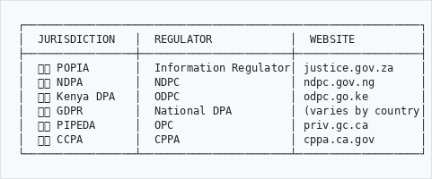
```

---

## Troubleshooting
```
Problem                          Solution
───────────────────────────────────────────────────────────
Can't find Privacy menu       →  Check Admin permissions
                                 May need admin role
                                 
Jurisdiction not showing      →  Enable in Configuration
                                 Check it's activated
                                 
Deadline calculating wrong    →  Check jurisdiction settings
                                 Verify response days set
                                 
Can't attach documents        →  Check file size (<10MB)
                                 Use PDF/JPG/PNG format
                                 
Report won't generate         →  Select date range
                                 Ensure data exists
```

---

## Need Help?

Contact your system administrator or Information Officer if you experience issues.

For regulatory guidance:
- POPIA: www.justice.gov.za/inforeg
- GDPR: ec.europa.eu/info/law/law-topic/data-protection
- PIPEDA: www.priv.gc.ca

---

*Part of the AtoM AHG Framework*
