# Privacy & Compliance

## User Guide

Data protection compliance for POPIA, GDPR, PAIA, and international privacy regulations. Includes DSAR management, breach register, consent tracking, PII detection, and PDF redaction.

---

## Workflow Overview
```
┌──────────────┐    ┌──────────────┐    ┌──────────────┐    ┌──────────────┐
│   Configure  │    │   Detect     │    │   Manage     │    │   Report     │
│   Jurisdiction│ ──▶│   PII        │ ──▶│   Requests   │ ──▶│   Compliance │
│              │    │              │    │              │    │              │
│ POPIA/GDPR   │    │ Scan records │    │ DSARs        │    │ Dashboard    │
│ PAIA/CCPA    │    │ Review risks │    │ Breaches     │    │ Audit logs   │
└──────────────┘    └──────────────┘    └──────────────┘    └──────────────┘
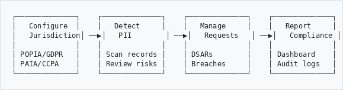
```

---

## What This Plugin Manages
```
┌─────────────────────────────────────────────────────────────┐
│                    PRIVACY COMPLIANCE                       │
├─────────────────────────────────────────────────────────────┤
│                                                             │
│  📋 DATA SUBJECT ACCESS REQUESTS (DSARs)                   │
│     Track and respond to access requests                    │
│     POPIA Section 23 / GDPR Article 15                     │
│                                                             │
│  🚨 BREACH REGISTER                                        │
│     Record and manage data breaches                         │
│     72-hour notification tracking                           │
│                                                             │
│  ✅ CONSENT MANAGEMENT                                     │
│     Track consent given and withdrawn                       │
│     Purpose-based consent records                           │
│                                                             │
│  🔍 PII DETECTION                                          │
│     Scan records for personal information                   │
│     AI-powered name and entity recognition                  │
│                                                             │
│  📄 PDF REDACTION                                          │
│     Automatically redact PII from documents                 │
│     Public access to redacted versions                      │
│                                                             │
│  📊 ROPA (Records of Processing Activities)                │
│     Document processing activities                          │
│     Legal basis and retention records                       │
│                                                             │
└─────────────────────────────────────────────────────────────┘
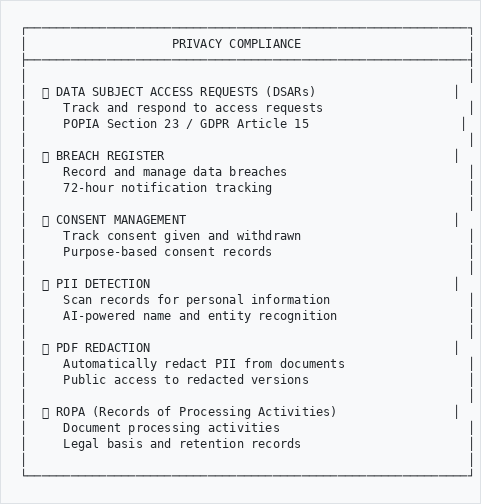
```

---

## How to Access
```
Option A: From Admin Menu              Option B: Quick Links
──────────────────────                 ─────────────────────

  Main Menu                              Dashboard
      │                                      │
      ▼                                      ▼
   Admin                                Privacy Overview
      │                                      │
      ▼                              ┌───────┼───────┐
  Privacy & Compliance               │       │       │
      │                              ▼       ▼       ▼
      ▼                           DSARs  Breaches  PII Scan
  Dashboard
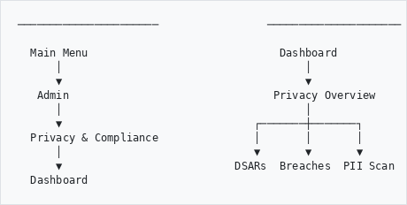
```

---

## Part 1: Understanding Jurisdictions

### Supported Privacy Regulations
```
┌─────────────────────────────────────────────────────────────┐
│ JURISDICTION     │ REGULATION        │ DEADLINE │ BREACH   │
├──────────────────┼───────────────────┼──────────┼──────────┤
│                  │                   │          │          │
│  🇿🇦 South Africa │ POPIA            │ 30 days  │ 72 hours │
│                  │                   │          │          │
│  🇪🇺 European Union│ GDPR             │ 30 days  │ 72 hours │
│                  │                   │          │          │
│  🇬🇧 United Kingdom│ UK GDPR          │ 30 days  │ 72 hours │
│                  │                   │          │          │
│  🇺🇸 California   │ CCPA/CPRA        │ 45 days  │ Varies   │
│                  │                   │          │          │
│  🇨🇦 Canada       │ PIPEDA           │ 30 days  │ ASAP     │
│                  │                   │          │          │
│  🇳🇬 Nigeria      │ NDPA             │ 30 days  │ 72 hours │
│                  │                   │          │          │
│  🇰🇪 Kenya        │ DPA              │ 30 days  │ 72 hours │
│                  │                   │          │          │
│  🇧🇷 Brazil       │ LGPD             │ 15 days  │ 72 hours │
│                  │                   │          │          │
│  🇦🇺 Australia    │ Privacy Act      │ 30 days  │ 72 hours │
│                  │                   │          │          │
│  🇸🇬 Singapore    │ PDPA             │ 30 days  │ 3 days   │
│                  │                   │          │          │
└──────────────────┴───────────────────┴──────────┴──────────┘
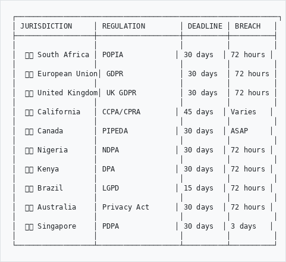
```

---

## Part 2: Data Subject Access Requests (DSARs)

### DSAR Workflow
```
                         Request Received
                               │
                               ▼
                    ┌──────────────────┐
                    │   Log Request    │
                    │   Start Timer    │
                    └────────┬─────────┘
                             │
                             ▼
                    ┌──────────────────┐
                    │   Verify         │
                    │   Identity       │
                    └────────┬─────────┘
                             │
              ┌──────────────┴──────────────┐
              │                             │
              ▼                             ▼
    ┌──────────────────┐          ┌──────────────────┐
    │   Fee Required?  │    NO    │   Process        │
    │   (PAIA only)    │─────────▶│   Request        │
    └────────┬─────────┘          └────────┬─────────┘
             │                             │
            YES                            │
             │                             │
             ▼                             │
    ┌──────────────────┐                   │
    │   Await Payment  │                   │
    └────────┬─────────┘                   │
             │                             │
             └─────────────┬───────────────┘
                           │
                           ▼
                    ┌──────────────────┐
                    │   Compile        │
                    │   Response       │
                    └────────┬─────────┘
                             │
                             ▼
                    ┌──────────────────┐
                    │   Send to        │
                    │   Data Subject   │
                    └────────┬─────────┘
                             │
                             ▼
                    ┌──────────────────┐
                    │   Close DSAR     │
                    │   (within 30 days)│
                    └──────────────────┘
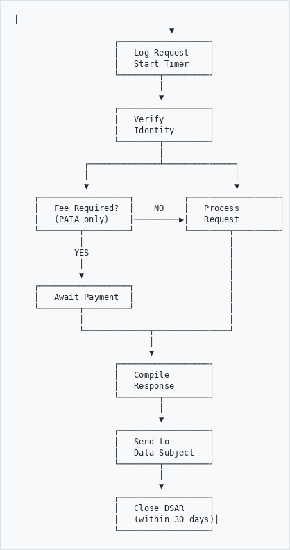
```

### Creating a DSAR
```
┌─────────────────────────────────────────────────────────────┐
│ NEW DATA SUBJECT ACCESS REQUEST                             │
├─────────────────────────────────────────────────────────────┤
│                                                             │
│  Reference Number:  [DSAR-2026-0042] (auto-generated)       │
│                                                             │
│  Request Type:      [ Access Request        ▼]              │
│                     ┌─────────────────────────┐             │
│                     │ Access Request          │             │
│                     │ Rectification           │             │
│                     │ Erasure ("Right to be   │             │
│                     │   forgotten")           │             │
│                     │ Restriction             │             │
│                     │ Data Portability        │             │
│                     │ Objection               │             │
│                     └─────────────────────────┘             │
│                                                             │
│  Jurisdiction:      [ POPIA (South Africa)   ▼]             │
│                                                             │
│  Data Subject:                                              │
│  Name:              [John Smith_______________]             │
│  Email:             [john.smith@example.com___]             │
│  ID Type:           [ SA ID Number           ▼]             │
│  ID Number:         [8501015800088___________]             │
│                                                             │
│  Received Date:     [ 15/01/2026  📅]                      │
│  Due Date:          [ 14/02/2026  📅] (auto-calculated)    │
│                                                             │
│  Description:                                               │
│  [Request for all personal information held including     ]│
│  [correspondence and photographs.                         ]│
│                                                             │
│                              [ Cancel ]  [ Create DSAR ]   │
│                                                             │
└─────────────────────────────────────────────────────────────┘
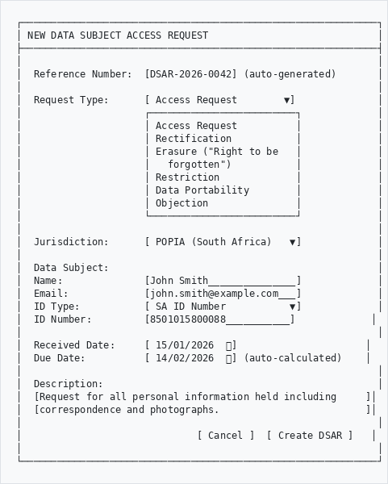
```

### DSAR Dashboard
```
┌─────────────────────────────────────────────────────────────┐
│ DSAR MANAGEMENT DASHBOARD                                   │
├──────────────────┬──────────────────┬───────────────────────┤
│                  │                  │                       │
│   OPEN           │  DUE THIS WEEK   │   OVERDUE             │
│   REQUESTS       │                  │                       │
│                  │                  │                       │
│      12          │       3          │       1               │
│    requests      │    requests      │    request            │
│                  │      ⚠️           │      🔴               │
│                  │                  │                       │
└──────────────────┴──────────────────┴───────────────────────┘

RECENT REQUESTS:
┌─────────────────────────────────────────────────────────────┐
│ Reference     │ Subject      │ Type    │ Due Date  │ Status │
├───────────────┼──────────────┼─────────┼───────────┼────────┤
│ DSAR-2026-0042│ John Smith   │ Access  │ 14 Feb 26 │ Open   │
│ DSAR-2026-0041│ Mary Jones   │ Erasure │ 10 Feb 26 │ Pending│
│ DSAR-2026-0040│ Peter Brown  │ Access  │ 05 Feb 26 │ ⚠️ Due  │
│ DSAR-2026-0039│ Sarah White  │ Access  │ 28 Jan 26 │ 🔴 Late│
└───────────────┴──────────────┴─────────┴───────────┴────────┘
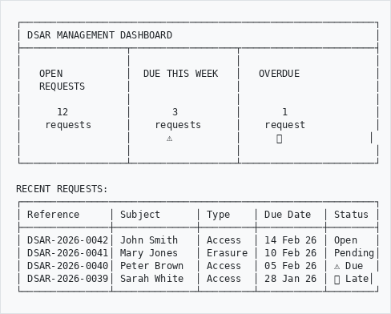
```

---

## Part 3: Breach Register

### Recording a Data Breach
```
┌─────────────────────────────────────────────────────────────┐
│ RECORD DATA BREACH                                          │
├─────────────────────────────────────────────────────────────┤
│                                                             │
│  Reference:         [BREACH-2026-0003] (auto-generated)     │
│                                                             │
│  Breach Date:       [ 20/01/2026 14:30  📅]                │
│  Discovery Date:    [ 20/01/2026 16:45  📅]                │
│                                                             │
│  Breach Type:       [ Unauthorised Access  ▼]               │
│                     ┌─────────────────────────┐             │
│                     │ Unauthorised Access     │             │
│                     │ Unauthorised Disclosure │             │
│                     │ Loss of Data            │             │
│                     │ Theft                   │             │
│                     │ Accidental Deletion     │             │
│                     │ System Breach           │             │
│                     │ Ransomware              │             │
│                     └─────────────────────────┘             │
│                                                             │
│  Severity:          ○ Low  ● Medium  ○ High  ○ Critical    │
│                                                             │
│  Categories Affected:                                       │
│  ☑ Names and contact details                               │
│  ☑ Identification numbers                                   │
│  ☐ Financial information                                    │
│  ☐ Health information                                       │
│  ☐ Biometric data                                          │
│                                                             │
│  Estimated Affected: [150______] data subjects              │
│                                                             │
│  Description:                                               │
│  [Employee laptop stolen from vehicle. Laptop contained   ]│
│  [spreadsheet with donor contact information.             ]│
│                                                             │
│                              [ Cancel ]  [ Record Breach ] │
│                                                             │
└─────────────────────────────────────────────────────────────┘
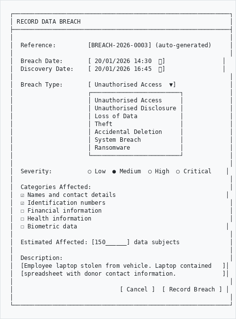
```

### Breach Notification Timeline
```
┌─────────────────────────────────────────────────────────────┐
│                                                             │
│   BREACH NOTIFICATION TIMELINE (72 hours)                   │
│                                                             │
│   Discovery        24hrs          48hrs          72hrs      │
│       │              │              │              │        │
│       ▼              ▼              ▼              ▼        │
│   ━━━━╋━━━━━━━━━━━━━╋━━━━━━━━━━━━━╋━━━━━━━━━━━━━╋━━━━━━▶  │
│       │              │              │              │        │
│   ┌───┴───┐      ┌───┴───┐     ┌───┴───┐     ┌───┴───┐   │
│   │Contain│      │Assess │     │Prepare│     │Notify │   │
│   │Breach │      │Impact │     │Report │     │ Info  │   │
│   │       │      │       │     │       │     │ Reg   │   │
│   └───────┘      └───────┘     └───────┘     └───────┘   │
│                                                             │
│   🔴 POPIA/GDPR: Must notify Information Regulator within  │
│      72 hours of becoming aware of the breach              │
│                                                             │
└─────────────────────────────────────────────────────────────┘
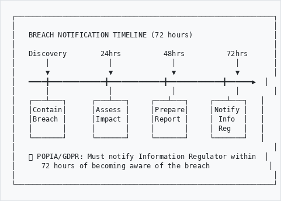
```

---

## Part 4: PII Detection

### What is PII?
```
┌─────────────────────────────────────────────────────────────┐
│                PERSONALLY IDENTIFIABLE INFORMATION          │
├─────────────────────────────────────────────────────────────┤
│                                                             │
│  🔴 CRITICAL RISK                                          │
│     • Credit card numbers                                   │
│     • Bank account numbers                                  │
│                                                             │
│  🟠 HIGH RISK                                               │
│     • SA ID numbers (8501015800088)                         │
│     • Nigerian NIN numbers                                  │
│     • Passport numbers                                      │
│     • Tax numbers                                           │
│                                                             │
│  🟡 MEDIUM RISK                                             │
│     • Email addresses                                       │
│     • Phone numbers                                         │
│     • Names of individuals                                  │
│                                                             │
│  🟢 LOW RISK                                                │
│     • Organisation names                                    │
│     • Place names                                           │
│     • Dates                                                 │
│                                                             │
└─────────────────────────────────────────────────────────────┘
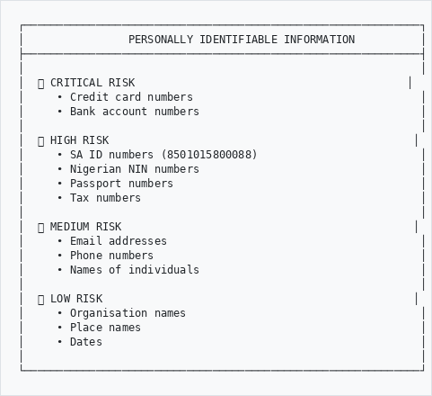
```

### PII Scanner Dashboard
```
┌─────────────────────────────────────────────────────────────┐
│ PII DETECTION DASHBOARD                                     │
├──────────────────┬──────────────────┬───────────────────────┤
│                  │                  │                       │
│   SCANNED        │  WITH PII        │   HIGH RISK           │
│   RECORDS        │                  │                       │
│                  │                  │                       │
│     1,247        │      342         │       28              │
│    records       │    records       │    records            │
│                  │      27%         │      🔴               │
│                  │                  │                       │
└──────────────────┴──────────────────┴───────────────────────┘

COVERAGE: ████████████████░░░░░░░░░░░░░░░░ 54%

HIGH-RISK RECORDS (Review Required):
┌─────────────────────────────────────────────────────────────┐
│ Reference    │ Title              │ Risk  │ PII    │ Action │
├──────────────┼────────────────────┼───────┼────────┼────────┤
│ ABC/001/005  │ Personnel Files    │  85   │ 12     │[Review]│
│ DEF/003/012  │ Donor Correspondence│ 72   │  8     │[Review]│
│ GHI/007/001  │ Medical Records    │  95   │ 15     │[Review]│
│ JKL/002/003  │ Financial Statements│ 68   │  6     │[Review]│
└──────────────┴────────────────────┴───────┴────────┴────────┘
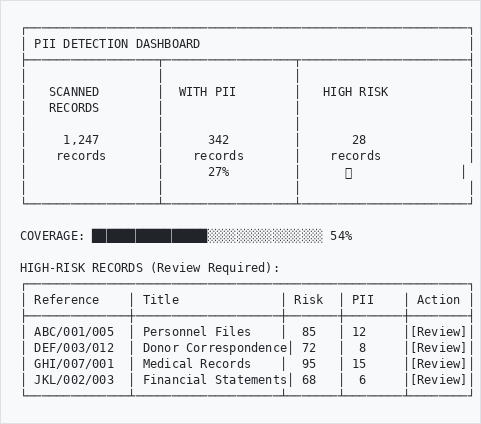
```

### Scanning a Record
```
┌─────────────────────────────────────────────────────────────┐
│ PII SCAN RESULTS - Personnel Files (ABC/001/005)            │
├─────────────────────────────────────────────────────────────┤
│                                                             │
│  Risk Score: 85/100  ██████████████████░░  HIGH RISK       │
│                                                             │
│  Summary:                                                   │
│  • High Risk Entities:    5                                 │
│  • Medium Risk Entities:  4                                 │
│  • Low Risk Entities:     3                                 │
│                                                             │
├─────────────────────────────────────────────────────────────┤
│  DETECTED ENTITIES                                          │
├─────────────────────────────────────────────────────────────┤
│                                                             │
│  🔴 HIGH RISK                                               │
│     SA_ID:    8501015800088         [Scope and Extent]     │
│     SA_ID:    7203145800081         [Scope and Extent]     │
│     PASSPORT: A12345678             [Notes]                 │
│     BANK:     1234567890            [Notes]                 │
│     TAX:      1234567890            [Title]                 │
│                                                             │
│  🟡 MEDIUM RISK                                             │
│     EMAIL:    john@example.com      [Notes]                 │
│     PHONE:    +27 11 123 4567       [Notes]                 │
│     PERSON:   John Smith            [NER - Scope]           │
│     PERSON:   Mary Jones            [NER - Notes]           │
│                                                             │
│  🟢 LOW RISK                                                │
│     ORG:      ABC Corporation       [NER - Title]           │
│     GPE:      Johannesburg          [NER - Scope]           │
│     DATE:     15 January 1985       [NER - Scope]           │
│                                                             │
├─────────────────────────────────────────────────────────────┤
│  ACTIONS                                                    │
│                                                             │
│  [ Mark for Redaction ]  [ Add Embargo ]  [ Dismiss ]      │
│                                                             │
└─────────────────────────────────────────────────────────────┘
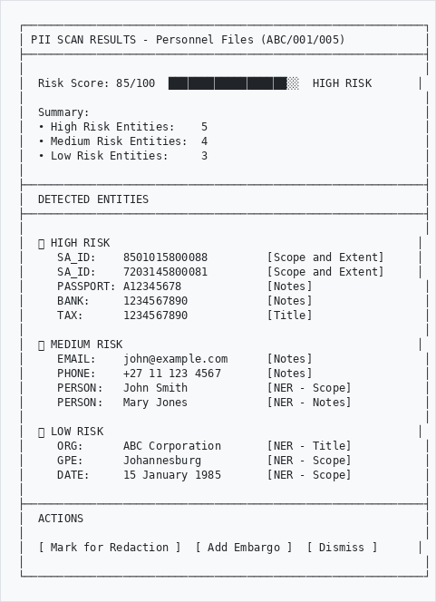
```

---

## Part 5: PDF Redaction

### How Redaction Works
```
┌─────────────────────────────────────────────────────────────┐
│                                                             │
│   ORIGINAL PDF              REDACTED PDF                    │
│   (Staff view)              (Public view)                   │
│                                                             │
│   ┌───────────────┐        ┌───────────────┐               │
│   │               │        │               │               │
│   │ Name: John    │   ──▶  │ Name: ████    │               │
│   │ ID: 850101... │        │ ID: ██████... │               │
│   │ Phone: +27... │        │ Phone: ██████ │               │
│   │               │        │               │               │
│   └───────────────┘        └───────────────┘               │
│                                                             │
│   Entities marked          Black boxes                      │
│   for redaction            replace PII                      │
│                                                             │
└─────────────────────────────────────────────────────────────┘
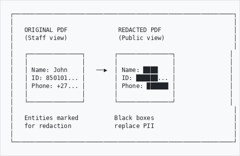
```

### Marking Entities for Redaction
```
┌─────────────────────────────────────────────────────────────┐
│ MANAGE PII ENTITIES - Personnel Files (ABC/001/005)         │
├─────────────────────────────────────────────────────────────┤
│                                                             │
│  Select entities to redact from public PDFs:                │
│                                                             │
│  ☑ SA_ID:    8501015800088        ← Will be redacted       │
│  ☑ SA_ID:    7203145800081        ← Will be redacted       │
│  ☑ PASSPORT: A12345678            ← Will be redacted       │
│  ☐ EMAIL:    john@example.com     ← Will remain visible    │
│  ☐ PERSON:   John Smith           ← Will remain visible    │
│                                                             │
│  Note: Redacted PDFs are generated automatically when       │
│  entities are marked. Public viewers will see the           │
│  redacted version.                                          │
│                                                             │
│                    [ Apply Redactions ]  [ Cancel ]         │
│                                                             │
└─────────────────────────────────────────────────────────────┘
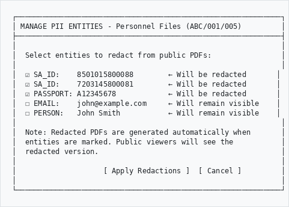
```

---

## Part 6: Consent Management

### Recording Consent
```
┌─────────────────────────────────────────────────────────────┐
│ RECORD CONSENT                                              │
├─────────────────────────────────────────────────────────────┤
│                                                             │
│  Data Subject:      [John Smith________________]            │
│  Contact:           [john.smith@example.com____]            │
│                                                             │
│  Purpose of Consent:                                        │
│  ☑ Research purposes                                        │
│  ☑ Publication in catalogues                                │
│  ☐ Marketing communications                                 │
│  ☐ Third-party sharing                                      │
│  ☐ Photography for promotional use                          │
│                                                             │
│  Consent Method:    [ Written Form          ▼]              │
│                     ┌─────────────────────────┐             │
│                     │ Written Form            │             │
│                     │ Online Form             │             │
│                     │ Email Confirmation      │             │
│                     │ Verbal (witnessed)      │             │
│                     └─────────────────────────┘             │
│                                                             │
│  Date Given:        [ 15/01/2026  📅]                      │
│  Expires On:        [ 15/01/2031  📅] (5 years)            │
│                                                             │
│  Evidence:          [📎 Consent_Form_Signed.pdf]            │
│                                                             │
│                              [ Cancel ]  [ Record Consent ] │
│                                                             │
└─────────────────────────────────────────────────────────────┘
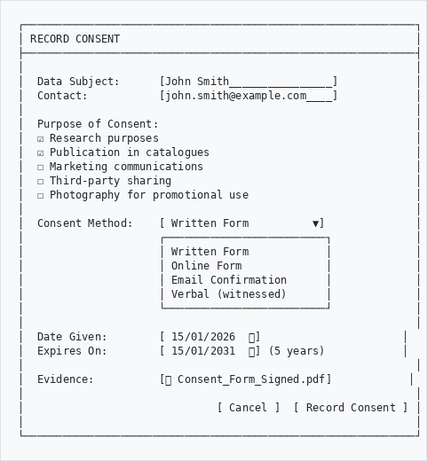
```

---

## Part 7: CLI Commands (System Administrators)

### PII Scanning Commands
```
┌─────────────────────────────────────────────────────────────┐
│  PRIVACY:SCAN-PII - Scan Records for PII                    │
├─────────────────────────────────────────────────────────────┤
│                                                             │
│  Show statistics only:                                      │
│  $ php symfony privacy:scan-pii --stats                     │
│                                                             │
│  Scan specific object:                                      │
│  $ php symfony privacy:scan-pii --id=123                    │
│                                                             │
│  Batch scan (default 100 objects):                          │
│  $ php symfony privacy:scan-pii                             │
│                                                             │
│  Limit batch size:                                          │
│  $ php symfony privacy:scan-pii --limit=50                  │
│                                                             │
│  Scan specific repository:                                  │
│  $ php symfony privacy:scan-pii --repository=5              │
│                                                             │
│  Re-scan already scanned objects:                           │
│  $ php symfony privacy:scan-pii --rescan                    │
│                                                             │
│  Verbose output (show entity details):                      │
│  $ php symfony privacy:scan-pii --verbose                   │
│                                                             │
└─────────────────────────────────────────────────────────────┘
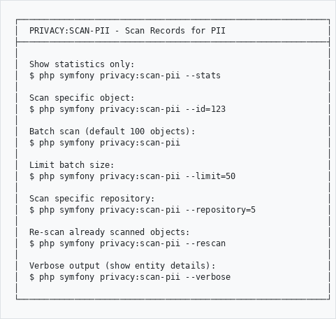
```

### Jurisdiction Management Commands
```
┌─────────────────────────────────────────────────────────────┐
│  PRIVACY:JURISDICTION - Manage Compliance Jurisdictions     │
├─────────────────────────────────────────────────────────────┤
│                                                             │
│  List all jurisdictions:                                    │
│  $ php symfony privacy:jurisdiction                         │
│                                                             │
│  Install a jurisdiction:                                    │
│  $ php symfony privacy:jurisdiction --install=popia         │
│  $ php symfony privacy:jurisdiction --install=gdpr          │
│                                                             │
│  Uninstall a jurisdiction:                                  │
│  $ php symfony privacy:jurisdiction --uninstall=ccpa        │
│                                                             │
│  Set active jurisdiction globally:                          │
│  $ php symfony privacy:jurisdiction --set-active=popia      │
│                                                             │
│  Set for specific repository:                               │
│  $ php symfony privacy:jurisdiction --set-active=popia \    │
│                                     --repository=5          │
│                                                             │
│  View jurisdiction details:                                 │
│  $ php symfony privacy:jurisdiction --info=popia            │
│                                                             │
└─────────────────────────────────────────────────────────────┘
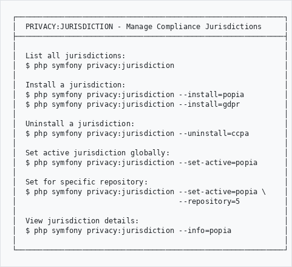
```

### Available Jurisdictions
```
┌─────────────────┬────────────────────────────────────────────┐
│  CODE           │  DESCRIPTION                               │
├─────────────────┼────────────────────────────────────────────┤
│  popia          │  South Africa - Protection of Personal     │
│                 │  Information Act                           │
│                 │                                            │
│  gdpr           │  European Union - General Data Protection  │
│                 │  Regulation                                │
│                 │                                            │
│  uk_gdpr        │  United Kingdom - UK GDPR (post-Brexit)    │
│                 │                                            │
│  pipeda         │  Canada - PIPEDA                           │
│                 │                                            │
│  ccpa           │  USA California - CCPA/CPRA                │
│                 │                                            │
│  ndpa           │  Nigeria - NDPA                            │
│                 │                                            │
│  kenya_dpa      │  Kenya - Data Protection Act               │
│                 │                                            │
│  lgpd           │  Brazil - LGPD                             │
│                 │                                            │
│  australia_privacy│ Australia - Privacy Act                  │
│                 │                                            │
│  pdpa_sg        │  Singapore - PDPA                          │
└─────────────────┴────────────────────────────────────────────┘
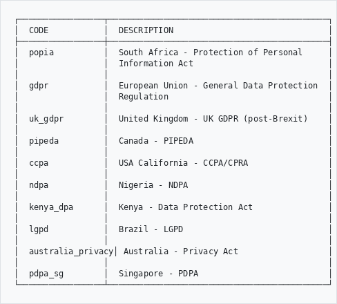
```

### Example CLI Output
```
$ php symfony privacy:scan-pii --stats

  ╔════════════════════════════════════════════════════════╗
  ║              PII Detection Statistics                  ║
  ╚════════════════════════════════════════════════════════╝

  Objects Scanned:      1247
  Objects with PII:     342
  High-Risk Entities:   156
  Pending Review:       28
  Coverage:             54.2%

  Entities by Type:
  ----------------------------------------
    PERSON               412
    EMAIL                287
    PHONE_SA             156
    SA_ID                 89
    ORG                  234
    GPE                  567
```

---

## Quick Reference
```
┌─────────────────────────────────────────────────────────────┐
│  TASK                      │  HOW TO DO IT                  │
├────────────────────────────┼────────────────────────────────┤
│  Create DSAR               │  Admin → Privacy → New DSAR    │
│  View DSAR dashboard       │  Admin → Privacy → DSARs       │
│  Record breach             │  Admin → Privacy → New Breach  │
│  Scan record for PII       │  Record → More → Scan for PII  │
│  View PII dashboard        │  Admin → Privacy → PII Scanner │
│  Mark entity for redaction │  PII Scan → Entity → Redact    │
│  Record consent            │  Admin → Privacy → Consent     │
│  Generate ROPA             │  Admin → Privacy → ROPA Export │
│  Check overdue DSARs       │  Dashboard → Overdue section   │
└────────────────────────────┴────────────────────────────────┘
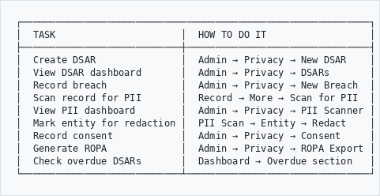
```

---

## Risk Score Calculation
```
┌─────────────────────────────────────────────────────────────┐
│                                                             │
│  RISK SCORE FORMULA                                         │
│                                                             │
│  Score = (Critical × 30) + (High × 20) +                   │
│          (Medium × 5) + (Low × 1)                          │
│                                                             │
│  Maximum: 100                                               │
│                                                             │
├─────────────────────────────────────────────────────────────┤
│  SCORE RANGE     │  CLASSIFICATION  │  ACTION               │
├──────────────────┼──────────────────┼───────────────────────┤
│  0 - 20          │  🟢 Low Risk     │  Monitor              │
│  21 - 50         │  🟡 Medium Risk  │  Review recommended   │
│  51 - 100        │  🔴 High Risk    │  Immediate review     │
└──────────────────┴──────────────────┴───────────────────────┘
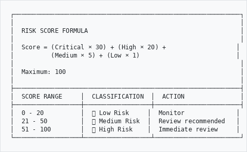
```

---

## PAIA Integration (South Africa)
```
┌─────────────────────────────────────────────────────────────┐
│                    PAIA REQUEST FLOW                        │
├─────────────────────────────────────────────────────────────┤
│                                                             │
│  The system supports PAIA (Promotion of Access to           │
│  Information Act) requests as a type of DSAR.               │
│                                                             │
│  Key differences from standard DSAR:                        │
│  • May require a fee (R35 for individual, R50 for entity)   │
│  • 30-day deadline (can be extended by 30 more days)        │
│  • Specific refusal grounds under Section 36-46             │
│  • Must use prescribed PAIA Form C                          │
│                                                             │
│  To create a PAIA request:                                  │
│  1. Create new DSAR                                         │
│  2. Set Jurisdiction to "POPIA (South Africa)"              │
│  3. Set Request Type to "Access Request"                    │
│  4. Mark "Fee Required" if applicable                       │
│  5. Upload Form C as supporting document                    │
│                                                             │
└─────────────────────────────────────────────────────────────┘
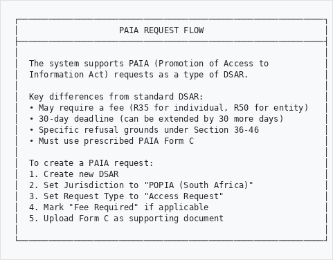
```

---

## Troubleshooting
```
Problem                          Solution
───────────────────────────────────────────────────────────
Can't find Privacy menu       →  Check admin permissions
                                 Plugin must be enabled

DSAR deadline wrong           →  Check jurisdiction setting
                                 Verify received date

PII scan not finding entities →  Ensure OCR is enabled
                                 Check NER service running
                                 Re-scan with --rescan

Redacted PDF not showing      →  Clear cache
                                 Check entity status = redacted
                                 Verify PyMuPDF installed

Breach notification late      →  System shows warning only
                                 Manual notification required
```

---

## Need Help?

Contact your system administrator if you experience issues.

For more information on regulations:
- POPIA: www.justice.gov.za/inforeg
- GDPR: gdpr.eu
- PAIA: www.justice.gov.za/paia
- Information Regulator (SA): www.inforegulator.org.za

---

*Part of the AtoM AHG Framework*
