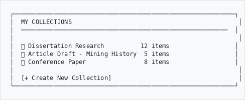
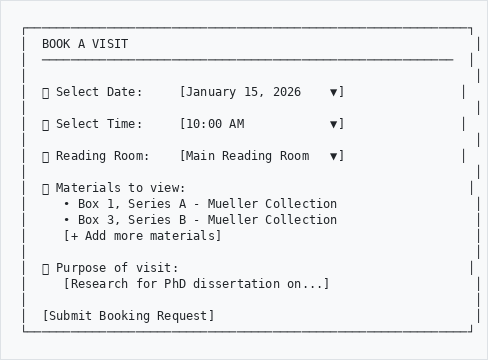
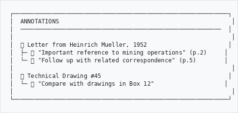
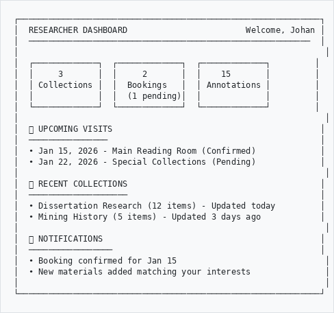
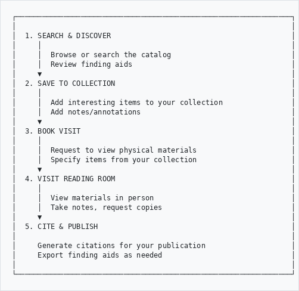
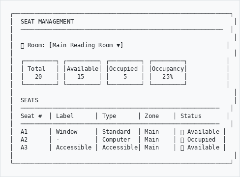
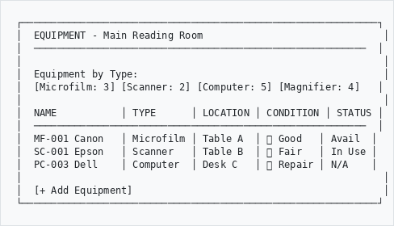
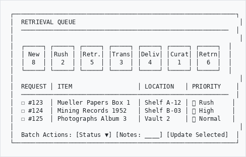
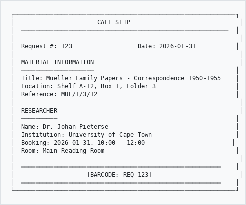
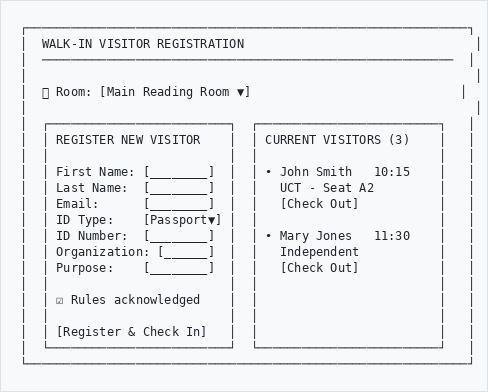

# Researcher Portal - User Guide

## Overview

The Researcher Portal provides tools for researchers to interact with archival materials, including booking reading room visits, creating research collections, adding annotations, and generating citations.

---

## Getting Started

### Registration

1. Click **"Register"** on the homepage or navigate to the researcher registration page
2. Fill in your details:
   - Full name
   - Email address
   - Institution/Affiliation
   - Research purpose
   - Password
3. Submit registration
4. Wait for administrator approval (you'll receive an email)
5. Once approved, log in with your credentials

### Accessing the Researcher Dashboard

After logging in, click on **"My Workspace"** or navigate to your researcher dashboard to access all features.

---

## Features

### 1. 📚 Research Collections

Create personal collections to organize materials for your research projects.
```
┌─────────────────────────────────────────────────────────────┐
│  MY COLLECTIONS                                              │
│  ─────────────────────────────────────────────────────────  │
│                                                              │
│  📁 Dissertation Research          12 items                  │
│  📁 Article Draft - Mining History  5 items                  │
│  📁 Conference Paper                8 items                  │
│                                                              │
│  [+ Create New Collection]                                   │
└─────────────────────────────────────────────────────────────┘

```

**To add items to a collection:**
1. Browse or search for archival materials
2. Click **"Add to Collection"** button on the record
3. Select existing collection or create new one
4. Item is saved to your collection

**To manage collections:**
- View all items in a collection
- Remove items
- Rename or delete collections
- Share collections (if enabled)

---

### 2. 📅 Reading Room Bookings

Book visits to the reading room to view physical materials.
```
┌─────────────────────────────────────────────────────────────┐
│  BOOK A VISIT                                                │
│  ─────────────────────────────────────────────────────────  │
│                                                              │
│  📅 Select Date:     [January 15, 2026    ▼]                │
│                                                              │
│  ⏰ Select Time:     [10:00 AM            ▼]                │
│                                                              │
│  📍 Reading Room:    [Main Reading Room   ▼]                │
│                                                              │
│  📦 Materials to view:                                       │
│     • Box 1, Series A - Mueller Collection                   │
│     • Box 3, Series B - Mueller Collection                   │
│     [+ Add more materials]                                   │
│                                                              │
│  📝 Purpose of visit:                                        │
│     [Research for PhD dissertation on...]                    │
│                                                              │
│  [Submit Booking Request]                                    │
└─────────────────────────────────────────────────────────────┘

```

**Booking Process:**
1. Navigate to **"Book a Visit"**
2. Select your preferred date and time
3. Choose the reading room
4. Add the materials you wish to view
5. Describe your research purpose
6. Submit the booking request
7. Wait for confirmation email

**Booking Status:**
| Status | Meaning |
|--------|---------|
| 🟡 Pending | Awaiting staff review |
| 🟢 Confirmed | Booking approved |
| 🔴 Declined | Booking not available (see reason) |
| ⚪ Cancelled | Cancelled by you or staff |
| ✅ Completed | Visit completed |

---

### 3. 📝 Annotations

Add personal notes and annotations to archival materials.
```
┌─────────────────────────────────────────────────────────────┐
│  ANNOTATIONS                                                 │
│  ─────────────────────────────────────────────────────────  │
│                                                              │
│  📄 Letter from Heinrich Mueller, 1952                       │
│  ├─ 📌 "Important reference to mining operations" (p.2)     │
│  └─ 📌 "Follow up with related correspondence" (p.5)        │
│                                                              │
│  📄 Technical Drawing #45                                    │
│  └─ 📌 "Compare with drawings in Box 12"                    │
│                                                              │
└─────────────────────────────────────────────────────────────┘

```

**To add an annotation:**
1. View an archival record
2. Click **"Add Annotation"**
3. Enter your note
4. Optionally specify page/section reference
5. Save

> **Note:** Annotations are private by default. Only you can see them unless you choose to share.

---

### 4. 📖 Citations

Generate properly formatted citations for archival materials.

**Supported Citation Styles:**
- Chicago Manual of Style (Notes & Bibliography)
- Chicago Manual of Style (Author-Date)
- MLA (Modern Language Association)
- APA (American Psychological Association)
- Harvard

**To generate a citation:**
1. View an archival record
2. Click **"Cite this Record"**
3. Select your preferred citation style
4. Copy the formatted citation

**Example Output:**
```
Chicago (Notes):
The Archive and Heritage Group, "Letter from Heinrich Mueller 
to Mining Commissioner," 15 March 1952, Mueller Collection, 
Box 1, Folder 3, Item 12.

APA:
The Archive and Heritage Group. (1952). Letter from Heinrich 
Mueller to Mining Commissioner (Box 1, Folder 3, Item 12). 
Mueller Collection.
```

---

### 5. 📋 Finding Aid Generator

Create formatted finding aids for your research.

1. Select materials or a collection
2. Choose output format (PDF, Word, HTML)
3. Customize included fields
4. Generate and download

---

## Researcher Dashboard

Your central hub for all research activities:
```
┌─────────────────────────────────────────────────────────────┐
│  RESEARCHER DASHBOARD                        Welcome, Johan │
│  ─────────────────────────────────────────────────────────  │
│                                                              │
│  ┌─────────────┐  ┌─────────────┐  ┌─────────────┐         │
│  │     3       │  │     2       │  │    15       │         │
│  │ Collections │  │  Bookings   │  │ Annotations │         │
│  │             │  │  (1 pending)│  │             │         │
│  └─────────────┘  └─────────────┘  └─────────────┘         │
│                                                              │
│  📅 UPCOMING VISITS                                          │
│  ────────────────                                           │
│  • Jan 15, 2026 - Main Reading Room (Confirmed)             │
│  • Jan 22, 2026 - Special Collections (Pending)             │
│                                                              │
│  📚 RECENT COLLECTIONS                                       │
│  ────────────────────                                       │
│  • Dissertation Research (12 items) - Updated today         │
│  • Mining History (5 items) - Updated 3 days ago            │
│                                                              │
│  🔔 NOTIFICATIONS                                            │
│  ─────────────────                                          │
│  • Booking confirmed for Jan 15                              │
│  • New materials added matching your interests               │
│                                                              │
└─────────────────────────────────────────────────────────────┘

```

---

## Profile Management

### Update Your Profile
1. Click on your name or **"My Profile"**
2. Update your information:
   - Contact details
   - Institution
   - Research interests
   - Notification preferences
3. Save changes

### Change Password
1. Go to **"My Profile"**
2. Click **"Change Password"**
3. Enter current password
4. Enter new password (twice)
5. Save

### Account Renewal
Research accounts may require periodic renewal:
1. You'll receive a notification before expiry
2. Go to **"Renew Account"**
3. Confirm your details are current
4. Submit renewal request
5. Wait for administrator approval

---

## Workflow: Typical Research Visit
```
┌────────────────────────────────────────────────────────────────┐
│                                                                │
│  1. SEARCH & DISCOVER                                          │
│     │                                                          │
│     │  Browse or search the catalog                            │
│     │  Review finding aids                                     │
│     ▼                                                          │
│  2. SAVE TO COLLECTION                                         │
│     │                                                          │
│     │  Add interesting items to your collection                │
│     │  Add notes/annotations                                   │
│     ▼                                                          │
│  3. BOOK VISIT                                                 │
│     │                                                          │
│     │  Request to view physical materials                      │
│     │  Specify items from your collection                      │
│     ▼                                                          │
│  4. VISIT READING ROOM                                         │
│     │                                                          │
│     │  View materials in person                                │
│     │  Take notes, request copies                              │
│     ▼                                                          │
│  5. CITE & PUBLISH                                             │
│                                                                │
│     Generate citations for your publication                    │
│     Export finding aids as needed                              │
│                                                                │
└────────────────────────────────────────────────────────────────┘

```

---

## Quick Reference

| Action | How to Access |
|--------|---------------|
| View Dashboard | My Workspace → Dashboard |
| Create Collection | My Workspace → Collections → New |
| Add to Collection | Record page → "Add to Collection" |
| Book Visit | My Workspace → Book a Visit |
| View Bookings | My Workspace → My Bookings |
| Add Annotation | Record page → "Add Annotation" |
| Generate Citation | Record page → "Cite this Record" |
| Update Profile | My Workspace → Profile |
| Change Password | My Workspace → Profile → Change Password |

### Staff Operations (Admin)

| Action | How to Access |
|--------|---------------|
| Manage Seats | Research → Seats |
| Manage Equipment | Research → Equipment |
| View Retrieval Queue | Research → Retrieval Queue |
| Print Call Slips | Research → Retrieval Queue → Print |
| Register Walk-In | Research → Walk-In Visitors |
| View Activity Log | Research → Activities |

---

## Tips for Researchers

1. **Plan ahead** - Book reading room visits at least 48 hours in advance
2. **Be specific** - When booking, list exact box/folder numbers if known
3. **Use collections** - Organize materials by project or topic
4. **Add notes** - Annotations help you remember why items are important
5. **Check notifications** - Important updates about your bookings and account

---

## Access Restrictions

Some materials may have access restrictions:

| Restriction Type | What It Means |
|-----------------|---------------|
| 🔒 **Embargoed** | Not available until a specific date |
| 🔐 **Restricted** | Requires special permission |
| 📋 **Reading Room Only** | Cannot be copied/photographed |
| ✍️ **Appointment Required** | Must book in advance |

If you need access to restricted materials, contact the archive staff with your research justification.

---

---

## Reading Room Operations (Staff)

The following features are available to staff administrators for managing reading room operations.

### 6. 🪑 Seat Management

Manage reading room seats and track occupancy in real-time.

```
┌─────────────────────────────────────────────────────────────┐
│  SEAT MANAGEMENT                                             │
│  ─────────────────────────────────────────────────────────  │
│                                                              │
│  📍 Room: [Main Reading Room ▼]                             │
│                                                              │
│  ┌─────────┐ ┌─────────┐ ┌─────────┐ ┌─────────┐           │
│  │ Total   │ │Available│ │Occupied │ │Occupancy│           │
│  │   20    │ │   15    │ │    5    │ │   25%   │           │
│  └─────────┘ └─────────┘ └─────────┘ └─────────┘           │
│                                                              │
│  SEATS                                                       │
│  ────────────────────────────────────────────────────────   │
│  Seat #  │ Label      │ Type      │ Zone    │ Status       │
│  ────────────────────────────────────────────────────────   │
│  A1      │ Window     │ Standard  │ Main    │ 🟢 Available │
│  A2      │ -          │ Computer  │ Main    │ 🔴 Occupied  │
│  A3      │ Accessible │ Accessible│ Main    │ 🟢 Available │
│                                                              │
└─────────────────────────────────────────────────────────────┘

```

**Seat Types:**
| Type | Description |
|------|-------------|
| Standard | Regular desk/table |
| Accessible | Wheelchair accessible |
| Computer | With workstation |
| Microfilm | Microfilm reader station |
| Oversize | For large format materials |
| Quiet | Silent study zone |
| Group | Collaborative table |

**Features:**
- **Bulk Create:** Generate multiple seats using patterns (e.g., A1-A10, 1-20)
- **Amenities Tracking:** Power outlets, lamps, computers, magnifiers
- **Zone Assignment:** Organize seats by room zones
- **Real-time Occupancy:** Dashboard showing current availability

**To assign a seat:**
1. Navigate to **Research → Seats**
2. Select the reading room
3. Click **Assign** on an available seat
4. Select the researcher from current bookings
5. Confirm assignment

---

### 7. 🔧 Equipment Management

Track and manage reading room equipment including microfilm readers, scanners, and computers.

```
┌─────────────────────────────────────────────────────────────┐
│  EQUIPMENT - Main Reading Room                               │
│  ─────────────────────────────────────────────────────────  │
│                                                              │
│  Equipment by Type:                                          │
│  [Microfilm: 3] [Scanner: 2] [Computer: 5] [Magnifier: 4]   │
│                                                              │
│  NAME           │ TYPE      │ LOCATION │ CONDITION │ STATUS │
│  ─────────────────────────────────────────────────────────  │
│  MF-001 Canon   │ Microfilm │ Table A  │ 🟢 Good   │ Avail  │
│  SC-001 Epson   │ Scanner   │ Table B  │ 🟡 Fair   │ In Use │
│  PC-003 Dell    │ Computer  │ Desk C   │ 🔴 Repair │ N/A    │
│                                                              │
│  [+ Add Equipment]                                           │
└─────────────────────────────────────────────────────────────┘

```

**Equipment Types:**
- Microfilm Reader
- Microfiche Reader
- Scanner
- Computer
- Magnifier
- Book Cradle
- Light Box
- Camera Stand
- Cotton Gloves
- Page Weights

**Condition Tracking:**
| Status | Badge Color |
|--------|-------------|
| Excellent | 🟢 Green |
| Good | 🔵 Blue |
| Fair | 🟡 Yellow |
| Needs Repair | 🔴 Red |
| Out of Service | ⚫ Dark |

**Maintenance Logging:**
1. Click the wrench icon on any equipment
2. Describe the maintenance performed
3. Update condition status
4. Set next maintenance date
5. Log entry is saved with timestamp

---

### 8. 📦 Retrieval Queue

Manage material retrieval workflow with queue-based processing.

```
┌─────────────────────────────────────────────────────────────┐
│  RETRIEVAL QUEUE                                             │
│  ─────────────────────────────────────────────────────────  │
│                                                              │
│  ┌─────┐ ┌─────┐ ┌─────┐ ┌─────┐ ┌─────┐ ┌─────┐ ┌─────┐  │
│  │ New │ │Rush │ │Retr.│ │Trans│ │Deliv│ │Curat│ │Retrn│  │
│  │  8  │ │  2  │ │  5  │ │  3  │ │  4  │ │  1  │ │  6  │  │
│  └─────┘ └─────┘ └─────┘ └─────┘ └─────┘ └─────┘ └─────┘  │
│                                                              │
│  REQUEST │ ITEM                  │ LOCATION   │ PRIORITY    │
│  ─────────────────────────────────────────────────────────  │
│  ☐ #123  │ Mueller Papers Box 1  │ Shelf A-12 │ 🔴 Rush     │
│  ☐ #124  │ Mining Records 1952   │ Shelf B-03 │ 🟡 High     │
│  ☐ #125  │ Photographs Album 3   │ Vault 2    │ ⚪ Normal   │
│                                                              │
│  Batch Actions: [Status ▼] [Notes: ____] [Update Selected]  │
└─────────────────────────────────────────────────────────────┘

```

**Queue Stages:**
| Queue | Icon | Description |
|-------|------|-------------|
| New | 🔵 | New requests awaiting processing |
| Rush | 🔴 | Priority requests needing immediate attention |
| Retrieval | 🟠 | Ready for retrieval from storage |
| Transit | 🟣 | Materials in transit to reading room |
| Delivery | 🟢 | Ready for delivery to researcher |
| Curatorial | 🟤 | Requires curatorial review |
| Return | 🔷 | Pending return to storage |

**Batch Processing:**
1. Select multiple requests using checkboxes
2. Choose new status from dropdown
3. Add optional notes
4. Click **Update Selected**
5. All selected items move to new queue

---

### 9. 🖨️ Call Slips (Paging Slips)

Generate and print call slips for material retrieval.

```
┌─────────────────────────────────────────────────────────────┐
│                       CALL SLIP                              │
│  ─────────────────────────────────────────────────────────  │
│                                                              │
│  Request #: 123                  Date: 2026-01-31           │
│                                                              │
│  MATERIAL INFORMATION                                        │
│  ────────────────────                                       │
│  Title: Mueller Family Papers - Correspondence 1950-1955    │
│  Location: Shelf A-12, Box 1, Folder 3                      │
│  Reference: MUE/1/3/12                                      │
│                                                              │
│  RESEARCHER                                                  │
│  ──────────                                                 │
│  Name: Dr. Johan Pieterse                                   │
│  Institution: University of Cape Town                       │
│  Booking: 2026-01-31, 10:00 - 12:00                        │
│  Room: Main Reading Room                                    │
│                                                              │
│  ═══════════════════════════════════════════════════════    │
│                    [BARCODE: REQ-123]                        │
│  ═══════════════════════════════════════════════════════    │
└─────────────────────────────────────────────────────────────┘

```

**Printing Call Slips:**
1. Go to **Research → Retrieval Queue**
2. Select requests to print
3. Click **Print Selected** or individual print icon
4. Call slips open in print-friendly format
5. Use browser print function

---

### 10. 🚶 Walk-In Visitor Registration

Register and track visitors without researcher accounts.

```
┌─────────────────────────────────────────────────────────────┐
│  WALK-IN VISITOR REGISTRATION                                │
│  ─────────────────────────────────────────────────────────  │
│                                                              │
│  📍 Room: [Main Reading Room ▼]                             │
│                                                              │
│  ┌─────────────────────────┐  ┌─────────────────────────┐   │
│  │ REGISTER NEW VISITOR    │  │ CURRENT VISITORS (3)    │   │
│  │                         │  │                         │   │
│  │ First Name: [________]  │  │ • John Smith   10:15    │   │
│  │ Last Name:  [________]  │  │   UCT - Seat A2         │   │
│  │ Email:      [________]  │  │   [Check Out]           │   │
│  │ ID Type:    [Passport▼] │  │                         │   │
│  │ ID Number:  [________]  │  │ • Mary Jones   11:30    │   │
│  │ Organization: [______]  │  │   Independent           │   │
│  │ Purpose:    [________]  │  │   [Check Out]           │   │
│  │                         │  │                         │   │
│  │ ☑ Rules acknowledged    │  │                         │   │
│  │                         │  │                         │   │
│  │ [Register & Check In]   │  │                         │   │
│  └─────────────────────────┘  └─────────────────────────┘   │
└─────────────────────────────────────────────────────────────┘

```

**Walk-In vs Registered Researchers:**
| Feature | Walk-In | Registered |
|---------|---------|------------|
| Account Required | No | Yes |
| Pre-request Materials | No | Yes |
| Access Level | Open-access only | Full access |
| Booking Required | No | Yes |
| Can be Converted | Yes → Registered | - |

**Registration Process:**
1. Select the reading room
2. Enter visitor details (name, ID, organization)
3. Record purpose of visit and research topic
4. Optionally assign a seat
5. Visitor acknowledges reading room rules
6. Click **Register & Check In**

**Checking Out:**
1. Find visitor in current list
2. Click **Check Out**
3. Confirm checkout
4. Visit is recorded with timestamps

---

## Need Help?

- **Technical Issues:** Contact system administrator
- **Access Questions:** Contact the reading room
- **Research Assistance:** Contact the reference archivist

---

*Last updated: February 2026*
*Part of the AHG Extensions for AtoM 2.10*
