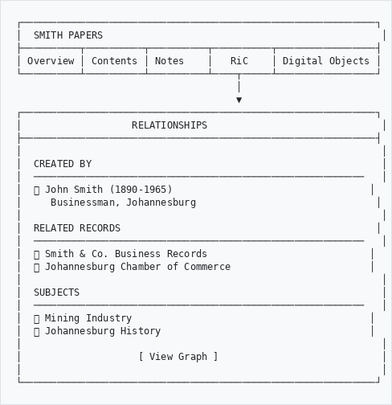
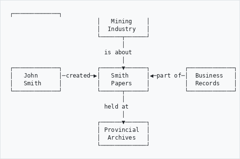
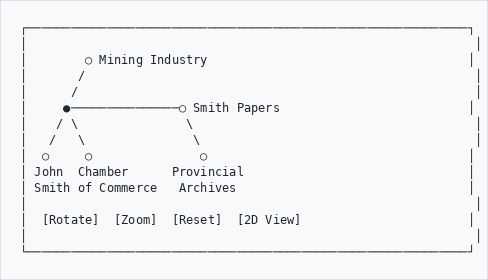
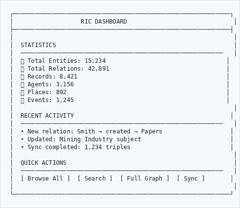
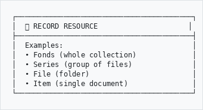
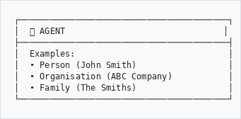
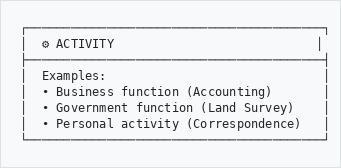
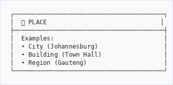

# Records in Contexts (RiC)

## Understanding Archival Relationships

---

## What is RiC?

Records in Contexts (RiC) is a new way of describing archives that shows how everything connects. Instead of just listing records, RiC reveals:

- Who created the records
- What activities produced them
- Where they came from
- How they relate to other records

Think of it like a family tree, but for archives.

---

## The RiC Explorer

### Finding It

On any record page, look for the **RiC** tab or panel. This shows you the record's relationships.

```
┌─────────────────────────────────────────────────────────────┐
│  SMITH PAPERS                                                │
├──────────┬──────────┬──────────┬──────────┬─────────────────┤
│ Overview │ Contents │ Notes    │   RiC    │ Digital Objects │
└──────────┴──────────┴──────────┴────┬─────┴─────────────────┘
                                      │
                                      ▼
┌─────────────────────────────────────────────────────────────┐
│                   RELATIONSHIPS                              │
├─────────────────────────────────────────────────────────────┤
│                                                              │
│  CREATED BY                                                  │
│  ─────────────────────────────────────────────────────────   │
│  👤 John Smith (1890-1965)                                  │
│     Businessman, Johannesburg                               │
│                                                              │
│  RELATED RECORDS                                            │
│  ─────────────────────────────────────────────────────────   │
│  📁 Smith & Co. Business Records                            │
│  📁 Johannesburg Chamber of Commerce                        │
│                                                              │
│  SUBJECTS                                                    │
│  ─────────────────────────────────────────────────────────   │
│  🏷️ Mining Industry                                         │
│  🏷️ Johannesburg History                                    │
│                                                              │
│                    [ View Graph ]                            │
│                                                              │
└─────────────────────────────────────────────────────────────┘

```

---

## Understanding the Graph View

### 2D Graph

Click **View Graph** to see relationships visually:

```
                         ┌─────────────┐
                         │   Mining    │
                         │  Industry   │
                         └──────┬──────┘
                                │
                           is about
                                │
┌─────────────┐          ┌──────▼──────┐          ┌─────────────┐
│   John      │─created─▶│   Smith     │◀─part of─│  Business   │
│   Smith     │          │   Papers    │          │  Records    │
└─────────────┘          └──────┬──────┘          └─────────────┘
                                │
                           held at
                                │
                         ┌──────▼──────┐
                         │ Provincial  │
                         │  Archives   │
                         └─────────────┘

```

### What the Colours Mean

| Colour | Entity Type |
|--------|-------------|
| 🔵 Blue | Records (fonds, series, files) |
| 🟢 Green | People and organisations |
| 🟡 Yellow | Places |
| 🟣 Purple | Events and activities |
| 🟠 Orange | Concepts and subjects |

### Interacting with the Graph

- **Click** a node to see its details
- **Drag** nodes to rearrange
- **Scroll** to zoom in/out
- **Double-click** to focus on a node

---

## 3D Graph View

For complex relationships, try the 3D view:

```
┌─────────────────────────────────────────────────────────────┐
│                                                              │
│        ○ Mining Industry                                    │
│       /                                                      │
│      /                                                       │
│     ●───────────────○ Smith Papers                          │
│    / \               \                                       │
│   /   \               \                                      │
│  ○     ○               ○                                    │
│ John  Chamber      Provincial                               │
│ Smith of Commerce   Archives                                │
│                                                              │
│  [Rotate]  [Zoom]  [Reset]  [2D View]                       │
│                                                              │
└─────────────────────────────────────────────────────────────┘

```

### 3D Controls

| Action | How |
|--------|-----|
| Rotate | Click and drag |
| Zoom | Scroll wheel |
| Pan | Right-click and drag |
| Select | Click on node |
| Reset | Press R or click Reset |

---

## The RiC Dashboard

Administrators can access the full RiC Dashboard at **Admin → RiC Explorer**

```
┌─────────────────────────────────────────────────────────────┐
│                   RIC DASHBOARD                              │
├─────────────────────────────────────────────────────────────┤
│                                                              │
│  STATISTICS                                                  │
│  ─────────────────────────────────────────────────────────   │
│  📊 Total Entities: 15,234                                  │
│  🔗 Total Relations: 42,891                                 │
│  📁 Records: 8,421                                          │
│  👤 Agents: 3,156                                           │
│  📍 Places: 892                                             │
│  📅 Events: 1,245                                           │
│                                                              │
│  RECENT ACTIVITY                                            │
│  ─────────────────────────────────────────────────────────   │
│  • New relation: Smith → created → Papers                   │
│  • Updated: Mining Industry subject                         │
│  • Sync completed: 1,234 triples                            │
│                                                              │
│  QUICK ACTIONS                                               │
│  ─────────────────────────────────────────────────────────   │
│  [ Browse All ]  [ Search ]  [ Full Graph ]  [ Sync ]       │
│                                                              │
└─────────────────────────────────────────────────────────────┘

```

---

## Searching with RiC

### Semantic Search

RiC enables smarter searching:

**Traditional search:** "Smith mining"
→ Finds records with those words

**Semantic search:** "Records created by people involved in mining"
→ Finds records through relationships, even if "mining" isn't in the text

### How to Search

1. Go to **RiC Explorer → Search**
2. Enter your query
3. Choose search type:

| Type | Finds |
|------|-------|
| **Keyword** | Text matches |
| **Entity** | People, places, events |
| **Relationship** | Connected records |
| **Path** | Multi-step connections |

---

## Understanding Entity Types

### Records (What we hold)

```
┌─────────────────────────────────────────┐
│  📁 RECORD RESOURCE                     │
├─────────────────────────────────────────┤
│  Examples:                              │
│  • Fonds (whole collection)             │
│  • Series (group of files)              │
│  • File (folder)                        │
│  • Item (single document)               │
└─────────────────────────────────────────┘

```

### Agents (Who created/used them)

```
┌─────────────────────────────────────────┐
│  👤 AGENT                               │
├─────────────────────────────────────────┤
│  Examples:                              │
│  • Person (John Smith)                  │
│  • Organisation (ABC Company)           │
│  • Family (The Smiths)                  │
└─────────────────────────────────────────┘

```

### Activities (What produced them)

```
┌─────────────────────────────────────────┐
│  ⚙️ ACTIVITY                            │
├─────────────────────────────────────────┤
│  Examples:                              │
│  • Business function (Accounting)       │
│  • Government function (Land Survey)    │
│  • Personal activity (Correspondence)   │
└─────────────────────────────────────────┘

```

### Places (Where they're from)

```
┌─────────────────────────────────────────┐
│  📍 PLACE                               │
├─────────────────────────────────────────┤
│  Examples:                              │
│  • City (Johannesburg)                  │
│  • Building (Town Hall)                 │
│  • Region (Gauteng)                     │
└─────────────────────────────────────────┘

```

---

## Common Relationships

| Relationship | Meaning | Example |
|--------------|---------|---------|
| **created** | Made by | Smith created the Papers |
| **accumulated** | Collected by | Archive accumulated the Papers |
| **is part of** | Belongs to | File is part of Series |
| **is about** | Subject matter | Papers are about Mining |
| **was held at** | Location | Records were held at Office |
| **preceded** | Came before | Series A preceded Series B |
| **is associated with** | General connection | Person associated with Company |

---

## For Researchers

### Why RiC Helps Your Research

1. **Discover connections** you wouldn't find otherwise
2. **Understand context** - who, what, where, when
3. **Find related materials** across collections
4. **Trace provenance** - where records came from

### Example Research Journey

```
You're researching: "Gold mining in 1890s Johannesburg"

1. Search finds: "Mining Company Records"
         │
         │ RiC shows this was "created by"
         ▼
2. Discover: "Chamber of Mines"
         │
         │ RiC shows "members included"
         ▼
3. Find: "Individual mine owners"
         │
         │ RiC shows "personal papers"
         ▼
4. Access: "Private correspondence about mining"

Without RiC, you might have missed steps 3 and 4!
```

---

## Tips for Using RiC

**Start broad, then narrow**
- Begin with the graph view
- See the big picture
- Click into specific connections

**Follow the people**
- Agents often link many records
- One person might connect different collections

**Check both directions**
- Who created this? (look backwards)
- What else did they create? (look forwards)

**Use semantic search for complex questions**
- "Records about mining created by government"
- "Materials related to Johannesburg before 1900"

---

## Troubleshooting

| Problem | Solution |
|---------|----------|
| Graph won't load | Refresh the page |
| Too many nodes | Filter by entity type |
| Can't find relationships | Check if record has been synced |
| 3D view slow | Try 2D view for large graphs |

---

*RiC is based on the ICA Records in Contexts standard (RiC-CM 1.0).*

*For technical questions, contact your system administrator.*
