# Security Classification

## User Guide

Manage access to sensitive records using security clearance levels and classification markings.

---

## Overview
```
┌─────────────────────────────────────────────────────────────┐
│                  SECURITY CLASSIFICATION                    │
├─────────────────────────────────────────────────────────────┤
│                                                             │
│  RECORD CLASSIFICATION          USER CLEARANCE              │
│         │                              │                    │
│         ▼                              ▼                    │
│  ┌─────────────┐               ┌─────────────┐             │
│  │ TOP SECRET  │               │ TOP SECRET  │ ← Can see   │
│  ├─────────────┤               ├─────────────┤    all      │
│  │   SECRET    │               │   SECRET    │             │
│  ├─────────────┤               ├─────────────┤             │
│  │CONFIDENTIAL │               │CONFIDENTIAL │             │
│  ├─────────────┤               ├─────────────┤             │
│  │ RESTRICTED  │               │ RESTRICTED  │             │
│  ├─────────────┤               ├─────────────┤             │
│  │   PUBLIC    │               │   PUBLIC    │ ← Everyone  │
│  └─────────────┘               └─────────────┘             │
│                                                             │
│  Users can only see records at or below their level         │
│                                                             │
└─────────────────────────────────────────────────────────────┘
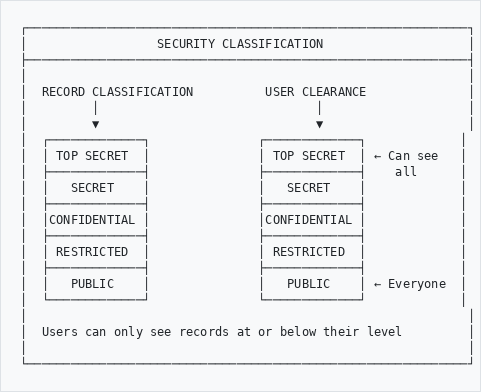
```

---

## Classification Levels
```
┌─────────────────────────────────────────────────────────────┐
│  LEVEL           │  DESCRIPTION                             │
├──────────────────┼──────────────────────────────────────────┤
│  🔴 TOP SECRET   │  Highest sensitivity                     │
│                  │  Severe damage if disclosed              │
│                  │                                          │
│  🟠 SECRET       │  High sensitivity                        │
│                  │  Serious damage if disclosed             │
│                  │                                          │
│  🟡 CONFIDENTIAL │  Medium sensitivity                      │
│                  │  Damage if disclosed                     │
│                  │                                          │
│  🔵 RESTRICTED   │  Limited distribution                    │
│                  │  Internal use only                       │
│                  │                                          │
│  🟢 PUBLIC       │  No restrictions                         │
│                  │  Anyone can view                         │
└──────────────────┴──────────────────────────────────────────┘
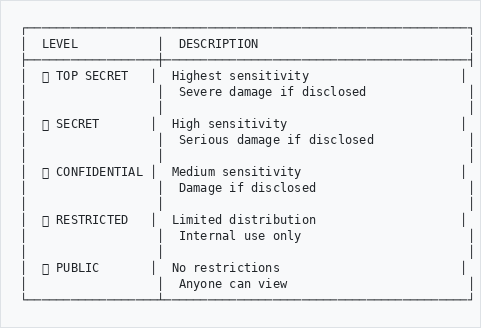
```

---

## How It Works
```
┌─────────────────────────────────────────────────────────────┐
│  ACCESS DECISION                                            │
├─────────────────────────────────────────────────────────────┤
│                                                             │
│  User with SECRET clearance tries to view a record:         │
│                                                             │
│  Record is PUBLIC      →  ✅ ACCESS GRANTED                 │
│  Record is RESTRICTED  →  ✅ ACCESS GRANTED                 │
│  Record is CONFIDENTIAL→  ✅ ACCESS GRANTED                 │
│  Record is SECRET      →  ✅ ACCESS GRANTED                 │
│  Record is TOP SECRET  →  ❌ ACCESS DENIED                  │
│                                                             │
└─────────────────────────────────────────────────────────────┘
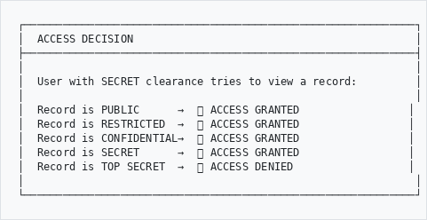
```

---

## Viewing Your Clearance Level

### Check Your Profile

1. Click your **username** in the top right
2. Select **Profile**
3. Your clearance level is displayed
```
┌─────────────────────────────────────────────────────────────┐
│  MY PROFILE                                                 │
├─────────────────────────────────────────────────────────────┤
│                                                             │
│  Name:           Jane Smith                                 │
│  Email:          j.smith@archive.org                        │
│  Role:           Editor                                     │
│                                                             │
│  Security Clearance:  🟠 SECRET                             │
│                                                             │
│  You can view records classified up to SECRET               │
│                                                             │
└─────────────────────────────────────────────────────────────┘
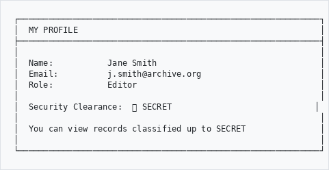
```

---

## Classifying Records

### For Editors and Above

When creating or editing a record:
```
┌─────────────────────────────────────────────────────────────┐
│  EDIT RECORD                                                │
├─────────────────────────────────────────────────────────────┤
│                                                             │
│  Title:          [Board Meeting Minutes 2025    ]           │
│                                                             │
│  Reference:      [ADM/BOARD/2025/001            ]           │
│                                                             │
│  ... other fields ...                                       │
│                                                             │
│  ─────────────────────────────────────────────────────────  │
│  SECURITY CLASSIFICATION                                    │
│  ─────────────────────────────────────────────────────────  │
│                                                             │
│  Classification:  [CONFIDENTIAL        ▼]                   │
│                   • PUBLIC                                  │
│                   • RESTRICTED                              │
│                   • CONFIDENTIAL  ←                         │
│                   • SECRET                                  │
│                   • TOP SECRET                              │
│                                                             │
│  Reason:         [Contains staff salary information]        │
│                                                             │
│  Review Date:    [2030-01-01           ]                    │
│                                                             │
└─────────────────────────────────────────────────────────────┘
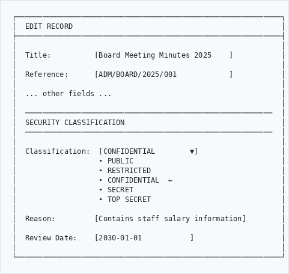
```

### Classification Guidelines
```
┌─────────────────────────────────────────────────────────────┐
│  WHAT TO CLASSIFY AT EACH LEVEL                             │
├─────────────────────────────────────────────────────────────┤
│                                                             │
│  🔴 TOP SECRET                                              │
│     • National security documents                           │
│     • Legal proceedings (active)                            │
│     • Highly sensitive personal data                        │
│                                                             │
│  🟠 SECRET                                                  │
│     • Personnel files                                       │
│     • Financial records                                     │
│     • Investigation files                                   │
│                                                             │
│  🟡 CONFIDENTIAL                                            │
│     • Internal correspondence                               │
│     • Meeting minutes (sensitive)                           │
│     • Draft documents                                       │
│                                                             │
│  🔵 RESTRICTED                                              │
│     • Internal administrative records                       │
│     • Unpublished research                                  │
│     • Work in progress                                      │
│                                                             │
│  🟢 PUBLIC                                                  │
│     • Published materials                                   │
│     • Historical records (declassified)                     │
│     • General reference materials                           │
│                                                             │
└─────────────────────────────────────────────────────────────┘
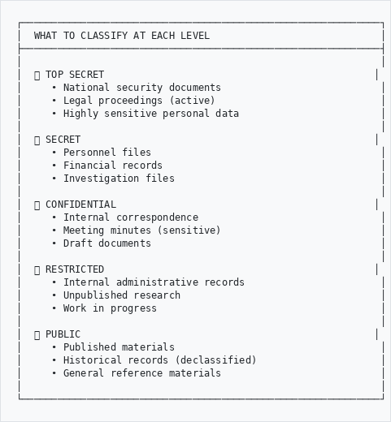
```

---

## What You See When Access is Denied

If you try to view a record above your clearance:
```
┌─────────────────────────────────────────────────────────────┐
│                                                             │
│                    🔒 ACCESS RESTRICTED                     │
│                                                             │
│  ─────────────────────────────────────────────────────────  │
│                                                             │
│  This record requires a higher security clearance.          │
│                                                             │
│  Record Classification:  SECRET                             │
│  Your Clearance:         RESTRICTED                         │
│                                                             │
│  If you need access to this record, please contact          │
│  your supervisor or the records administrator.              │
│                                                             │
│                      [Request Access]                       │
│                                                             │
└─────────────────────────────────────────────────────────────┘
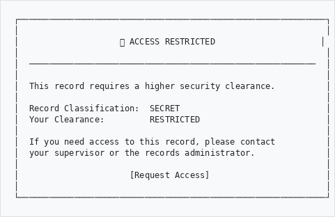
```

---

## Searching Classified Records

When you search, you only see records you have clearance for:
```
┌─────────────────────────────────────────────────────────────┐
│  SEARCH RESULTS                                             │
├─────────────────────────────────────────────────────────────┤
│                                                             │
│  Search: "budget 2025"                                      │
│                                                             │
│  Showing 15 of 15 results you can access                    │
│  (3 additional results require higher clearance)            │
│                                                             │
│  1. Budget Report 2025 - Draft          🟢 PUBLIC           │
│  2. Departmental Budget Requests        🔵 RESTRICTED       │
│  3. Budget Committee Minutes            🟡 CONFIDENTIAL     │
│  ...                                                        │
│                                                             │
└─────────────────────────────────────────────────────────────┘
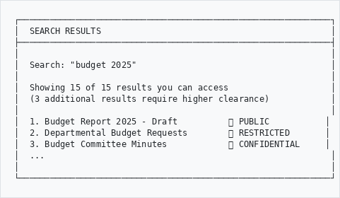
```

---

## Classification Markings on Records

Classified records show their level clearly:
```
┌─────────────────────────────────────────────────────────────┐
│  🟠 SECRET                                          [Edit]  │
├─────────────────────────────────────────────────────────────┤
│                                                             │
│  Title:       Personnel Investigation File                  │
│  Reference:   HR/INV/2025/003                               │
│  Date:        15 January 2025                               │
│                                                             │
│  ─────────────────────────────────────────────────────────  │
│  CLASSIFICATION DETAILS                                     │
│  ─────────────────────────────────────────────────────────  │
│                                                             │
│  Level:         SECRET                                      │
│  Classified by: Admin User                                  │
│  Date:          01 January 2025                             │
│  Review Date:   01 January 2035                             │
│  Reason:        Contains personal employment information    │
│                                                             │
└─────────────────────────────────────────────────────────────┘
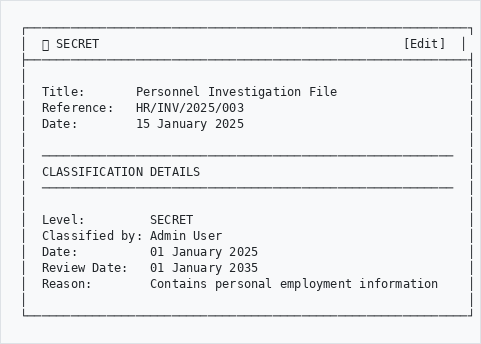
```

---

## Declassification

Records may be reviewed and declassified over time:
```
┌─────────────────────────────────────────────────────────────┐
│  DECLASSIFICATION WORKFLOW                                  │
├─────────────────────────────────────────────────────────────┤
│                                                             │
│  Review Date Reached                                        │
│         │                                                   │
│         ▼                                                   │
│  ┌─────────────────┐                                       │
│  │ Review Record   │                                       │
│  └────────┬────────┘                                       │
│           │                                                 │
│     ┌─────┴─────┐                                          │
│     ▼           ▼                                          │
│  Still       Can be                                        │
│  Sensitive   Declassified                                  │
│     │           │                                          │
│     ▼           ▼                                          │
│  Extend     Lower the                                      │
│  Review     Classification                                 │
│  Date       Level                                          │
│                                                             │
└─────────────────────────────────────────────────────────────┘
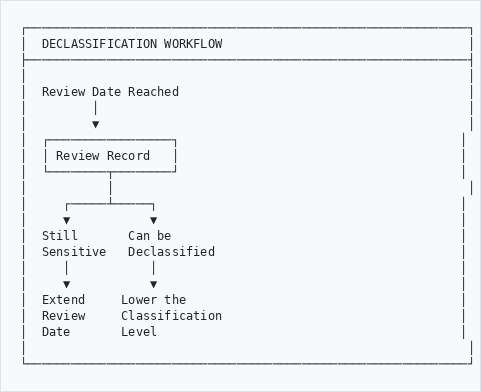
```

---

## Audit Trail

All classification changes are logged:
```
┌─────────────────────────────────────────────────────────────┐
│  CLASSIFICATION HISTORY                                     │
├─────────────────────────────────────────────────────────────┤
│                                                             │
│  Date            User          Action                       │
│  ─────────────────────────────────────────────────────────  │
│  10 Jan 2026     J. Smith      Downgraded to RESTRICTED     │
│  01 Jan 2025     A. Brown      Set to CONFIDENTIAL          │
│  15 Dec 2024     M. Jones      Created as SECRET            │
│                                                             │
└─────────────────────────────────────────────────────────────┘
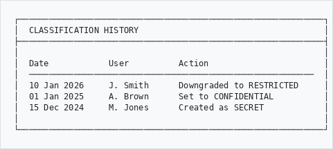
```

---

## Automated Security Tasks

The system automatically performs security maintenance tasks:

```
┌─────────────────────────────────────────────────────────────┐
│  SCHEDULED SECURITY TASKS                                   │
├─────────────────────────────────────────────────────────────┤
│                                                             │
│  ⏰ Daily at 1:00 AM                                        │
│                                                             │
│  1. 📋 Process Declassifications                            │
│     Records scheduled for automatic declassification        │
│                                                             │
│  2. ⏳ Expire Clearances                                    │
│     Deactivate clearances past their expiry date           │
│                                                             │
│  3. 📧 Send Expiry Warnings                                 │
│     Email users 30 days before clearance expires           │
│                                                             │
│  4. 🔐 Cleanup 2FA Sessions                                 │
│     Remove expired two-factor authentication sessions      │
│                                                             │
│  5. 📝 Audit Log Retention                                  │
│     Remove access logs older than retention period         │
│                                                             │
└─────────────────────────────────────────────────────────────┘
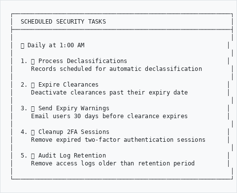
```

### Clearance Expiry Notifications

When your clearance is about to expire, you'll receive an email:

```
┌─────────────────────────────────────────────────────────────┐
│  Subject: Security Clearance Expiry Warning                 │
├─────────────────────────────────────────────────────────────┤
│                                                             │
│  Dear Jane Smith,                                           │
│                                                             │
│  Your SECRET security clearance will expire on              │
│  15 March 2026 (30 days remaining).                         │
│                                                             │
│  Please contact your security administrator to request      │
│  a renewal.                                                 │
│                                                             │
│  Regards,                                                   │
│  Security Administration                                    │
│                                                             │
└─────────────────────────────────────────────────────────────┘
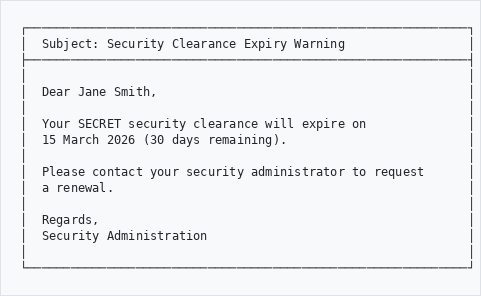
```

**Note**: Warnings are sent once per week until the clearance expires or is renewed.

---

## Best Practices
```
┌────────────────────────────────┬────────────────────────────┐
│  ✓ DO                          │  ✗ DON'T                   │
├────────────────────────────────┼────────────────────────────┤
│  Classify at creation          │  Leave classification blank│
│  Document the reason           │  Over-classify everything  │
│  Set review dates              │  Forget to review          │
│  Downgrade when appropriate    │  Keep things secret forever│
│  Report security concerns      │  Ignore policy violations  │
│  Respond to expiry notices     │  Ignore email warnings     │
└────────────────────────────────┴────────────────────────────┘
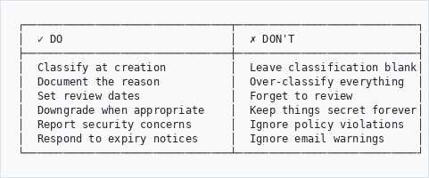
```

---

## Need Help?

Contact your security administrator or records manager if you:
- Need a higher clearance level
- Are unsure how to classify a record
- Need to request access to restricted materials

---

*Part of the AtoM AHG Framework*
