# Semantic Search User Guide

## Overview

Semantic Search enhances your AtoM search experience by automatically expanding your search queries with related terms, synonyms, and alternative spellings. This means you can find more relevant records even when you don't use the exact words stored in the archive.

**Example:** When you search for "photograph", Semantic Search can also find records containing "photo", "picture", "image", or "snapshot".

---

## Getting Started

### Enabling Semantic Search

When searching, you can enable semantic search from the search box:

1. Click the **gear icon** next to the search box
2. Toggle **"Semantic search"** on
3. Enter your search terms
4. Click Search

```
┌─────────────────────────────────────────────────────────┐
│  [⚙️ ▼]  [ Search archives...                    ] [🔍] │
│   │                                                      │
│   └──► ┌─────────────────────────────┐                  │
│        │ ○ Global search             │                  │
│        │ ○ Search Repository X       │                  │
│        │ ─────────────────────────── │                  │
│        │ › Advanced search           │                  │
│        │ ─────────────────────────── │                  │
│        │ [✓] Semantic search         │ ◄── Enable here │
│        │     Expand with synonyms    │                  │
│        └─────────────────────────────┘                  │
└─────────────────────────────────────────────────────────┘
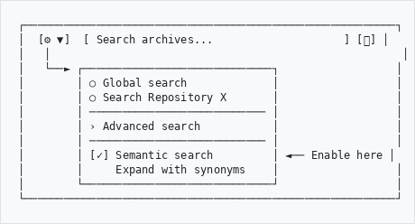
```

### Understanding Search Results

When Semantic Search expands your query, you'll see an information box showing which synonyms were used:

```
┌─────────────────────────────────────────────────────────────────────┐
│ 🧠 Semantic Search Active                                            │
│                                                                       │
│ Your search has been expanded with related terms:                    │
│                                                                       │
│ "archive" → [repository] [depot] [record office] [holdings]          │
│ "letter"  → [correspondence] [epistle] [missive]                     │
│                                                                       │
│ ℹ️ Disable semantic search in options to search exact terms only.    │
└─────────────────────────────────────────────────────────────────────┘
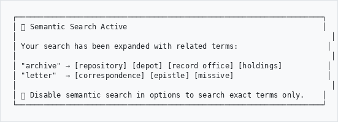
```

---

## How It Works

### Search Flow

```
                    ┌──────────────────┐
                    │   User enters    │
                    │  search query    │
                    └────────┬─────────┘
                             │
                             ▼
                    ┌──────────────────┐
                    │ Semantic Search  │
                    │    enabled?      │
                    └────────┬─────────┘
                             │
              ┌──────────────┴──────────────┐
              │                             │
              ▼ Yes                         ▼ No
    ┌──────────────────┐          ┌──────────────────┐
    │  Expand query    │          │  Search exact    │
    │  with synonyms   │          │  terms only      │
    └────────┬─────────┘          └────────┬─────────┘
             │                              │
             ▼                              │
    ┌──────────────────┐                   │
    │ "photo" becomes: │                   │
    │ photo OR picture │                   │
    │ OR photograph    │                   │
    │ OR image         │                   │
    └────────┬─────────┘                   │
             │                              │
             └──────────────┬───────────────┘
                            │
                            ▼
                   ┌──────────────────┐
                   │  Search results  │
                   │    displayed     │
                   └──────────────────┘
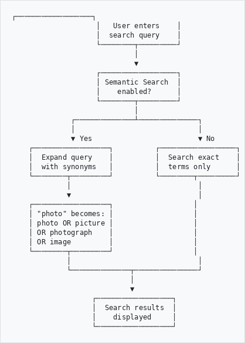
```

### Types of Term Relationships

Semantic Search understands different types of word relationships:

| Type | Description | Example |
|------|-------------|---------|
| **Exact Synonyms** | Words with the same meaning | photo = photograph = picture |
| **Related Terms** | Conceptually connected words | archive ↔ repository |
| **Broader Terms** | More general concepts | letter → correspondence |
| **Narrower Terms** | More specific concepts | document → manuscript |

---

## Administration

### Accessing Semantic Search Settings

Administrators can configure Semantic Search from the AHG Settings:

1. Navigate to **Admin → AHG Settings**
2. Click on the **"Semantic Search"** card
3. You'll see the Semantic Search dashboard

```
┌─────────────────────────────────────────────────────────────────────┐
│                        AHG SETTINGS                                  │
├─────────────────────────────────────────────────────────────────────┤
│                                                                       │
│  ┌─────────────┐  ┌─────────────┐  ┌─────────────┐  ┌─────────────┐ │
│  │ 🎨 Theme   │  │ 📧 Email   │  │ 🔌 Plugins │  │ 🧠 Semantic │ │
│  │ Config     │  │ Settings   │  │ Management │  │ Search      │ │
│  └─────────────┘  └─────────────┘  └─────────────┘  └─────────────┘ │
│                                                                       │
│  ┌─────────────┐  ┌─────────────┐  ┌─────────────┐                  │
│  │ 🛡️ Privacy │  │ 📚 Library │  │ 🏛️ Heritage│                  │
│  │ Compliance │  │ Settings   │  │ Accounting │                  │
│  └─────────────┘  └─────────────┘  └─────────────┘                  │
│                                                                       │
└─────────────────────────────────────────────────────────────────────┘
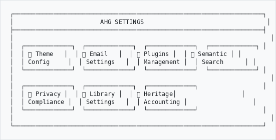
```

### Dashboard Overview

The Semantic Search dashboard shows:

```
┌─────────────────────────────────────────────────────────────────────┐
│ 🧠 Semantic Search                                    [⚙️ Settings] │
├─────────────────────────────────────────────────────────────────────┤
│                                                                       │
│  ┌─────────────────┐  ┌─────────────────┐  ┌─────────────────┐      │
│  │ 📚 Total Terms  │  │ 🔄 Synonyms     │  │ 📊 Data Sources │      │
│  │     1,247       │  │    3,892        │  │     3 / 4       │      │
│  │                 │  │                 │  │    active       │      │
│  │ [local] [wnet]  │  │ [exact][related]│  │                 │      │
│  └─────────────────┘  └─────────────────┘  └─────────────────┘      │
│                                                                       │
│  ┌─ Quick Actions ──────────────────────────────────────────────┐   │
│  │                                                               │   │
│  │  [Import Local]  [Sync WordNet]  [Export to ES]  [Add Term]  │   │
│  │                                                               │   │
│  └───────────────────────────────────────────────────────────────┘   │
│                                                                       │
│  ┌─ Test Query Expansion ────────────────────────────────────────┐   │
│  │                                                               │   │
│  │  [ Enter a search term...                    ] [🔍 Expand]   │   │
│  │                                                               │   │
│  └───────────────────────────────────────────────────────────────┘   │
│                                                                       │
└─────────────────────────────────────────────────────────────────────┘
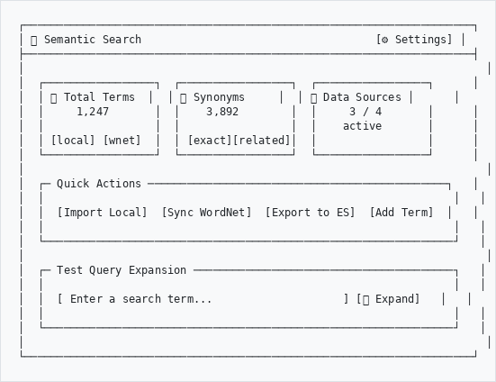
```

### Quick Actions Explained

| Action | What It Does |
|--------|--------------|
| **Import Local** | Loads predefined archival, museum, library, and South African terms |
| **Sync WordNet** | Downloads synonyms from the WordNet linguistic database |
| **Export to ES** | Generates synonym file for Elasticsearch |
| **Add Term** | Manually add a custom term with synonyms |

### Testing Query Expansion

Before enabling semantic search for all users, test how queries are expanded:

1. Enter a term in the **"Test Query Expansion"** box
2. Click **Expand**
3. Review the synonyms that would be added

```
┌─────────────────────────────────────────────────────────────────────┐
│ Test Query Expansion                                                 │
├─────────────────────────────────────────────────────────────────────┤
│                                                                       │
│  [ manuscript                               ] [🔍 Expand]            │
│                                                                       │
│  Expansions:                                                         │
│                                                                       │
│  manuscript → [document] [text] [codex] [script] [holograph]        │
│                                                                       │
└─────────────────────────────────────────────────────────────────────┘
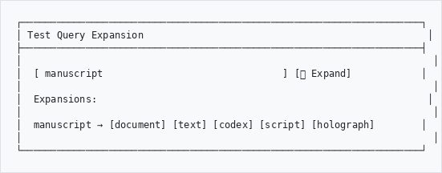
```

---

## Settings Configuration

### General Settings

Access settings via the **Settings** button on the dashboard:

| Setting | Description | Recommended |
|---------|-------------|-------------|
| **Enable Semantic Search** | Master on/off switch | On |
| **Expansion Limit** | Max synonyms per term (1-20) | 5 |
| **Minimum Weight** | Relevance threshold (0.0-1.0) | 0.6 |
| **Show Expansion Info** | Display synonyms used on results page | On |
| **Log Searches** | Keep history of expanded searches | On |

### Data Sources

Configure where synonyms come from:

| Source | Description | When to Enable |
|--------|-------------|----------------|
| **Local Synonyms** | Curated archival/museum terminology | Always |
| **WordNet** | Large English language database | For general vocabulary |
| **Wikidata** | Heritage and archival concepts | For specialized heritage terms |
| **Ollama Embeddings** | AI-powered similarity | Advanced: requires Ollama server |

```
┌─────────────────────────────────────────────────────────────────────┐
│ Data Sources Configuration                                           │
├─────────────────────────────────────────────────────────────────────┤
│                                                                       │
│  [✓] Local Synonyms                                                  │
│      Uses curated archival, museum, and library terminology          │
│                                                                       │
│  [✓] WordNet (Datamuse API)                                         │
│      Fetches synonyms from the WordNet linguistic database           │
│                                                                       │
│  [ ] Wikidata                                                        │
│      Fetches heritage terms from Wikidata knowledge base             │
│                                                                       │
│  [ ] Ollama Embeddings                                               │
│      Uses AI models for semantic similarity (requires Ollama)        │
│                                                                       │
└─────────────────────────────────────────────────────────────────────┘
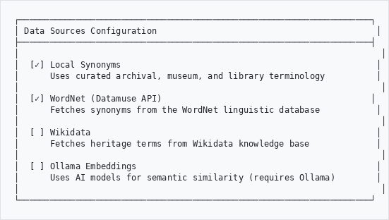
```

---

## Managing Terms

### Browsing the Thesaurus

View all terms in your semantic search database:

1. From the dashboard, click **"Browse terms"**
2. Filter by source (Local, WordNet, Wikidata)
3. Search for specific terms

```
┌─────────────────────────────────────────────────────────────────────┐
│ Terms                                               [+ Add Term]     │
├─────────────────────────────────────────────────────────────────────┤
│                                                                       │
│  Search: [ manuscript        ]  Source: [All Sources ▼]  [Filter]   │
│                                                                       │
├─────────────────────────────────────────────────────────────────────┤
│ Term          │ Source   │ Domain   │ Synonyms │ Created            │
├───────────────┼──────────┼──────────┼──────────┼────────────────────┤
│ archive       │ local    │ archival │ 8        │ Jan 15, 2026       │
│ catalogue     │ local    │ library  │ 5        │ Jan 15, 2026       │
│ manuscript    │ wordnet  │ general  │ 6        │ Jan 18, 2026       │
│ photograph    │ local    │ archival │ 7        │ Jan 15, 2026       │
│ township      │ local    │ sa       │ 4        │ Jan 15, 2026       │
└─────────────────────────────────────────────────────────────────────┘
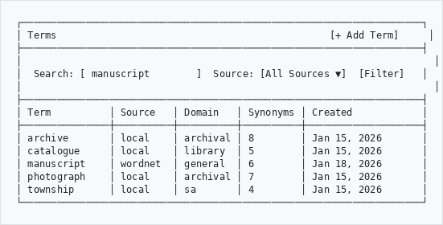
```

### Adding Custom Terms

Add organization-specific terminology:

1. Click **"Add Term"**
2. Enter the main term
3. Select the domain (Archival, Museum, Library, South African, General)
4. Enter synonyms (one per line)
5. Set the relationship type and weight
6. Click **Save**

```
┌─────────────────────────────────────────────────────────────────────┐
│ Add Term                                                             │
├─────────────────────────────────────────────────────────────────────┤
│                                                                       │
│  Term: *                                                             │
│  [ dompas                                           ]                │
│                                                                       │
│  Domain:                    Relationship:          Weight:           │
│  [South African ▼]          [Exact ▼]              [0.8    ]        │
│                                                                       │
│  Synonyms (one per line):                                            │
│  ┌─────────────────────────────────────────────────┐                │
│  │ pass book                                        │                │
│  │ reference book                                   │                │
│  │ passbook                                         │                │
│  │ pass laws document                               │                │
│  └─────────────────────────────────────────────────┘                │
│                                                                       │
│                                      [Cancel]  [💾 Save Term]        │
└─────────────────────────────────────────────────────────────────────┘
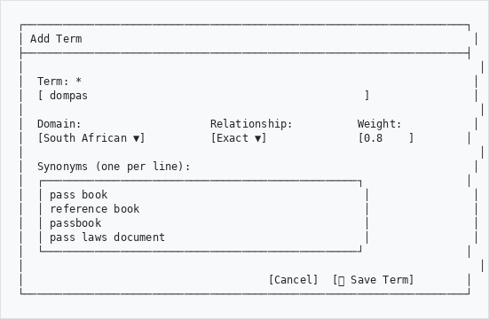
```

### Viewing Term Details

Click on any term to see its full details and all associated synonyms:

```
┌─────────────────────────────────────────────────────────────────────┐
│ Term: archive                                                        │
├─────────────────────────────────────────────────────────────────────┤
│                                                                       │
│  Source: local              Domain: archival                         │
│  Created: Jan 15, 2026                                               │
│                                                                       │
│  ┌─ Synonyms (8) ──────────────────────────────────────────────────┐│
│  │                                                                  ││
│  │  Synonym          │ Type    │ Weight │ Source                   ││
│  │ ──────────────────┼─────────┼────────┼───────────────────────── ││
│  │  repository       │ exact   │ 0.95   │ local                    ││
│  │  record office    │ exact   │ 0.90   │ local                    ││
│  │  depot            │ exact   │ 0.85   │ local                    ││
│  │  holdings         │ related │ 0.75   │ wordnet                  ││
│  │  collection       │ related │ 0.70   │ wordnet                  ││
│  │  registry         │ related │ 0.65   │ local                    ││
│  │  muniment room    │ narrower│ 0.60   │ local                    ││
│  │  records center   │ exact   │ 0.80   │ local                    ││
│  │                                                                  ││
│  └──────────────────────────────────────────────────────────────────┘│
└─────────────────────────────────────────────────────────────────────┘
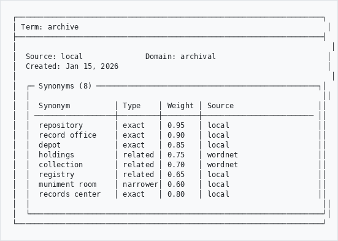
```

---

## Domain-Specific Terminology

### Pre-loaded Term Collections

Semantic Search includes curated terminology for:

#### Archival Terms
- fonds, series, file, item, accession
- provenance, custody, arrangement, description
- finding aid, inventory, register, calendar

#### Library Terms
- catalogue, classification, call number
- monograph, serial, periodical
- ISBN, ISSN, bibliography

#### Museum Terms
- artefact, specimen, exhibit, collection
- acquisition, deaccession, loan
- conservation, restoration, provenance

#### South African Terms
- apartheid, township, homeland, bantustans
- dompas, influx control, Group Areas Act
- TRC, amnesty, reconciliation

---

## Workflow Examples

### Workflow 1: Initial Setup

```
┌─────────────────────────────────────────────────────────────────────┐
│                     INITIAL SETUP WORKFLOW                           │
└─────────────────────────────────────────────────────────────────────┘

   Step 1                 Step 2                 Step 3
┌──────────────┐      ┌──────────────┐      ┌──────────────┐
│ Go to AHG    │      │ Click on     │      │ Click        │
│ Settings     │ ───► │ "Semantic    │ ───► │ "Import      │
│              │      │ Search" card │      │ Local"       │
└──────────────┘      └──────────────┘      └──────────────┘
                                                   │
                                                   ▼
   Step 6                 Step 5                 Step 4
┌──────────────┐      ┌──────────────┐      ┌──────────────┐
│ Test a       │      │ Enable       │      │ Go to        │
│ search with  │ ◄─── │ Semantic     │ ◄─── │ Settings,    │
│ synonyms     │      │ Search       │      │ configure    │
└──────────────┘      └──────────────┘      └──────────────┘
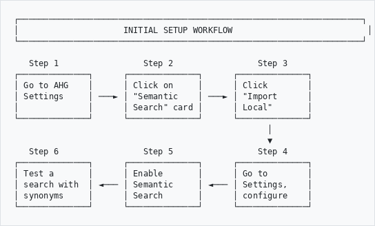
```

### Workflow 2: Adding Organization-Specific Terms

```
┌─────────────────────────────────────────────────────────────────────┐
│              ADDING CUSTOM TERMINOLOGY WORKFLOW                      │
└─────────────────────────────────────────────────────────────────────┘

 ┌─────────────┐     ┌─────────────┐     ┌─────────────┐
 │ Identify    │     │ Navigate to │     │ Click       │
 │ terms users │ ──► │ Semantic    │ ──► │ "Add Term"  │
 │ search for  │     │ Search      │     │             │
 └─────────────┘     └─────────────┘     └─────────────┘
                                                │
                                                ▼
 ┌─────────────┐     ┌─────────────┐     ┌─────────────┐
 │ Test        │     │ Save        │     │ Enter term  │
 │ expansion   │ ◄── │ the term    │ ◄── │ & synonyms  │
 │             │     │             │     │             │
 └─────────────┘     └─────────────┘     └─────────────┘
        │
        ▼
 ┌─────────────────────────────────┐
 │ Export to Elasticsearch if      │
 │ using ES synonym filters        │
 └─────────────────────────────────┘
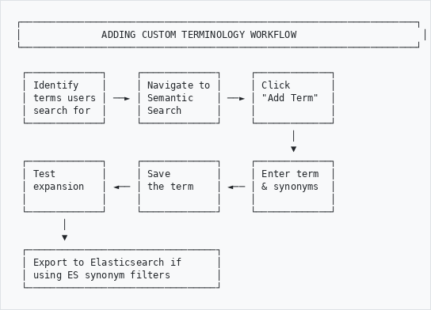
```

### Workflow 3: Syncing External Sources

```
┌─────────────────────────────────────────────────────────────────────┐
│                   SYNC EXTERNAL SOURCES WORKFLOW                     │
└─────────────────────────────────────────────────────────────────────┘

                    ┌─────────────────┐
                    │ Review current  │
                    │ term count on   │
                    │ dashboard       │
                    └────────┬────────┘
                             │
                             ▼
          ┌──────────────────┴──────────────────┐
          │                                     │
          ▼                                     ▼
┌─────────────────┐                   ┌─────────────────┐
│ Click "Sync     │                   │ Click "Sync     │
│ WordNet" for    │                   │ Wikidata" for   │
│ general English │                   │ heritage terms  │
└────────┬────────┘                   └────────┬────────┘
         │                                     │
         └──────────────────┬──────────────────┘
                            │
                            ▼
                  ┌─────────────────┐
                  │ Wait for sync   │
                  │ to complete     │
                  │ (check logs)    │
                  └────────┬────────┘
                           │
                           ▼
                  ┌─────────────────┐
                  │ Review new      │
                  │ terms added     │
                  └────────┬────────┘
                           │
                           ▼
                  ┌─────────────────┐
                  │ Export to       │
                  │ Elasticsearch   │
                  └─────────────────┘
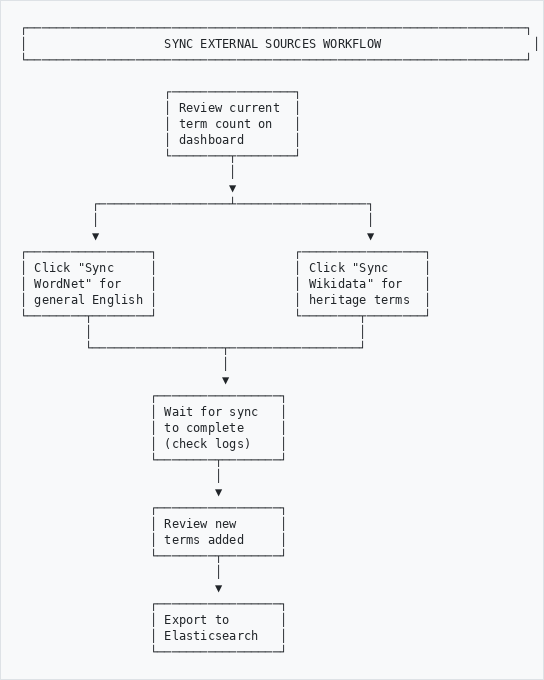
```

---

## Troubleshooting

### Common Issues

| Issue | Possible Cause | Solution |
|-------|----------------|----------|
| No synonyms appearing | Semantic search disabled | Enable in search options |
| Wrong synonyms | Weight too low | Increase minimum weight in settings |
| Too many results | Expansion limit too high | Reduce expansion limit |
| Missing terms | Source not enabled | Enable WordNet or Wikidata |
| Slow searches | Too many synonyms | Reduce expansion limit |

### Checking Sync Status

View sync history to diagnose issues:

1. From dashboard, click **"View All"** under Recent Syncs
2. Check for failed syncs (red status)
3. Review error messages

---

## Best Practices

### For Administrators

1. **Start with local synonyms** - Import the curated terminology first
2. **Test before enabling** - Use the test expansion feature
3. **Set appropriate limits** - Start with 5 synonyms per term
4. **Review search logs** - See what users are searching for
5. **Add organization-specific terms** - Include your unique terminology
6. **Export to Elasticsearch** - Keep the synonym file updated

### For Users

1. **Use semantic search for discovery** - Find related records
2. **Disable for exact matches** - When you need precise results
3. **Check expansion info** - Understand why results were returned
4. **Report missing synonyms** - Help improve the system

---

## Glossary

| Term | Definition |
|------|------------|
| **Synonym** | A word with the same or similar meaning |
| **Thesaurus** | A collection of words and their relationships |
| **Query expansion** | Adding related terms to a search |
| **Weight** | A score indicating how relevant a synonym is |
| **WordNet** | A large English linguistic database |
| **Elasticsearch** | The search engine powering AtoM |

---

## Semantic Search and Fuzzy Search

Semantic Search works alongside Fuzzy Search (typo-tolerant search) to maximize search coverage. They are complementary:

| Feature | Semantic Search | Fuzzy Search |
|---------|----------------|--------------|
| **Purpose** | Expand vocabulary with synonyms | Correct misspellings and typos |
| **How** | Synonym dictionary relationships | Character/sound similarity |
| **Example** | "photo" finds "photograph", "picture" | "photograps" corrects to "photographs" |
| **Activation** | User toggles on/off | Always active on GLAM Browse |
| **Admin setup** | Import terms, configure sources | No configuration needed |

**Best together:** Fuzzy Search corrects your typos first, then Semantic Search expands the corrected query with related terms. For example, "archieves" is corrected to "archives", which is then expanded to include "repository", "record office", and "holdings".

For full details on fuzzy search, see the [Fuzzy Search User Guide](fuzzy-search-user-guide.md).

---

## Support

For assistance with Semantic Search:

- **Documentation**: This guide and technical manual
- **Issues**: Report bugs via your system administrator
- **Training**: Contact The Archive and Heritage Group

---

*Document Version: 1.1*
*Last Updated: February 2026*
*Author: The Archive and Heritage Group (Pty) Ltd*
