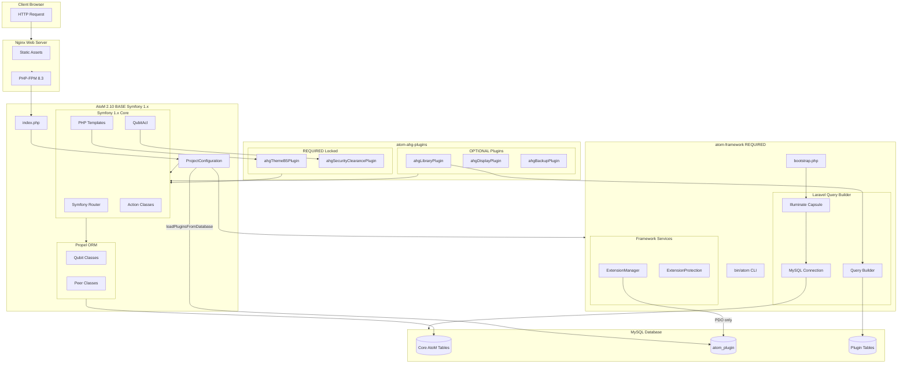
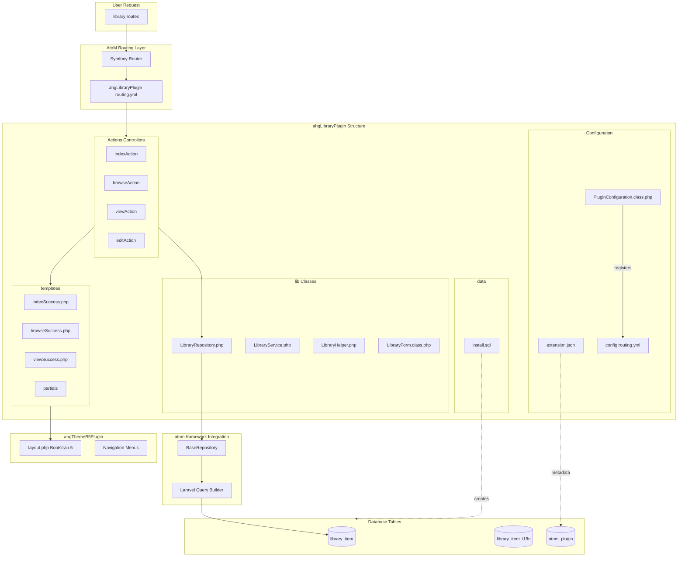
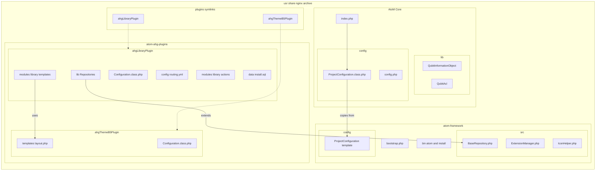
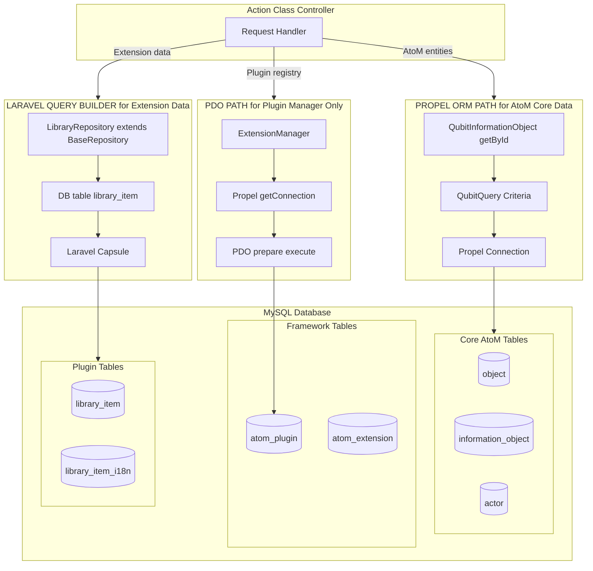
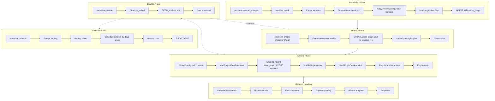
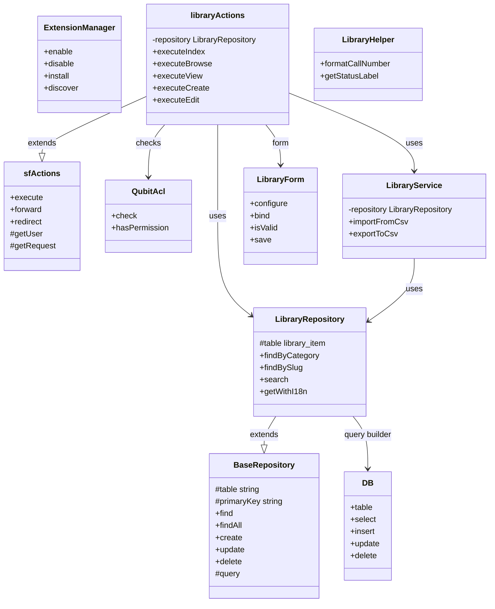
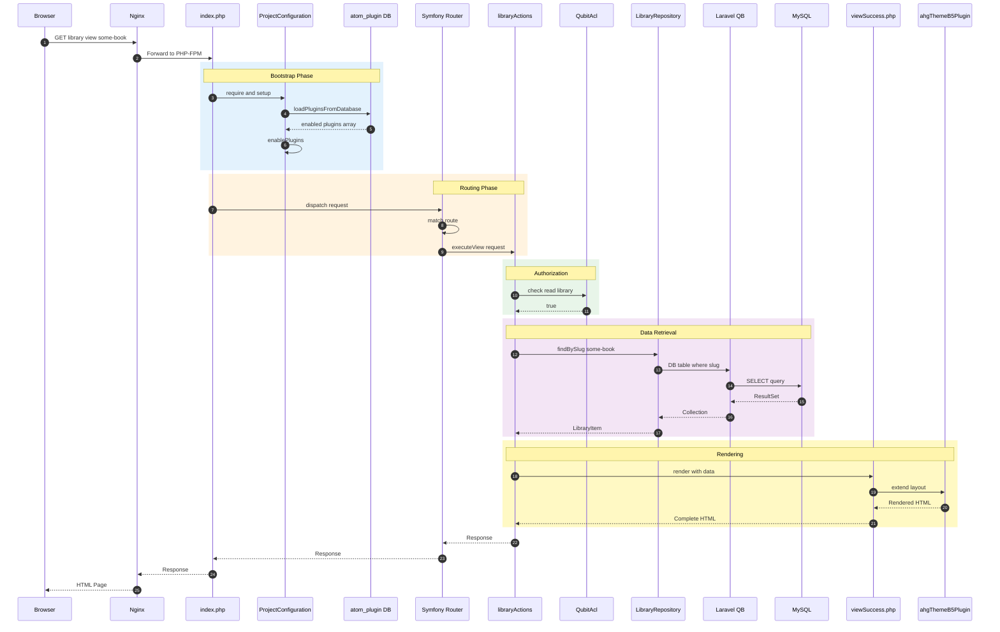

# AtoM AHG Framework - Architecture Diagrams

**Focus:** ahgLibraryPlugin Integration  
**Version:** 1.0.0  
**Last Updated:** 2025-01-08

---

## Table of Contents

1. [Architecture Overview](#1-architecture-overview)
2. [ahgLibraryPlugin Detail](#2-ahglibraryplugin-detail)
3. [Request Lifecycle Flow](#3-request-lifecycle-flow)
4. [File Structure](#4-file-structure)
5. [Database Access Patterns](#5-database-access-patterns)
6. [Plugin Lifecycle](#6-plugin-lifecycle)
7. [Class Relationships](#7-class-relationships)
8. [Request Sequence](#8-request-sequence)

---

## 1. Architecture Overview

Shows the three-layer structure: AtoM Base, atom-framework, atom-ahg-plugins

---

## 2. ahgLibraryPlugin Detail

Internal structure showing Configuration, Actions, Lib, Templates, and Data layers

---

## 3. Request Lifecycle Flow

Complete flow from bootstrap through plugin loading to response rendering

```mermaid
flowchart TD
    subgraph BOOT["Application Bootstrap"]
        A1["index.php"] --> A2["require ProjectConfiguration"]
        A2 --> A3["getApplicationConfiguration"]
        A3 --> A4["setup"]
    end
    subgraph PLUGINLOAD["Plugin Loading"]
        A4 --> B1{"loadPluginsFromDatabase"}
        B1 --> B2["SELECT from atom_plugin"]
        B2 --> B3["Build plugin array"]
        B3 --> B4["enablePlugins"]
        B4 --> B5["Load PluginConfiguration classes"]
    end
    subgraph FRAMEWORKINIT["Framework Init"]
        B5 --> C1["atom-framework bootstrap.php"]
        C1 --> C2["Initialize Laravel Capsule"]
        C2 --> C3["Set MySQL Connection"]
        C3 --> C4["Make Capsule global"]
    end
    subgraph ROUTING["Request Routing"]
        C4 --> D1["Symfony Router parses URL"]
        D1 --> D2{"Module exists?"}
        D2 -->|"Yes"| D3["Load module actions"]
        D2 -->|"No"| D4["404 Error"]
        D3 --> D5["Execute action method"]
    end
    subgraph ACTIONEXEC["Action Execution"]
        D5 --> E1["libraryActions.class.php"]
        E1 --> E2["Get Request Parameters"]
        E2 --> E3{"Use Repository?"}
        E3 -->|"Yes"| E4["LibraryRepository"]
        E3 -->|"No"| E5["Direct Propel"]
        E4 --> E6["Laravel Query Builder"]
        E5 --> E7["Propel ORM"]
        E6 --> E8[("MySQL")]
        E7 --> E8
        E8 --> E9["Return data to Action"]
    end
    subgraph RENDER["Template Rendering"]
        E9 --> F1["Set template variables"]
        F1 --> F2["Load xxxSuccess.php"]
        F2 --> F3["Apply theme layout"]
        F3 --> F4["Render Bootstrap 5 HTML"]
        F4 --> F5["Send Response"]
    end
```

---

## 4. File Structure

Directory structure at /usr/share/nginx/archive showing symlinks and dependencies

---

## 5. Database Access Patterns

When to use Propel vs Laravel Query Builder vs PDO

### When to Use Each

| Path | Use For |
|------|---------|
| **Propel ORM** | QubitInformationObject, Actor, ACL, Core AtoM queries |
| **Laravel QB** | Plugin-specific tables, Custom reports, Complex joins |
| **PDO** | Plugin Manager ONLY due to autoloader conflict |

---

## 6. Plugin Lifecycle

Complete lifecycle: Install, Enable, Runtime, Disable, Uninstall

---

## 7. Class Relationships

UML class diagram showing inheritance and dependencies

---

## 8. Request Sequence

Sequence diagram for GET /library/view/some-book

---

## Quick Reference

### Key Components

| Component | Technology | Purpose |
|-----------|------------|---------|
| Core AtoM | Symfony 1.x + Propel | Legacy base system |
| atom-framework | Laravel Capsule | Modern database operations |
| Plugin Loading | atom_plugin table | Database-driven plugin discovery |
| Required Plugins | ahgThemeB5Plugin, ahgSecurityClearancePlugin | Locked, always enabled |
| ahgLibraryPlugin | Symfony actions + Laravel repositories | Library management extension |

