# Vendor Management

## User Guide

Track items sent to external vendors for conservation, restoration, digitization, repair, and other services.

---

## Workflow Overview
```
┌──────────────┐    ┌──────────────┐    ┌──────────────┐    ┌──────────────┐
│   Register   │    │   Create     │    │   Track      │    │   Receive    │
│   Vendor     │ ──▶│   Transaction│ ──▶│   Progress   │ ──▶│   Return     │
│              │    │              │    │              │    │              │
│ Contact info │    │ Add items    │    │ Monitor      │    │ Update       │
│ Services     │    │ Set dates    │    │ Status       │    │ Condition    │
└──────────────┘    └──────────────┘    └──────────────┘    └──────────────┘
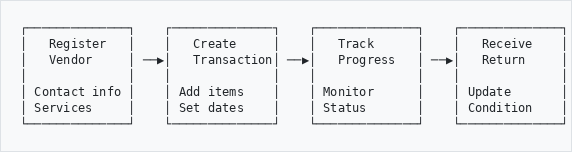
```

---

## When to Use
```
┌─────────────────────────────────────────────────────────────┐
│                USE VENDOR MANAGEMENT FOR:                   │
├─────────────────────────────────────────────────────────────┤
│  🔧 Conservation/Restoration  →  Track repair work          │
│  📷 Digitization              →  Items at scanning vendor   │
│  🖼️  Framing/Mounting          →  Artwork preparation        │
│  📋 Appraisal/Valuation       →  External assessments       │
│  🚚 Transport                 →  Items in transit           │
│  🧹 Cleaning/Pest Treatment   →  Specialist services        │
└─────────────────────────────────────────────────────────────┘
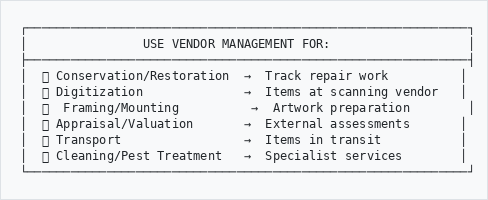
```

---

## How to Access
```
  Main Menu
      │
      ▼
   Admin
      │
      ▼
   Vendors ──────────────────────────────────────────┐
      │                                              │
      ├──▶ All Vendors      (view/add vendors)       │
      │                                              │
      ├──▶ Transactions     (all jobs/dispatches)    │
      │                                              │
      ├──▶ Items Out        (currently offsite)      │
      │                                              │
      └──▶ Overdue          (past return date)       │
```

---

## Part 1: Managing Vendors

### Add a New Vendor
```
┌─────────────────────────────────────────────────────────────┐
│ ADD VENDOR                                                  │
├─────────────────────────────────────────────────────────────┤
│                                                             │
│  Company Name *     [_________________________]             │
│                                                             │
│  Type *             [ Company           ▼]                  │
│                     ┌─────────────────────┐                 │
│                     │ Company             │                 │
│                     │ Individual          │                 │
│                     │ Institution         │                 │
│                     │ Government          │                 │
│                     └─────────────────────┘                 │
│                                                             │
│  Email *            [_________________________]             │
│                                                             │
│  Phone              [_________________________]             │
│                                                             │
│  Address            [_________________________]             │
│                     [_________________________]             │
│                                                             │
│  Services Offered   ☑ Conservation    ☑ Restoration        │
│                     ☐ Digitization    ☑ Framing            │
│                     ☐ Valuation       ☐ Transport          │
│                                                             │
│                              [ Cancel ]  [ Save Vendor ]    │
└─────────────────────────────────────────────────────────────┘

* Required fields
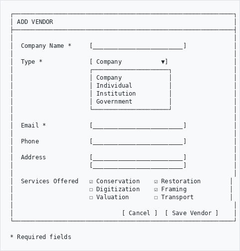
```

---

### Vendor Record
```
┌─────────────────────────────────────────────────────────────┐
│ ACME CONSERVATION SERVICES                          [Edit]  │
├─────────────────────────────────────────────────────────────┤
│                                                             │
│  Type:        Company                                       │
│  Email:       info@acme-conservation.co.za                  │
│  Phone:       012 345 6789                                  │
│  Address:     123 Main Street, Pretoria, 0001               │
│                                                             │
├─────────────────────────────────────────────────────────────┤
│  SERVICES                                                   │
│  ┌─────────────┐ ┌─────────────┐ ┌─────────────┐           │
│  │Conservation │ │ Restoration │ │   Framing   │           │
│  └─────────────┘ └─────────────┘ └─────────────┘           │
│                                                             │
├─────────────────────────────────────────────────────────────┤
│  CONTACTS                                                   │
│  • John Smith (Manager) - john@acme.co.za - 082 123 4567   │
│  • Jane Doe (Accounts) - jane@acme.co.za - 082 987 6543    │
│                                                             │
├─────────────────────────────────────────────────────────────┤
│  STATISTICS                                                 │
│  Total Jobs: 24    Items Processed: 156    Active: 3       │
│                                                             │
└─────────────────────────────────────────────────────────────┘
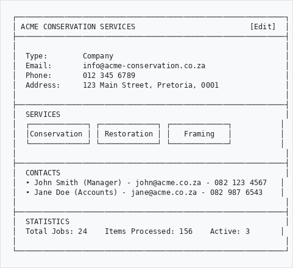
```

---

## Part 2: Creating Transactions

### Transaction Flow
```
                         ┌─────────────┐
                         │   START     │
                         └──────┬──────┘
                                │
                                ▼
                    ┌───────────────────────┐
                    │  Select Vendor        │
                    │  Choose Service Type  │
                    └───────────┬───────────┘
                                │
                                ▼
                    ┌───────────────────────┐
                    │  Add Items            │
                    │  • Search records     │
                    │  • Record condition   │
                    │  • Add estimates      │
                    └───────────┬───────────┘
                                │
                                ▼
                    ┌───────────────────────┐
                    │  Set Dates            │
                    │  • Dispatch date      │
                    │  • Expected return    │
                    └───────────┬───────────┘
                                │
                                ▼
                    ┌───────────────────────┐
                    │  Submit for Approval  │
                    │  (if required)        │
                    └───────────┬───────────┘
                                │
                                ▼
                         ┌─────────────┐
                         │  DISPATCH   │
                         └─────────────┘
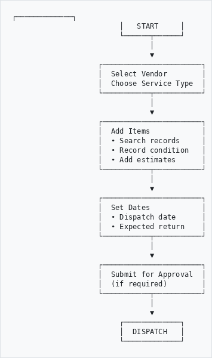
```

---

### Create New Transaction
```
┌─────────────────────────────────────────────────────────────┐
│ NEW TRANSACTION                                             │
├─────────────────────────────────────────────────────────────┤
│                                                             │
│  Vendor *           [ Select vendor...          ▼]          │
│                                                             │
│  Service Type *     [ Conservation              ▼]          │
│                     ┌─────────────────────────────┐         │
│                     │ Conservation                │         │
│                     │ Restoration                 │         │
│                     │ Digitization                │         │
│                     │ Framing                     │         │
│                     │ Valuation                   │         │
│                     │ Transport                   │         │
│                     └─────────────────────────────┘         │
│                                                             │
│  Reference No.      [ TXN-2026-001____________]             │
│                                                             │
│  Dispatch Date *    [ 15/01/2026  📅]                       │
│                                                             │
│  Expected Return *  [ 15/02/2026  📅]                       │
│                                                             │
│  Notes              [_________________________]             │
│                     [_________________________]             │
│                                                             │
└─────────────────────────────────────────────────────────────┘
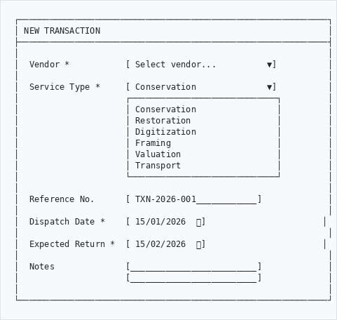
```

---

### Add Items to Transaction
```
┌─────────────────────────────────────────────────────────────┐
│ ADD ITEMS TO TRANSACTION                                    │
├─────────────────────────────────────────────────────────────┤
│                                                             │
│  🔍 Search records: [photograph album_______] [Search]      │
│                                                             │
│  Search Results:                                            │
│  ┌─────────────────────────────────────────────────────┐   │
│  │ ☐ ABC/001/005 - Photograph Album 1920s              │   │
│  │ ☑ ABC/001/012 - Family Photograph Album 1935     ←  │   │
│  │ ☐ ABC/002/003 - Wedding Album 1948                  │   │
│  └─────────────────────────────────────────────────────┘   │
│                                                             │
│  [ Add Selected Items ]                                     │
│                                                             │
├─────────────────────────────────────────────────────────────┤
│  ITEMS IN THIS TRANSACTION (2)                              │
│                                                             │
│  ┌─────────────────────────────────────────────────────┐   │
│  │ 1. ABC/001/012 - Family Photograph Album 1935       │   │
│  │    Condition: Fair - spine damaged                   │   │
│  │    Estimate: R 1,500.00                       [Remove]│   │
│  ├─────────────────────────────────────────────────────┤   │
│  │ 2. ABC/003/001 - Minute Book 1890                   │   │
│  │    Condition: Poor - binding loose                   │   │
│  │    Estimate: R 2,200.00                       [Remove]│   │
│  └─────────────────────────────────────────────────────┘   │
│                                                             │
│  Total Estimated Cost: R 3,700.00                          │
│                                                             │
└─────────────────────────────────────────────────────────────┘
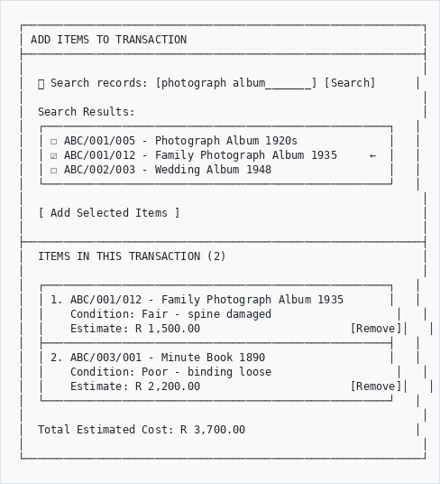
```

---

## Part 3: Transaction Status Flow
```
┌─────────┐     ┌─────────┐     ┌──────────┐     ┌───────────┐
│  Draft  │ ──▶ │ Pending │ ──▶ │ Approved │ ──▶ │Dispatched │
│         │     │Approval │     │          │     │           │
└─────────┘     └─────────┘     └──────────┘     └─────┬─────┘
                                                       │
                                                       ▼
┌─────────┐     ┌─────────┐     ┌──────────┐     ┌───────────┐
│ Closed  │ ◀── │Returned │ ◀── │Completed │ ◀── │In Progress│
│         │     │         │     │          │     │           │
└─────────┘     └─────────┘     └──────────┘     └───────────┘


Status Meanings:
─────────────────────────────────────────────────────────────
Draft         →  Being prepared, not yet submitted
Pending       →  Awaiting manager approval
Approved      →  Ready to send to vendor
Dispatched    →  Items sent, with vendor
In Progress   →  Vendor working on items
Completed     →  Work done, awaiting pickup
Returned      →  Items back in-house
Closed        →  Transaction complete
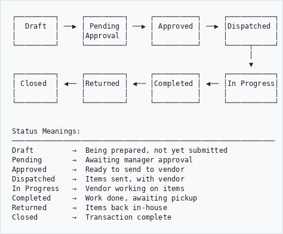
```

---

## Part 4: Monitoring Items

### Dashboard Overview
```
┌─────────────────────────────────────────────────────────────┐
│ VENDOR DASHBOARD                                            │
├──────────────────┬──────────────────┬───────────────────────┤
│                  │                  │                       │
│   ITEMS OUT      │    OVERDUE       │   THIS MONTH          │
│                  │                  │                       │
│      12          │       3          │   Dispatched: 5       │
│     items        │     items        │   Returned: 8         │
│                  │    ⚠️ Action!     │   Cost: R 15,420      │
│                  │                  │                       │
└──────────────────┴──────────────────┴───────────────────────┘

┌─────────────────────────────────────────────────────────────┐
│ ITEMS CURRENTLY OUT                                         │
├─────────────────────────────────────────────────────────────┤
│ Reference    │ Item              │ Vendor      │ Due       │
├──────────────┼───────────────────┼─────────────┼───────────┤
│ TXN-2026-001 │ Photo Album 1935  │ ACME Cons.  │ 15 Feb    │
│ TXN-2026-001 │ Minute Book 1890  │ ACME Cons.  │ 15 Feb    │
│ TXN-2026-003 │ Oil Painting      │ Art Restore │ 28 Feb    │
│ TXN-2026-005 │ Maps (12)         │ DigiScan    │ 🔴 OVERDUE │
└──────────────┴───────────────────┴─────────────┴───────────┘
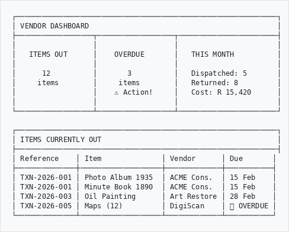
```

---

### Overdue Alerts
```
┌─────────────────────────────────────────────────────────────┐
│ ⚠️  OVERDUE ITEMS                                            │
├─────────────────────────────────────────────────────────────┤
│                                                             │
│  🔴 TXN-2026-005 - DigiScan Services                        │
│     12 Maps for digitization                                │
│     Expected: 05 Jan 2026                                   │
│     Overdue: 5 days                                         │
│     [ View ] [ Contact Vendor ] [ Extend Date ]             │
│                                                             │
│  🔴 TXN-2025-089 - Bookbinders Inc                          │
│     Ledger Book 1905                                        │
│     Expected: 02 Jan 2026                                   │
│     Overdue: 8 days                                         │
│     [ View ] [ Contact Vendor ] [ Extend Date ]             │
│                                                             │
└─────────────────────────────────────────────────────────────┘
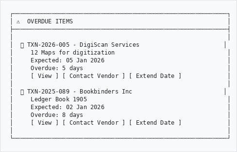
```

---

## Part 5: Receiving Items Back

### Return Process
```
                    Item Returns
                         │
                         ▼
            ┌────────────────────────┐
            │  Verify items received │
            │  Check against list    │
            └───────────┬────────────┘
                        │
                        ▼
            ┌────────────────────────┐
            │  Inspect condition     │
            │  Compare before/after  │
            └───────────┬────────────┘
                        │
           ┌────────────┴────────────┐
           │                         │
           ▼                         ▼
    ┌─────────────┐          ┌─────────────┐
    │  Condition  │          │  Condition  │
    │    OK ✓     │          │  Issue ⚠️    │
    └──────┬──────┘          └──────┬──────┘
           │                        │
           ▼                        ▼
    ┌─────────────┐          ┌─────────────┐
    │   Update    │          │   Document  │
    │   Status    │          │   Problem   │
    │  "Returned" │          │   Contact   │
    └──────┬──────┘          │   Vendor    │
           │                 └──────┬──────┘
           ▼                        │
    ┌─────────────┐                 │
    │   Record    │◀────────────────┘
    │   Actual    │
    │    Cost     │
    └──────┬──────┘
           │
           ▼
    ┌─────────────┐
    │   Close     │
    │ Transaction │
    └─────────────┘
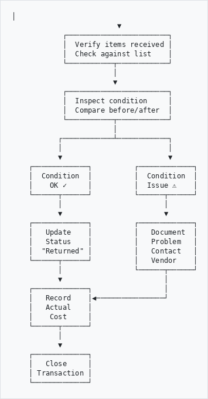
```

---

### Record Return
```
┌─────────────────────────────────────────────────────────────┐
│ RECORD ITEM RETURN                                          │
├─────────────────────────────────────────────────────────────┤
│                                                             │
│  Transaction: TXN-2026-001                                  │
│  Vendor: ACME Conservation Services                         │
│                                                             │
│  ┌─────────────────────────────────────────────────────┐   │
│  │ Item: ABC/001/012 - Family Photograph Album 1935    │   │
│  ├─────────────────────────────────────────────────────┤   │
│  │                                                     │   │
│  │  Condition Before:  Fair - spine damaged            │   │
│  │                                                     │   │
│  │  Condition After:   [Good - spine repaired    ▼]    │   │
│  │                                                     │   │
│  │  Work Completed:    ☑ Spine repair                  │   │
│  │                     ☑ Cleaning                      │   │
│  │                     ☐ Rebinding                     │   │
│  │                                                     │   │
│  │  Estimated Cost:    R 1,500.00                      │   │
│  │  Actual Cost:       [R 1,650.00_____]               │   │
│  │                                                     │   │
│  │  Notes:             [Additional cleaning required_] │   │
│  │                                                     │   │
│  │  Attach Invoice:    [ Choose File ] receipt.pdf     │   │
│  │                                                     │   │
│  └─────────────────────────────────────────────────────┘   │
│                                                             │
│                    [ Cancel ]  [ Mark as Returned ]         │
│                                                             │
└─────────────────────────────────────────────────────────────┘
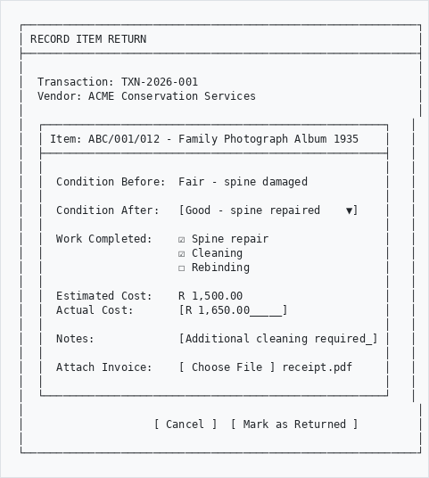
```

---

## Service Types Reference
```
┌─────────────────────────────────────────────────────────────┐
│  SERVICE TYPE      │  TYPICAL DAYS  │  INSURANCE  │ VALUATION│
├────────────────────┼────────────────┼─────────────┼──────────┤
│  Conservation      │      30        │     ✓       │    ✓     │
│  Restoration       │      45        │     ✓       │    ✓     │
│  Framing           │      14        │     ✓       │    ✓     │
│  Digitization      │       7        │     ✓       │    -     │
│  Photography       │       3        │     ✓       │    -     │
│  Binding           │      21        │     -       │    -     │
│  Cleaning          │       5        │     -       │    -     │
│  Pest Treatment    │       7        │     -       │    -     │
│  Transport         │       1        │     ✓       │    ✓     │
│  Valuation         │      14        │     -       │    -     │
│  Deacidification   │      14        │     -       │    -     │
│  Encapsulation     │       7        │     -       │    -     │
└────────────────────┴────────────────┴─────────────┴──────────┘
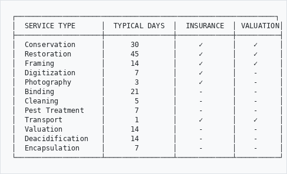
```

---

## Tips for Best Practice
```
┌─────────────────────────────────────────────────────────────┐
│  ✓ DO                          │  ✗ DON'T                  │
├────────────────────────────────┼────────────────────────────┤
│  Document condition before     │  Send without photos      │
│  Get written estimates         │  Skip the approval step   │
│  Set realistic return dates    │  Forget to follow up      │
│  Keep vendor contacts updated  │  Let items go overdue     │
│  Record all costs              │  Lose track of receipts   │
│  Check items on return         │  Accept without inspection│
└────────────────────────────────┴────────────────────────────┘
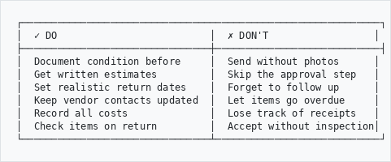
```

---

## Troubleshooting
```
Problem                          Solution
───────────────────────────────────────────────────────────
Can't find a record to add    →  Check spelling
                                 Try reference number
                                 Record may not exist yet
                                 
Transaction stuck in Draft    →  Complete all required fields
                                 Add at least one item
                                 
Can't dispatch               →  Get approval first
                                 Check dates are set
                                 
Vendor not in list           →  Add new vendor first
                                 Check vendor is active
                                 
Item shows wrong vendor      →  Contact administrator
                                 May need to move item
```

---

## Quick Reference
```
┌─────────────────────────────────────────────────────────────┐
│  ACTION                    │  WHERE                        │
├────────────────────────────┼───────────────────────────────┤
│  View all vendors          │  Admin → Vendors → All        │
│  Add new vendor            │  Admin → Vendors → Add        │
│  Create transaction        │  Admin → Vendors → New Job    │
│  View items out            │  Admin → Vendors → Items Out  │
│  Check overdue             │  Admin → Vendors → Overdue    │
│  View transaction history  │  Admin → Vendors → Transactions│
└────────────────────────────┴───────────────────────────────┘
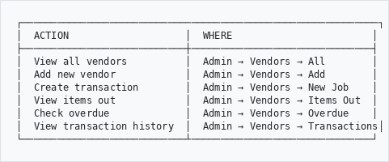
```

---

## Need Help?

Contact your system administrator if you experience issues.

---

*Part of the AtoM AHG Framework*
